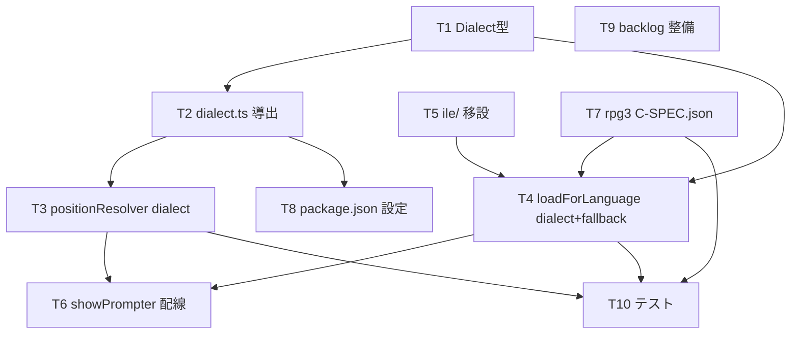

# 計画: RPG方言(ILE / RPG III)対応の基盤整備

spec.md / decisions.md を前提に実装を分解する。design 工程は未実施（decisions D1）。

## 実装方針

下から上へ「型 → 導出ヘルパ → 桁解決 → loader → 呼出側配線 → リソース移設/新規 → 設定 →
バックログ → テスト」の順で組み立てる。各層は下層が決まれば独立に検証可能。最も回帰リスクが高いのは
(a) 既存4定義の `ile/` 移設と (b) `loadForLanguage` シグネチャ変更の呼出側追従なので、移設は
loader 改修と同一タスク群で行い、その直後にビルドを通す。

## 作業順序と依存関係

1. **T1 `Dialect` 型追加**（依存: なし）— 後続の型基盤。
2. **T2 `dialect.ts` 導出ヘルパ**（依存: T1）— 純関数＋vscode ラッパ。単一真実源。
3. **T5 既存4定義を `rpg/ile/` へ移設**（依存: なし）— git mv 相当。
4. **T7 rpg3 `C-SPEC.json` 新規**（依存: なし、桁は research F5）— 移設先と並列で配置。
5. **T4 `loadForLanguage` 方言対応＋ile 旧パスフォールバック**（依存: T1, T5, T7）。
6. **T3 `positionResolver` に dialect 付与＋rpg3 は `C`→`C-SPEC` 固定**（依存: T2）。
7. **T6 `showPrompter` で `resolved.dialect` を loader へ受け渡し**（依存: T3, T4）。
8. **T8 `package.json` に `rpgClSupport.rpgDialectByExtension`**（依存: T2 の既定マップと整合）。
9. **T9 バックログ整備**（依存: なし）— `rpg-spec.md` ILE 明記＋`rpg3-spec.md` 新規。
10. **T10 テスト追加/追従＋ビルド**（依存: T3, T4, T6, T7）— unit/定義整合/回帰、`tsc` ＋既存テスト。

## リスク / 留意点

- **移設による上書き回帰**: 既存 `.rpg-cl/rpg/` 上書きが読まれなくなる → T4 で ile フォールバック実装（D3）。
- **シグネチャ変更の追従漏れ**: `loadForLanguage` 引数追加で呼出側（showPrompter / integration test）が壊れる
  → T6・T10 で全呼出箇所を `tsc` で検出・修正。
- **タブナビ副作用**: `.rpg` の C 行 keyword が C-SPEC 固定化（D5）。RPG III 妥当・ILE 不変。review で確認。
- **原典逸脱**: rpg3 桁は research F5 のみを根拠とし、独自補完しない（AGENTS.md 照合規約）。

## テスト方針

- `tsc`（型チェック）が通ること＝シグネチャ追従の網羅確認。
- unit: `resolveDialectFromPath`（`.rpgle`→ile/`.rpg`→rpg3/上書き/未知/長い順照合）。
- 定義整合: `rpg3/C-SPEC.json` の桁(F5)・required・keyword、`ile/` 既存定義が読めること。
- 既存テスト（`prompterModel` / `f4Prompter` 等）が新シグネチャでグリーンであること。
- spec の受け入れ基準6項目に対し test 工程でトレース。
