# レビューガイド: RPG方言(ILE / RPG III)対応の基盤整備

関連 issue: #18 / 後続前提: #19

## 変更概要 / 目的

RPG 固定長サポートに **方言(dialect)** という新次元を導入する。`.rpgle`→`ile`(RPG IV)、`.rpg`→`rpg3`(RPG III)
を拡張子から判定（設定で上書き可）し、プロンプター定義の読込と桁解決を方言別に分岐させる。既存4定義は
`resources/prompter/rpg/ile/` へ移設、RPG III の代表1定義 `rpg3/C-SPEC.json` を新規追加（原典照合済み）。
**languageId(`rpg-fixed`)は変更せず**、方言は languageId と直交する別次元として足す（既存 ILE 挙動は不変）。

## 重要ポイント（特に見てほしい所）

- **方言は languageId からは導出できない**（`.rpgle`/`.rpg` とも languageId は `rpg-fixed`）。よって
  **拡張子から導出**する。導出ロジックは `dialect.ts` に一元化（[[decisions]] D2/D4）。
- **後方互換の肝**（`jsonDefinitions.ts`）: 既存4定義を `ile/` へ移設したことで、既存ユーザーの
  ワークスペース上書き `.rpg-cl/rpg/`(dialect 無し) が読まれなくなる回帰を、**ile のときだけ旧パスも
  低優先フォールバックで読む**ことで防ぐ（D3）。`!hasOverride` 時は従来どおり `definitions` 配列を
  そのまま返し、ILE 既存挙動を完全保持。
- **rpg3 は `C`→`C-SPEC` 固定**（C-NEW 判定を波及させない）。EVAL/IF 等の自由形演算は ILE 固有で
  RPG III に存在しないため（D5）。`.rpg` のタブナビ keyword が従来の C-NEW 判定→C-SPEC 固定に変わるが、
  RPG III 的にむしろ正しく、回帰ではない。
- **原典照合**: rpg3 `C-SPEC.json` の桁は research F5（RPG 演算仕様書フォーム rpg006/rpg007 の独立2ページ
  相互裏付け）と機械照合し全桁一致（FACTOR1 18-27 / OPCODE 28-32 / FACTOR2 33-42 / RESULT 43-48 /
  COMMENT 60-74）。ILE の C-SPEC（FACTOR1 12-25 等）とは別物で、方言分離の根拠。

## 処理フロー

```mermaid
flowchart TD
  doc[".rpgle / .rpg ドキュメント"] --> rp["resolvePosition()"]
  rp -->|"resolveDialect(): 拡張子+設定"| dia{{"dialect = ile / rpg3"}}
  dia -->|"rpg3 かつ C行"| cspec["keyword = C-SPEC 固定"]
  dia -->|"ile かつ C行"| cnew["opcode で C-NEW / C-SPEC 判定（従来）"]
  rp -->|"ResolvedPosition{language, dialect, keyword}"| sp["showPrompter"]
  sp -->|"loadForLanguage(language, dialect, …)"| ld["jsonDefinitions"]
  ld --> def1["resources/prompter/rpg/&#123;dialect&#125;/ （既定）"]
  ld --> def2[".rpg-cl/rpg/&#123;dialect&#125;/ （上書き・高優先）"]
  ld -. "ile のみ" .-> def3[".rpg-cl/rpg/ （旧・低優先フォールバック）"]
  def1 & def2 & def3 --> merge["keyword 単位マージ"]
  merge -->|"keyword 一致"| picked["選択された定義 → F4 プロンプター"]
```

## 主要な変更箇所

- `vscode-extension/src/prompter/dialect.ts`（新規）— 方言導出の単一真実源。純関数
  `resolveDialectFromPath(fsPath, overrides)`（unit テスト対象）＋vscode ラッパ `resolveDialect(document)`。
  既定マップ・設定キー・正規化（キーの小文字化/`.`補完・不正値破棄・**長い拡張子優先**で `.rpgle` を
  `.rpg` より先に照合）。
- `vscode-extension/src/prompter/positionResolver.ts:30` 付近 — `ResolvedPosition.dialect?` を追加し、
  rpg-fixed のとき `resolveDialect` を設定。`C` 行は rpg3 で `C-SPEC` 固定、ile は従来の C-NEW 判定。
- `vscode-extension/src/prompter/jsonDefinitions.ts:53` — `loadForLanguage` に `dialect` 引数を追加。
  `rpg/{dialect}/` を既定、`.rpg-cl/rpg/{dialect}/` を上書き、ile のみ旧 `.rpg-cl/rpg/` をフォールバック。
- `vscode-extension/src/extension/commands/showPrompter.ts:63` — `loadForLanguage` に `resolved.dialect` を受け渡し。
- `vscode-extension/resources/prompter/rpg/rpg3/C-SPEC.json`（新規）/ `rpg/ile/*.json`（既存4件を移設）。
- `vscode-extension/package.json` — 設定 `rpgClSupport.rpgDialectByExtension`（既定 `{".rpgle":"ile",".rpg":"rpg3"}`）。
- `vscode-extension/test/unit/dialect.test.ts`（新規）— `resolveDialectFromPath` の 8 ケース。
- `.aidev/backlog/{rpg-spec.md(ILE明記), rpg3-spec.md(新規枠)}`。

## リスク / 確認してほしい点

- **`.rpg` を ILE として使っていた利用者**: 本対応で `.rpg`→rpg3 に切替わる。設定
  `rpgClSupport.rpgDialectByExtension` で `{".rpg":"ile"}` に上書き可能（README/リリースノートで告知推奨）。
- **タブナビ／ルーラーの桁は方言非対応のまま**（requirement 対象外）。`.rpg`(rpg3) でも ILE 桁マップ
  （`resources/navigation/rpg-fixed-keyword-columns.json`）を使う。ILE `.rpgle` の挙動は不変。
- **テスト実行**: 当環境は VS Code テストホストを起動できず（`npm test` はプレースホルダ）、検証は
  `tsc`＋原典直読＋手順トレースで実施（[[decisions]] D6）。`dialect.test.ts` はテストハーネス配線時に走る。
- **既知の小制限**: `getLanguageId` の拡張子フォールバックは `.rpg` を含まない（languageId 登録で実害なし）。
  rpg3 で `D` 行を開くと定義なしメッセージ（最小スコープの想定内）。
