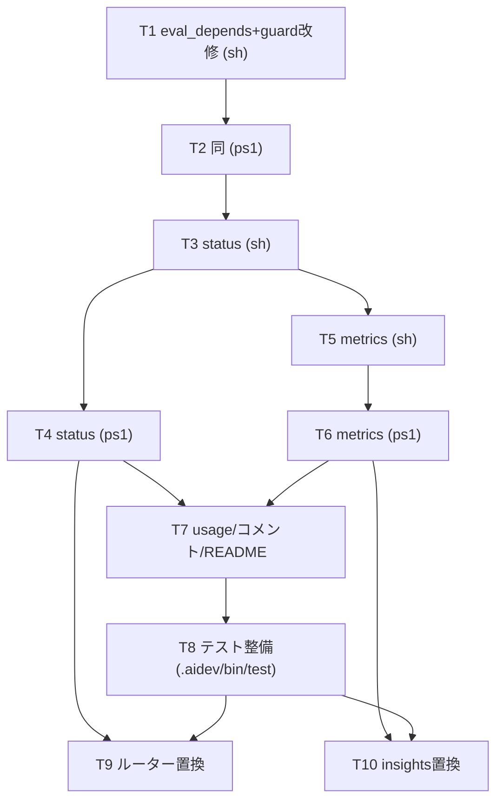

# 計画: aidev 状況の機械抽出（status / metrics）とルーター置換

関連 issue: #24 / 前工程: spec.md

## 実装方針

spec の 3 機能（A=status / B=metrics / C=共有 eval_depends）を、**機能単位で sh→ps1 の順に対で実装**し、
都度パリティを確認する。最後に README / 使い方コメント・ルーター / insights skill を更新し、テストで締める。

- **C を先に実装**（status が依存するため）。`guard` の exit 挙動・メッセージは不変に保つ。
- 各コマンドは**読み取り専用**（state.yml/metrics.yml を書き換えない）。
- パリティは **`--format tsv` の厳密一致**を主契約とし、テストで sh 出力 == ps1 出力を確認。
- 時刻差は epoch 秒で算出（sh=awk civil-days 純算術 / ps1=`[DateTimeOffset]`）。ts は `Z`/`UTC`/無し許容。

## 作業順序と依存関係

1. T1 eval_depends（sh）＋ guard 改修（依存: なし）
2. T2 eval_depends（ps1）＋ Cmd-Guard 改修（依存: T1）
3. T3 `aidev status`（sh）works＋backlog / table＋tsv（依存: T1）
4. T4 `aidev status`（ps1）パリティ（依存: T3, T2）
5. T5 `aidev metrics`（sh）per-work＋--phases / ts 正規化 / awk epoch（依存: T3）
6. T6 `aidev metrics`（ps1）パリティ（依存: T5）
7. T7 使い方コメント＋`usage()` 抽出範囲調整（sh/ps1）＋ README コマンド表（依存: T4, T6）
8. T8 テスト整備（status/metrics/パリティ/既存回帰）（依存: T7）
9. T9 ルーター `aidev-00-start` §2/§2.5 を `aidev status` へ（依存: T4, T8）
10. T10 insights `aidev-util-insights` を `aidev metrics --all` へ（依存: T6, T8）

## リスク / 留意点

- **桁揃えパリティ**: 全フィールド ASCII 前提（research F3）。多バイトが混じる入力は想定外だが、混入時も
  tsv は影響なし（テストは tsv を主契約）。表形式は同一の最大幅算出ロジックで両実装一致させる。
- **usage 範囲ズレ**: コメント行追加で `sed -n '2,30p'` / `Select-Object -First 28` の範囲が足りなくなる。
  追加後の末尾まで届く値へ更新（回帰: `aidev help` の出力確認）。
- **guard 回帰**: C で共通化しても exit コード（2/3）・メッセージ・advisory(warn) の挙動を厳密維持する。
- **epoch 算術**: awk の civil-days 実装は負方向・うるう年を含めテスト境界を置く。ps1 と秒一致を必ず確認。
- **pwsh 不在環境**: パリティテストは pwsh が無ければ skip（その旨を明示出力）。sh 側テストは常時実行。
- **読み取り専用の保証**: status/metrics 実行後に state.yml/metrics.yml が不変であることをテストで確認。

## テスト方針

- `.aidev/bin/test/` にシェルベースのテスト（Node 非依存）を新設。一時ディレクトリに `.aidev` フィクスチャ
  （works 複数＝通常/legacy/未deliver/依存あり、backlog＝needs 有無、metrics＝手戻り/未deliver/不正ts）を作り、
  `aidev status|metrics` の table/tsv 出力を期待値と照合。
- パリティ: 同フィクスチャで `aidev` と `pwsh aidev.ps1` の tsv 出力・終了コードを diff（pwsh 無ければ skip）。
- 回帰: 既存コマンド（new/approve/guard/verify/doctor）の主要出力・exit が不変。
- 受け入れ: requirement 完了条件の各項目をテスト or 手動確認で対応づけ。
