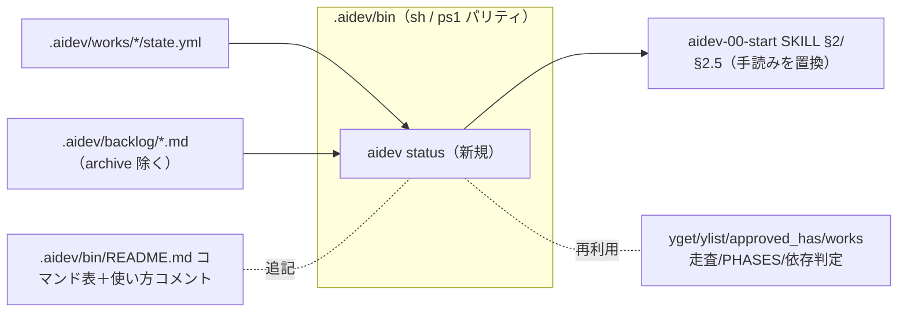

# 調査: aidev 状況の機械抽出（status）と harness 内の機械化候補

関連 issue: #24 / 前工程: requirement.md

## 調査の問い

- Q1: 既存 `aidev` CLI（sh/ps1）の構造・再利用できるヘルパ・出力/終了コード規約は？
- Q2: ルーター `aidev-00-start` が手読みしている内容（置換対象）は具体的に何か？
- Q3: `status` を sh/ps1 でパリティ実装する際の技術的リスク（桁揃え・走査順・YAML 読み）は？
- Q4: backlog 未着手の機械抽出は可能か（既存 §2.5 / insights §3 の手読みを置換できるか）？
- Q5: harness 内で AI が手作業集計している**他の機械化候補**は何か（横展開）。

## 判明した事実

- **F1（CLI 構造・再利用ヘルパ）**: `.aidev/bin/aidev`（POSIX sh, 313行）/ `.aidev/bin/aidev.ps1`
  （PowerShell, 301行）。両者に以下の再利用可能ヘルパが既存。`status` はこれらを使い回せる。
  - root 解決: `find_root`/`FindRoot`、`$AIDEV` 確定。
  - 最小 YAML 読み: scalar `yget`/`YGet`、flow list `ylist`/`YList`、`approved_has`/`ApprovedHas`。
  - works 走査の前例: `doctor`/`Cmd-Doctor` が `"$AIDEV/works"/*/`（sh はグロブで辞書順）/
    `Get-ChildItem -Directory | Sort-Object Name`（ps1 明示ソート）で**両者とも名前昇順**を保証済み。
  - 工程順: `PHASES="requirement research spec design plan coding test review walkthrough deliver retro"`
    （sh）／同配列（ps1）。`is_phase`/`IsPhase`。
  - 依存判定: `check_depends`/guard 内ロジック（works slug→approved に `deliver`／`#N`→advisory）。
  - 出力規約: UTF-8(BOM なし)・LF、`Now()` は明示フォーマットで sh と完全一致。終了コードは
    `0=OK / 1=使用法 / 2=前提不足 / 3=依存未充足 / 4=不変条件違反`。
  - ディスパッチ: 末尾 `case`/`switch` に1ブランチ追加するだけで新コマンドを足せる。`usage` は冒頭コメント
    （sh: `2,30p`、ps1: `Select-Object -Skip 1 -First 28`）から生成 → **コメントの使い方節も更新が要る**。

- **F2（置換対象＝ルーター手読み）**: `aidev-00-start/SKILL.md`「2. 作業状況の確認」が対象。
  - 現状の手順: `cat .aidev/current` → `ls .aidev/works` → **各 `state.yml`（current/approved/dependsOn）と
    成果物有無を AI が読んで要約** → `dependsOn` 未充足は `⛔依存待ち（…）` と明示。
  - 「2.5 未着手キュー」: `.aidev/backlog/*.md`（`archive/` 除く）の未チェック `[ ]` を件数＋先頭数件、
    `(needs:…)` は依存待ちと明示（これも手読み）。
  - つまり置換対象は **§2 本体（works 横断要約）＋§2.5 の backlog 件数抽出**。外部トラッカー併記は任意。

- **F3（パリティ実装リスク＝低）**: status が扱うフィールド（slug・current・next・mode・ticket・approved の
  各論理名・backlog ファイル名）は**すべて ASCII**（slug は kebab・英小文字、工程名/モードは固定語、
  ticket は `#N`/`PROJ-…`）。よって**文字数ベースの桁揃えが sh(awk)/ps1 で一致**する（多バイト幅問題が出ない）。
  走査順も F1 のとおり両者名前昇順で一致。YAML 読みは既存 `yget`/`ylist` の範囲（フロー形式）で足りる。
  → status は date 演算を含まず、**低リスクで本作業実装が妥当**。

- **F4（backlog 機械抽出＝可能）**: 未チェック行は `^\s*- \[ \]` で機械カウント可能（既に手調査で実証済み:
  `rpg-spec.md` 4件等）。`archive/` 除外はグロブ/ディレクトリ除外で対応。`(needs:` の有無で依存待ちを
  機械判定できる。→ §2.5 の件数抽出は完全に機械化可能（「先頭数件の本文表示」は skill 側で必要時に
  `grep` すればよく、status は件数＋依存待ち有無を返す方針で十分）。

- **F5（横展開の機械化候補）**:
  1. **status（works＋backlog）** … 本作業のコア。§2/§2.5 を置換。【本作業で実装】
  2. **metrics 集計**（insights §2/§3 が手集計）… protocol §8 に導出式が定義済み
     （経過時間 = approved−直近 start／手戻り = 同 phase の start 2回以上／差し戻し = sent_back 件数／
     リードタイム = 最初の start〜deliver approved／件数指標）。**機械化可能だが ISO8601 の時刻差演算**が
     必要で、POSIX `date` の `-d` 非標準・BusyBox 差異など sh/ps1 パリティが重い。
     → **規模大。follow-up issue 化**（本作業では実装しない）。
  3. **dependsOn 充足判定の共通化** … 現在 guard 内に実装。status でも使うため**読み取り専用の共有関数**に
     小さく切り出す余地（任意・小）。【本作業で軽微対応 or 見送り、spec で判断】
  4. **doctor**（記録ドリフト検出）… 既に機械化済み。insights §2 も `aidev doctor` 参照済み。【対応不要】

## 影響範囲

- 直接変更: `.aidev/bin/aidev`・`.aidev/bin/aidev.ps1`（status 追加＋冒頭コメント使い方）、
  `.aidev/bin/README.md`（コマンド表）、`aidev-00-start/SKILL.md`（§2/§2.5 を CLI 呼び出しへ）。
- 新規テスト: status の出力／sh・ps1 パリティ／legacy work 込み一覧／backlog 件数。
- follow-up（別 issue）: `aidev metrics` 集計（insights の手集計置換）。

## 実現性 / リスク

- **実現性: 高**。既存ヘルパとディスパッチに素直に追加でき、date 演算不要。
- **リスク（低〜中）**:
  - 桁揃えの sh/ps1 不一致 → F3 のとおり全 ASCII で回避。機械形式（`--format tsv`）を**パリティ契約の主**にし、
    テストはまず tsv で厳密一致を取る（表形式は同一データ由来で派生）。
  - 「次工程」導出の定義ぶれ → **標準パイプライン**（requirement spec plan coding test review deliver）で
    approved に無い最初の工程、deliver 済みなら「完了」。任意工程(research/design/walkthrough/retro)は
    既定の next にしない（spec で明文化）。
  - ps1 の関数戻り値が標準出力に混入する PS の罠 → 既存 `VerifyWork` のコメントどおり
    `[Console]::Out.WriteLine` で回避する流儀に倣う。
  - 走査順非決定 → F1 のとおり両者名前昇順で固定。

## spec への申し送り

- `aidev status` の**出力スキーマ**を確定する: 列順（works: slug / ticket / mode / current / next / done /
  deps）と backlog セクション（file / 未着手件数 / 依存待ち有無）。
- **出力形式**: 既定＝人間可読表（ASCII 桁揃え）／`--format tsv`＝タブ区切り（パリティ契約の主）。
  tsv のレコード種別の区別方法（works/backlog を先頭列で分けるか、セクション分割か）を決める。
- 「次工程」「完了」「依存充足」の**機械的定義**を spec に明文化（上記リスク欄の方針）。
- ルーター §2/§2.5 を `aidev status`（CLI 無し環境のフォールバック手順も併記）に置換。
- **横展開の線引き（ユーザー決定 2026-06-21）**: 本作業に **A+B+C すべて**を含める。
  - A. `aidev status`（works＋backlog）。
  - B. `aidev metrics` 集計（insights の手集計を置換）。**ISO8601 時刻差演算が必要**。sh は POSIX `date -d`
    非標準のため **awk で civil-days→epoch 変換**（days_from_civil 系の純算術）を実装し、ps1 は
    `[DateTime]::ParseExact`（UTC・固定書式）で対応。**パリティ契約は機械形式（秒・整数）で厳密一致**を取り、
    人間向けの時間表記（例 `1h05m`）は同一データ由来の派生とする（spec で形式確定）。
  - C. dependsOn 充足判定を**読み取り専用の共有関数**に切り出し、guard と status/その他で共用。
  - follow-up issue 化は不要（doctor は既存で対応済み）。
- README コマンド表と CLI 冒頭コメント（usage 生成元）も更新対象に含める。
