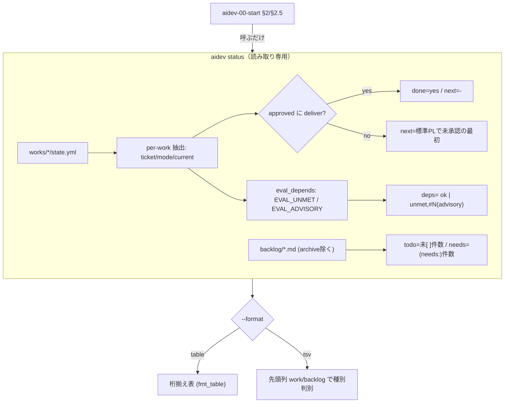
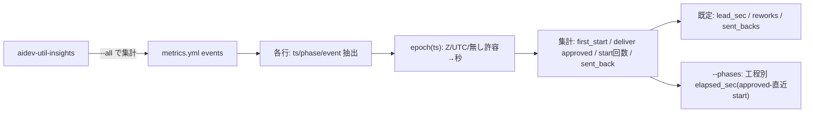

# レビューガイド: aidev 状況の機械抽出（status / metrics）とルーター置換

関連 issue: #24

## 変更概要 / 目的

`aidev-00-start`（ルーター）が全 `state.yml` を **AI に手読みさせていた**無駄を排し、`aidev` CLI に
**読み取り専用の機械抽出コマンド 2 つ**を追加して置換した。

- `aidev status` … works 横断（state.yml）＋ backlog 未着手を 1 コマンドで要約。
- `aidev metrics` … `metrics.yml` のイベントログから派生指標（リードタイム/手戻り/差し戻し/工程時間）を集計。
- 依存充足判定を共有関数 `eval_depends` に切り出し、`guard` と `status` で共用。

すべて **sh / ps1 パリティ・Node 非依存・読み取り専用**。ルーターと insights skill は CLI 利用に書き換えた。

## 重要ポイント（特に見てほしい所）

- **既存バグの修正（最重要）** [[decisions]] D3: `yget`/`YGet` の inline コメント除去（`sed 's/#.*//'`）が、
  `ticket: #24` や `dependsOn: [a, #99]` の `#` 始まり値を消していた。これは status だけでなく
  **既存 guard の `#N` 外部チケット依存が黙って無視されていた潜在バグ**。コメント除去を廃止し囲みクォート
  除去に変更（実ファイルは機械生成でコメントを含まない前提）。`aidev` `yget`／`aidev.ps1` `YGet` の両方。
- **共有 eval_depends の2系統分離** [[decisions]] D2: 未充足を `EVAL_UNMET`（works 由来＝guard の exit 3 に
  影響）と `EVAL_ADVISORY`（`#N`＝warn のみ）に分離。これにより guard の exit/メッセージ挙動を不変に保ったまま、
  status の `deps` 列に両方を併記できる。
- **`next`/`done` の機械的定義** [[decisions]] D4: `done`=approved に `deliver`。`done` なら `next`=`-`、
  そうでなければ標準パイプライン（requirement..deliver）で未承認の最初の工程。任意工程は next にしない。
- **時刻差演算のパリティ**: sh は awk の civil-days 純算術で epoch 秒、ps1 は `[DateTimeOffset]`。ts 末尾の
  `Z`/`UTC`/無しを許容。**lead_sec 等は秒（整数）で一致**させ、tsv をパリティ契約の主にした。
- **桁揃えのパリティ**: 対象フィールドは全 ASCII（slug/工程名/ticket）なので、awk と PowerShell の
  最大幅算出が一致する（`fmt_table` / `Fmt-Table`）。

## 処理フロー

## 主要な変更箇所

- `.aidev/bin/aidev:61` — `yget` のコメント除去廃止＋クォート除去（既存バグ修正 D3）。
- `.aidev/bin/aidev:200` 付近 — `eval_depends`（共有・読み取り専用）と `check_depends` の改修（D2）。
- `.aidev/bin/aidev` `cmd_status` — works＋backlog 抽出、`fmt_table` 桁揃え、table/tsv。
- `.aidev/bin/aidev` `cmd_metrics` ＋ `metrics_awk` — epoch 算術と派生指標集計。
- `.aidev/bin/aidev.ps1` — 上記の ps1 対応版（`YGet`/`Eval-Depends`/`Cmd-Status`/`Fmt-Table`/`Cmd-Metrics`/`Mt-Epoch`）。
- `.aidev/bin/aidev` / `aidev.ps1` の `usage()` — 行数レンジ依存をやめ「先頭の連続コメント行のみ」を出す堅牢版に変更。
- `.aidev/bin/test/run.sh`（新規, 144行） — フィクスチャで status/metrics・境界・回帰・読み取り専用・パリティ検証。
- `.aidev/bin/README.md` — コマンド表に status/metrics。
- `.claude/skills/aidev-00-start/SKILL.md:22` — §2/§2.5 を `aidev status` 呼び出しへ（フォールバック併記）。
- `.claude/skills/aidev-util-insights/SKILL.md` — 定量集計を `aidev metrics --all` 利用へ。

## リスク / 確認してほしい点

- **ps1 パリティが当環境で未検証**（pwsh 不在 [[decisions]] D1）。sh と1対1で対応させ静的確認済だが、
  **pwsh のある環境/CI で `sh .aidev/bin/test/run.sh` のパリティ節（pwsh があれば自動実行）** での最終確認を依頼したい。
- `yget` のコメント除去廃止は全 scalar 読みに影響する変更。実ファイルにコメントが無い前提に依存している点を確認してほしい
  （回帰テストで既存出力不変は確認済）。
- backlog の「未着手の本文（先頭数件）」は status では件数のみ。本文が要るときは skill 側で `grep` する設計とした。
