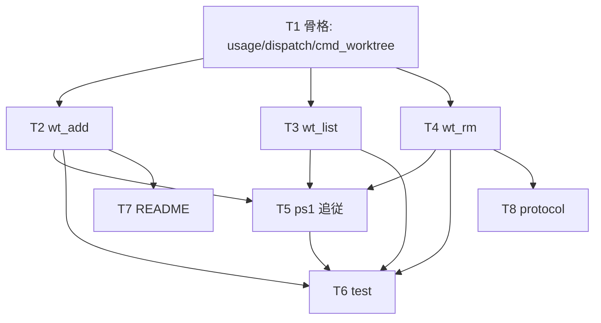

# 計画: `aidev worktree` 実装

## 実装方針

spec.md に従い、`bin/aidev`（POSIX sh）を正本として実装し、`bin/aidev.ps1` を**挙動・出力・終了コード一致**で
追従させる。work 作成は既存 `new` に委譲（DRY）、隔離は git＋gitignored current に委ねる。
すべての git 呼び出しは**実 exit code を直接判定**（research リスク2）。最後に test／ドキュメント（README/protocol）を整える。

骨格 → 各サブコマンド → ps1 追従 → テスト → ドキュメント、の順で、各段が独立検証可能になるよう分解する。

## 作業順序と依存関係

1. T1 骨格（依存: なし）
2. T2 wt_add / T3 wt_list / T4 wt_rm（依存: T1）
3. T5 ps1 追従（依存: T2,T3,T4）
4. T6 test（依存: T2,T3,T4,T5）
5. T7 README / T8 protocol（依存: 確定した surface）

## リスク / 留意点

- **INV-1（main current 不変）**: wt_add/wt_rm が main tree の `.aidev/current` を絶対に書かない。
  実装では current への書き込みを worktree path 配下に限定し、テスト（T6）で before/after を assert する。
- **git exit code 隠蔽**: `git ... | head` のようなパイプ越し判定をしない。`if git ...; then` 形式で実 code を見る。
- **branch は必ず `-b` 明示**（research F4）。git の暗黙 basename 命名に委ねない。
- **未コミット work は worktree 非伝播**（research リスク1）: 既定運用は「add 内で new」。継続は要コミット。
- **ps1 パリティ**: Windows のパス区切り・既定 path 組み立てのみ吸収し、出力・終了コードを sh と一致させる。
- test は実際に worktree を作る→検証→撤去する。プローブ worktree/branch を必ず後始末する（main を汚さない）。

## テスト方針（T6, bin/test/run.sh）

- wt_add: `feature/<slug>` ブランチ＋外部 path worktree 作成 / worktree 側 current=該当 work /
  **main current が before/after 不変（INV-1）** / 規約警告が出力に含まれる / 既存 work は new せず current 設定のみ。
- wt_add 異常: git 無し（疑似）や使用法・slug 不足で exit 1 / path 衝突で exit 1。
- wt_list: aidev 管理 worktree を `.aidev/current` 有無で抽出（非対象を除外）。tsv 先頭列 `path`。
- wt_rm: 未コミット差分で拒否（exit 1）/ `--force` で削除 / `--delete-branch` の有無 / 削除後 main current 不変。
- 後始末: 生成した worktree/branch を必ず remove/prune/-D する。
- ps1: 主要ケースで sh と出力・終了コードが一致することを（環境があれば）確認。
