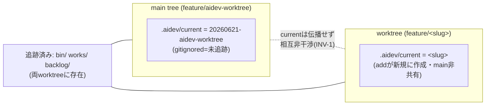

# 調査: `aidev worktree` の技術前提を実機検証

> 方法: feature/aidev-worktree 上から使い捨て worktree（probe）を実際に `git worktree add` し、
> `.aidev/current` の伝播・隔離・解決を観測。検証後に probe worktree/branch は撤去済み（main は不変）。

## 調査の問い

- Q1: gitignored な `.aidev/current` は git worktree ごとにローカルか（worktree 間で共有されないか）＝ INV-1 の土台。
- Q2: `aidev`（`resolve_work`）は worktree 内で**そのワーキングツリーの** `.aidev/current` を解決するか。
- Q3: `git worktree add` の既定挙動（base 省略時／branch 省略時）はどうなるか。
- Q4: 既に checkout 済みのブランチを別 worktree で checkout できるか（衝突挙動）。

## 判明した事実

- **F1（Q1, INV-1の土台）: `.aidev/current` は新 worktree に伝播せず、書き換えも相互非干渉。**
  - 新 worktree には `.aidev/current` が**存在しない**（gitignored＝未追跡のため committed tree に含まれない）。
    一方 `bin/` `works/` `backlog/` 等の**追跡済み内容は worktree にも存在**する。
  - probe worktree 側で `.aidev/current` に `probe-work` と書いても、main 側は `20260621-aidev-worktree` のまま不変。
  - → **worktree 操作は main の current を物理的に壊さない**。INV-1 はファイルシステムレベルで成立する。
- **F2（Q1の系）: 新 worktree は current 不在で生まれる → `add` が current を必ず設定する必要がある。**
  - current 不在のまま `aidev` を叩くと `resolve_work` が `.aidev/current 無し` で die する（設計どおりの前提）。
- **F3（Q2）: `resolve_work` は worktree ローカル current を正しく解決する。**
  - worktree 内で current=`probe-work`（worktree に該当 work 無し）→ `work が存在しません: probe-work` で正しく失敗。
  - current を追跡済み work（例 `20260620-ruler-display`）に変えると解決し `verify` が走る。
  - `AIDEV_WORK=<slug>` 上書きも worktree 内で有効（解決順 明示→AIDEV_WORK→current は worktree でも不変）。
- **F4（Q3）: base 省略時は HEAD、branch 省略時は path basename で自動ブランチ。**
  - `git worktree add <path>`（base 省略）→ base=現在 HEAD（b8802cb）で作成 ＝ 設計の既定「base=HEAD」と一致。
  - branch を省略すると **path の basename でブランチが自動生成**される（例: `probe2`）。
    → `add` は**必ず明示的に `-b feature/<slug>`** を渡し、git の暗黙命名に委ねないこと。
- **F5（Q4）: 同一ブランチの二重 checkout は git が拒否する。**
  - 既に main tree が checkout 中の `feature/aidev-worktree` を別 worktree で checkout しようとすると
    `fatal: '...' is already used by worktree at '...'` で失敗。
  - → 同じ work に二重 worktree は git が構造的に防ぐ（安全）。`add` 時はこの fatal を**明確なエラー**として扱う。

## 影響範囲

- `bin/aidev` / `bin/aidev.ps1`（`worktree` サブコマンド追加）。
- `.aidev/current` の読み書き経路（既存 `resolve_work`・`new`・`approve`）。worktree でも挙動が変わらないことは F3 で確認済み。
- `bin/test/run.sh`（worktree ケース追加）、`bin/README.md`、`protocol.md`。

## 実現性 / リスク

- 設計の根幹（current の worktree ローカル性・INV-1）は**実機で成立**。新しい状態機構を足さずに実装可能。
- リスク1（要 spec 反映）: **未コミットの work folder は worktree に現れない**。今回の `20260621-aidev-worktree`
  自体が未追跡で、もし別ブランチから worktree を切ると見えない。→ **「add 内で new」推奨**の技術的裏付け
  （既存 work を継続するなら、その work の成果物を**コミット済み**にしてからでないと worktree に乗らない）。
- リスク2（実装注意）: F5 の git エラーは**パイプ（`| head`）で終了コードが隠れる**事象を観測。CLI 実装では
  git の**実 exit code を直接判定**し、失敗時に exit 1＋git メッセージを見せること（パイプ越しに成功扱いしない）。
- リスク3: 既定 path `../<repo>-wt/<slug>` は**親ディレクトリの書込権限**が要る（今回 `/workspaces/...-wt/` 作成は可）。
  作成失敗時は git のエラーを見せて exit 1。

## spec への申し送り

1. `add` 手順を確定: ① git 存在チェック ② `git worktree add -b feature/<slug> <path> <base(既定HEAD)>`
   （**branch は必ず明示**） ③ worktree 内 `.aidev/current` に `<slug>` を書く（F2） ④ work folder 不在なら
   worktree 内で `new` 相当（F3 で current/AIDEV_WORK 経路は健全）。
2. **既存 work 継続は「成果物がコミット済み」が条件**（リスク1）。未コミットだと worktree に現れない旨を
   help/出力と protocol に明記。既定運用は「add 内で new」。
3. `list` の aidev 管理判定は **worktree ローカル `.aidev/current` の有無**で行う（F1/F3 で worktree ローカル性確認）。
4. エラー処理は git の実 exit code を直接判定（リスク2）。同一ブランチ二重 checkout（F5）・path 衝突・git 不在は exit 1。
5. INV-1（main current 不変）は F1 で成立。テストで main current の before/after 不変を assert する。

## 隔離モデル（確認結果）

