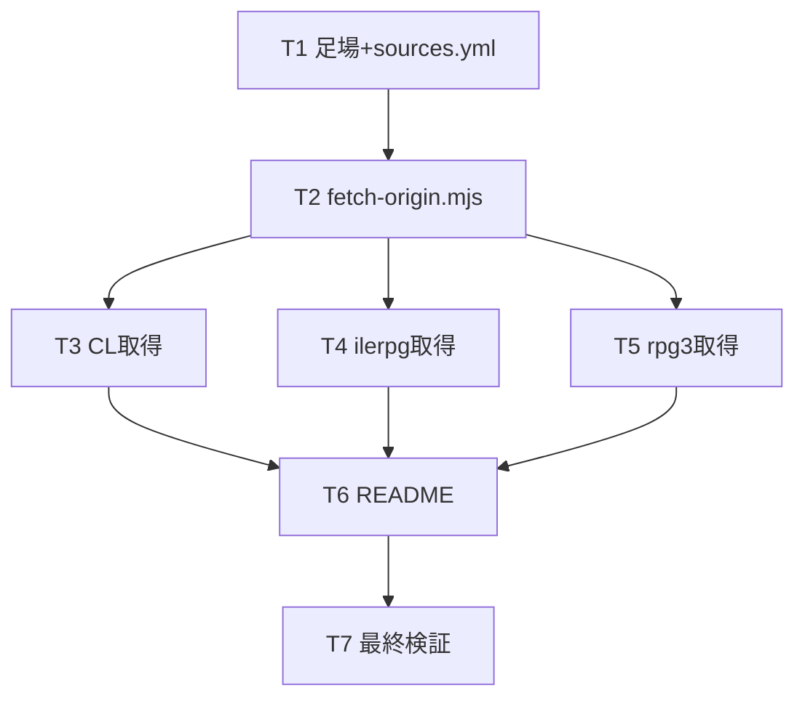

# 計画: 原典 HTML ソースの収集・保存

## 実装方針

spec の構成（入力 `sources.yml` → 取得スクリプト `fetch-origin.mjs` → 保存＋`manifest.yml`／`README.md`）を、下から上へ「足場 → スクリプト → カテゴリ別取得 → 文書化 → 検証」の順で積む。取得は実ネットワーク I/O のため、CL→ilerpg→rpg3 とカテゴリ単位で回し、各回の status/件数を主エージェントが manifest で確認して欠落・綴り誤りを潰す。

- スクリプトは `manifest.yml` 生成まで担う（取得結果の単一の真実）。
- 取得は `/tmp` 等に導入済みの playwright を `NODE_PATH` 経由で参照（research で導入済み）。
- 変更対象は `docs/origin/**` のみ。既存コード・定義 JSON・contributes・言語登録は不変更（git diff で担保）。

## 作業順序と依存関係

1. **T1** `docs/origin/` 足場＋`sources.yml`（CL46 / ilerpg7 / rpg3 6 を列挙）（依存: なし）
2. **T2** `fetch-origin.mjs` 実装（描画後 outerHTML・script 除去・逐次・リトライ・manifest 生成）（依存: T1）
3. **T3** CL 取得 → `docs/origin/cl/*.html`、status/件数を manifest で確認、404 綴りを是正・再取得（依存: T2）
4. **T4** ilerpg 取得 → `docs/origin/ilerpg/<X>-SPEC.html`（7 種）（依存: T2）
5. **T5** rpg3 取得 → `docs/origin/rpg3/<id>.html`（jaymoseley・承認方針 A）（依存: T2）
6. **T6** `README.md` 作成（出所・版・取得手順・rpg3 第三者注記＋IBM RPG/400 PDF 出典・script 除去ポリシー）（依存: T3-T5）
7. **T7** 最終検証（件数・status・gaps の妥当性、スコープ外不変更を git diff で確認）（依存: T3-T6）

## リスク / 留意点

- **CL 綴り 404**: 構文系（ELSE/SELECT/CALLSUBR 等）の htm 綴りが想定と異なる可能性 → manifest の gaps を見て主エージェントが IBM 一覧で正綴りを確認し `sources.yml` を是正・再取得（T3）。
- **取得の不安定さ**: 描画タイムアウト → スクリプトで 1 回リトライ、なお失敗は gaps。部分失敗で全体を止めない。
- **リポジトリ肥大**: outerHTML 約 50 ファイル・十数 MB。script 除去で削減。サイズは検証で確認。
- **rpg3 の正典注記漏れ**: README/manifest に「jaymoseley=第三者 RPG II/III、IBM RPG/400 PDF が正」を必ず明記（原典の取り違え防止）。
- **原典照合の主体**: 取得成否・本文有無の確定は主エージェントが manifest・保存物を直読して行う（委譲しない。protocol §2.6）。

## テスト方針（test 工程で確認）

- **件数**: `docs/origin/cl/*.html` ≈ 46、`ilerpg/*.html` = 7、`rpg3/*.html` = jaymoseley 件数。manifest の items 件数と一致。
- **本文実在**: 代表サンプル（CL: DLTF/SBMJOB、ilerpg: C-SPEC、rpg3: rpg006）を grep し、パラメータ/桁本文が含まれることを確認（空・bot シェルでない）。
- **gaps の正当性**: gaps に残る項目が真に取得不能か（綴り是正で解消できるものは解消済みか）を確認。
- **スコープ厳守**: `git status`/`git diff --stat` が `docs/origin/**`＋work 成果物のみで、定義 JSON・`package.json`・`src/`・言語登録に変更が無いこと。
- **マニフェスト整合**: 各 item の file が実在し、source_url/http_status/fetched_at が埋まっていること。
