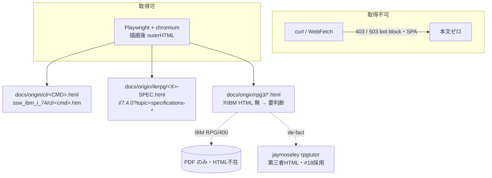

# 調査: 原典 HTML ソース収集の取得方式・URL・現存性

> 取得検証はすべて主エージェントが Playwright + bundled chromium で IBM/一次ソースを**実取得**して確定（AGENTS.md 照合規約 / protocol §2.6）。

## 調査の問い

- Q1: IBM Documentation の原典は curl/WebFetch で取れるか。取れないなら何で・何を保存すべきか（保存形式）。
- Q2: CL コマンド原典の URL パターンと版。制御コマンド（IF/DOWHILE 等）含め確定リスト全てが解決するか。
- Q3: ilerpg（ILE RPG 固定長仕様書 H/F/D/I/C/O/P）の原典 URL。
- Q4: rpg3（RPG/400 / RPG III）の原典は IBM Documentation に生 HTML として現存するか。無いなら代替は。
- Q5: 出力先（保存ディレクトリ・命名）と、規模・サイズの現実性。

## 判明した事実

### F1: 保存形式は「描画後 DOM（outerHTML）」一択（Q1）

- `curl -A Mozilla …/cl/dltf.htm` → **HTTP 503**（bot ブロックの "page cannot be displayed" シェル）。本文キーワード（FILE/パラメーター/OBJ/DLTF）は **0 件**。生 HTTP 応答は使えない。
- Playwright（headless chromium + 通常 UA）で描画 → `outerHTML` 248KB に本文が全て含有：`FILE×9 / パラメーター×6 / OBJ×1 / ライブラリー×19 / DLTF×27`。`hasParams: true`。
- **結論**: 原典 HTML ＝ **Playwright で描画後の `document.documentElement.outerHTML`** を保存する（生 HTML／DOMContentLoaded 前の応答は本文を持たない）。`innerText` だけだと構造（表・桁レイアウト）が失われるため、後続の JSON 化照合には outerHTML が適切。

### F2: CL の URL パターンと版（Q2）— 確定

- パターン: `https://www.ibm.com/docs/ja/ssw_ibm_i_74/cl/<cmd小文字>.htm`（→ `https://www.ibm.com/docs/ja/i/7.4.0?topic=ssw_ibm_i_74/cl/<cmd>.html` にリダイレクト、status 200）。
- 版は **7.4（`ssw_ibm_i_74`）** を採用＝既存 `cl-command-def` skill・既存定義と同一版で一貫。
- 実取得で解決を確認（status 200・正しい h1）:
  - `dltf`（ファイル削除）/ `sbmjob`（ジョブ投入, 21954 chars）/ **`if`（制御）** / **`dowhile`（DO WHILE 制御）**。
  - → 制御コマンド（IF/ELSE/DOWHILE/DOUNTIL/DOFOR/SELECT/RETURN/CALLSUBR）も同じ `cl/<cmd>.htm` で取得可能。確定リスト約 40 件はこのパターンで網羅できる見込み。

### F3: ilerpg 固定長仕様書 7 種の原典 URL（Q3）— 確定

- 一覧元: 「RPG IV の仕様書タイプ」`…/ssw_ibm_i_74/rzasd/rpgspec.htm`（→ `i/7.4.0?topic=specifications-rpg-iv-specification-types`）。
- ここから 7 仕様書ページへのリンクを実抽出（すべて `i/7.4.0?topic=specifications-<name>`）:

  | 仕様書 | 記号 | topic |
  |---|---|---|
  | 制御仕様書 | H | `specifications-control` |
  | ファイル仕様書 | F | `specifications-file-description` |
  | 定義仕様書 | D | `specifications-definition` |
  | 入力仕様 | I | `specifications-input` |
  | 演算仕様書 | C | `specifications-calculation` |
  | 出力仕様 | O | `specifications-output` |
  | プロシージャー仕様書 | P | `specifications-procedure` |

- 注: これらは仕様書の概説ページ。各仕様の**桁位置の記入項目要約**は配下のサブページにある場合がある（後続 JSON 化で要参照）。本収集では最低限この 7 ページを原典として保存し、桁要約サブページの併取は spec で判断する。

### F4: rpg3（RPG/400）は IBM Documentation に生 HTML が**現存しない**（Q4）— 重要

- IBM の RPG/400 リファレンス（RDi help, `…/rdfi/9.6.0?topic=rpg400-language-reference` / 旧 `SSAE4W_9.6.0/…/evferlsh02.htm`）は **"End of support … Product version no longer published"** にリダイレクトされ、本文が無い。#18 当時も 403 で取得不可だった（`20260620-rpg-dialect-split/research.md` F5）。
- 入手可能な IBM 一次資料は **PDF のみ**（RPG/400 Reference SC09-1817 系。IBM Publications / 第三者ホスト）。HTML 原典は存在しない。
- #18 は rpg3 の桁を **jaymoseley.com の RPG チュートリアル**（`rpgtutor/rpg006.htm` 演算仕様, `rpg007.htm`）で照合・grounding 済み。これは**アクセス可能な HTML**（status 200）。ただし第三者・かつ System/3 系 RPG II/III チュートリアルで、IBM RPG/400 の厳密な原典ではない（桁レイアウトは概ね共通のため #18 で採用）。
- jaymoseley 側の仕様関連ページ（実抽出）: `rpg002`(Header/File/Input/Output) / `rpg006`(Calculation) / `rpg007`(selected calc ops) / `rpg010`(Extension/Line Counter) / `rpg008`(Indicators) / `rpg011`(Output Edit Words)。

### F5: 出力先・規模（Q5）

- 保存先（requirement 決定）: `docs/origin/{cl,ilerpg,rpg3}/`（リポジトリ追跡）。既存 `docs/`（`ILE_RPG_Fixed_Format_Reference.md`, `src/`）と並ぶ。
- 規模: CL 約 40 ＋ ilerpg 7 ＋ rpg3 数ページ ≈ **50 ファイル前後**。1 ファイルの outerHTML ≈ 200〜260KB（DLTF 実測 248KB）→ 合計 **約 10〜13MB** を commit。許容範囲だが、`<script>`/`<style>`/不要 chrome を除去すれば数分の一に圧縮可能（spec で判断）。
- 取得は逐次＋描画待ち（1 ページ 10〜20 秒程度）。全体で十数分規模。リクエスト過多を避けるため逐次・待機を入れる。

## 影響範囲

- 追加は `docs/origin/**`（新規ディレクトリ）と取得スクリプト・マニフェストのみ。**既存コード・定義 JSON・`package.json` contributes・言語登録には触れない**（languageId 波及なし＝収集のみ）。
- `cl-command-def` skill の取得手順（Playwright）と整合。skill は `innerText` 取得だが、本収集は outerHTML 保存に拡張する点が差分。

## 実現性 / リスク

- **実現可能**: CL・ilerpg は IBM Documentation から Playwright で確実に取得可能（実証済み）。
- **rpg3 のリスク**: IBM 生 HTML が無い。`docs/origin/rpg3/` を「HTML で」埋めるには第三者（jaymoseley）に頼るか、PDF を別形式で保存するか、いずれかの妥協が要る（下記 spec 申し送り）。
- **サイズ**: outerHTML 全保存はリポジトリを十数 MB 増やす。`<script>` 除去等のスリム化を検討。
- **版差**: 7.4 で統一（既存資産と一致）。7.5/7.6 との差分は本作業では扱わない。

## spec への申し送り

1. **保存形式**: Playwright 描画後 `outerHTML`（`<!DOCTYPE html>` 付き）を保存。UA 設定＋本文長閾値で描画待ち。`innerText` 単体は不採用。
2. **CL**: `ssw_ibm_i_74/cl/<cmd>.htm` を取得 → `docs/origin/cl/<CMD>.html`（ファイル名は既存 JSON と揃え**大文字 CMD**）。確定リスト約 40 件。各取得の status を記録し、404/不一致は欠落として明示。
3. **ilerpg**: F3 の 7 topic を取得 → `docs/origin/ilerpg/<X>-SPEC.html`（H/F/D/I/C/O/P）。桁の「記入項目要約」サブページを併取するかは spec で決定（後続 JSON 化の照合精度に効く）。
4. **rpg3（要意思決定）**: IBM 生 HTML 不在が確定。次のいずれかを spec で選ぶ:
   - (A) #18 と一貫して **jaymoseley の該当ページ**（rpg002/006/007/008/010/011）を `docs/origin/rpg3/` に HTML 保存。マニフェストに「第三者・RPG II/III・IBM RPG/400 PDF が正」と明記。
   - (B) IBM **RPG/400 Reference PDF** を `docs/origin/rpg3/` に保存（HTML ではないが IBM 一次）。
   - (C) 本作業では rpg3 を保留し、ギャップとして記録（CL/ilerpg を先行）。
   - 推奨: **(A)＋マニフェストに IBM PDF の出典リンク**（既存 grounding と整合しつつ、正の所在も残す）。最終判断はユーザー承認に委ねる。
5. **マニフェスト**: `docs/origin/manifest.yml`（または .md）に `{ file, source_url, fetched_at(UTC), http_status, title }` を全件記録。取得失敗・HTML 不在（rpg3）は捏造せず gap として残す（protocol §8 の欠落明示方針）。
6. **スリム化（任意）**: `<script>`/`<style>`/ナビゲーション chrome 除去でサイズ削減してよいが、**本文・表・桁構造は保持**（後続照合の正のため）。除去するなら除去ポリシーをマニフェストに明記。
7. **規約**: 収集のみで contributes/言語登録/定義 JSON は不変更（languageId 波及なし）。逐次取得＋待機でリクエスト過多回避。
