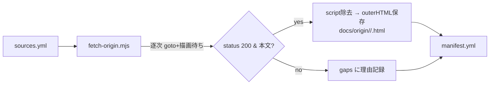

# 仕様: 原典 HTML ソースの収集・保存

## 概要

確定リスト（CL コア約 46 件＋ilerpg 7 仕様書＋rpg3 jaymoseley 該当ページ）の原典を、**Playwright で描画後の `outerHTML`** として `docs/origin/{cl,ilerpg,rpg3}/` に保存する。取得は**再現可能なスクリプト**で行い、入力リスト（`sources.yml`）と取得結果（`manifest.yml`）・出所説明（`README.md`）を残す。**定義 JSON の作成はスコープ外**（後続 issue）。

## 設計方針

- **再現性のためスクリプト化**: その場限りの手取得ではなく、入力リスト → 取得 → 出力＋マニフェスト生成を行う Node スクリプトを `docs/origin/` 配下に commit する。後続の再取得・追加・差分更新が容易。
  - Playwright は PJ の依存に入れない（重い・収集専用）。`/tmp` 等に導入した playwright を `NODE_PATH` 経由で参照して実行する（README に手順明記）。`cl-command-def` skill の既存運用（Playwright + bundled chromium）と一貫。
- **保存は描画後 outerHTML**（research F1）。`<script>`/`<noscript>` のみ除去してサイズ・ノイズを削減し、**本文・表・桁構造・`<style>` は保持**（後続 JSON 化の照合の正を損なわない）。除去ポリシーは README/manifest に明記。
- **版は IBM i 7.4（`ssw_ibm_i_74`）に統一**（既存定義・`cl-command-def` skill と一致）。
- **rpg3 は (A) jaymoseley HTML**（承認済み）。第三者・RPG II/III チュートリアルである旨と、IBM RPG/400 Reference（PDF・正）の出典を README/manifest に明記。
- **欠落は捏造しない**（protocol §8）。404・取得失敗は manifest の `gaps` に理由付きで残し、空ファイルを置かない。

## 対象範囲（追加ファイルのみ・既存不変更）

```
docs/origin/
  README.md            # 出所・版・取得方法・rpg3 第三者注記・除去ポリシー
  sources.yml          # 入力: 取得対象リスト {category,name,url}
  fetch-origin.mjs     # 取得スクリプト(Node+Playwright): sources.yml→保存+manifest生成
  manifest.yml         # 出力: 全件の取得結果 {file,source_url,fetched_at,http_status,title} + gaps
  cl/<CMD>.html        # CL 原典（大文字 CMD・約46件）
  ilerpg/<X>-SPEC.html # ILE RPG 固定長仕様書 7種（H/F/D/I/C/O/P）
  rpg3/<id>.html       # jaymoseley rpgtutor 該当ページ
```

- **既存コード・定義 JSON・`package.json` contributes・言語登録には一切触れない**（収集のみ＝languageId 波及なし。AGENTS.md）。

## インターフェース / データ構造

### `sources.yml`（入力リスト）

```yaml
version: ssw_ibm_i_74            # CL/ilerpg の IBM 版
categories:
  cl:
    base: https://www.ibm.com/docs/ja/ssw_ibm_i_74/cl/   # <name小文字>.htm を付加
    items: [CRTPF, CRTLF, DLTF, ...]                      # 大文字 CMD（ファイル名にも使用）
  ilerpg:
    items:                                                # topic は固定 URL
      - { name: H-SPEC, url: 'https://www.ibm.com/docs/ja/i/7.4.0?topic=specifications-control' }
      - { name: F-SPEC, url: '...specifications-file-description' }
      # D/I/C/O/P ...
  rpg3:
    base: https://www.jaymoseley.com/hercules/rpgtutor/
    items:                                                # id=ファイル名
      - { name: rpg002, url_suffix: rpg002.htm, note: 'Header/File/Input/Output basic statement types' }
      - { name: rpg006, url_suffix: rpg006.htm, note: 'Calculation Specifications' }
      # rpg007/008/010/011 ...
```

### CL items（確定 46 件・★=定義済みも再収集）

- ファイル: CRTPF CRTLF DLTF★ OVRDBF CPYF CLRPFM RGZPFM CRTSRCPF
- オブジェクト/ライブラリ: CRTLIB DLTLIB DLTOBJ CRTDUPOBJ CHGOBJD RNMOBJ MOVOBJ ADDLIBLE CHKOBJ
- プログラム/ジョブ: CALL★ CALLPRC SBMJOB RTVJOBA★ RTVDTAARA CHGDTAARA CRTDTAARA
- CL ロジック: DCL★ DCLF CHGVAR★ IF ELSE DOWHILE DOUNTIL DOFOR SELECT RETURN CALLSUBR
- メッセージ: SNDPGMMSG★ RCVMSG★ MONMSG★ SNDUSRMSG SNDMSG
- I/O・スプール: SNDRCVF★ RCVF SNDF WRKSPLF★ CPYSPLF OVRPRTF

### ilerpg items（7 種）

| name | 記号 | url(topic) |
|---|---|---|
| H-SPEC | 制御 | `i/7.4.0?topic=specifications-control` |
| F-SPEC | ファイル | `i/7.4.0?topic=specifications-file-description` |
| D-SPEC | 定義 | `i/7.4.0?topic=specifications-definition` |
| I-SPEC | 入力 | `i/7.4.0?topic=specifications-input` |
| C-SPEC | 演算 | `i/7.4.0?topic=specifications-calculation` |
| O-SPEC | 出力 | `i/7.4.0?topic=specifications-output` |
| P-SPEC | プロシージャー | `i/7.4.0?topic=specifications-procedure` |

> ilerpg の桁「記入項目要約」サブページの**併取は本作業では行わない**（7 概説ページのみ）。サブページ収集は後続 JSON 化 issue で必要に応じ追加（research F3 注記）。

### rpg3 items（jaymoseley・5〜6 ページ）

`rpg002`(H/F/I/O 基本) / `rpg006`(演算) / `rpg007`(選択演算) / `rpg008`(指示器) / `rpg010`(拡張/行カウンタ) / `rpg011`(出力編集語)。

### `manifest.yml`（出力）

```yaml
generated_at: <UTC ISO8601>
fetch_method: 'playwright chromium, rendered document.documentElement.outerHTML, <script>/<noscript> stripped'
version: ssw_ibm_i_74 (IBM i 7.4)
items:
  - { file: cl/DLTF.html, category: cl, name: DLTF, source_url: '...', http_status: 200, title: 'ファイル削除 (DLTF) - IBM Documentation', bytes: 240000, fetched_at: '<ts>' }
  # ...
gaps:
  - { name: <name>, category: <cat>, reason: 'http 404' | 'render timeout' | ... }
notes:
  rpg3: '第三者(jaymoseley) RPG II/III チュートリアル。IBM 正典 = RPG/400 Reference (SC09-1817系, PDF; ibm.com/docs に生HTML無し)'
```

## 振る舞いの詳細（`fetch-origin.mjs`）

1. `sources.yml` を読み、category ごとに URL と保存パス（`docs/origin/<cat>/<name>.html`）を組み立てる。
2. chromium（headless）を 1 つ起動し、**逐次**で各 URL を処理（リクエスト過多回避）:
   - `newContext({ userAgent: 通常ブラウザ UA })` → `goto(url, { waitUntil:'domcontentloaded', timeout:60000 })`。
   - `waitForFunction(() => document.body.innerText.length > 2000, { timeout:30000 }).catch(()=>{})` → `waitForTimeout(1500)`（SPA 描画待ち）。
   - `http_status`・`title`・`outerHTML` を取得。`<script>`/`<noscript>` を DOM から除去後に `'<!DOCTYPE html>\n'+outerHTML` を保存。
   - 各取得後に短い待機（例 800ms）を入れる。
3. 取得成功（status 200 かつ本文閾値超）→ ファイル保存＋`items` に追記。失敗（非200・タイムアウト・本文取得不可）→ ファイルを書かず `gaps` に理由を記録。
4. 全件処理後に `manifest.yml` を生成（`generated_at` は実行時 `date -u` 由来をスクリプトに渡す or スクリプト内で取得）。



## ドメイン固有の考慮（AGENTS.md）

- **原典照合は主エージェントが実施**: 取得の成否・本文有無・件数充足は、主エージェントが取得結果（manifest・保存 HTML）を直接確認して確定する（サブエージェント委譲しない。protocol §2.6）。本作業は「原典の収集」自体が目的のため、保存物＝原典スナップショットが正。
- **languageId 波及なし**: contributes/言語登録/拡張子関連付けに触れないため、診断・キーバインド等への副作用は発生しない。
- **sh/ps1 二本立て CLI への影響なし**（`.aidev/bin` 不変更）。

## エラー処理 / 異常系

- **404 / リダイレクト先が end-of-support**: `gaps` に記録し空ファイルを置かない（rpg3 IBM HTML 不在は想定どおり。rpg3 は jaymoseley で取得するため gap にはならない）。
- **描画タイムアウト / 本文閾値未満**: 1 度リトライ（再 goto）し、なお失敗なら `gaps`。
- **CL 名の綴り違いで 404**: 個別 gap として残し、必要なら正しい綴りを主エージェントが IBM 一覧で確認して `sources.yml` を修正・再取得。
- **部分失敗で全体を止めない**: 1 件の失敗は握りつぶして次へ（最後に gaps を集計）。

## 受け入れ基準との対応

- CL コア約 46 件 → `docs/origin/cl/*.html`（fetch-origin.mjs が一括取得、manifest で件数・status 確認）。
- ilerpg 7 種 → `docs/origin/ilerpg/<X>-SPEC.html`。
- rpg3 → `docs/origin/rpg3/<id>.html`（jaymoseley、承認方針 A）。
- 取得元 URL・取得日 → `manifest.yml` の各 `source_url` / `fetched_at`。
- 欠落明示 → `manifest.yml` の `gaps`（捏造なし）。
- 定義 JSON 不変更 → 変更対象は `docs/origin/**` のみ（git diff で担保）。

## 未確定の小項目（plan/coding で確定）

- CL 一部コマンド（ELSE/SELECT/CALLSUBR 等の構文系）の正確な htm 綴り → coding 時の実取得 status で確認・修正。
- `generated_at` 等タイムスタンプの注入方法（スクリプト内取得 or 引数）。
- README の rpg3 注記に載せる IBM RPG/400 PDF の具体 URL。
