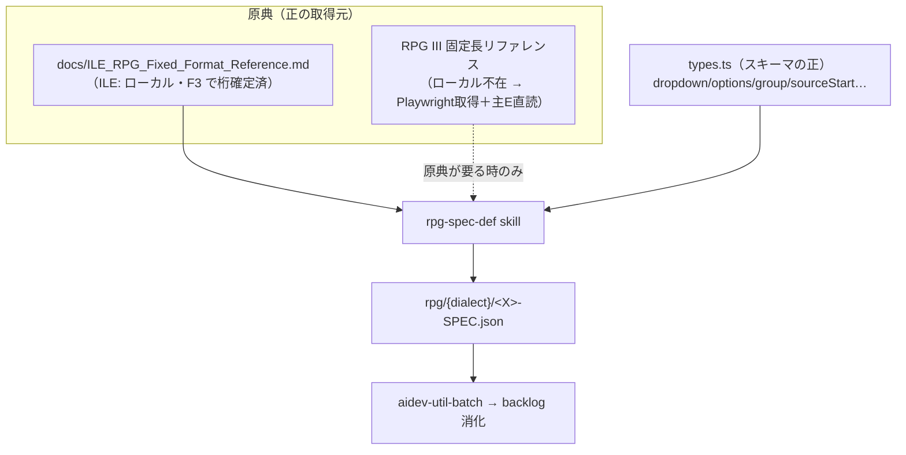

# 調査: RPG固定長仕様書のプロンプター定義生成・検証 支援skill（rpg-spec-def）

> requirement.md「未確定事項」を事実で解消する。原典（固定長リファレンス）の桁位置照合は
> protocol §2.6 / AGENTS.md 検証規約に従い**主エージェントが生テキストを直読**して実施した。

## 調査の問い

- Q1: 出力先スキーマ（`types.ts`）はどの表現を持つか（特に列挙・グループ・桁位置）。
- Q2: 既存 RPG 定義（ile/rpg3）の構造・命名・桁位置の付け方の慣行。
- Q3: ILE(RPG IV) の F/I/O/P 仕様の正確な桁位置（原典直読）。
- Q4: **RPG III 固定長リファレンスの所在**（issue は「#18 で追加」と主張）。
- Q5: 模倣すべき `cl-command-def` skill の構造と、RPG で変える点。

## 判明した事実

### F1: 出力先スキーマ `types.ts`（Q1）

`vscode-extension/src/prompter/types.ts:20-60` を直読。

- `PrompterDefinition` = `{ keyword, description, help?, parameters[] }`。
- `ParameterDefinition` の主キー: `name`, `description`, `help?`, `inputType`(`text|dropdown|number|group`),
  `required`, **`sourceStart?` / `sourceLength?`（固定長の1始まり桁位置。初期値取得と書き戻しに使用）**,
  `defaultValue?`, `attributes?`{`characterSet`(`alpha|alnum|upper|any`), `numericOnly`, `minLength`, `maxLength`},
  `length?`, `placeholder?`, `maxOccurrences?`, `visibleByDefault?`, `options?[{label,value}]`, `children?[]`。
- **重要差分（cl-command-def の前提と異なる）**: スキーマには **`options[]`（列挙）と `inputType:"dropdown"` が
  既に存在**する。CL skill 執筆時は「enum 欄が無いので help 列挙」だったが、RPG では固定値
  （ファイル・タイプ I/O/U/C 等）を **dropdown + options** で正しく表現できる（既存 D-SPEC が実例）。
- `Dialect = "ile" | "rpg3"`（`types.ts:5`）。languageId `rpg-fixed` と直交し拡張子で導出。

### F2: 既存 RPG 定義の慣行（Q2）

実例: `resources/prompter/rpg/ile/D-SPEC.json`、`rpg/rpg3/C-SPEC.json` を直読。

- `keyword` は `"<X>-SPEC"`、`description`/`help` は日本語・短文＋詳細。
- 各パラメータに `sourceStart`/`sourceLength` を**桁位置表どおり**に付与（例 D-SPEC NAME=8/14, LEN=33/7）。
- 固定値の列挙は `dropdown`+`options`（D-SPEC の DECLTYPE/INTTYPE）。名前系は `characterSet:"upper"`。
  数値は `inputType:"number"`+`attributes.numericOnly`。末尾に自由記述 `COMMENT` を置く慣行。
- rpg3 は ile と桁が異なるため**別ファイル**（`rpg3/C-SPEC.json`、help に「桁位置は ILE とは異なる」と明記）。
- 既存 ile 定義: `H/C/D-SPEC` + `C-NEW`（新形式 C）。**F/I/O/P は未作成**（本 skill の消化対象）。

### F3: ILE F/I/O/P 仕様の桁位置（Q3）— 原典直読で確定

`docs/ILE_RPG_Fixed_Format_Reference.md` を直読（行番号付き）。

- **F仕様書**（L159-171）: 6=コード, **7-16 ファイル名**, **17 ファイル・タイプ(I/O/U/C)**, **18 ファイル指定(F/空白)**,
  **19 ファイル形式(E/F)**, 20-23 レコード長, 24-27 制限処理, 28 レコード・アドレス・タイプ, 29-33 ファイル編成,
  **34-42 装置(DISK/PRINTER/WORKSTN/SPECIAL/SEQ)**, **44-80 キーワード**。
- **I仕様書**（L503-515）: 6=コード, 7-16 ファイル/DS名, 17-18 論理関係/標識, 19-20 レコード識別標識,
  21-41 レコード識別コード, **43-46 From**, **47-51 To**, **52 データ・タイプ**, 53-58 小数点/日付形式,
  **59-68 フィールド名**, 69-74 制御レベル。
- **O仕様書**（L745-753）: 6=コード, 7-16 ファイル名, **17 タイプ(H/D/T/E)**, 18-20 条件標識, 21-29 出力条件,
  **30-39 EXCEPT名**, 40-51 スペース・スキップ。
- **P仕様書**（L788-793）: 6=コード, **7-21 プロシージャー名**, **24 始め/終わり(B/E)**, **44-80 キーワード**。
- 参考: **C仕様書(ILE)**（L538-550）: 12-25 演算項目1, 26-35 演算コード, 36-49 演算項目2, 50-63 結果フィールド,
  64-68 長さ, 69-70 小数点, 71-76 結果標識（※既存 ile/C-SPEC 済みだが桁照合の裏取りとして併記）。

### F4: RPG III リファレンスの所在（Q4）— **重要: フル原典 doc は不在**

- リポジトリに**フル RPG III(RPG/400) 固定長リファレンス doc は存在しない**。`docs/` 配下を grep しても該当なし。
- #18（`20260620-rpg-dialect-split`）の `research.md` F5 によれば、RPG III は **C 仕様書の桁のみ**を外部の
  「固定長フォーマットリファレンス（RPG II/III 演算仕様書フォーム, rpg006/rpg007）」で直読照合しており、
  **フル doc 追加は別 issue（当時スコープ外）として明示的に先送り**されていた（同 research.md L125）。
  IBM 公式（RPG/400 Reference）は当時 **403** で取得不可と記録。
- backlog の方言分担:
  - `rpg-spec.md` = **ILE スコープ**。F/I/O/P が `needs: #19` で未着手（本 skill の直接の消化対象）。
  - `rpg3-spec.md` = **RPG III スコープ**。C-SPEC のみ済。F/I/O/H 等は「**#19 以降、必要時に原典照合のうえ追加**」と保留。
- ⇒ issue #19 の「RPG III リファレンス（#18 で追加）」という前提は**不正確**。RPG III のフル原典は
  ローカルに無く、rpg3 の多仕様生成は**オンライン原典の取得（Playwright）＋主エージェント直読**を要する。

### F5: 模倣元 `cl-command-def`（Q5）

`.claude/skills/cl-command-def/SKILL.md` を直読。構造 = frontmatter(`name`/`description`/`allowed-tools`) →
出力先・スキーマ → 原典参照方法（IBM Doc は WebFetch/curl 不可 → **Playwright headless 描画取得**）→
IBM仕様→JSON マッピング規約（表）→ 手順（取得→抽出→組立→検証→書出し）→ aidev 連携（research=取得/抽出,
coding=生成/検証）。**正誤確定は原典生テキスト直読・機械diff・サブ委譲しない**を明記。

## 影響範囲

- 新規ファイル: `.claude/skills/<name>/SKILL.md`（拡張機能 TypeScript には不変）。
- 生成物の置き場: `vscode-extension/resources/prompter/rpg/{ile,rpg3}/<X>-SPEC.json`（既存ツリーに追加）。
- 下流: `aidev-util-batch` が `rpg-spec.md`(ILE) を消化可能になる（#19 の受け入れ基準）。`rpg3-spec.md` は
  原典制約のため当面 C-SPEC のみ（本 skill は rpg3 も扱えるが原典取得が前提）。

## 実現性 / リスク

- **ILE は完全に実現可能**: F/I/O/P すべてローカル原典（F3）で桁が直読確定済み。`types.ts` の dropdown/options/
  group で固定値・修飾・反復を表現できる。CL より表現力が高い（enum 欄あり）。
- **rpg3 は原典制約あり（リスク）**: フル RPG III 原典がローカルに無い（F4）。rpg3 の F/I/O/P を作るには
  オンライン原典の Playwright 取得＋主エージェント直読が必須で、**取得不能時は桁を捏造せず保留**すべき。
  skill は dialect 引数を持ちつつ、rpg3 は「原典が到達可能な場合のみ」生成する設計にする。
- **I/O 仕様の構造的複雑さ（spec で要設計）**: I/O 仕様書は1レコードに複数の行種（レコード識別行とフィールド行、
  出力の見出し/明細/合計）を持ち、桁位置表は主に「レコード行」を表す。プロンプターは1行=フィールド集合の
  モデルなので、**どの行種を対象に定義を切るか**（例: I/O は代表行＝レコード行ベース）を spec で決める。
- **enum 表現の方針更新**: cl-command-def は「help 列挙」だったが、RPG skill は固定値を **dropdown+options**
  で表す（D-SPEC 実例）。マッピング規約を CL からそのまま流用せずこの点を上書きする。

## spec への申し送り

1. **skill は dialect-aware**（`ile`/`rpg3`）。出力先 `rpg/{dialect}/<X>-SPEC.json`。スキーマの正は `types.ts`。
2. **原典の正**: ILE = ローカル `docs/ILE_RPG_Fixed_Format_Reference.md`（直読）。rpg3 = ローカル不在のため
   Playwright 取得＋主E直読、取得不能なら生成保留（捏造禁止）。この非対称を skill 手順に明記する。
3. **マッピング規約は RPG 用に更新**: 固定値=`dropdown`+`options`、修飾/ELEM=`group`+`children`、
   名前=`characterSet:"upper"`、数値=`number`+`numericOnly`、桁位置=`sourceStart`/`sourceLength` を桁位置表どおり。
4. **対象仕様種別**: 当面の受け入れは ILE の **F/I/O/P**（backlog の needs:#19）。skill 手順は H〜P を汎用に扱えるが、
   I/O は行種の取り方を定義（代表行ベース）として spec に明記。
5. **検証**: JSON パース可・既存定義と同型・桁位置が原典と一致を、**主エージェントが原典生テキストと機械照合**
   （サブ委譲しない）。`cl-command-def` の検証節を踏襲。
6. **受け入れ基準の実証**: 本作業は skill 新設までがスコープ。F/I/O/P の実生成は後続 batch だが、
   skill が機能する**実証として最低1種（F-SPEC/ILE）を生成・原典照合**してドッグフードする案を spec/plan で検討。
