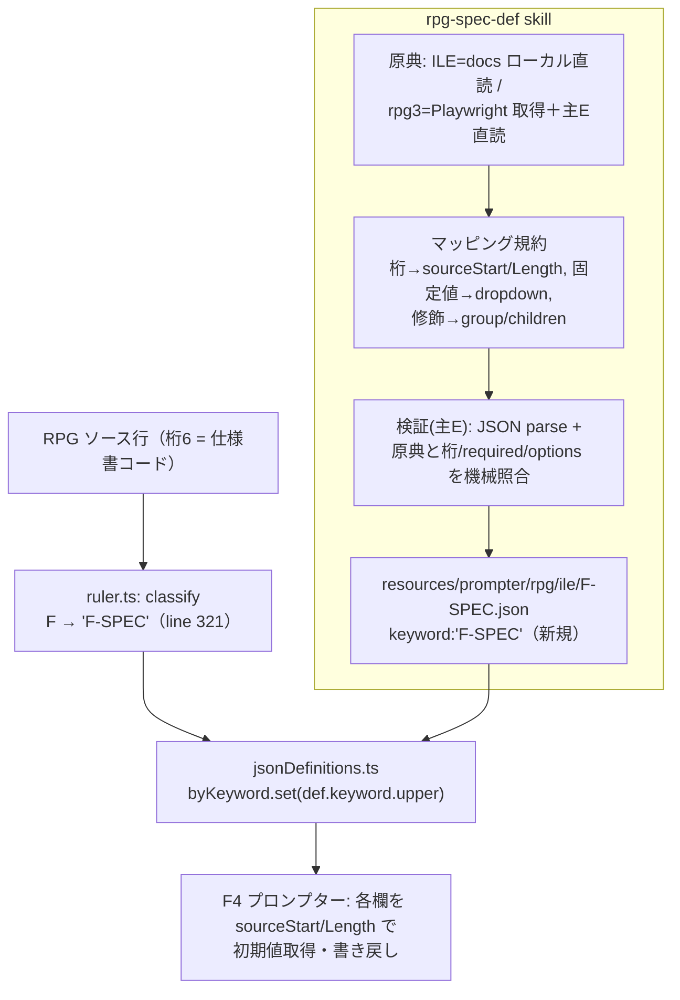

# レビューガイド: RPG固定長仕様書のプロンプター定義生成・検証 支援skill（rpg-spec-def）

## 変更概要 / 目的

CL の `cl-command-def` に相当する **RPG 用の支援 skill `rpg-spec-def`** を新設（#19）。RPG 固定長仕様書
（H/F/D/I/C/O/P）のプロンプター定義 JSON を、固定長リファレンス原典を正として生成・検証する。あわせて
skill の機能実証として **F-SPEC(ILE) を1件ドッグフード生成**し、`aidev-util-batch` が `rpg-spec` backlog を
消化できる前提（#19 の依存）を解消した。製品差分は実質3ファイル（skill md / F-SPEC.json / backlog 1行）。

## 重要ポイント（特に見てほしい所）

1. **原典の dialect 非対称**（`SKILL.md` の「原典の参照」節）— これが本 skill 最大の設計判断。
   issue は「RPG III リファレンスは #18 で追加」を前提にしたが、調査で**フル RPG III 原典 doc はリポジトリに
   不在**と判明（`research.md` F4 / `decisions.md` D2）。そこで ile=ローカル直読 / rpg3=オンライン取得＋主E直読・
   **未到達なら桁を捏造せず保留**、という非対称を skill 手順に内在化した。レビューはこの方針の妥当性を中心に。
2. **enum 表現を CL から更新** — `cl-command-def` は当時スキーマに enum 欄が無く help 列挙だったが、`types.ts` は
   `dropdown`+`options` を持つため、RPG では固定値を dropdown で表現する（`SKILL.md` マッピング規約の脚注）。
3. **positional / keyword の2系統**を区別（同マッピング規約）— 定位置欄は `sourceStart`/`sourceLength`、
   H 全体や 44-80 キーワード欄は keyword 方式で `sourceStart` を付けない（既存 H-SPEC.json の前例）。
4. **ドッグフードはスコープ判断を伴う**（`decisions.md` D1）— requirement「対象外」だが受け入れ基準の実証として
   F-SPEC のみ生成。I/O/P は backlog に据え置き。

## 処理フロー

## 主要な変更箇所

- `.claude/skills/rpg-spec-def/SKILL.md:30` — 原典参照の dialect 非対称（ile ローカル / rpg3 オンライン・未到達保留）。
- `.claude/skills/rpg-spec-def/SKILL.md:62` — RPG→JSON マッピング規約（dropdown/options・group/children・positional/keyword）。
- `.claude/skills/rpg-spec-def/SKILL.md:104` — languageId 非波及の明記（診断/キーバインドへ波及しないことの保証）。
- `vscode-extension/resources/prompter/rpg/ile/F-SPEC.json:1` — F 仕様の11欄。桁は原典 L159-171 と一致（主E照合済み）。
  既存 `ruler.ts:321`（F→"F-SPEC"）＋ `jsonDefinitions.ts` の keyword 索引に**配線済み**＝従来 F 行に定義が無かった穴を埋める。
- `.aidev/backlog/rpg-spec.md` — F-SPEC を `[x]`（生成根拠つき）。I/O/P は未着手のまま。

## リスク / 確認してほしい点

- **rpg3 経路は本作業で未実証**（原典がローカルに無いため ile のみドッグフード）。rpg3 多仕様の消化は別途
  オンライン原典が前提になる点を許容できるか。
- **`F-SPEC.json` の required / COMMENT 欄**は原典に明示列が無い中での判断（既存 D-SPEC.json の前例に準拠）。
  原典厳格主義の観点で許容範囲か（review nit、対応=許容）。
- **既知の制約（PR にも記載予定）**: ①ユニット/結合テストは runner 未設定で未実行（tsc クリーン・配線はコード直読で確認）。
  ②`ruler.ts` の specChar switch に `case "I"` が無く、後続 I-SPEC 消化時に ruler 側の対応も要検討（本作業スコープ外）。
