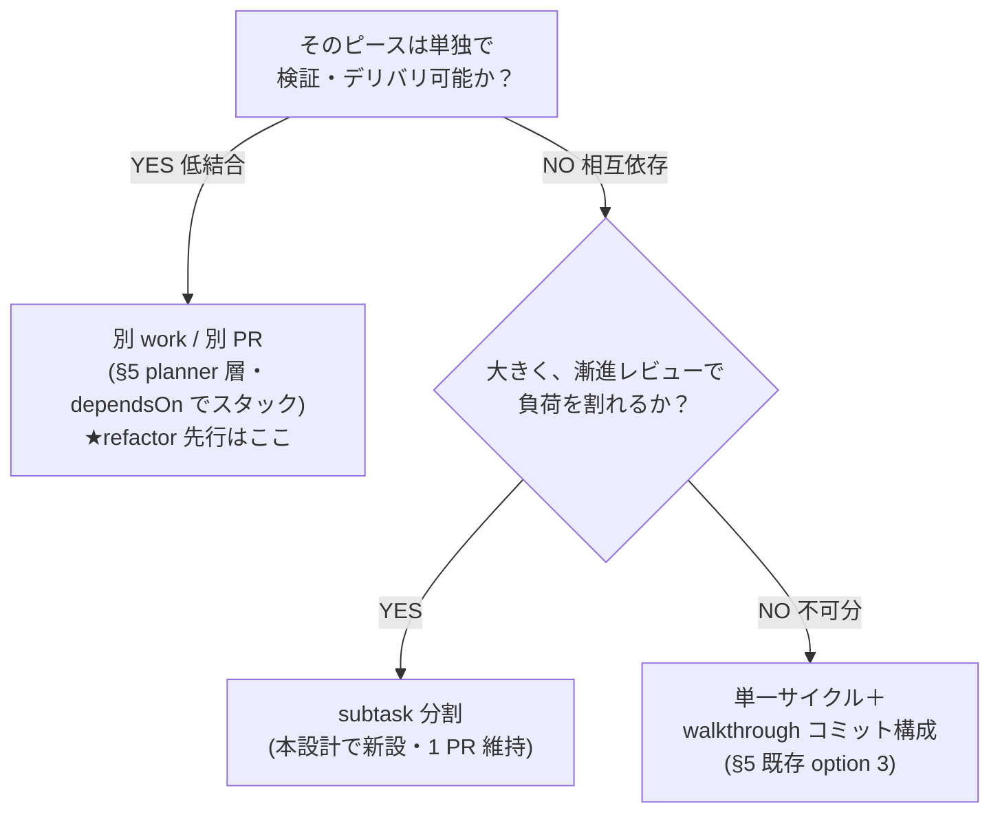
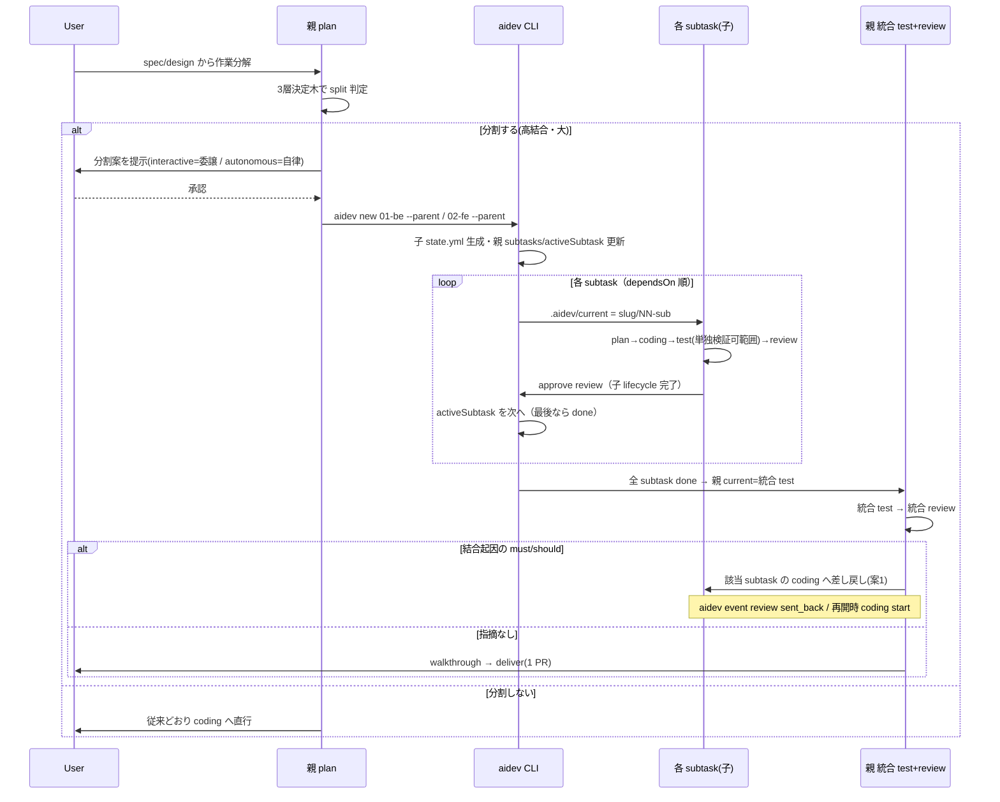
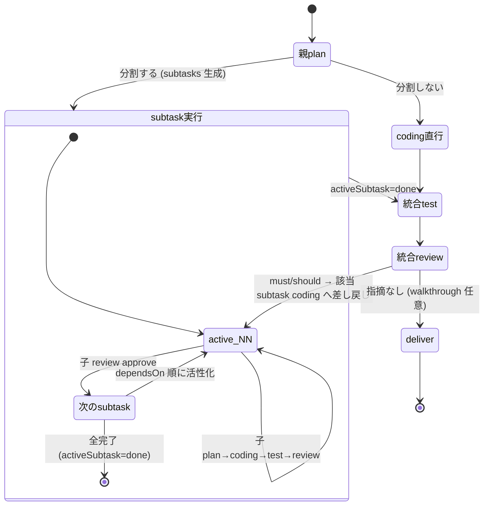

# 設計: サブタスク分割（subtask 層）の導入

## アーキテクチャ概要

現行の「work = フォルダ＋フラット state.yml」を**再帰適用**し、高結合 feature の内部に
subtask 子サイクルを挟む。新しい不変条件は最小限（親に2フィールド、子に `parent` 1フィールド、
schema 2→3）。判定原則は単一（検証可能性 seam）で、軸は増やさない。



## コンポーネント / モジュール

| 対象 | 変更 | 責務 |
|---|---|---|
| `aidev-docs/DESIGN.md` §5 | 改訂 | split を3層決定木として明文化。refactor 非対象の釘刺し |
| `aidev-30-plan/SKILL.md` | 改訂 | split 判定（interactive=委譲 / autonomous=自律）・subtask 生成・subtask plan の scope 凍結 |
| `aidev-60-review/SKILL.md` | 改訂 | 親「統合 review」：差し戻し先 = 該当 subtask の coding（案1） |
| `aidev-50-test/SKILL.md` | 改訂 | 親「統合 test」追加。subtask test は単独検証可能範囲に限定と明記 |
| `aidev-00-start/protocol.md` | 改訂 | state スキーマ（subtasks/activeSubtask/parent・schema 3）、工程一覧に subtask 層を追記 |
| `.aidev/bin/aidev`（sh） | 改修 | resolve_work のパス解決・new の subtask モード・guard の dependsOn 解決・CURRENT_SCHEMA |
| `.aidev/bin/aidev.ps1`（ps1） | 改修 | sh と挙動一致（パリティ） |
| `.aidev/bin/test/run.sh` | 追加 | subtask 系のパリティ節 |

## インターフェース / データモデル

### 親 state.yml（schema 3・追加2フィールド）

```yaml
schema: 3
slug: <feature-slug>
current: <親 lifecycle 工程>
approved: [...]
mode: interactive
subtasks: [01-backend, 02-frontend]   # フローリスト（既存 ylist で読める）
activeSubtask: 01-backend             # スカラ。全完了で done（既存 yget で読める）
dependsOn: []
```

### 子 state.yml（既存フラット schema ＋ parent 逆参照）

```yaml
schema: 3
slug: 01-backend
parent: <feature-slug>     # 追加（逆参照）
current: coding
approved: [plan, coding]
mode: interactive          # 親から継承
humanGates: []
maxSendBacks: 3
dependsOn: [01-backend]    # 同一親内 producer→consumer の順序を表現
```

> **設計ポイント**：子 state.yml はネストを一切持たない＝`yget`/`ylist`（フロー形式専用）が無改修で読める。
> これが案A（親に全ネスト）を退け案Bを採る決め手。AGENTS.md の sh/ps1 パリティ罠を回避する。

### カーソル（`.aidev/current`）

- 親工程中：`<YYYYMMDD-slug>`
- subtask 実行中：`<YYYYMMDD-slug>/<NN>-<subslug>`（パス文字列。`resolve_work` がそのまま `works/<path>` に解決）

### CLI 表面（想定）

```sh
aidev new <NN>-<subslug> --parent <slug>   # 子フォルダ＋子 state.yml 生成、親 subtasks/activeSubtask 更新
aidev event coding start                   # .aidev/current のパスが指す対象（親 or 子）に記録
aidev approve review must=0 ...            # 同上
```

## 処理フロー / シーケンス



## 状態遷移（親 current と activeSubtask）



## 設計判断

1. **案B（子ごとの独立フラット state.yml）を採用、案A（親に全ネスト）を却下**。
   理由：`bin/aidev` の最小 YAML ヘルパーはフロー形式専用でネストを読めず、案A は本格パーサ導入＝
   sh/ps1 二重改修を招く（AGENTS.md のパリティ罠）。案B は既存スキーマの再帰適用で無改修に近い。

2. **`.aidev/current` をパスにしてカーソル兼用**。`resolve_work` は元々「文字列から `works/<path>` を組む」
   だけなので、スラッシュ許可の最小変更でカーソル機能が成立する。親 `activeSubtask` は機械可読の冗長コピー
   （propose/metrics が構造を把握するため。current が真実、activeSubtask は導出キャッシュ）。

3. **split 判定原則を単一に保つ（軸を列挙しない）**。frontend/backend 等は原則の適用結果。
   refactor 等の振る舞い不変変更は単独検証可＝低結合なので subtask に落とさない（決定木で上位/下位へ振る）。
   退けた代替：split 軸の taxonomy 化（DESIGN §5 と矛盾し場当たり化する）。

4. **subtask test を単独検証可能範囲に限定し、親に統合 test を新設**。
   高結合 work は seam で単独検証が効きにくい（§5）。subtask test を本ゲートに置くと false-green を生むため、
   結合検証の本ゲートは親統合 test に集約する。退けた代替：subtask test を結合まで担わせる（検証不能で空通過）。

5. **統合 review の差し戻しは該当 subtask の coding（案1）**。再 split（親 plan 戻し）より手戻りが小さく、
   activeSubtask を該当子へ巻き戻すだけで再開できる。`maxSendBacks` は親・子それぞれの sent_back 件数で独立判定。

6. **schema 2→3、後方互換は legacy 免除**。既存 work（schema 2 / 未記載）は subtask 系不変条件を verify が免除。

## plan への申し送り（作業分解の示唆）

本 work 自体は**高結合**（DESIGN 改訂・protocol スキーマ・各 skill・CLI が `current`/`state.yml` 規約を共有）。
3層決定木で言えば **subtask 分割の好例**。想定 subtask（producer→consumer 順、dependsOn でスタック）：

1. `01-cli-core`：`bin/aidev`（sh/ps1）の resolve_work パス解決・new subtask モード・guard・CURRENT_SCHEMA 3、
   `test/run.sh` パリティ。← 他の土台（contract 提供側）。
2. `02-protocol-schema`：`protocol.md` の state スキーマ（subtasks/activeSubtask/parent）・工程一覧改訂。（依存: 01）
3. `03-skills`：`plan`/`review`/`test` SKILL の改訂（split 判定・subtask 生成・統合 test/review）。（依存: 01,02）
4. `04-design-doc`：`DESIGN.md` §5 の3層決定木改訂と refactor 釘刺し。（依存: なし。並行可だが文言は 01-03 確定後が安全）

- 親統合 test = sh/ps1 パリティ＋既存 work（schema 2）非破壊の e2e 確認。
- 親統合 review = `current`/`state.yml`/`metrics` の不変条件横断と AGENTS.md 規約（sh/ps1・languageId は本件無関係）。
- **注意**：本 work は自己言及的（aidev で aidev を改修）。subtask 機能未実装の段階で本 work を subtask 分割すると
  CLI が未対応。よって**本 work の実装中は 01-cli-core を先に通常 plan で仕上げ**、subtask 機能が動く状態にしてから
  必要なら以降を subtask 化する（鶏卵回避）。plan 工程でこのブートストラップ順序を確定すること。
```
