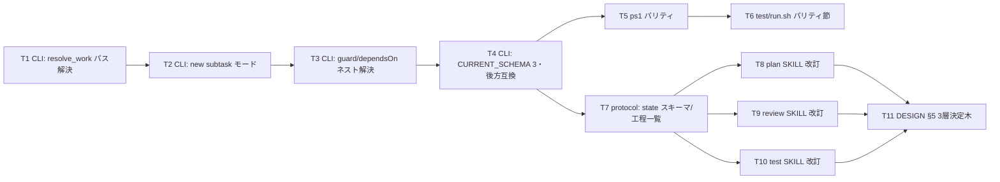

# 計画: サブタスク分割（subtask 層）の導入

## split 判定の結論（本 work 自身に3層決定木を適用）

本 work は高結合（DESIGN/protocol/skill/CLI が `current`・`state.yml`・schema 規約を共有）で、
決定木上は **subtask 分割の好例**。しかし**自己言及的なブートストラップ問題**がある：
subtask を回す CLI 機能が未実装のうちは、本 work 自体を subtask 分割できない（鶏卵）。

→ **本 work は subtask 分割せず、単一サイクルの通常 tasks.md で実装する**（§5 の「不可分」運用に倣う）。
依存順に並べた順序付きコミットで、レビュー負荷は walkthrough で緩和する。
subtask 機能の「実証」は、本 work 完了後に別 work（または follow-up）で行う。

## 実装方針

CLI（contract 提供側）→ protocol（スキーマ規約）→ skills（規約の利用側）→ docs の順で、
依存の下流から積み上げる。各層は前の層の確定を前提にする。

## 作業順序と依存関係

## リスク / 留意点

- **sh/ps1 パリティ罠**（AGENTS.md）：`set -eu` の `return 0`・`var=$(func)` 非0停止、ps1 単一要素配列アンラップ。
  T1–T5 で踏みやすい。`test/run.sh` パリティ節（T6）で機械突合し、ps1 は CI（pwsh）で必ず確認。
- **後方互換**：schema 2 / 未記載の既存 work（`works/*` 多数）が verify/guard で落ちないこと（T4 で legacy 免除）。
- **自己言及の事故**：本 work の実装中に誤って自分を subtask 化しない（plan の結論どおり単一サイクル厳守）。
- **原典照合**：本 work はワークフロー基盤改修で IBM 原典の対象外だが、CLI 挙動は既存 `bin/README.md`/
  `test/run.sh` の現仕様を正として突合する。

## テスト方針（test 工程）

- **単体（CLI）**：`test/run.sh` に subtask 系ケースを追加——new subtask で親 subtasks/activeSubtask 更新、
  `.aidev/current` パス解決、guard のネスト dependsOn、schema 3 刻印、schema 2 work の非破壊。
- **パリティ**：sh⇔ps1 を `test/run.sh` パリティ節で突合（pwsh 環境/CI 必須）。
- **整合**：protocol.md の state スキーマ記述と CLI 実装・各 SKILL の参照が一致するか内部突合。
