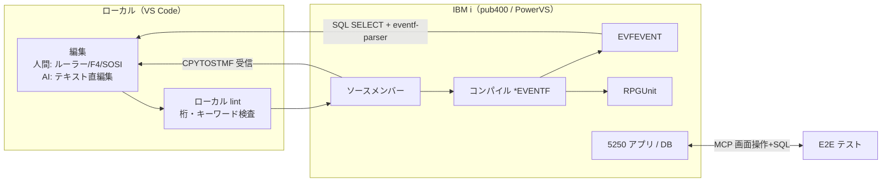

# 仕様: VS Code を軸とした IBM i 開発ワークフローの設計

## 概要

research の事実（F1〜F9）を土台に、**ワークフロー設計書**と**実装バックログ**を作る。
本作業の成果物は文書であり、個別機能の実装は後続作業に委ねる。

成果物の置き場:

- 設計書: `docs/workflow/ibmi-dev-workflow.md`（リポジトリに恒久配置。
  `docs/research/code-for-ibmi.md` と同じ扱いで main にマージする）
- バックログ: `.aidev/backlog/workflow.md`（既存の backlog 形式に合わせ、
  優先度と依存 `(needs:…)` を付ける）

## 設計方針

### 中心原則: 「人間は UI、AI は同じプリミティブを直接」

Code for IBM i の実行系が ssh + CL + SQL の包装であることが確定した（research F1）ので、
AI に UI を操作させる方向は捨て、**サーバー側プリミティブを AI が直接叩く**設計とする。
人間は Code for IBM i ＋本 PJ 拡張（ルーラー・F4・SOSI）で編集し、AI は同じ実機に
別経路で到達する。両者は**実機上の状態（メンバー・オブジェクト・スプール）で合流**する。

### 決定事項（ユーザー確認済み）

| 論点 | 決定 | 理由 |
|---|---|---|
| Db2 経路 | **as400-web-emulator に TS で配線** | 画面操作と SQL が 1 つの MCP にまとまる。Java 不要。実機側導入物ゼロ。core の `DbConnection` は実機確認済み |
| 実機操作の形 | **レシピ集 → CLI に段階化** | まず ssh レシピ（skill 化）で回して実証し、固まった手順だけ CLI（npm、VS Code 非依存）に固定化。未実証段階での実装手戻りを避ける |
| リンター置場 | **本 PJ 内の独立パッケージ** | 桁定義・検証ロジックの再利用が最短。VS Code 非依存の lint core を CLI（AI 用）と拡張機能（人間用診断）の両方から使う |
| バックログ | **本 PJ に集約** | 一覧性を優先。他リポジトリ実装分（as400-web-emulator の MCP 配線）も本 PJ の backlog で追跡し、実装先を明記する |

## ワークフロー全体像（設計書に記載する内容）

### AI 自律ループ（コーディング役割）の標準手順

1. ローカルで編集（固定長の桁は lint core で即時検査）
2. `CPYFRMSTMF` でメンバーへ送信（CCSID レシピ: STMFCCSID(1208) ⇔ DBFCCSID）
3. `system "CRTxxx ... OPTION(*EVENTF)"` でコンパイル（liblist 設定込み）
4. EVFEVENT メンバーを SQL で SELECT し `@ibm/ibmi-eventf-parser` で構造化
5. エラーがあれば 1 へ戻る（ループ上限は aidev の maxSendBacks 相当を適用）
6. 通れば RPGUnit（`@ibm/itest`）→ 必要に応じ E2E（as400-web-emulator MCP）

### テスト 3 層

| 層 | 手段 | 制約 |
|---|---|---|
| ユニット | RPGUnit + `@ibm/itest`（ssh・環境変数認証） | ILE のみ。RPG III は対象外（コンパイル通過＋E2E で代替） |
| データ | as400-web-emulator MCP の SQL ツール（TS 配線後） | 書き込みは対象スキーマ制限付きで許可（設計書に安全規則を明記） |
| E2E | as400-web-emulator MCP（19 ツール、実績あり） | スプール検証はプリンターセッション経由（既存機能） |

### リンター 2 層

- **ローカル層**（本 PJ 独立パッケージ・新規）: 桁位置・キーワード使用レベル・
  方言（ILE/RPG III）語彙。オフライン・保存時即時。世に存在しない部分
- **実機層**（レシピ）: `OPTION(*NOGEN)`（RPG/CL）・QTEMP コンパイル（DDS、*NOGEN が
  無いため）・QCAPCMD（CL 単文）。接続時のみ・OS 純正の確定判定

## 対象範囲

- 新規: `docs/workflow/ibmi-dev-workflow.md`（設計書）
- 新規: `.aidev/backlog/workflow.md`（バックログ）
- 変更なし: 既存コード（本作業ではコードを書かない）

## 設計書の章立て（コーディング工程で書く内容の仕様）

1. 全体像（上の図＋役割分担の原則）
2. 資源マップ（3 資源＋IBM 公式部品。何をどこから使うか、research の根拠へのリンク）
3. 人間のフロー（Code for IBM i ＋本 PJ 拡張の使い方、メンバー送受信、ソース日付の扱い）
4. AI のフロー（4 役割それぞれの標準手順。上記自律ループを含む）
5. 環境（pub400 既定・PowerVS トライアルの使い分け・資格情報の扱い・負荷規律）
6. 安全規則（書き込み SQL の制限・共用機での禁止事項・ループ上限）
7. 未検証事項と確認計画（実機確認 2 点＋導入可否）
8. バックログ一覧（`.aidev/backlog/workflow.md` への参照と優先度の根拠）

## バックログ項目の仕様（起票する内容）

優先度は P1（自律ループ成立に必須）> P2（品質向上）> P3（将来）。実装先を明記する。

- P1: 実機確認タスク（EVFEVENT の SQL 取得・RPGUnit 導入可否。pub400 復旧後すぐ）
- P1: 実機操作レシピの skill 化（転送・コンパイル・エラー取得。本 PJ）
- P1: as400-web-emulator の MCP に SQL ツール配線（実装先: as400-web-emulator。
  既存 backlog `hostserver.md` と合流）
- P2: lint core パッケージ（本 PJ。桁検査 → キーワードレベル検査の順）
- P2: 任意 CL・IFS の MCP 配線（実装先: as400-web-emulator）
- P2: レシピの CLI 化（本 PJ。レシピ実証後）
- P3: E2E ハーネスの DSL 化・CI 整備・PowerVS 環境手順

## ドメイン固有の考慮

- 資格情報は環境変数のみ（`SSHPASS`/`PUB400_PASSWORD`。引数・コミット禁止 — 既存規約）
- pub400 への大量バッチ禁止（AGENTS.md 既存規約をワークフロー設計書にも継承）
- 文字コード: メンバー送受信は vscode-ibmi の CCSID 2 段変換レシピを正とする
- ソース日付: 保持しない（Code for IBM i の既定と同じ割り切り。設計書に明記）
- RPG III: ユニットテスト対象外。コンパイル検査（*NOGEN）と E2E でカバー

## エラー処理 / 異常系

- 実機到達不可時: ローカル層（編集・lint）のみで作業継続できる縮退を設計書に明記
- コンパイルエラーの無限ループ: 修正試行に上限を置き、超過時は人間へ引き継ぐ
- 書き込み SQL の事故: 対象スキーマ（自ライブラリ）以外を拒否する検証を MCP 側に置く

## 受け入れ基準との対応

| requirement の完了条件 | 満たし方 |
|---|---|
| 3 資源の調査結果 | research.md（承認済み）＋設計書 2 章 |
| AI から使えない機能と代替経路 | research F1 の表＋設計書 4 章 |
| 4 役割の実現方法 | 設計書 4 章（役割別の標準手順） |
| メンバー送受信の経路 | research F2 ＋設計書 3 章（CCSID・ソース日付含む） |
| ワークフロー設計書 | `docs/workflow/ibmi-dev-workflow.md` |
| 優先度付きバックログ | `.aidev/backlog/workflow.md` |
| 未確定事項の解消 | 9 件中 7 件は research で解消。残 2 件（実機確認）は
  P1 バックログとして「確認計画」に変換（保留の明示） |
