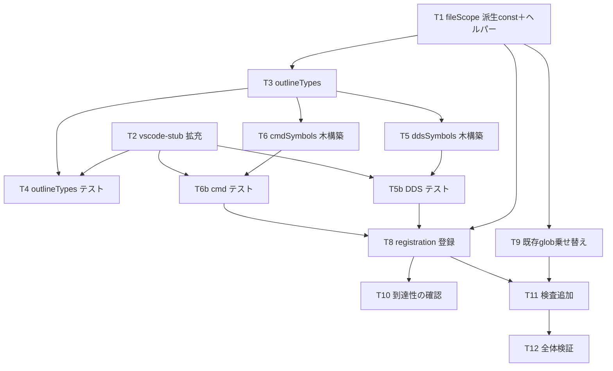

# 計画: DDS / .cmd の DocumentSymbolProvider

## split 判定（subtask 分割の要否）

**分割しない。** 判定の根拠（DESIGN.md「5.」の3層決定木、discriminator＝「そのピースは単独で
検証・デリバリ可能か」）:

- DDS のアウトラインと `.cmd` のアウトラインは**互いに独立**で、片方だけでも検証・デリバリできる。
  つまり高結合ではない。決定木では「低結合＝そもそも別 work/PR の候補」に当たる。
- しかし**規模が小さい**（新規3ファイル・変更6ファイル）。共通基盤（`OutlineNode`・
  `toDocumentSymbols`・`fileScope` の派生 const・スタブ拡充）を両者が共有するため、
  分けると同じ基盤変更を2つの PR に跨がせることになり、かえって手間が増える。
- したがって **1 PR・単一 tasks.md** とする。subtask 化は過剰分割になる。

## 実装方針

spec.md の設計方針に従い、**下から順に**組み立てる。

1. **土台**（他の全てが依存する）: `fileScope.ts` の派生 const と glob/selector ヘルパー。
   ここで `TARGET_EXTENSIONS` を派生の合成に置き換えるが、**値は現状と完全に同一に保つ**
   （既存の `verify-contributes.mjs` と `contributesSideEffects.test.ts` が両方とも
   現在の値を検査しているので、変わればすぐ落ちる＝安全網が既にある）。
2. **テスト基盤**: `vscode-stub.js` の拡充。これが無いとアダプタのテストが書けない。
   純粋関数に寄せた設計のおかげで追加は3点だけで済む。
3. **共通型とアダプタ**: `outlineTypes.ts`。
4. **provider 本体**: `ddsSymbols.ts` と `cmdSymbols.ts`。両者は独立で並行可。
   それぞれ「純粋な木構築」→「テスト」→「登録関数」の順で作る。
5. **到達性**: `registration.ts` への登録。**ここまでやって初めて完了**（AGENTS.md の
   「追加したリソースは到達可能になって初めて完了」）。実際にアウトラインが出ることを確認する。
6. **既存ドリフトの解消**: `ddsKeywordCompletion.ts` / `rpgCompletion.ts` の手書き glob を
   派生 const に乗せ替える。`.dds` が DDS 補完に入る（既存バグの修正）。
7. **検査の固定**: `contributesSideEffects.test.ts` に一致検査を追加。

## 作業順序と依存関係

1. `fileScope.ts` の派生 const とヘルパー（依存: なし）
2. `vscode-stub.js` の拡充（依存: なし。1 と並行可）
3. `outlineTypes.ts`（依存: 1）
4. `outlineTypes` のテスト（依存: 2, 3）
5. `ddsSymbols.ts` の木構築 → テスト（依存: 3）
6. `cmdSymbols.ts` の木構築 → テスト（依存: 3）
7. registration への登録（依存: 5, 6）
8. 既存 glob の乗せ替え（依存: 1）
9. 検査の追加（依存: 7, 8）
10. 全体検証（`npm test` ＋ `npm run verify`）

## リスク / 留意点

| リスク | 対応 |
|---|---|
| `vscode-stub.js` は全ユニットテストの共有物。壊すと全部落ちる | 追加は純粋な足し算に留める。`Range` の 4 引数対応は**引数の個数で分岐**し、既存の 2 引数呼び出しの挙動を変えない。拡充後に `npm test` を回して既存テストが通ることを先に確認する |
| `TARGET_EXTENSIONS` の値を変えてしまう | 派生 const の合成結果が現行の13個と順序込みで一致することをテストで固定。既存の `verify-contributes.mjs` も安全網として効く |
| `selectionRange ⊆ range` を破ると VSCode がアウトラインを出さない | 全ノードを再帰的に走査して包含関係を検査するヘルパーをテストに置き、DDS・cmd の全フィクスチャに適用する |
| provider が例外を投げるとアウトラインが固まる | 異常系（空・注記のみ・途中で切れたソース）をテストに含める |
| `.cmd` のグループ解決が前方参照で壊れる | 全論理行を先に読んでからグループを解決する2パス構成にする。解決失敗は例外にせず子なしで出す |
| `.dds` を DDS 補完に入れると挙動が変わる | 意図した修正（既存バグ）。review で明示する |
| 既存の検査が二重にある所へ3つ目を足す | 足さない。`contributesSideEffects.test.ts` に寄せる（spec 決定済み） |

## テスト方針

- **ユニットテスト**（`npm test`、mocha tdd）が主。純粋関数に寄せたので木の形を直接 assert できる。
  - フィクスチャは `docs/src/` の実サンプル（`CUSTMST.pf` / `CUSTLF1.lf` / `CUSTMNT.dspf` /
    `CUSTRPT.prtf` / `ADDCUST.cmd`）を読み込んで使う。合成した文字列ではなく**実物**を使うことで、
    桁のずれや実務的な書き方の揺れを拾える。
  - 異常系（空文字列・注記のみ・途中で切れたソース）は文字列リテラルで与える。
  - 全ノードで `selectionRange ⊆ range` を検査する共通ヘルパーを置く。
- **既存検査の維持**: `npm run verify`（`verify:defs` ＋ `verify:roundtrip`）が通ること。
  特に `verify-contributes.mjs` が `TARGET_EXTENSIONS` の変更に反応しないこと（＝値が不変）。
- **到達性の確認**: provider が `registration.ts` 経由で実際に登録されることをコード上で辿り、
  `activate()` からの経路を review で名指しで示す。可能なら拡張機能を起動して
  `docs/src/` のサンプルでアウトラインが出ることを目視確認する。
