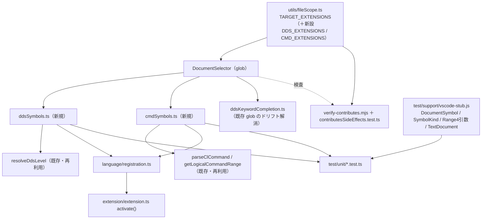

# 調査: DDS / .cmd アウトラインの既存資産と配線

requirement.md の「未確定事項」を潰すための PJ 内部調査。外部原典（競合拡張の対応状況）は
requirement.md の表で確定済みのため再調査しない。

## 調査の問い

- Q1: DDS のレコード様式・フィールド・キーは既存資産から取れるか。レベル判定は再利用できるか。
- Q2: `.cmd` の `CMD`/`PARM`/`ELEM`/`QUAL`/`DEP`/`PMTCTL` は既存資産で識別できるか。継続行は。
- Q3: `DocumentSymbolProvider` をどこに登録し、拡張子集合の一致をどう機械検査するか。
- Q4: ユニットテストで `DocumentSymbolProvider` を動かせるか（vscode スタブの充足度）。

## 判明した事実

### F1（Q1）DDS のレベル判定は既に存在し、そのまま再利用できる

`src/language/ddsKeywordCompletion.ts:60` の **`resolveDdsLevel` は既に export 済み**で、
必要な規約を全て実装している。

```ts
export function resolveDdsLevel(
  lineAt: (index: number) => string,
  lineIndex: number
): DdsLevel
```

- 17 桁目（index 16）の名前タイプ → レベルの対応表（`ddsKeywordCompletion.ts:44-51`）:
  `R`=record / `K`=key / `S`,`O`=select / `J`=join / `H`=help
- 注記行（7 桁目が `*`）はスキップ（`:68`）
- 17 桁目が空でも名前欄に値があれば field、名前も無ければ継続行として上に遡る（`:79`）
- 遡っても見つからなければ file レベル（`:84`）

**署名が `lineAt: (index) => string` という純粋な形**なので、`vscode.TextDocument` に依存せず
テストから直接呼べる。切り出し（リファクタ）は不要。

`DdsLevel` 型（`:41`）も export 済み: `"file" | "record" | "field" | "key" | "join" | "select" | "help"`。

### F2（Q1）名前欄は 19-28 桁。実サンプルで検証済み

桁定義は `resources/navigation/dds-keyword-columns.json` と `dds-field-labels.json` の組
（`generate-dds-columns.mjs` 由来）。3 種別（DDS-PF / DDS-DSPF / DDS-PRTF）とも同じ 14 欄:

| 桁 | 欄 |
|---|---|
| 1 | 順序番号 |
| 6 | 仕様書タイプ |
| 7 | 注記 |
| 8 | 条件付け |
| **17** | **名前または仕様のタイプ** |
| 18 | 予約済み |
| **19** | **名前** |
| 29 | 参照 |
| 30 | 長さ |
| 35 | データ・タイプ |
| 36 | 小数点以下桁数 |
| 38 | 使用目的 |
| 39 | 位置 |
| 45 | キーワード項目 |

したがって名前欄は **19-28 桁（`slice(18, 28)`）**。`resolveDdsLevel:79` が使っている範囲と一致する。

`docs/src/` の実サンプルで抽出を確認した（主エージェントが実行）:

```
--- CUSTMST.pf     nametype='R' name='CUSTREC' / ' ' CUSTNO,CUSTNM,CUSTKN,CUSTAM,UPDDAT / 'K' CUSTNO
--- CUSTLF1.lf     nametype='R' name='CUSTREC' / ' ' CUSTNO,CUSTNM,CUSTAM / 'K' CUSTNM / 'S' CUSTAM
--- CUSTMNT.dspf   'R' HEADER / 'R' DETAIL / ' ' CUSTNO,CUSTNM,MSGTXT
```

**DSPF の定数行**（`1 25'顧客保守'` のような位置＋リテラルだけの行）は名前欄が空になり、
自然に除外される。特別な処理を足す必要がない。

`docs/src/` に PF / LF / DSPF / PRTF / DBCS の実サンプルが揃っており、**テスト用フィクスチャに使える**。

### F3（Q2）`.cmd` の解析器は既にあり、継続行・ラベルも処理済み

`.cmd` は `positionResolver.ts:105` で拡張子から `"cmd"` 言語と判定され、`:49` の
`language === "cl" || language === "cmd"` 分岐で **CL と同じ解析経路**を通る。使える部品:

- `src/language/clContinuation.ts:8` `getLogicalCommandRange(document, lineNumber)` —
  継続行（末尾 `+`）をまたいだ論理行の `vscode.Range` を返す。**アウトラインの range にそのまま使える**。
- `src/prompter/clCommandParser.ts:42` `joinContinuationLines(lines)` — 継続行の連結
- `src/prompter/clCommandParser.ts:208` `parseClCommand(text)` → `ParsedClCommand`:
  ```ts
  export interface ParsedClCommand {
    readonly label?: string;              // "Q1"（`Q1:` から）
    readonly keyword: string;             // "CMD" / "PARM" / "QUAL" / "ELEM" / "DEP" / "PMTCTL"（大文字化済み）
    readonly parameters: Record<string, string>;   // { KWD: "CUST", TYPE: "Q1", ... }
    readonly positional: string[];
  }
  ```
- `src/prompter/clCommandParser.ts:119` `extractComments(lines)` — `/* ... */` の除去

つまり **`.cmd` 用のパーサーを新規に書く必要はない**。`keyword` が文のタイプ、
`label` がラベル、`parameters.KWD` がパラメータ名になる。

実サンプル `docs/src/ADDCUST.cmd` の構造:

```
             CMD        PROMPT('顧客の追加')
             PARM       KWD(CUST) TYPE(Q1) MIN(1) PROMPT('顧客ファイル')
Q1:          QUAL       TYPE(*NAME) LEN(10) MIN(1)
             QUAL       TYPE(*NAME) LEN(10) DFT(*LIBL) SPCVAL((*LIBL) (*CURLIB)) +
                        PROMPT('ライブラリー')
             PARM       KWD(NAME) TYPE(*CHAR) LEN(30) MIN(1) PROMPT('顧客名')
             PARM       KWD(RANGE) TYPE(E1) PROMPT('番号の範囲')
E1:          ELEM       TYPE(*DEC) LEN(5 0) MIN(1) PROMPT('開始')
             ELEM       TYPE(*DEC) LEN(5 0) DFT(0) PROMPT('終了')
             PARM       KWD(REPLACE) TYPE(*CHAR) LEN(4) RSTD(*YES) +
                        VALUES(*NO *YES) DFT(*NO) PROMPT('置換')
             DEP        CTL(REPLACE) PARM(NAME) NBRTRUE(*EQ 1)
```

**重要な構造的事実**: `ELEM` / `QUAL` は `PARM` の子として字句的にネストしていない。
先頭にラベル（`Q1:` / `E1:`）を持つ**兄弟の文**で、`PARM` 側が `TYPE(Q1)` で**参照**する。
したがって階層を作るには「TYPE の値がラベルに一致するか」で結び付ける必要がある。
グループの終わりは、次のラベル付き文か次の `PARM` / `DEP` / `PMTCTL` の出現で決まる。

`.cmd` の桁は `resources/navigation/cmd-keyword-columns.json` = `[1, 14, 25]`、
ラベルは `["Label", "Statement", "Parameters"]`。ただし **AGENTS.md のとおりこれは SEU の書き方であって
原典由来ではなく、`.cmd` は自由形式**。したがってアウトラインは桁ではなく `parseClCommand` の
結果で組み立てる（桁に依存させない）。

### F4（Q3）登録は「拡張子ベース」の先例があるが、拡張子集合が 3 箇所に散っている

登録の入口は `src/extension/extension.ts`（12 行の委譲だけ）→ `src/language/registration.ts`。
既存の登録イディオムは 2 通りあり、どちらでもよい:

- `Disposable` を返して呼び側が `context.subscriptions.push`（補完系 2 つ）
- 内部で push して void を返す（コメントトグル・ルーラー等）

**`DocumentSelector` の形が 3 通り存在する**:

1. `registration.ts:27-30` — languageId ベース（現状 no-op のホバー用）
2. `ddsKeywordCompletion.ts:219-225` — **glob パターン**。
   `{ scheme: "file", pattern: "**/*.{pf,lf,dspf,prtf,mnudds}" }` ＋ `untitled` の 2 本。
   コメントに「DDS は言語登録していない（拡張子だけで扱う方針）ため、languageId ではなく
   scheme+pattern で対象を絞る」と明記されており、**本作業が採るべき先例**
3. `rpgCompletion.ts:254-259` — language と pattern の併用

**ここに既存のドリフトがある（本作業で解消すべき）**:

- `ddsKeywordCompletion.ts` の glob は `{pf,lf,dspf,prtf,mnudds}` で、**`.dds` が欠けている**。
  `TARGET_EXTENSIONS`（`fileScope.ts:11-29`）には `dds` があるので、
  `.dds` ファイルでは DDS キーワード補完が効いていない。
- glob の中身は**手書きで、`TARGET_EXTENSIONS` と何も繋がっていない**。現状これを検査するものは無い。
- `ddsKeywordCompletion` は `untitled` を含むが `rpgCompletion` は含まない（不統一）。

### F5（Q3）機械検査の作り方には既存の型が 2 つある

**`docs/origin/verify-contributes.mjs`**（67 行、`npm run verify:defs` に配線済み）は
TS ソースを**正規表現でテキストとして読む**:

```js
const source = readFileSync(join(EXT, "src/utils/fileScope.ts"), "utf8");
const block = /TARGET_EXTENSIONS\s*=\s*\[([\s\S]*?)\]/u.exec(source);
const extensions = [...block[1].matchAll(/"([a-z0-9]+)"/gu)].map(m => m[1]);
```

そのうえで F4 キーバインドの `when` と**双方向**（不足・余分の両方）で突き合わせる。

**`test/unit/contributesSideEffects.test.ts`** は同じ不変条件を、
正規表現ではなく **`TARGET_EXTENSIONS` を型付きで import** して検査している。

> つまり同じ不変条件が 2 つの機構で二重に検査されている。3 つ目を足す前に、どちらの型に
> 乗せるかを決める必要がある。**ユニットテスト側（型付き import）の方が壊れにくい**
> ——glob を正規表現で切り出す必要が無く、コンパイラが定数の存在を保証するため。

**設計上の含意**: glob 文字列を手書きのまま検査するには
`/\*\*\/\*\.\{([a-z0-9,]+)\}/` を切り出す必要があって脆い。
**名前付きの const 配列（例 `DDS_EXTENSIONS` / `CMD_EXTENSIONS`）を `fileScope.ts` に置き、
そこから glob を組み立てる**方が、既存の正規表現も型付き import もそのまま効く。

### F6（Q3）verify スクリプトの配線状況

`npm run verify` = `verify:defs`（8 本）＋ `verify:roundtrip`（4 実行）。
`verify-contributes.mjs` は `verify:defs` に含まれる。
CI（`.github/workflows/prompter-definitions.yml`）は `npm run verify`（:80）と `npm test`（:86）を実行する。
配線されていない verify が 3 本ある（`verify-cdml-attributes` / `verify-cdml-rules` /
`verify-cl-against-cmddoc`）が、本作業の対象外。

### F7（Q4）vscode スタブは DocumentSymbol 系を一切持たない。拡充が必要

`test/support/vscode-stub.js`（43 行）は `Module._load` を差し替えて `require("vscode")` を横取りする。
スタブ済みなのは `Position` / `Range`（**2 引数のみ**）/ `Uri` / `EventEmitter` /
`workspace.getConfiguration` / `window` / `StatusBarAlignment` / `ConfigurationTarget` / `FileType`。

**`languages` と `commands` は空オブジェクト `{}`**。したがって:

- `DocumentSymbol` … 無い（`children` を初期化した形で追加が必要）
- `SymbolKind` … 無い（使う値だけでも追加が必要）
- `languages.registerDocumentSymbolProvider` … 無い（呼ぶと TypeError）
- `Range` の **4 引数オーバーロード**（`(sl, sc, el, ec)`）… 無い。実物にはある
- `TextDocument` の偽物 … 無い。既存のユニットテストは**文字列に対する純粋関数だけ**を
  テストして `TextDocument` を回避している

既存テストの規約: mocha `tdd`（`suite()` / `test()`、mocha 自体は import しない）、
`import { strict as assert } from "node:assert"`、ソースは**相対 TS パス** `../../src/...` で import。

## 影響範囲



- 新規: DDS 用・`.cmd` 用のシンボル提供モジュール
- 変更: `fileScope.ts`（拡張子の派生集合を追加）、`registration.ts`（登録）、
  `vscode-stub.js`（拡充）、検査（拡張子一致）
- 既存の副作用: `ddsKeywordCompletion.ts` の glob を派生に置き換えると `.dds` が対象に入る
  （現状効いていない補完が効くようになる＝バグ修正）
- **言語登録（`contributes.languages`）は触らない**。触ると診断・キーバインドが波及する
  （`contributesSideEffects.test.ts` が固定している不変条件）

## 実現性 / リスク

- **実現性は高い**。DDS のレベル判定も `.cmd` の解析も既に存在し、どちらも
  `vscode.TextDocument` 非依存または論理行 API 越しに使える。新規に書くのは
  「解析結果 → `DocumentSymbol` ツリー」の組み立てだけ。
- **リスク1: スタブ拡充の副作用**。`vscode-stub.js` は全ユニットテストが共有する。
  追加は純粋な足し算に留め、既存の `Range`（2 引数）の挙動を壊さないこと
  （4 引数対応は引数の個数で分岐する形にする）。
- **リスク2: `.cmd` の階層は参照解決に依存**。`TYPE(Q1)` ↔ `Q1:` の対応が取れないソース
  （ラベル未定義・前方参照）でも例外を出さず、解決できない `PARM` は子なしで出す。
- **リスク3: 検査の三重化**。同じ不変条件を検査する仕組みが既に 2 つある。3 つ目を
  無造作に足さず、既存のどちらかに寄せる。
- **リスク4（低）: DDS の巨大ファイル**。行数に比例する単純走査なので問題にならない見込み。

## spec への申し送り

requirement.md の未確定事項への回答:

1. **キー（17 桁目 `K`）の扱い** → `resolveDdsLevel` が `key` / `select` / `join` / `help` を
   既に区別する。**レコード様式の子として、フィールドと区別できる `SymbolKind` で出す**のが素直
   （`K`=`SymbolKind.Key`、`S`/`O`=選択・省略、フィールド=`SymbolKind.Field`）。
   実サンプル `CUSTLF1.lf` が `R` / フィールド / `K` / `S` を全部含むのでテストに使える。
2. **`.cmd` の `DEP` / `PMTCTL`** → `PARM` の子ではなく**`CMD` 直下の兄弟**にする。
   字句的にも参照的にも `PARM` にぶら下がっておらず（`DEP CTL(REPLACE) PARM(NAME)` は
   複数の `PARM` を横断的に参照する）、子にすると嘘の階層になる。
3. **フィールド名が無い行（キーワード継続行）** → シンボルを作らない。直前のシンボルの
   range を延ばすかは spec で決める（延ばさなくても機能上は困らない）。
   DSPF の定数行も同じ扱いで自然に落ちる（F2）。
4. **`ELEM` / `QUAL` の階層** → ラベルと `TYPE(...)` の一致で `PARM` の子に付ける（F3）。
   解決できなければ子なしで出す。

その他:

- **拡張子集合の単一真実源化を spec に含める**。glob 手書きは既に `.dds` を落としている（F4）。
  `fileScope.ts` に派生 const を置き、DDS 補完の glob もそれに乗せ替える。
- **検査は `contributesSideEffects.test.ts` 側（型付き import）に寄せる**（F5）。
  正規表現で glob を切り出す方式は取らない。
- **`vscode-stub.js` の拡充が先行タスクになる**（F7）。これが無いとユニットテストが書けない。
- 解析ロジックは `vscode.TextDocument` に直接依存させず、`lineAt: (i) => string` のような
  純粋な形に寄せる（`resolveDdsLevel` の既存の形に倣う）。テストが軽くなる。
