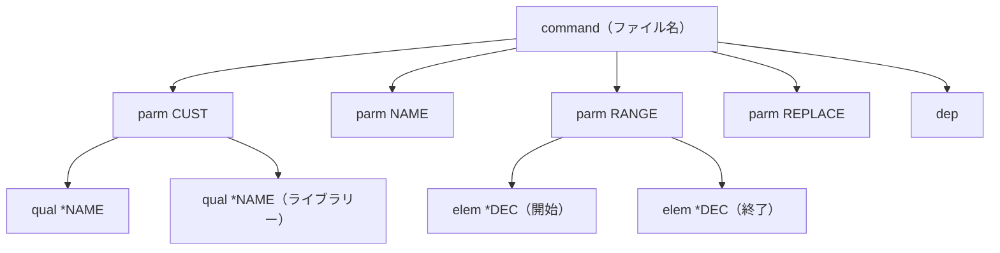

# 仕様: DDS / .cmd の DocumentSymbolProvider

## 概要

DDS（`.pf`/`.lf`/`.dspf`/`.prtf`/`.mnudds`/`.dds`）と `.cmd`（コマンド定義ソース）に
`vscode.DocumentSymbolProvider` を登録し、アウトラインタブ・パンくず・`Ctrl+Shift+O`・
ワークスペース記号検索を有効にする。RPG / CL は既存拡張が対応済みのため提供しない。

## 設計方針

### 1. 解析の中核は vscode 非依存の純粋関数にする

シンボルの木を組み立てる処理は `vscode.TextDocument` にも `vscode.DocumentSymbol` にも
依存させず、**行の読み取り関数と、自前の平坦なデータ構造**だけで完結させる。
`vscode` 依存は薄いアダプタ層に閉じる。

```
buildDdsOutline(lineAt, lineCount, ddsType) ─→ OutlineNode[]  （純粋・テスト対象）
buildCmdOutline(lineAt, lineCount, name)    ─→ OutlineNode[]  （純粋・テスト対象）
                                                  │
                                      toDocumentSymbols()（薄いアダプタ）
                                                  │
                                          vscode.DocumentSymbol[]
```

理由:

- 既存の `resolveDdsLevel`（`ddsKeywordCompletion.ts:60`）が既に
  `lineAt: (index: number) => string` という純粋な形を採っており、それに倣う。
- **`vscode-stub.js` の拡充範囲を最小化できる**。木の組み立てを素の JS オブジェクトで
  テストできるので、`TextDocument` の偽物は不要になる。スタブは全ユニットテストの共有物なので、
  触る面積が小さいほど安全（research.md リスク1）。

> research.md の申し送りでは `TextDocument` の偽物も必要としていたが、純粋関数に寄せることで
> 不要になった。スタブ追加は `DocumentSymbol` / `SymbolKind` / `Range` 4 引数のみに縮む。

### 2. 拡張子集合を単一の真実源から導く

glob を手書きしているため `.dds` が DDS キーワード補完から落ちている（research.md F4）。
`fileScope.ts` に**用途別の派生 const** を置き、glob をそこから組み立てる。

```ts
export const DDS_EXTENSIONS = ["pf", "lf", "dspf", "prtf", "mnudds", "dds"] as const;
export const CMD_EXTENSIONS = ["cmd"] as const;
export const RPG_EXTENSIONS = ["rpg", "rpgle", "sqlrpgle", "sqlrpg"] as const;
export const CL_EXTENSIONS  = ["clp", "clle"] as const;

/** `**/*.{pf,lf,...}` 形式の glob を作る。DocumentSelector の pattern に使う。 */
export function toGlobPattern(extensions: readonly string[]): string;

/** file / untitled の両 scheme を含む DocumentSelector を作る。 */
export function toDocumentSelector(extensions: readonly string[]): vscode.DocumentFilter[];
```

`TARGET_EXTENSIONS` は**これら派生 const の合成**として定義し直す（値は現状と完全に同一に保つ）。
これで「片方だけ増える」が構造的に起こらなくなる。

### 3. 検査は型付き import 側に寄せる

同じ不変条件が `verify-contributes.mjs`（正規表現）と `contributesSideEffects.test.ts`
（型付き import）で二重に検査されている（research.md F5）。**3 つ目の機構は足さない。**
拡張子集合の一致検査は `contributesSideEffects.test.ts` に追加する。正規表現で glob を
切り出す方式は取らない（脆いため）。

### 4. 言語登録は触らない

`contributes.languages` は変更しない。DDS も `.cmd` も languageId を持たないまま、
scheme+pattern で登録する（`ddsKeywordCompletion.ts:219-225` の先例に従う）。
言語登録を広げると診断・キーバインドが波及する（`contributesSideEffects.test.ts` が固定済み）。

## 対象範囲

### 追加

| ファイル | 役割 |
|---|---|
| `src/language/outlineTypes.ts` | `OutlineNode` 型と `OutlineKind`、`toDocumentSymbols` アダプタ |
| `src/language/ddsSymbols.ts` | `buildDdsOutline` ＋ provider 登録 |
| `src/language/cmdSymbols.ts` | `buildCmdOutline` ＋ provider 登録 |
| `test/unit/outlineDds.test.ts` | DDS の木構築テスト |
| `test/unit/outlineCmd.test.ts` | `.cmd` の木構築テスト |

### 変更

| ファイル | 変更内容 |
|---|---|
| `src/utils/fileScope.ts` | 用途別の派生 const と `toGlobPattern` / `toDocumentSelector` を追加。`TARGET_EXTENSIONS` を合成に |
| `src/language/registration.ts` | 2 つの provider を登録 |
| `src/language/ddsKeywordCompletion.ts` | 手書き glob を `toDocumentSelector(DDS_EXTENSIONS)` に置換（`.dds` 欠落の解消） |
| `src/language/rpgCompletion.ts` | 手書き glob を `toGlobPattern(RPG_EXTENSIONS)` に置換 |
| `test/support/vscode-stub.js` | `DocumentSymbol` / `SymbolKind` / `Range` 4 引数を追加 |
| `test/unit/contributesSideEffects.test.ts` | 派生 const の合成が `TARGET_EXTENSIONS` と一致することを検査 |

## インターフェース / データ構造

### OutlineNode（vscode 非依存）

```ts
export type OutlineKind =
  | "record" | "field" | "key" | "select" | "join" | "help"   // DDS
  | "command" | "parm" | "elem" | "qual" | "dep" | "pmtctl";  // .cmd

export interface OutlineNode {
  readonly name: string;
  readonly detail: string;
  readonly kind: OutlineKind;
  /** シンボル全体の範囲（子・キーワード継続行を含む）。0 始まりの行番号。 */
  readonly range: { startLine: number; startChar: number; endLine: number; endChar: number };
  /** 名前そのものの範囲。必ず range に含まれる。 */
  readonly selectionRange: { startLine: number; startChar: number; endLine: number; endChar: number };
  readonly children: OutlineNode[];
}
```

`OutlineKind` → `vscode.SymbolKind` の対応（**kind はアイコン表示にしか影響しない**。
意味は `name` と `detail` が担う）:

| OutlineKind | SymbolKind | 理由 |
|---|---|---|
| `record` | `Struct` | レコード様式＝フィールドの集合体 |
| `field` | `Field` | そのまま |
| `key` | `Key` | キー・フィールド |
| `select` | `Property` | 選択／省略（`S`/`O`）。条件付きの絞り込み |
| `join` | `Interface` | 結合（`J`）。複数ファイルの関係を表す |
| `help` | `Object` | ヘルプ（`H`）。他に当てはまるものが無い |
| `command` | `Module` | コマンド定義の全体 |
| `parm` | `Field` | パラメータ |
| `qual` | `Property` | 修飾名の構成要素 |
| `elem` | `Variable` | 要素リストの要素 |
| `dep` | `Event` | 依存関係の制約 |
| `pmtctl` | `Event` | プロンプト制御の制約 |

### 登録

```ts
export function registerDdsSymbols(): vscode.Disposable;
export function registerCmdSymbols(): vscode.Disposable;
```

`registration.ts` で `context.subscriptions.push(...)` する（補完系と同じイディオム）。

## 振る舞いの詳細

### DDS

#### 桁（1 始まり。`resources/navigation/dds-keyword-columns.json` 由来。実サンプルで検証済み）

| 桁 | 欄 | 用途 |
|---|---|---|
| 7 | 注記 | `*` なら注記行としてスキップ |
| 17 | 名前または仕様のタイプ | `R`/`K`/`S`/`O`/`J`/`H` |
| 19-28 | 名前 | シンボル名 |
| 29 | 参照 | `R` なら detail に `R` |
| 30-34 | 長さ | detail |
| 35 | データ・タイプ | detail |
| 36-37 | 小数点以下桁数 | detail |
| 38 | 使用目的 | detail |
| 39-44 | 位置 | detail（DSPF/PRTF） |

#### 木の組み立て

1. 注記行（7 桁目 `*`）はスキップする。
2. 17 桁目が `R` → レコード様式。**新しい親**になる。
3. 17 桁目が `K`/`S`/`O`/`J`/`H` → 直近のレコード様式の**子**。
   名前が空の場合もシンボルを作る（`K` は名前必須だが、不完全なソースでも落ちないため）。
4. 17 桁目が空で名前欄（19-28）に値がある → フィールド。直近のレコード様式の子。
   レコード様式がまだ無ければ**トップレベル**に置く（不完全なソースへの耐性）。
5. 17 桁目も名前欄も空 → **シンボルを作らない**（キーワード継続行・DSPF の定数行）。
   直前のシンボルの `range` を延ばす（下記）。

レベル判定には既存の `resolveDdsLevel` を用いる。同じ規約を二重に実装しない。

#### detail の組み立て

参照 / 長さ＋タイプ＋小数 / 使用目的 / 位置 を、値のあるものだけ空白区切りで連結する。

| 行 | detail |
|---|---|
| `CUSTNO 5S 0`（PF） | `5S 0` |
| `CUSTNM 30A`（PF） | `30A` |
| `CUSTNO R B 5 20`（DSPF） | `R B 5 20` |
| `MSGTXT 50A O 23 2`（DSPF） | `50A O 23 2` |
| `CUSTNO R 5`（PRTF） | `R 5` |
| レコード様式 | `""`（空） |

#### range / selectionRange

- `selectionRange` = 名前欄（19-28 桁）の中で、実際に名前が占める文字範囲。
  名前が空なら 17 桁目の 1 文字（`K` など）。それも無ければ行全体。
- `range` = 自身の行頭から、**次の同レベル以上のシンボルの直前行の行末**まで。
  文書末まで続く場合は最終行の行末。これにより配下のキーワード継続行と子が含まれる。
- 不変条件: `selectionRange ⊆ range`（VSCode の要件）。実装で必ず満たす。

### .cmd

#### 解析

既存部品を使い、`.cmd` 用のパーサーは新規に書かない（research.md F3）。

- `getLogicalCommandRange(document, line)` … 継続行（末尾 `+`）をまたぐ論理行の範囲
- `joinContinuationLines(lines)` … 連結
- `parseClCommand(text)` … `{ label, keyword, parameters, positional }`

#### 木の組み立て



1. 論理行を先頭から順に読み、`parseClCommand` にかける。
2. `keyword` で振り分ける:
   - `CMD` … ルート。`name` は**ファイル名の拡張子を除いた部分を大文字化**したもの
     （`ADDCUST.cmd` → `ADDCUST`）。コマンド名は `.cmd` 本文には無く、メンバー名で決まるため。
     `detail` は `PROMPT` の値。
   - `PARM` … ルートの子。`name` = `parameters.KWD`、`detail` = `TYPE` と `PROMPT` を連結。
   - `DEP` / `PMTCTL` … **ルートの子**（`PARM` の子にはしない）。`DEP CTL(REPLACE) PARM(NAME)` は
     複数の `PARM` を横断的に参照するため、特定の `PARM` にぶら下げると嘘の階層になる。
     `name` = `"DEP"` / `"PMTCTL"`、`detail` = `CTL` の値。
   - `QUAL` / `ELEM` … 後述のグループ解決で `PARM` の子に付ける。
     `name` = `TYPE` の値（`*NAME` / `*DEC`）、`detail` = `LEN` と `PROMPT` を連結。
3. `CMD` 文が無いソースでも、`PARM` 以下をトップレベルに並べて返す（例外を投げない）。

#### QUAL / ELEM のグループ解決

`ELEM` / `QUAL` は `PARM` に字句的にネストせず、**ラベル付きの兄弟文**として書かれ、
`PARM` 側が `TYPE(ラベル)` で参照する（research.md F3）。

- グループの**開始**は、ラベルを持つ `QUAL` / `ELEM` 文。そのラベルがグループ名になる。
- グループの**継続**は、直後に続くラベルなしの同じ種類（`QUAL`/`ELEM`）の文。
- グループの**終了**は、次のラベル付き文、または `QUAL`/`ELEM` 以外の文の出現。
- `PARM` の `TYPE` の値がグループ名と一致すれば、そのグループの全メンバーを
  その `PARM` の子にする。
- **解決できない場合**（`TYPE` がラベルに一致しない・ラベルが未定義・前方参照）は
  例外を投げず、その `PARM` は子なしで出す。**引き取り手のいないグループは
  ルート直下に、グループ名をシンボル名にしたノードとして出す**（隠すと情報が消えるため）。

#### range / selectionRange

- `range` = `getLogicalCommandRange` が返す論理行の範囲（継続行を含む）。
  `PARM` は、子として付いたグループの範囲までは**広げない**（グループは別の場所にあり、
  範囲が飛び地になって `selectionRange ⊆ range` と両立しないため）。
- `selectionRange` = 論理行の**先頭の物理行**の範囲。`range` に必ず含まれる。
- ルート（`command`）の `range` は文書全体。

## ドメイン固有の考慮

- **`.cmd` は自由形式**。桁の規定は原典に無く、実機も 1 桁目から書ける（AGENTS.md）。
  したがって `.cmd` のアウトラインは**桁に依存させず** `parseClCommand` の結果だけで組む。
  `cmd-keyword-columns.json`（`[1, 14, 25]`）は SEU の書き方であってパースの根拠ではない。
- **DDS の種別は拡張子で決まる**（`resolveDdsType`）。ただしアウトラインの構造は
  PF/LF/DSPF/PRTF で共通なので、種別は detail の組み立てにしか影響しない
  （位置欄は DSPF/PRTF でのみ意味を持つが、空なら detail に出ないので分岐は不要）。
- **73-80 桁は無視されない**が、DDS のキーワード欄は 45-80 桁でありアウトラインは
  名前欄しか見ないため、本作業では影響しない。
- **既存の桁定義を再実装しない**。桁は `resources/navigation/dds-keyword-columns.json`
  （`generate-dds-columns.mjs` 由来）と同じ値を使い、ルーラー・プロンプターと食い違わせない。

## エラー処理 / 異常系

| 状況 | 挙動 |
|---|---|
| 空ファイル | 空配列を返す |
| 全行が注記 | 空配列を返す |
| 6 桁に満たない短い行 | スキップ（`charAt` は空文字を返すので自然に落ちる） |
| レコード様式より前にフィールド行 | トップレベルに置く |
| `.cmd` に `CMD` 文が無い | `PARM` 以下をトップレベルに並べる |
| `.cmd` の `TYPE` が解決できない | 子なしで出す。グループはルート直下に出す |
| `parseClCommand` が `undefined` を返す | その論理行を飛ばす |
| 名前が空のレコード様式 | `name` を `"(no name)"` 相当ではなく空文字にせず、17 桁目の値（`R`）を名前に使う |

**いかなる入力でも例外を投げない**。provider が throw すると VSCode のアウトラインが
「読み込み中」のまま固まるため。

## 受け入れ基準との対応

| requirement の完了条件 | 満たし方 | 検証 |
|---|---|---|
| DDS でレコード様式→フィールド→キーの階層が出る | 木の組み立て（上記） | `outlineDds.test.ts` が `docs/src/CUSTMST.pf` / `CUSTLF1.lf` / `CUSTMNT.dspf` / `CUSTRPT.prtf` に対し木の形を assert |
| `.cmd` で CMD→PARM→ELEM/QUAL の階層が出る | グループ解決（上記） | `outlineCmd.test.ts` が `docs/src/ADDCUST.cmd` に対し assert |
| シンボル選択で該当行へジャンプ | `selectionRange` を名前の位置に置く | テストで `selectionRange` の行・桁を assert し、`selectionRange ⊆ range` を全ノードで検査 |
| 拡張子集合の一致を機械検査 | 派生 const の合成＝`TARGET_EXTENSIONS` | `contributesSideEffects.test.ts` に追加。片方だけ増えたら落ちる |
| RPG・CL を提供しない | provider の selector に RPG/CL 拡張子を含めない | `contributesSideEffects.test.ts` で selector に RPG/CL 拡張子が無いことを assert |
| 空・不完全ファイルで例外を投げない | 異常系（上記） | テストで空文字列・注記のみ・途中で切れたソースを流す |
| `npm test` が通る | — | CI（`npm run verify` ＋ `npm test`） |

## design 工程の要否

**不要**と判断する。新規モジュールは 3 つで相互依存が浅く、インターフェース（`OutlineNode`）は
上記で確定している。アーキテクチャ上の判断（純粋関数＋アダプタ、単一真実源、検査の寄せ先）は
本 spec で決着済みで、plan で作業分解できる粒度にある。
