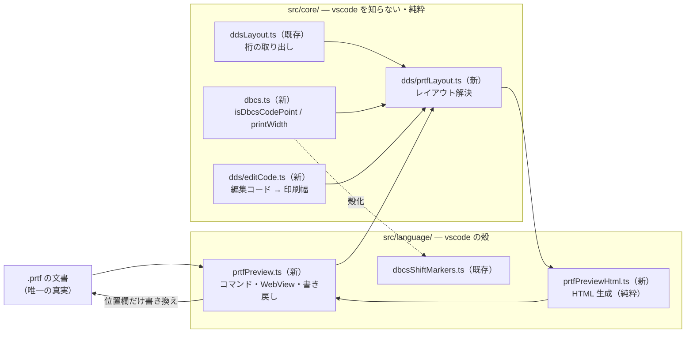
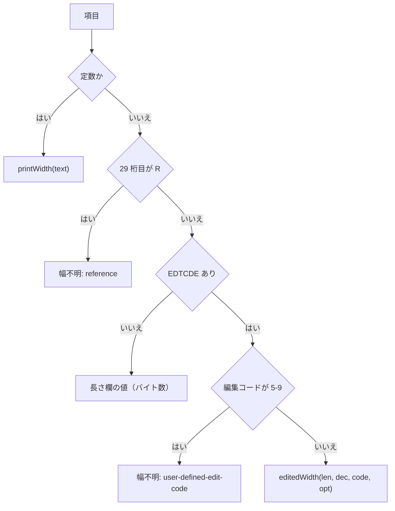
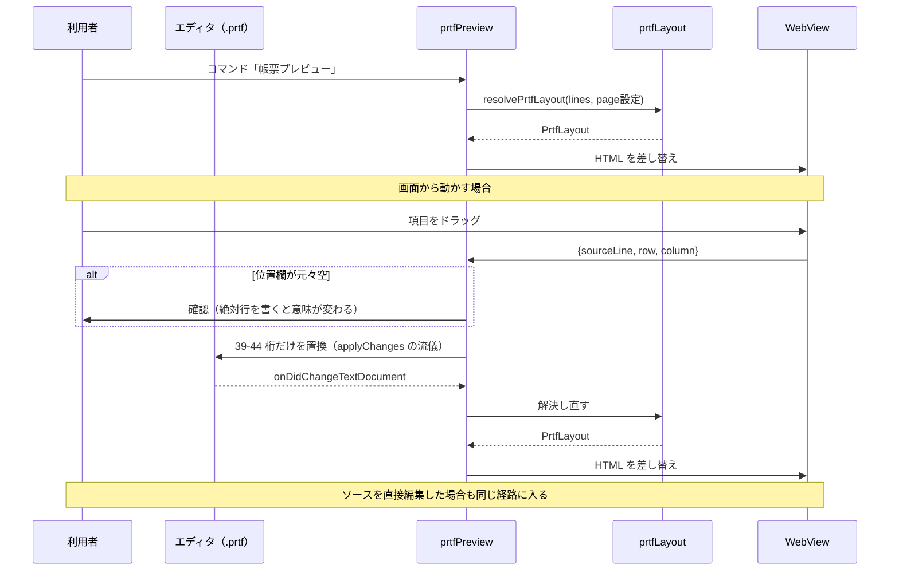

# 設計: PRTF 帳票の視覚編集（DBCS 対応）

## アーキテクチャ概要

**ソースが唯一の真実**。レイアウトはそこから毎回計算し直す。



**輪が閉じている**のが要点。画面の操作はソースを書き換えるだけで、
その変更が文書変更イベントとして戻ってきて再描画する。

## コンポーネント / モジュール

| モジュール | 責務 | 依存 |
|---|---|---|
| `core/dbcs.ts` | 全角判定と**実機の印刷桁数**の計算 | なし |
| `core/dds/editCode.ts` | `EDTCDE` の印刷幅。原典から生成した表を読む | 生成データ |
| `core/dds/prtfLayout.ts` | 行・桁・幅の解決。**この作業の芯** | 上記＋`ddsLayout` |
| `language/prtfPreviewHtml.ts` | レイアウト → HTML 文字列（純粋） | `prtfLayout` の型 |
| `language/prtfPreview.ts` | コマンド登録・WebView・文書変更の追従・書き戻し | vscode |

## 設計判断

### D1. `isDbcsCodePoint` の移設は殻化を要しない

lint core のときは `specClassifier` が 3 箇所から使われていたため「殻」が要ったが、
**`isDbcsCodePoint` は `dbcsShiftMarkers.ts` 内の非 export 関数で利用元が 1 箇所だけ**
（`:96`）。`src/core/dbcs.ts` へ移して import するだけで、
**公開シグネチャも import パスも変わらない**。

`printWidth()` も同じファイルに置く。SOSI 表示と印刷幅が同じ判定を使うことが
一目で分かる場所にするため。

```ts
// src/core/dbcs.ts
export function isDbcsCodePoint(codePoint: number): boolean;

/**
 * 実機の印刷桁数。ソースに SO/SI は存在しないので計算で足す。
 *   'ABC'       → 3
 *   '顧客一覧表' → 1 + 5*2 + 1 = 12
 *   'A顧客B'    → 1 + 1 + 2*2 + 1 + 1 = 8
 */
export function printWidth(text: string): number;
```

### D2. ソースを唯一の真実にし、WebView に状態を持たせない

**採用**: 文書が変わるたびにレイアウトを解決し直し、WebView を作り直す。

WebView 側に配置情報を持って差分更新する案は退けた。**同じ情報が 2 か所に存在すると
必ず食い違う**（AGENTS.md が `binding.ts` の写しで繰り返し記録している失敗）。
利用者はプレビューを開いたままソースを直接編集できるため、状態を持つと
そちらの経路で簡単に壊れる。

計算量は許容できる。レイアウト解決はファイルを 1 度走査する O(n) で、
lint が既に**入力のたびに全行を検査している**のと同じ水準。

### D3. レイアウト解決は「印刷カーソル」を持つ 1 走査

`research.md` F2 のとおり行は状態で決まる。lint の `RpgSpecContext` と同じ形にする。

```ts
interface PrintCursor {
  row: number;        // 次に印刷する行（1 始まり）
  recordName?: string;
}
```

走査の規則:

| 行 | 処理 |
|---|---|
| 注記行・ブランク行 | 飛ばす（`ddsLayout` の判定を共有） |
| 17 桁目が `R` | レコード開始。`SKIPB`→行を n へ / `SPACEB`→行を +n |
| 名前あり or 定数 | 項目。位置欄に行があればその行、無ければカーソルの行 |
| 項目のキーワード | `SKIPA`/`SPACEA` を**項目を置いた後**に適用 |

**レコード・レベルとフィールド・レベルの両方に `SKIP*`/`SPACE*` がある**ことに注意。
レコードのものはレコードの開始・終了に、フィールドのものはその項目の前後に効く。

> **リスク**: レコード・レベルの `SPACEA` が「レコードの最後の項目の後」に効くのか
> 「各項目の後」なのかを、`research.md` では確定できていない。
> **coding の前に原典で確定する**（`plan` の最初のタスクにする）。
> サンプル `CUSTRPT.prtf` は `R DETLINE SPACEA(1)` を持つので、ここを誤ると
> 明細行の送りが全部ずれる。

### D4. 幅は解決器が 3 つの純粋関数に振り分ける

`prtfLayout.ts` が判定し、計算自体は外の純粋関数に出す。



### D5. 編集コードは「表は生成・式は実装」に分ける

原典 `os400edits.htm` の早見表が持つのは**属性**（コンマの印刷 / 小数点の印刷 /
負数の符号 / 先行ゼロの抑制）で、印刷幅そのものではない。幅は属性から**導出**する。

そこで AGENTS.md の「原典から機械的に決まる成果物はスクリプトで生成する」に従い:

- `docs/origin/generate-dds-editcodes.mjs` … 原典 → `resources/completion/dds-editcodes.json`
  （コード → `{commas, decimalPoint, negativeSign, zeroBalance, suppressLeadingZero}`）
- `core/dds/editCode.ts` … その JSON を読み、**属性から幅を計算する式**を持つ
- `docs/origin/verify-dds-editcodes.mjs` … 原典の表に現れるコードが JSON に漏れなく
  あること、および実装が扱えないコードが無いことを検査する

**表を手で書かない。** `verify-cdml-attributes.mjs` が「新しい属性が出たら判断を
書くまで落ちる」形になっているのと同じ思想にする。

原典の取得は `docs/origin/sources.mjs` に足して `fetch-origin.mjs` の経路に載せる
（PJ の User-Agent で HTTP 200 が返ることを確認済み）。

### D6. 桁は計算で決め、箱を権威にする

**採用**: 各項目を `position: absolute` で `ch` 単位の整数倍に置き、
**箱の幅も計算値で固定**して `overflow: hidden` にする。

```
left:  calc(var(--cell) * (column - 1))
width: calc(var(--cell) * width)
```

**フォントに全角の幅を委ねない**のが要点。等幅フォントでも全角がちょうど 2 倍に
なる保証は無く、環境で変わる。**計算した桁が正、表示は箱に収める**。
はみ出したら見た目で分かる（それ自体が「幅が足りない」という情報になる）。

紙面は 132 桁 × 66 行の格子。ルーラーとオーバーフロー行（既定 60）の線を出す。

### D7. `POSITION` キーワードは読むが移動はさせない

位置欄と `POSITION` は排他（原典）。読み取りは両方に対応するが、
**書き戻しは位置欄を持つ項目に限る**。`POSITION` の項目は移動不可として見せる。
初版で両方の書き戻しを持つと、排他の維持まで面倒を見ることになる。

## インターフェース / データモデル

`spec.md` の型をそのまま使う。design で確定・追加する点のみ:

```ts
// core/dds/prtfLayout.ts — 内部
interface ResolveState {
  cursor: PrintCursor;
  items: PlacedItem[];
}

// 1 行を読み、状態を更新して項目を積む（lint の RpgSpecContext と同じ形）
function consumeLine(state: ResolveState, line: string, lineNumber: number): void;
```

```ts
// core/dds/editCode.ts
export interface EditCodeAttributes {
  readonly commas: boolean;
  readonly decimalPoint: boolean;
  readonly negativeSign: "none" | "CR" | "minus";
  readonly zeroBalance: "zero" | "blank";
  readonly suppressLeadingZero: boolean;
}
export function editCodeAttributes(code: string): EditCodeAttributes | undefined;
```

## 処理フロー / シーケンス



**書き戻しと再描画が同じ輪を通る**ので、経路が 2 つに割れない。

## plan への申し送り

### 分割単位と順序

1. **原典の追加取得と編集コード表の生成** — `sources.mjs` / `generate-dds-editcodes.mjs` /
   `verify-dds-editcodes.mjs`。他と独立していて最初に固められる。
   **受け入れ**: 生成が冪等で、検査が原典の全コードを網羅する。
2. **`core/dbcs.ts`（移設＋`printWidth`）** — 振る舞い不変の移設と新規関数。
   **受け入れ**: 既存テストが通る／`'顧客一覧表'`＝12 桁。
3. **`core/dds/editCode.ts`** — 属性から幅を計算する。
   **受け入れ**: 原典の 20 コードすべてに単体テスト。`5`-`9` は `unknown`。
4. **`core/dds/prtfLayout.ts`** — 芯。**着手前にレコード・レベルの `SPACEA` の
   意味を原典で確定する**（D3 のリスク）。
   **受け入れ**: `CUSTRPT.prtf` の行・桁・定数幅が期待どおり。
5. **HTML 生成** — 純粋関数。**受け入れ**: 桁が `ch` の整数倍で出る。
6. **WebView と書き戻し** — 殻。**受け入れ**: 位置欄以外の桁が変化しない。
7. **共存の確認** — IBM i Renderer と同時に入れて干渉しないこと。

**1〜5 は vscode を使わないので単体テストで固まる。** 6 だけが手で確かめる部分。

### 注意点

- **`core/ddsLayout.ts` に PRTF の行/桁の分割を足す**（既存は `position: [39,44]` の
  一括）。既存の利用元（アウトライン・補完・lint）の挙動を変えないこと。
- **`verify-lint-core.mjs` の純粋性検査に `src/core/dds` が含まれる**ことを確認する
  （`PURE_DIRS` は `src/core` 配下を再帰的に見るので自動的に入るが、テストで確かめる）。
- **サンプルが 1 本しかない**。`docs/src/` に PRTF の実機確認済みサンプルは
  `CUSTRPT.prtf` だけで、しかも `REF` だらけ。**行の解決を検証する用の小さな
  サンプルを足す**か、単体テストで賄うかを plan で決める。
- **`EDTCDE` の完全対応は「幅」だけ**。実際に印刷される文字列（カンマ挿入・
  `CR` 付加）までは作らない。幅が出れば箱は描ける。
