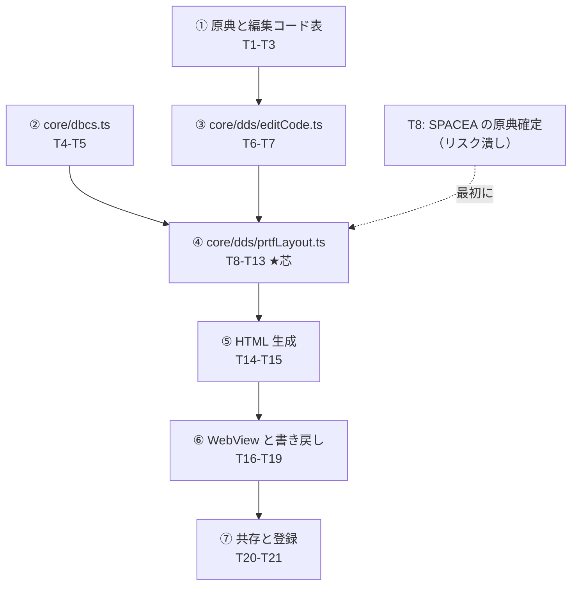

# 計画: PRTF 帳票の視覚編集（DBCS 対応）

## 実装方針

`design.md` の依存関係に従い**下から積む**。特徴は**7 段のうち 5 段が vscode を
使わない**こと。芯（レイアウト解決・幅計算）はすべて純粋関数なので、
**単体テストで固めきってから画面を作る**。

順序の要点は 2 つ。

**原典まわりを最初に置く**（①）。他と独立していて、ここが固まらないと
編集コードの幅が計算できない。しかも原典取得は外部への通信を伴うので、
早い段階で成否を確定させたい。

**芯に入る前にリスクを潰す**（T8）。レコード・レベルの `SPACEA` が
「レコードの最後の項目の後」に効くのか「各項目の後」なのかが未確定で、
**誤ると明細行の送りが全部ずれる**。レイアウト解決を書き始める前に原典で確定する。

### subtask 分割はしない（split 判定）

`aidev-docs/DESIGN.md`「5.」の決定木で判定した。

- **単独でデリバリ可能なピースが無い**。①（原典＋編集コード表）は単独で検証できるが、
  それだけ入れても利用者に何も提供しない。②は振る舞い不変の移設で、決定木では
  明示的に「subtask に落とさない」側。
- **③〜⑥は共同でしか検証できない**。幅計算・レイアウト解決・描画・書き戻しは
  `CUSTRPT.prtf` が正しく出て初めて意味を持つ。
- 規模は中（新規 7 ファイル・変更 4 ファイル・21 タスク）。漸進レビューを要するほど
  大きくない。

→ **不可分として単一 `tasks.md`**。コミットを 7 段に分けて読みやすさを確保する。

## 作業順序と依存関係

①と②は互いに独立なので順序を入れ替えてよい。③は①に依存する（編集コード表を読む）。

## リスク / 留意点

| リスク | 対応 |
|---|---|
| **レコード・レベル `SPACEA` の意味が未確定** | **T8 で原典から確定してから T10 に入る**。サンプルの `R DETLINE SPACEA(1)` が該当し、誤ると明細行が全部ずれる |
| **原典（`os400edits.htm`）が取得できなくなる** | PJ の User-Agent で HTTP 200 を確認済みだが、外部依存。取れなければ編集コードは「幅不明」に倒し、`EDTCDE` 対応だけ後続に回す（他は進められる） |
| **検証用サンプルが 1 本しかない** | `CUSTRPT.prtf` は `REF` だらけで幅の検証に使えない。**行の解決を検証する小さなサンプルを足す**（T13）。実機コンパイル未確認なので**受け入れ基準には入れず**、単体テストの材料として使う |
| `ddsLayout` の変更が既存機能に波及 | PRTF の行/桁分割は**追加のみ**とし、既存の `position: [39,44]` を残す。既存利用元（アウトライン・補完・lint）を変更しない |
| 等幅フォントで全角が 2 倍幅にならない | 桁は計算で決めて箱を固定（`design.md` D6）。表示をフォントに委ねない |
| WebView とソースの状態が食い違う | ソースを唯一の真実にし、変更のたびに解決し直す（`design.md` D2）。WebView に配置状態を持たせない |

## テスト方針

- **①〜⑤は単体テストで固める**（vscode を使わない）。
  - `printWidth`: `'顧客一覧表'` = 12 桁を含む正例・負例
  - `editedWidth`: **原典の 20 コードすべて**に 1 件以上。`5`-`9` は `unknown`
  - `prtfLayout`: `SKIPB`/`SPACEA`/`SKIPA`/`SPACEB` の組み合わせ、位置欄あり/なし、
    `POSITION` キーワード、幅の 3 経路、重なり、はみ出し
  - HTML: 桁が `ch` の整数倍で出ること
- **`CUSTRPT.prtf` を結合テストの基準にする**（T13）。
  行位置・桁位置・定数幅が期待どおりで、`REF` の 3 項目が幅不明になること。
- **原典との突き合わせ**: `verify-dds-editcodes.mjs` を `npm run verify:defs` に載せ、
  原典に現れる編集コードが漏れなく表にあることを機械検査する。
- **純粋性**: `verify-lint-core.mjs` の `PURE_DIRS` は `src/core` を再帰的に見るので
  `src/core/dds` も自動的に対象になる（確認済み）。テストでも押さえる。
- **既存の退行防止**: `npm test` と `npm run verify` を各段で通す。
- **手で確かめる**: ⑥⑦のみ。プレビューが開くこと、項目を動かすとソースが変わること、
  IBM i Renderer と同時に入れて干渉しないこと。`docs/src/CHECKLIST.md` に手順を足す。
