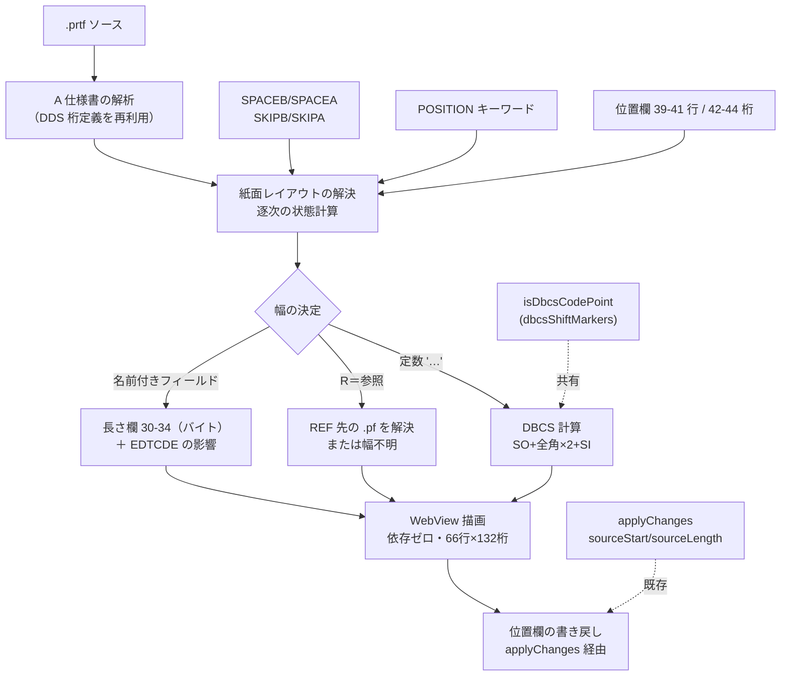

# 調査: PRTF 視覚編集（DBCS 対応）の前提確認

`requirement.md` の未確定事項 6 件を、原典（`docs/origin/dds/`）と既存コードの直読、
および実機コンパイル確認済みサンプル（`docs/src/CUSTRPT.prtf`）の実測で解消した。

原典照合は AGENTS.md に従い主エージェントが生テキストを直読した。

## 最重要の発見: サンプル 1 本が論点をすべて含んでいた

`docs/src/CUSTRPT.prtf`（`CRTPRTF` が通ることを確認済み）は 9 行しかないが、
**この作業の難所を 3 つとも含んでいる**。

```
     A                                      REF(CUSTMST)
     A          R HEADING                   SKIPB(1)
     A                                      SPACEA(2)
     A                                    30'顧客一覧表'
     A          R DETLINE                   SPACEA(1)
     A            CUSTNO    R              5
     A            CUSTNM    R             15
     A            CUSTAM    R             50EDTCDE(1)
```

| 難所 | このサンプルでの現れ方 |
|---|---|
| **行が位置欄で決まらない** | 39-41 桁（行）が全行ブランク。行は `SKIPB(1)` / `SPACEA(2)` / `SPACEA(1)` が決める |
| **幅がこのファイルに書かれていない** | `CUSTNO R` / `CUSTNM R` / `CUSTAM R` は 29 桁目が `R`＝参照。長さは `REF(CUSTMST)` 先にある |
| **DBCS の幅** | `'顧客一覧表'` は JS で 5 文字だが実機では **12 桁**（下記 F1） |

つまり**「位置欄を読んで value.length で描く」実装は、この 1 本ですべて外す**。
競合（IBM i Renderer）がまさにその作りになっている。

## 判明した事実

### F1（Q1）: 幅の計算は「フィールド」と「定数」で別問題。DBCS が効くのは定数

原典 `印刷装置ファイルの桁数 (30 から 34 桁目)` は明確:

> 指定する桁数は、このフィールドを対象とした出力操作のさいに、ユーザーのプログラムから
> 渡される**データのバイト数**を表します。

**名前付きフィールドの幅は 30-34 桁のバイト数**で決まり、DBCS かどうかに関係なく
そこに書いてある。バイトと印刷桁はおおむね 1:1 なので、**フィールドについては
DBCS 特有の計算が要らない**。

問題は**定数**（キーワード欄に `'…'` で書くリテラル）。こちらは長さ欄を持たず、
文字列そのものから幅を出すしかない。ここで実機とずれる。

```
'顧客一覧表'
  JS の文字数 : 5   ← 競合はこれを幅に使う
  実機の桁    : SO(1) + 全角 5 字 × 2 + SI(1) = 12
  ずれ        : 7 桁
```

**ローカルのソースに SO/SI は存在しない**（`docs/src/DBCSSAMP.pf` を生バイトで確認。
日本語は UTF-8 のまま `346 274 242`＝`漢` で `0x0E`/`0x0F` は無い）。
`dbcsShiftMarkers.ts` は SO/SI を**装飾として仮想表示**しているだけで、
桁位置は `codePointAt` で JS のコード単位を数えている（`:97`）。

→ **実機の桁を出すには、ソースに無い SO/SI を計算で足す**。既存の
`isDbcsCodePoint`（`dbcsShiftMarkers.ts:12`）がそのまま使える。

### F2（Q3・最優先）: 行は位置欄だけでは決まらない。逐次の状態計算になる

原典 `位置 (印刷装置ファイルの 39 から 44 桁目)`:

> 39 から 41 桁目には**行**、42 から 44 桁目には**位置**を指定します。
> …
> **行番号を使用しない場合には、印刷装置ファイル内で必要なフィールド順序のとおりに、
> DDS でフィールドを指定しなければなりません。**

桁送りキーワードの意味（PJ のキーワードデータより。いずれも原典生成）:

| キーワード | レベル | 意味 |
|---|---|---|
| `SPACEB(n)` | record / field | 印刷**前**に n 行送る（相対） |
| `SPACEA(n)` | record / field | 印刷**後**に n 行送る（相対） |
| `SKIPB(n)` | file / record / field | 印刷前に**行番号 n へ飛ぶ**（絶対） |
| `SKIPA(n)` | file / record / field | 印刷後に**行番号 n へ飛ぶ**（絶対） |

→ 行は「現在の印刷位置」という**状態**を持ち、レコード様式とフィールドを
**宣言順に走査しながら**更新して決まる。位置欄に行番号があればそれで上書きされる。

これは lint 作業で作った `RpgSpecContext`（先行行を蓄積して 1 走査で決める）と
**同じ構造の問題**。同じやり方が使える。

### F3（Q4）: 位置欄が空になる理由は 2 つある

1. **行番号を使わない書き方**（上記 F2）。サンプルがこれ。
2. **`POSITION` キーワードを使っている場合**。原典に明記:
   > POSITION キーワードが指定されている場合には、これらの位置は**ブランクでなければ
   > なりません**。

   `POSITION` はフィールド・レベルのキーワードで、位置欄の代わりに位置を与える。

### F4（Q2）: 紙面の大きさは **DDS に書かれていない**

`PAGESIZE` は **DDS キーワードではなく `CRTPRTF` のパラメータ**。
PJ が持つ PRTF キーワード 65 件を検索しても `PAGESIZE` / `PAGSIZ` は**存在しない**。

原典 `位置` の節も、桁・行の実際の最大値は
> 印刷装置ファイルの作成 (CRTPRTF) コマンドの PAGESIZE パラメーターのページ長の値
> および指定した 1 インチ当たりの行数によって

決まると書いている。

**既定値は PJ 自身の CL 定義（原典から生成・機械照合済み）から取れる**
（`resources/prompter/cl/ja/CRTPRTF.json`）:

| パラメータ | 既定 |
|---|---|
| `PAGESIZE` LENGTH（1 ページの行数） | **66** |
| `PAGESIZE` WIDTH（1 行の文字数） | **132** |
| `LPI`（行/インチ） | 6 |
| `CPI`（文字/インチ） | 10 |
| `OVRFLW`（オーバーフロー行） | 60 |

→ 紙面は既定 **66 行 × 132 桁**。DDS からは決められないので、**利用者が変えられる
必要がある**（`CRTPRTF` を別に書いているため）。なお `CPI` / `LPI` は DDS の
レコード/フィールド・レベルのキーワードとしては存在し、桁数そのものではなく
印字密度を変える。

### F5: 幅が参照先にある場合がある（requirement に無かった論点）

サンプルの `CUSTNO R` は 29 桁目が `R`＝参照で、長さ欄が空。
実体は `REF(CUSTMST)` が指す `CUSTMST.pf` にある。

```
CUSTNO         5S 0     → 5 バイト
CUSTNM        30A       → 30
CUSTAM         9S 2     → 9
```

→ **PRTF 単体では幅が確定しない**。参照を解決するには
(a) 同じワークスペースの `.pf` を読む (b) 実機に問い合わせる (c) 幅不明として描く、
のいずれか。本 PJ は実機非接続が既定なので (a) か (c)。

さらに原典は編集コードにも触れている:
> フィールドを編集する場合には、関連の**編集コードまたは編集語**を使用して、
> フィールドの**印刷桁数が決定されます**。

サンプルの `CUSTAM R 50EDTCDE(1)` がこれ。`EDTCDE` は桁数を変える（カンマ・
小数点・符号が入る）。**長さ欄の値がそのまま印刷幅とは限らない。**

### F6（Q5）: 書き戻しは既存の流儀がそのまま使える

`src/prompter/applyChanges.ts` は「桁で書き戻すのは RPG も DDS も同じ
（`sourceStart` / `sourceLength` を使う）」（`:70`）と明記し、`sourceStart` が
数値であることを検査してから（`:371`, `:430`）、元の行の該当範囲だけを
`slice` で取り出して置き換える（`:447-448`）。

→ 位置欄（39-44）だけを差し替える書き戻しは、**この経路に載せられる**。
DDS-PRTF のプロンプター定義に `C39`（位置）の欄が既にあるため、新しい桁定義も要らない。

### F7（Q6）: 描画は外部ライブラリなしで足りる

競合は `konva`（canvas）を使うが、**帳票は等幅の格子**であり自由図形ではない。
文字を桁行に置くだけなので、素の HTML/CSS（`monospace` のグリッド、
`position: absolute` またはグリッドレイアウト）で表現できる。

PJ には**依存ゼロの WebView 実績がある**（`src/prompter/webview.ts`。
`panel.webview.html` に CSP 付きで HTML を組み立てる形）。`dependencies: {}` を
維持したまま作れる。

**ただし DBCS の幅を CSS に頼ってはいけない**。ブラウザのフォントで全角が
ちょうど 2 倍幅になる保証はない。**桁は計算で決めて明示的に配置する**必要がある。

## 影響範囲



- **再利用**: DDS-PRTF の桁定義 / `isDbcsCodePoint` / `applyChanges` / WebView の作り
- **新規**: レイアウト解決（状態計算）/ 幅の決定 / 描画
- **触らない**: ルーラー・F4・SOSI 表示・補完・lint・アウトライン

## 実現性 / リスク

- **実現可能**。材料はすべて手元にあり、外部依存も増やさずに済む。
- **最大のリスクは行の解決**（F2）。ここを間違えると全部ずれる。ただし構造は
  lint の `RpgSpecContext` と同型で、既に一度作ったものと同じ形。
- **参照解決（F5）が未解決の設計判断**。ワークスペースの `.pf` を読みに行くと、
  この PJ が避けてきた「他ファイルへの依存」が入る。幅不明のまま描く選択もある。
- **編集コードの印刷幅（F5）は初版で完全対応は難しい**。`EDTCDE` は種類が多く、
  原典照合が別途要る。
- **紙面サイズが DDS に無い（F4）ため、見た目が実機と一致する保証は利用者の設定次第**。
  既定 66×132 は原典由来だが、`CRTPRTF` で変えていればずれる。

## spec への申し送り

### 設計に必ず反映すること

- **行はファイルを頭から走査する状態計算で決める**（F2）。位置欄だけを見る実装にしない。
  lint の `RpgSpecContext` と同じ形に寄せる。
- **幅はフィールドと定数で経路を分ける**（F1）。
  フィールド＝長さ欄（バイト）、定数＝DBCS 計算。`isDbcsCodePoint` を共有する。
- **位置欄が空でも異常ではない**（F3）。`POSITION` キーワードの経路も持つ。
- **紙面サイズは設定で変えられるようにする**（F4）。既定は原典由来の 66 行 × 132 桁。
- **書き戻しは `applyChanges` の経路に載せる**（F6）。位置欄の桁だけを差し替える。
- **描画は依存ゼロ。桁は計算で決めて明示配置する**（F7）。CSS のフォント幅に頼らない。

### 判断が要る点（spec で決める）

- **`REF` の解決をするか**（F5）。ワークスペースの `.pf` を読む / 幅不明として描く /
  初版は参照なしのフィールドだけ正確に描く、のどれか。
  **サンプルが 3 フィールドとも `R` なので、やらないと初版のデモができない。**
- **`EDTCDE` による印刷幅の変化**をどこまで見るか。初版は無視して長さ欄どおりに
  描くのが現実的だが、その場合サンプルの `CUSTAM` がずれる。
- **重なりの判定基準**。原典は「フィールドがオーバーラップしている場合には、
  プリンターは 2 重印刷を行います」「警告メッセージが表示されます」と書いており、
  **エラーではなく警告**。requirement の「実機では作成に失敗する」は**誤り**なので
  spec で訂正する。

### 受け入れ基準の見直し

requirement の
> `docs/src/CUSTRPT.prtf`（実機コンパイル確認済み）が正しく描画される

は、**`REF` の解決と `EDTCDE` を決めないと満たせない**。spec でどこまでを
「正しく」とするかを定義し直す必要がある。
