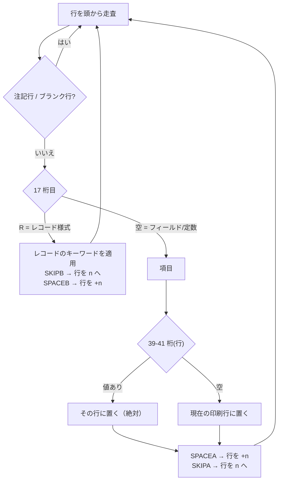

# 仕様: PRTF 帳票の視覚編集（DBCS 対応）

## 概要

`.prtf` を開いてコマンドを実行すると、**紙面のイメージを WebView に描く**。
項目を動かすとソースの位置欄に書き戻す。

`research.md` が示したとおり、この作業の芯は「絵を描くこと」ではなく
**帳票のレイアウトを DDS から正しく解決すること**にある。難所は 3 つ:

1. **行は位置欄で決まらない**（`SPACEB`/`SPACEA`/`SKIPB`/`SKIPA` の逐次状態計算）
2. **幅の求め方がフィールドと定数で違う**（前者は長さ欄のバイト数、後者は DBCS 計算）
3. **紙面の大きさが DDS に書かれていない**（`CRTPRTF` のパラメータ）

## 設計方針

### 方針 1: レイアウト解決を「純粋な計算」として独立させる

描画（WebView）と書き戻し（VS Code API）から切り離し、
**DDS の行の配列 → 配置済み項目の配列**という純粋な変換に閉じる。

理由は 2 つ。**この部分にしか難所が無い**ので、そこだけをテストで固めたい。
そして lint core で `src/core/` を作った経験から、**vscode 非依存に置けば
将来 lint からも使える**（「この項目は紙面をはみ出す」を lint 規則にできる）。

### 方針 2: 行の解決は lint の `RpgSpecContext` と同じ形にする

`SPACEB`/`SKIPB` は「現在の印刷位置」という状態を持ち、レコード様式とフィールドを
**宣言順に走査しながら**更新して決まる。これは lint 作業で作った `RpgSpecContext`
（先行行を蓄積して 1 走査で決める）と**同型の問題**なので、同じ形に寄せる。

### 方針 3: 幅は「経路を分ける」

`research.md` F1 のとおり、長さ欄は**バイト数**なのでフィールドに DBCS 計算は要らない。
壊れるのは長さ欄を持たない**定数**だけ。ここを一緒くたにすると、競合と同じ誤りになる。

```
名前付きフィールド → 長さ欄(30-34) → EDTCDE があれば印刷幅を計算
定数 '…'          → 文字列から DBCS 幅を計算（SO + 全角×2 + SI）
R（参照）          → 幅不明
```

### 方針 4: `REF` は解決しない（判断）

**ワークスペースの `.pf` を読みに行かない。** 本 PJ は「他ファイルに依存しない」
方針で来ており、`REF` の解決先はライブラリー・リストにも依存するため、
ローカルのファイル名一致で当てるのは**当たっているように見えて外れる**危険がある。

代わりに**幅不明として明示する**。利用者には「なぜ描けないか」が伝わる。

### 方針 5: `EDTCDE` は原典どおり全て実装する（判断）

ただし**到達できる範囲に明確な上限がある**ことを仕様に書いておく。

| 区分 | 対象 | 実装 |
|---|---|---|
| IBM i 編集コード | `1`-`4` / `A`-`D` / `J`-`Q` / `W`-`Z`（20 種） | **全て実装する** |
| アスタリスク充てん `*` / 浮動通貨記号 | `1`-`4` / `A`-`D` / `J`-`Q` に付加可 | **実装する** |
| **ユーザー定義編集コード `5`-`9`** | 実機の `*EDTD` オブジェクト | **不可能**（下記） |

`5`-`9` は**実機に作られたオブジェクト**であり、ソースからは決められない。
オフラインで解決する方法は無いので、**「ユーザー定義のため幅不明」として扱う**。
「完全対応」の上限はここ。

`EDTCDE` は 35 桁目が `S` またはブランク（数字）のフィールドにしか効かない（原典）。

### 退けた代替案

- **`konva` などの描画ライブラリ**（競合の選択）— 帳票は等幅の格子で自由図形ではない。
  ランタイム依存ゼロの制約を破ってまで得るものが無い。
- **CSS のフォント幅に全角を任せる** — ブラウザのフォントで全角がちょうど 2 倍幅に
  なる保証が無い。**桁は計算で決めて明示配置する**。
- **`languageId`（`dds.prtf`）で発火** — IBM i Renderer と二重に出る。
  PJ の既定方針どおり**拡張子で判定し、コマンドも別**にする。

## 対象範囲

### 追加

| パス | 役割 | vscode |
|---|---|---|
| `src/core/dds/prtfLayout.ts` | レイアウト解決（行・桁・幅）。この作業の芯 | 依存しない |
| `src/core/dds/printWidth.ts` | DBCS 幅の計算（SO + 全角×2 + SI） | 依存しない |
| `src/core/dds/editCode.ts` | `EDTCDE` の印刷幅計算 | 依存しない |
| `src/language/prtfPreview.ts` | コマンド登録・WebView・書き戻しの殻 | 依存する |
| `src/language/prtfPreviewHtml.ts` | 紙面の HTML/CSS 生成 | 依存しない（文字列を返すだけ） |
| `docs/origin/dds/PRTF-EDITCODES.html` | 原典（`os400edits.htm`）を追加取得 | — |
| `docs/origin/verify-dds-editcodes.mjs` | 編集コード表と実装の突き合わせ | — |
| `test/unit/prtfLayout.test.ts` / `printWidth.test.ts` / `editCode.test.ts` | 単体テスト | — |

### 変更

| パス | 変更内容 |
|---|---|
| `src/core/ddsLayout.ts` | PRTF の位置欄（39-41 行 / 42-44 桁）の取り出しを足す |
| `src/language/dbcsShiftMarkers.ts` | `isDbcsCodePoint` を `core` へ移し re-export（`printWidth` と共有） |
| `package.json` | コマンド `rpgClSupport.showPrtfPreview` と `contributes` |
| `docs/origin/sources.mjs` / `manifest.yml` | 編集コードの原典を収集対象に足す |

### 触らない

ルーラー / F4 プロンプター / SOSI 表示 / 補完 / lint / アウトライン / `fileScope.ts`。

## インターフェース / データ構造

```ts
// src/core/dds/printWidth.ts
/** 実機の印刷桁数を求める。SO/SI はソースに無いので計算で足す。 */
export function printWidth(text: string): number;

// src/core/dds/editCode.ts
export type EditCodeResult =
  | { readonly kind: "width"; readonly width: number }
  | { readonly kind: "unknown"; readonly reason: "user-defined" | "not-numeric" };

export function editedWidth(
  length: number, decimals: number, editCode: string, option?: "*" | string
): EditCodeResult;

// src/core/dds/prtfLayout.ts
export interface PlacedItem {
  readonly kind: "field" | "constant";
  readonly name?: string;              // フィールド名
  readonly text?: string;              // 定数の中身
  readonly row: number;                // 1 始まり
  readonly column: number;             // 1 始まり
  readonly width: number | undefined;  // undefined = 幅不明
  readonly widthUnknownReason?: "reference" | "user-defined-edit-code";
  readonly recordName?: string;
  readonly sourceLine: number;         // 1 始まり。書き戻しと対応づけに使う
}

export interface PrtfLayout {
  readonly page: { readonly rows: number; readonly columns: number };
  readonly items: readonly PlacedItem[];
  readonly overlaps: readonly (readonly [number, number])[]; // items の添字の組
  readonly overflows: readonly number[];                      // 紙面を超えた items の添字
}

export interface PrtfLayoutOptions {
  /** 既定は 66 行 × 132 桁（CRTPRTF の PAGESIZE 既定。原典由来）。 */
  readonly page?: { readonly rows: number; readonly columns: number };
}

export function resolvePrtfLayout(
  lines: readonly string[], options?: PrtfLayoutOptions
): PrtfLayout;
```

### 設定

| キー | 型 | 既定 | 意味 |
|---|---|---|---|
| `rpgClSupport.prtf.pageLength` | number | `66` | 1 ページの行数（`CRTPRTF` の `PAGESIZE` 長） |
| `rpgClSupport.prtf.pageWidth` | number | `132` | 1 行の桁数（同 幅） |

DDS に書かれていない値なので**利用者が変えられる**必要がある（`research.md` F4）。

## 振る舞いの詳細

### 行と桁の解決



- **桁**は 42-44 桁の値。空なら 1 桁目。
- **`POSITION` キーワード**があれば位置欄の代わりにそれを使う
  （原典: 位置欄はブランクでなければならない）。
- 行が紙面（既定 66）を超えたら `overflows` に記録する。

### 幅の決定

| 項目 | 幅 |
|---|---|
| 定数 `'…'` | `printWidth(text)`。DBCS の連なりごとに SO(1) + 全角×2 + SI(1) |
| フィールド（長さ欄に値あり・`EDTCDE` 無し） | 長さ欄の値（バイト数） |
| フィールド（長さ欄に値あり・`EDTCDE` あり） | `editedWidth(...)` |
| フィールド（29 桁目が `R`＝参照） | **幅不明**（`reference`） |
| フィールド（`EDTCDE` が `5`-`9`） | **幅不明**（`user-defined-edit-code`） |

`printWidth` の規約は SOSI 表示（`dbcsShiftMarkers`）と同じ `isDbcsCodePoint` を使う。
**ソースに SO/SI は存在しない**ので、DBCS の連なりを見つけて計算で足す。

### 重なりの扱い

原典は「フィールドがオーバーラップしている場合には、プリンターは **2 重印刷**を
行います」「**警告**メッセージが表示されます」と書いている。
**エラーではない**ので、描画上で見えるようにするだけで、開けなくしたりはしない。
幅不明の項目は重なり判定の対象外にする（幅が分からないので判定できない）。

### 書き戻し

- 画面上で項目を動かすと、その項目の**位置欄（39-44 桁）だけ**を書き換える。
- 行は 39-41 桁に右詰め、桁は 42-44 桁に右詰め。
- **元々位置欄が空だった項目（`SPACEA` で流れている項目）を動かした場合**は、
  絶対行を書き込むことになり**意味が変わる**。この場合は確認を求める。
- 書き戻しは `applyChanges` と同じ流儀（`sourceStart` / `sourceLength` の範囲だけを
  `slice` で置き換え、他の桁に触れない）。
- `POSITION` キーワードを持つ項目は初版では**移動できない**（位置欄が使えないため）。

### 描画

- 依存ゼロの WebView。`prompter/webview.ts` と同じく CSP 付きで HTML を組み立てる。
- **桁は計算で決めて明示配置する**。`ch` 単位のグリッドに `position: absolute` で置き、
  全角の幅をフォントに依存させない。
- ルーラー（桁目盛り）を出す。オーバーフロー行（既定 60）に線を引く。
- 項目をクリックするとソースの該当行にジャンプする。逆にカーソル行の項目を強調する。

## ドメイン固有の考慮

- **桁定義を作り直さない**（AGENTS.md）。位置欄・長さ欄の桁は `core/ddsLayout.ts` と
  既存の DDS 桁定義から取る。ルーラー・プロンプター・lint と食い違わせない。
- **`isDbcsCodePoint` を共有する**。SOSI 表示と別の判定を持たない。
- **原典から機械的に決まるものはスクリプトで生成・検証する**。編集コードの表は
  `docs/origin/` に収集し、`verify-dds-editcodes.mjs` で実装と突き合わせる。
- **IBM i Renderer と共存する**。拡張子で発火・別コマンド・別 WebView。
- ランタイム依存ゼロ（`dependencies: {}`）を維持する。

## エラー処理 / 異常系

| 事象 | 扱い |
|---|---|
| `.prtf` 以外で コマンド実行 | 何もしない（メッセージを出す） |
| 位置欄が数値でない | その項目を「配置不能」として一覧に出し、描画しない |
| 行が 255 を超える | 原典の上限。警告として示す |
| 紙面をはみ出す | `overflows` に入れ、描画上で示す（原典も警告） |
| 幅不明 | 位置だけ描き、幅が分からないことを見せる |
| ソースが変更された | WebView を再構築する |
| 書き戻し先の行が変わっている | 書き戻しを中止して再読み込みを促す |

## 受け入れ基準との対応

| requirement の完了条件 | 満たし方 |
|---|---|
| `.prtf` でコマンドからプレビューが開く | `rpgClSupport.showPrtfPreview` を拡張子判定で登録 |
| **`CUSTRPT.prtf` が正しく描画される** | **下記のとおり読み替える** |
| 日本語の幅が実機の桁と一致する | `printWidth` の単体テスト＋`'顧客一覧表'`＝12 桁の実測 |
| 重なりを検出して示せる | `overlaps`。ただし警告扱い（エラーにしない） |
| 項目を動かすとソースが更新され他の桁が変化しない | `applyChanges` の流儀。無変更で桁が崩れないテスト |
| 紙面の桁数・行数が反映される | 設定 2 つ。既定は原典由来の 66×132 |
| IBM i Renderer と干渉しない | 拡張子発火・別コマンド |
| 既存機能に退行がない | 既存テストと `npm run verify` を維持 |

### 受け入れ基準の読み替え（requirement からの変更）

requirement の
> `docs/src/CUSTRPT.prtf`（実機コンパイル確認済み）が正しく描画される

は、**`REF` を解決しない決定により、そのままでは満たせない**（3 フィールドが `R`）。
次のように読み替える。

> `docs/src/CUSTRPT.prtf` について、
> - **行位置**が `SKIPB(1)` / `SPACEA(2)` / `SPACEA(1)` から正しく解決される
> - **桁位置**が位置欄（42-44）どおりに解決される
> - **定数 `'顧客一覧表'` の幅が 12 桁**（実機と一致）になる
> - `CUSTNO` / `CUSTNM` / `CUSTAM` は**幅不明（参照）として示される**

この作業の芯（行の解決・DBCS 幅）はこのサンプルで検証できる。

### requirement の誤りの訂正

requirement は重なりについて「実機では作成に失敗するか印刷が崩れる」と書いたが、
**原典は警告＋2 重印刷**であり作成は成功する。仕様側を原典に合わせた。

## 未確定事項（plan / coding で確定してよい範囲）

- WebView の描画で `ch` 単位を使うか、px 換算するか。
- 編集コードの原典（`os400edits.htm`）を `sources.mjs` のどのカテゴリに入れるか。
- 項目の移動操作（ドラッグか、選択＋キー操作か）。
