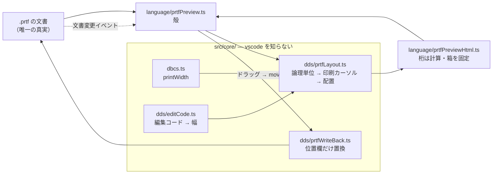

# レビューガイド: PRTF 帳票プレビュー（DBCS 対応）

## 変更概要 / 目的

DDS で書いた帳票（PRTF）の**紙面イメージを VS Code 上に描く**。日本語を含む帳票でも、
画面に見えるものが実機の印刷結果と一致する。項目をドラッグするとソースの位置欄に反映する。

SEU 時代の RLU に相当するものが VS Code に無く、帳票は**印刷して初めてレイアウトが
分かる**状態だった。

### 競合はあるが、日本語で破綻する

IBM i Development Extension Pack 同梱の **IBM i Renderer**
（`halcyontechltd.vscode-displayfile` v0.1.3）を、**配布 VSIX を展開して直読**した。

| 項目 | あちら |
|---|---|
| DBCS / SOSI の処理 | **0 件**（`0x0E` / `0x0F` / `ccsid` / `dbcs` すべてヒットなし） |
| 桁の計算 | `line.substring()` と `value.length`＝**JS の文字数** |
| 書き戻し | 無し（閲覧専用） |

`顧客一覧表` は JS で 5 文字だが実機では **12 桁**（SO + 全角 5×2 + SI）。**7 桁ずれる。**

上流に投げる道も検討したが、同種の指摘（`vscode-ibmi#2357`「DSPF プレビューが
80 桁固定」）が **1 年 8 か月 OPEN のまま**で、`#717`（多言語対応）は協力者が
名乗り出ても `ja` が入っていない。DBCS は日本語圏だけの問題なのでさらに後回しになる
見込みと判断した。

## まず読み分けてほしいこと

**差分の 3 分の 2 はテストと原典データ**です。実装は 1309 行。

| 区分 | 行数 | 中身 |
|---|---|---|
| 実装 `src/core` | +791 | レイアウト解決・DBCS 幅・編集コード・書き戻し |
| 実装 `src/language` | +518 | HTML 生成・WebView の殻 |
| **テスト** | **+1129** | 6 ファイル |
| **原典 HTML と生成物** | **+1311** | 取得した原典 2 本＋生成スクリプト＋検証＋生成 JSON |

コミットは 7 段（原典 → DBCS/編集コード → レイアウト解決 → HTML → WebView →
確認手順 → レビュー修正）。**`3fca684`（レイアウト解決）がこの作業の芯**で、
そこだけ見れば要点はつかめます。

## 重要ポイント（特に見てほしい所）

### 1. 一見矛盾する 2 つの決定 —「`REF` は解決しない」「`EDTCDE` は完全対応」

利用者の決定だが、**この 2 つは相互作用する**。`EDTCDE` の印刷幅は
「長さ・小数部・編集コード」から計算するが、`REF` を解決しないとその長さが分からない。

サンプルの `CUSTAM R 50EDTCDE(1)` がまさにこれで、**完全対応しても入力が無く幅が出ない**。

そこで `EDTCDE` は**純粋な関数**として実装し（`src/core/dds/editCode.ts:76`）、
**長さが分かる項目にだけ適用される**形にした。将来 `REF` 解決を足せばそのまま効く。

結果として `CUSTRPT.prtf` は 4 項目中 3 項目が「幅不明」になるため、
**受け入れ基準を読み替えた**（`spec.md`「受け入れ基準の読み替え」）:

> 行位置・桁位置・定数の幅が実機と一致し、`REF` の項目は幅不明と示される

この作業の芯（行の解決・DBCS 幅）はサンプルで検証できる。

### 2. 行は位置欄では決まらない — `src/core/dds/prtfLayout.ts:194`

原典（`位置 (39 から 44 桁目)`）:

> 行番号を使用しない場合には、印刷装置ファイル内で必要なフィールド順序のとおりに、
> DDS でフィールドを指定しなければなりません。

`SPACEB`/`SPACEA`（相対）と `SKIPB`/`SKIPA`（絶対）が「現在の印刷行」を動かすので、
**ファイルを頭から走査する状態計算**になる。lint 作業で作った `RpgSpecContext` と同型。

**レベルで効き方が違う**（原典で確定・`decisions.md` D1）:

| | レコード・レベル | フィールド・レベル |
|---|---|---|
| `SPACEA(n)` | レコードの**すべての行の後** | **その項目の後** |

原典は「レコード・レベルで 1 回、そして**各フィールドについて 1 回ずつ**指定できる」と
**両方の併存**まで書いており、推測では到達できなかった。

### 3. 幅の問題は「フィールド」と「定数」で別物 — `prtfLayout.ts:340` 付近

原典（`桁数 (30 から 34 桁目)`）は長さ欄を「**データのバイト数**」と定義している。
バイトと印刷桁はほぼ 1:1 なので、**名前付きフィールドに DBCS 特有の計算は要らない**。

壊れるのは長さ欄を持たない**定数**だけ。競合が `value.length` で済ませているのはここ。

```
定数 '…'        → printWidth()          … SO + 全角×2 + SI
長さ欄あり       → そのまま or editedWidth()
29 桁目が R      → 幅不明（reference）
EDTCDE が 5-9   → 幅不明（user-defined-edit-code）
```

`printWidth`（`src/core/dbcs.ts:56`）で注意が要るのは、**DBCS が途切れるたびに
SO/SI が要る**こと。`あZい` は 6 ではなく 9。全角の総数だけ数えると外す。

### 4. 桁は計算で決め、箱を権威にする — `src/language/prtfPreviewHtml.ts`

等幅フォントでも全角がちょうど 2 倍幅になる保証は無く、環境で変わる。
**計算した桁が正、表示は箱に収める**（`overflow: hidden`）。
はみ出せばそれ自体が「幅が足りない」という情報になる。

ドラッグで落とす位置も同じ方針で、**実際に描かれた項目から 1 桁の実寸を逆算**して
`Math.round` で桁に丸める（`prtfPreviewHtml.ts` の `toCell`）。見た目に合わせない。

### 5. 原典の宣言と表が食い違っていた — `docs/origin/generate-dds-editcodes.mjs:113`

原典の本文は編集コードを「1 から 4 / A から D / J から Q / **W から Z**」と宣言するが、
**早見表に `X` の行が無い**（W / Y / Z のみ）。`X` は別の注記で
「優先符号 F と同じ」＝編集しない、と説明されている。

黙って見逃すと `X` が「知らないコード」になって幅不明に落ちるため、注記から補い、
**宣言との差を生成時に検査する**。AGENTS.md の「原典が値を取りこぼしていることがある」
の実例がまた 1 つ増えた形。

読み取りでは他に 3 つ踏んでいる（いずれもコメントに残してある）:
**空セルが「なし」を意味する**（テキスト化すると消えて `3`/`4` が `1`/`2` と
区別できなくなる）/ **脚注の `<sup>2</sup>`** が `W2` として読める / **表の末尾に脚注行**。

## 処理フロー



**輪が閉じている**のが要点。画面の操作はソースを書き換えるだけで、その変更が
文書変更イベントとして戻ってきて再描画する。**WebView に配置状態を持たせない**ので、
利用者がソースを直接編集しても同じ経路に入る。

## 主要な変更箇所

| ファイル | 要点 |
|---|---|
| `src/core/dds/prtfLayout.ts:194` | **芯**。`toLogicalUnits` → 印刷カーソルの 2 段 |
| `src/core/dds/prtfColumns.ts:1` | 位置欄の行/桁分割。**`DDS_COLUMNS` に足さず導出**（後述） |
| `src/core/dbcs.ts:56` | `printWidth`。DBCS が途切れるたびに SO/SI |
| `src/core/dds/editCode.ts:76` | 属性から幅を導く式。表は持たない |
| `src/core/dds/prtfWriteBack.ts:26` | 位置欄 39-44 桁だけを置換 |
| `docs/origin/verify-dds-editcodes.mjs:1` | 原典の宣言・属性・ユーザー定義の混入を検査 |

## 工程中に見つけた欠陥 4 件（すべて修正済み）

**いずれも「型検査もテストも通るのに間違っている」種類**でした。

| # | 見つけた工程 | 欠陥 |
|---|---|---|
| 1 | coding | **見出しと明細が同じ行に重なった**。キーワードだけの行を独立した行として扱っていた（実際は直前のレコードの続き）。行を**論理単位にまとめる**形に変更（D4） |
| 2 | review | **`possible-overprint` が型だけで未実装**。D3 で「検出する」と決め、test 工程で実際に起きることを実測していたのに診断が出ていなかった |
| 3 | review | **位置欄が非数値でも黙って 1 行 1 桁に置いていた**。`XX`/`YY` が紙面の左上に正しく置かれたように見える |
| 4 | review | **`move` の受け口が死蔵**。ロジックはあるのに画面から発火させる手段が無かった |

#1 は**サンプルを流さなければ気づけなかった**。#4 は AGENTS.md の
「追加したリソースは到達可能になって初めて完了」そのもので、
lint core の作業でも同じ型を 3 回踏んでいる。

## 既存の検査に助けられた点

`DDS_COLUMNS` に位置欄の行/桁分割を足そうとしたら、**PR #100 が入れた検査が落ちた**。
`DDS_COLUMNS` は**ルーラーのタブ位置と共有**する定義で、生成物に 42 桁は存在しない。

**検査を緩めず**、共有定義から導出する `prtfColumns.ts` を作った。基準の桁は 1 か所のまま。

## リスク / 確認してほしい点

### 判断を仰ぎたい点

- **`REF` を解決しない方針**（利用者の決定）により、実務のソースでは
  **多くの項目が幅不明になる見込み**。サンプルでも 4 項目中 3 項目。
  実用に耐えるかは使ってみないと分からない。
- **ドラッグで「元々位置欄が空だった項目」を動かすと確認を求める**設計にした
  （`prtfPreview.ts:96`）。絶対行を書くと「順序で流れる帳票」が
  「固定行の帳票」に変質し、原典では `SPACE`/`SKIP` が無効になるため。
  この確認が煩わしくないかは実際に触らないと判断できない。

### 既知の制約

- **拡張機能ホストでの目視確認が未実施**。配線の到達性（コマンド → WebView →
  レイアウト解決、ドラッグ → `move` → 書き戻し）は単体テストで押さえたが、
  **実際の画面は見ていない**。手順は `docs/src/CHECKLIST.md`「帳票プレビュー（PRTF）」に。
- **IBM i Renderer との実画面での共存確認が未実施**。`package.json` の照合では
  コマンド ID・キーバインド・言語 ID の重複いずれも **0 件**。
- **PRTF のサンプルが `CUSTRPT.prtf` 1 本のみ**。しかも `REF` だらけで幅の検証に
  使えず、行の解決は合成データの単体テストで補っている。
- **`EDTCDE` の完全対応は「幅」だけ**。実際に印刷される文字列（コンマの挿入位置・
  `CR` の付加）までは作っていない。箱が描ければよいため。
- **ユーザー定義の編集コード `5`-`9` は原理的に解決できない**（実機の `*EDTD`）。

### follow-up 候補（本 PR の外）

- **DSPF（表示装置ファイル）** — A 仕様書の解析は共通化できる見込み。
  ただし条件付け・標識・サブファイルなど画面固有の要素が多い。
- **`REF` の解決** — ワークスペースの `.pf` を読むか、実機に問い合わせるか。
- **`src/language/fixedFormatNavigation.ts:3` の未使用 import**（本作業の範囲外）。
- **DBCS 対応を上流に提案する** — `printWidth` は切り出せる形になっている。
  ただし `vscode-displayfile` はリポジトリと配布版が非同期で、届く経路が読めない。
