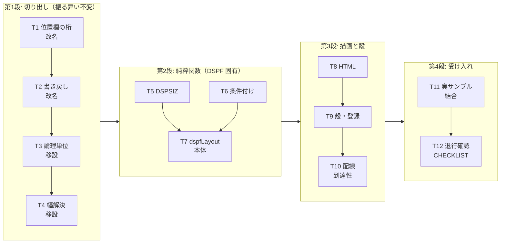

# 計画: DSPF 画面プレビュー（DBCS 対応）

## subtask 分割の判定: 分割しない

`aidev-docs/DESIGN.md`「5.」の 3 層決定木に当てて判定した。

| ピース | 単独で検証・デリバリ可能か | 判定 |
|---|---|---|
| 共有部品の切り出し（改名・移設） | **振る舞い不変の refactor** | 決定木より **subtask に落とさない** |
| DSPF 固有の純粋関数（サイズ・条件付け・レイアウト） | 単体テストは可能だが、**単独では価値を出さない**（画面が出ない） | 不可分 |
| 描画・WebView の殻 | レイアウト解決が無ければ動かない | 不可分 |

規模は新規 7 ファイル＋改名 3 で、**1 PR に収まる中規模**。protocol.md「2.8」の
「小〜中規模 work では使わない（過剰分割の禁止）」に該当する。
よって **単一 tasks.md ＋ walkthrough でのコミット構成**とする。

## 実装方針

**「既存を壊していないことを常に確認できる順」**に積む。

DSPF 固有の実装より先に、**共有部品の切り出し（振る舞い不変）を済ませる**。
これは既存の PRTF テストが緑のままであることで正しさが即座に確認でき、
後続の DSPF 実装が「借りる先」を確定させるため。ここを後回しにすると、
DSPF 側で似た関数を書いてしまい、二重実装を招く（AGENTS.md の禁止事項）。

次に **vscode に依存しない純粋関数**を下から積む（サイズ → 条件付け → レイアウト）。
最後に **描画と殻**を載せ、配線の到達性まで確認して完了とする。

## 作業順序と依存関係

### 第 1 段: 共有部品の切り出し（振る舞い不変）

1. **T1** `prtfColumns.ts` → `ddsPositionColumns.ts` 改名（依存: なし）
2. **T2** `prtfWriteBack.ts` → `ddsPositionWriteBack.ts` 改名（依存: T1）
3. **T3** `toLogicalUnits` / `readConstant` / `readNumber` を `ddsLogicalUnits.ts` へ移設（依存: なし）
4. **T4** 幅の解決を `ddsFieldWidth.ts` へ移設（依存: T3）

**各タスクの完了条件は「`npm test` が全部通ること」**。振る舞いを変えないので、
1 件でも落ちたらその時点で誤りと分かる。

### 第 2 段: DSPF 固有の純粋関数

5. **T5** `dspfScreenSize.ts`（`DSPSIZ` の解析）（依存: T3）
6. **T6** `ddsConditioning.ts`（7-16 桁の解析）（依存: T3）
7. **T7** `dspfLayout.ts` 本体（依存: T4, T5, T6）

### 第 3 段: 描画と殻

8. **T8** `dspfPreviewHtml.ts`（依存: T7）
9. **T9** `dspfPreview.ts` ＋ `registration.ts` ＋ `package.json`（依存: T8）
10. **T10** 配線の到達性テスト（依存: T9）

### 第 4 段: 受け入れ

11. **T11** 実サンプル `CUSTMNT.dspf` の結合テスト（依存: T7, T8）
12. **T12** 全体の退行確認・`CHECKLIST.md` 追記（依存: 全部）

## リスク / 留意点

### R1: 改名が生成物の検査に当たる（最も踏みやすい）

`prtfColumns.ts` のヘッダコメントに明記された設計判断がある。
**`DDS_COLUMNS` に 42 を足してはいけない** — 生成物 `dds-keyword-columns.json` は
39-44 を 1 欄として持ち、`contributesSideEffects.test.ts` が落ちる（過去に実際に落ちた記録）。

**対応**: 改名は**ファイル名と識別子だけ**にし、導出のしかたには一切触れない。
T1 の完了確認で `contributesSideEffects.test.ts` を名指しで見る。

### R2: 属性文字の占有を誤ると全項目が 1 桁ずれる

requirement が「これを誤ると全項目が 1 桁ずれる」と名指ししている最大の論点。

**対応**: `occupancy` を型の欄として持ち、**実サンプルの具体値でテストする**
（`'顧客保守'` → `[24, 35]`、`MSGTXT` → `[1, 52]`）。
計算を描画側に書かない（`dspfLayout` に閉じる）ことで、
HTML を直したときに桁がずれる経路を作らない。

### R3: `printWidth` を経由しない幅計算の混入

`.length` で数えた瞬間に DBCS が 6 桁ずれる（競合の失敗そのもの）。

**対応**: 幅の計算は T4 で切り出す `ddsFieldWidth.ts` に一本化し、
`dspfLayout.ts` / `dspfPreviewHtml.ts` に `.length` による桁計算を書かない。
review 時に grep で確認する。

### R4: 重なりの誤検出（受け入れ基準に明記）

**対応**: spec の「保守的判定」（両方とも条件付けが空のときだけ重なり）を実装し、
条件付きの項目を含む合成ソースで**重なりが出ないこと**をテストする。
サンプル `CUSTMNT.dspf` は条件付けを持たないため、これだけでは網羅にならない。

### R5: 到達性の漏れ（AGENTS.md の既知の罠）

「リソースを足しただけでは完了ではない」。コマンドを `package.json` に足しても、
`registration.ts` から呼ばれなければ何も起きない。

**対応**: T10 で vscode stub を使い、**コマンドを実際に実行して
`panel.webview.html` に中身が入る**ところまで見る。`.mnudds` でも開けることも見る。
なお本機能は**キーバインドを割り当てない**ので、`verify-contributes.mjs` の
拡張子一致検査には影響しない（コマンドパレットのみ）。

### R6: `.mnudds` の実物が無い

リポジトリに `.mnudds` のサンプルが存在しない。`resolveDdsType` が
`DDS-DSPF` に寄せているため実装上は通るが、**実物での確認はできない**。

**対応**: T10 の配線テストで `.mnudds` の拡張子を持つ**合成ドキュメント**を使い、
プレビューが開くことまでを担保する。実サンプルによる確認は範囲外とし、
review でこの限界を明示する。

### R7: PRTF への退行

改名 3 件が PRTF の全経路に触れる。

**対応**: `prtfWriteBack.test.ts` の**実サンプル全行の恒等性テスト**が
改名後も通ることを、T2 と T12 の両方で確認する。これが実質的に最強の担保。

## テスト方針

test 工程で確認するのは次の 4 つ。

1. **単位（第 2 段の純粋関数）**: `DSPSIZ` の 5 書式・省略時 24×80・不正値、
   条件付けの標識列/画面サイズ条件名の判別、`isMutuallyExclusive` の表。
2. **結合（実サンプル）**: `docs/src/CUSTMNT.dspf`（実機コンパイル確認済み）に対し
   spec の受け入れ基準の具体値（行・桁・幅 10・occupancy・参照の幅不明・
   画面サイズ 24×80・**診断ゼロ**）。
3. **到達性**: vscode stub でコマンドを実行し HTML が入ること。`.dspf` / `.mnudds` で開き、
   `.prtf` では何も起きないこと。
4. **退行**: `npm test` 全体。特に PRTF の書き戻し恒等性テスト。

**受け入れ基準に無いものをテストで足さない**。`+n` と 2 次画面サイズは
spec で初版対象外と決めたので、「診断が出ること」だけを見る。
