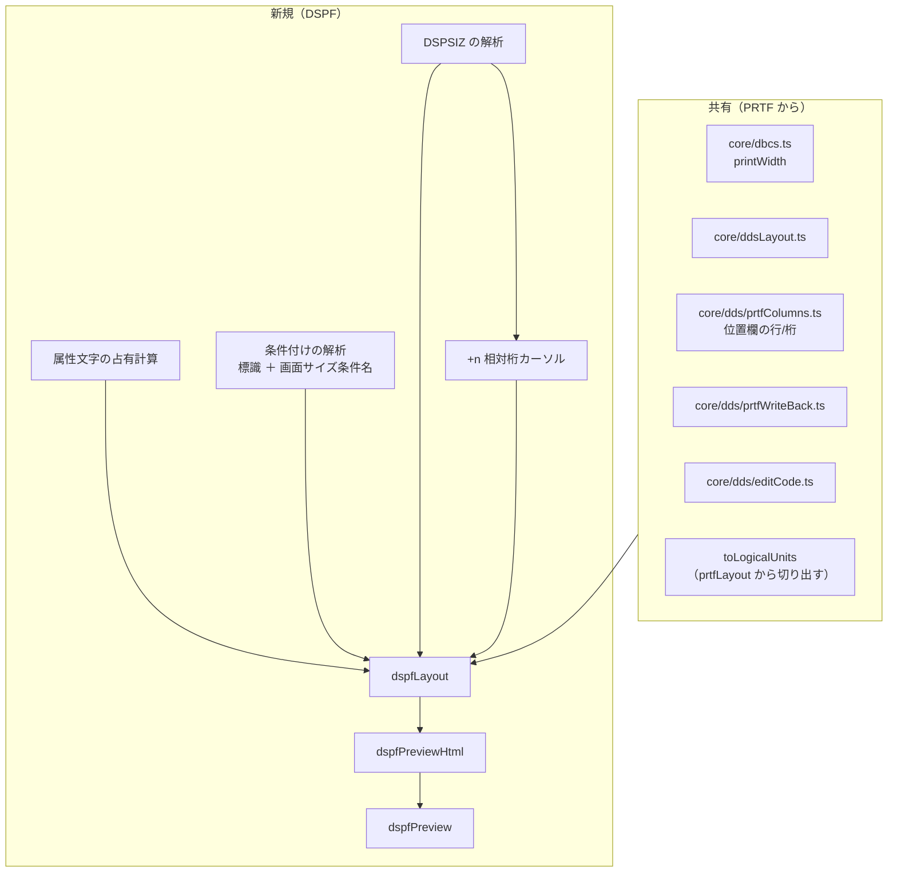

# 調査: DSPF 画面プレビュー（DBCS 対応）の前提確認

`requirement.md` の未確定事項を、原典（`docs/origin/dds/`）と PRTF 実装の直読で解消した。

原典照合は AGENTS.md に従い主エージェントが生テキストを直読した。

## まとめ: DSPF は PRTF より簡単な面と難しい面が両方ある

| | PRTF | DSPF |
|---|---|---|
| 行の決まり方 | **`SPACE`/`SKIP` による逐次の状態計算** | **位置欄で明示。ただし `+n` の相対指定あり**（F1） |
| 紙面／画面サイズ | DDS に無い（`CRTPRTF` のパラメータ） | **`DSPSIZ` が DDS にある**（F3） |
| 見えない桁の消費 | SO/SI（DBCS のみ） | SO/SI **＋属性文字（全項目）**（F2） |
| 重なり | 警告（2 重印刷） | **条件が違えば正当**（F4） |
| 幅 | 長さ欄＝バイト数 | 長さ欄＝**プログラム桁数**、表示桁数は別（F5） |

**PRTF の `SPACE`/`SKIP` 相当は無い**が、`+n` の相対桁指定があるため
**直前フィールドの終端を保持するカーソルは依然として必要**。
加えて**属性文字**が新しい難所になる。

## 判明した事実

### F1: 行は位置欄で決まる。ただし `+n` の相対桁指定がある（カーソルは必要）

原典 `表示装置ファイルの位置 (39 - 44 桁目)`:

> この欄には、画面上で各フィールドが始まる**正確な位置**を指定します。
> **行 (39 - 41 桁目)** … フィールドが始まる行を指定します。
> **桁 (42 - 44 桁目)** … 指定した行の中でのフィールドの開始桁を指定します。

PRTF の「行番号を使用しない場合は宣言順で流れる」に相当する記述が**無い**。
`SPACEB`/`SPACEA`/`SKIPB`/`SKIPA` は**印刷装置ファイルのキーワード**であり、
DSPF のキーワード 174 件にも含まれない（確認済み）。

→ `SPACE`/`SKIP` 由来の**行送りカーソルは DSPF に要らない**。

**ただし訂正: `+n` による相対桁指定がある**（原典 `DSPSIZ` キーワード 例 4）:

```
00010A                                      DSPSIZ(*DS4 *DS3)
00020A          R RECORD1
00030A            FIELD1        21      2 70
00040A            FIELD2        10        +10     ← 行を省略し前フィールドからの相対桁
```

> 例 4 … **DDS の プラス 機能**が働く結果、フィールドの表示位置がやはり画面サイズにより
> 決まることがあります。… **プラスの値で示されたフィールドの位置が 80 桁目を超えた場合には、
> フィールドの位置は画面サイズに応じて決まります。**

→ **直前フィールドの終端位置を保持するカーソルは必要**。しかも折り返しが
**画面サイズ依存**なので、`DSPSIZ`（F3）の解決がレイアウト解決の前提になる。
既存の `core/dds/prtfColumns.ts` に `+` の処理は**無い**（未対応。確認済み）。

なお**桁数欄（30-34）にも `R +7` の増減形がある**（参照フィールド使用時。F5 参照）。
`+` は位置欄と桁数欄の 2 か所に現れる。

論理単位にまとめる処理（`toLogicalUnits`）は**キーワード継続行のために必要**なので残る。

### F2（最重要）: 属性文字が画面の桁を消費する

**これが DSPF 固有の核心**で、SO/SI と同じ「ソースに書かれていないのに桁を食う」問題。

原典 `位置 (39 - 44 桁目)`:

> **開始属性文字** … 表示される各フィールドについて、画面上でのフィールドの表示属性を
> 定義するための**属性文字が 1 つ必要**です。
> **終了属性文字** … 画面上でのフィールドの終わりは終了属性文字によって示されます。
> ただし、そのフィールドと次のフィールドとの間が 1 桁しか空いていない場合を除きます。

原典 `桁数 (30 - 34 桁目)`:

> **表示桁数には、フィールドの開始属性文字および終了属性文字は含まれません。**
> しかし、フィールド位置について画面上でのレイアウトを考える際には、
> **これらの属性文字を考慮に入れる必要があります。**
> レコード内において、フィールドの終了属性文字は次のフィールドの開始属性文字に
> **重ねることができ**、したがって、フィールドとフィールドの間に必要なスペースは
> **1 文字分だけ**です。

> 文字フィールドの最大桁数は、**表示画面サイズから 1 を引いた桁数**です
> （この 1 桁は開始属性文字のためのスペースです）。

> **フィールドは、表示画面の最初の桁を占めることはできません。
> 最初の桁は属性文字のために予約されています。**

**確定した規則**:

```
  位置欄の桁 = フィールドの「データ」が始まる桁
  開始属性文字 = その 1 つ手前の桁（column - 1）
  終了属性文字 = データの直後の桁（column + width）
  → 実効的な占有は [column - 1, column + width]
  → 隣接する項目は終了属性と開始属性を共有できるので、間は 1 桁で足りる
  → 項目の桁は 2 以上でなければならない（1 桁目は属性文字の予約）
```

サンプル `CUSTMNT.dspf` の位置（`1 25` / `2 5` / `5 20` / `6 20` / `23 2`）は
**すべて桁 2 以上**で、規則を満たしている。`MSGTXT` の桁 2 は開始属性文字が
1 桁目に入る形で、これは正当（1 桁目は属性文字のための予約）。

### F3: 画面サイズは `DSPSIZ` から読める

`DSPSIZ` はファイル・レベルのキーワード（PJ のキーワードデータで確認）。

```
DSPSIZ(*DSw [*DSx])
DSPSIZ(lines positions[condition-name-1][lines positions[condition-name-2]])
```

**2 通りの書き方があり、複数のサイズを持てる**。サンプルは
`DSPSIZ(24 80 *DS3)` で、これは**数値指定＋条件名**の形。

**原典で展開表を確定した**（`docs/origin/dds/detail/rzakc_rzakcmstdfdspsz.htm` の「有効な画面サイズ」表）:

| 画面サイズ | 意味 |
|---|---|
| `*DS3` または `24 x 80` | 24 行 x 80 桁、合計 1920 桁 |
| `*DS4` または `27 x 132` | 27 行 x 132 桁、合計 3564 桁 |

確定した規則:

- **有効なサイズはこの 2 つだけ**（「指定できるのは、24 x 80、および 27 x 132 だけです」）。
- **`DSPSIZ` 省略時は 24×80**（「このキーワードを指定しなかった場合には、表示装置ファイルは、
  24 x 80 の画面を備えた表示装置に対してのみオープンすることができます」）。
- パラメーター値は**最大 2 つ**。最初が **1 次画面サイズ**、2 番目が **2 次画面サイズ**。
- **ユーザー定義の画面サイズ条件名**を付けられる（`DSPSIZ(27 132 *WIDE 24 80 *NORMAL)`）。
  **2 - 8 文字、先頭は `*`**。定義した場合、`*DS3`/`*DS4` は条件付けに使えない。
- オプション標識は無効。

**訂正**: 当初「`CRTDSPF` の `DSPSIZ` パラメータ定義から取れる可能性」と書いたが**誤り**。
`CRTDSPF` に `DSPSIZ` パラメータは**存在しない**（`docs/origin/cmddef/CRTDSPF.xml` の
`Kwd` 一覧に不在・grep 0 件）。`DSPSIZ` は DDS キーワード専用で、コマンド側には無い。

### F4: 重なりは「条件が違えば正当」

原典 `位置 (39 - 44 桁目)`:

> **重複フィールド** … 1 つのレコード様式内で、フィールドを他のフィールドまたは
> 属性文字とオーバーラップ（重複）するように定義することができます。
> ただし、このように相互にオーバーラップするフィールドのうち、
> **一時点で画面に表示されるのは 1 つだけ**です。

条件付け（7-16 桁）の構造（原典 `条件付け (7 - 16 桁目)`）:

- オプション標識は **01-99 の 2 桁**
- **`N` が指定されていればオフ、無ければオン**
- **7 桁目**が `A`（AND の継続。既定なのでブランクでもよい）または `O`（OR）
- 1 条件に最大 9 標識、1 項目に最大 9 条件（最大 81 標識）
- 「フィールドまたはキーワードは、**最後の（または唯一の）標識の組み合わせを
  指定した行と同じ行**に指定しなければならない」

**訂正: 7-16 桁に入るのは標識だけではない。画面サイズ条件名も入る。**
原典 `条件付け (7 - 16 桁目)`:

> **画面サイズ条件名** … DSPSIZ キーワードに指定した画面サイズ条件名によって、
> キーワードの使用や**フィールドの位置を条件付ける**ことができます。

固定情報フィールドの規則（原典 `名前 (19 - 28 桁目)`）でも:

> **画面サイズ条件名 (8 - 16 桁目)** を用いて、2 次画面での位置を指定することができます。
> 指定できるのは、画面サイズ条件名と位置だけです。つまり、7 桁目、17 - 38 桁目、
> および 45 - 80 桁目はブランクでなければなりません。

→ **`01-99` の標識だけを見るパーサでは、サイズ条件付きの位置指定を取りこぼす**
（原典 例 2・例 3 の `*NORMAL 1 50` / `*DS4 26 2` がこの形）。
条件付け欄は「標識列」と「画面サイズ条件名（先頭 `*`）」の 2 形態を判別する必要がある。
なお条件名は **8 桁目から**（7 桁目は AND/OR 用でブランク必須）。

さらに**位置 00（0 行 0 桁）のレコード**は画面を占有しない（原典 `DSPSIZ`）:
フィールドが定義されていないレコード / 潜在・メッセージ・プログラム-システム間
フィールドのみのレコード / `CLRL` 指定かつ入力可能フィールド無しのレコード。

→ **条件付けを読まずに重なりを検出すると、実務の DSPF で大量の誤検出**になる。
最低限「条件付けが両方とも空のときだけ重なりとする」必要がある。

### F5: 表示桁数はプログラム桁数と違うことがある

原典 `桁数 (30 - 34 桁目)`:

> 指定する桁数は、…データの**バイト数**です。これをフィールドの**プログラム桁数**といいます。
> 画面に表示されるときのフィールドの桁数を**表示桁数**といいます。
> 表示桁数は、プログラム桁数と**同じかまたはそれより大きく**なります。
> フィールドの表示桁数は、**キーボード・シフト（35 桁目）**のほか、
> 小数点以下の桁数（36-37 桁目）や**編集機能**などによって決まります。

PRTF には無かった要素として **35 桁目（データ・タイプ／キーボード・シフト）が幅に効く**。

**固定情報フィールド（定数）は桁数欄を持たない**。原典 `桁数 (30 - 34 桁目)`:

> **固定情報フィールドについては、フィールドの桁数を指定してはなりません。**
> 固定情報フィールドの桁数については、DATE / DFT / MSGCON / TIME キーワードを参照してください。

原典 `名前 (19 - 28 桁目)` の固定情報フィールドの規則:

- 名前なし（19-28 桁はブランク）、**17 - 38 桁目はブランク**
- **位置 (39 - 44 桁目) の指定は必須**
- 値は 45-80 桁に **明示 `DFT` / 暗黙 DFT（引用符のみ）/ `DATE` / `TIME` /
  `SYSNAME` / `USER` / `MSGCON`** のいずれかで指定

→ 定数の幅は**桁数欄ではなくリテラル本体（または当該キーワード）から求める**。
引用符付きリテラルは `printWidth` で計算する（SO/SI・全角を含むため）。

また桁数欄には参照フィールド使用時の**増減形 `R +7`** がある
（「新しい桁数を指定するかまたは増減桁数を指定する」）。数値のみを想定すると落ちる。

### F6: PRTF 実装の再利用可能性

| 資産 | DSPF での扱い |
|---|---|
| `core/dbcs.ts` `printWidth` | **そのまま使う** |
| `core/ddsLayout.ts`（桁・注記・レベル） | **そのまま使う** |
| `core/dds/prtfColumns.ts`（位置欄の行/桁分割） | **そのまま使える**（39-41/42-44 は DSPF も同じ） |
| `core/dds/prtfWriteBack.ts` | **そのまま使える**（位置欄だけ置換） |
| `core/dds/editCode.ts` | 使える（DSPF にも `EDTCDE` がある） |
| `prtfLayout.ts` の `toLogicalUnits` | **共有したい**（キーワード継続行の扱いは共通） |
| `prtfLayout.ts` の印刷カーソル | **不要**（F1） |
| `prtfPreviewHtml.ts` | 方針は同じ。画面サイズ・属性文字の表現が違う |
| `prtfPreview.ts` | 殻の構造は同じ |

**共有すべきは `toLogicalUnits` と桁・幅の計算**で、レイアウト解決の本体は別になる。

## 影響範囲



- **`prtfLayout.ts` から `toLogicalUnits` を切り出す**（PRTF 側の挙動を変えない）
- **`prtfColumns.ts` / `prtfWriteBack.ts` の名前**が PRTF 固有に見えるが中身は DDS 共通。
  改名するか、そのまま使うかは spec で決める。

## 実現性 / リスク

- **実現可能**。PRTF の枠組みがそのまま効き、難所は属性文字と条件付けの 2 つに絞られる。
- **属性文字を誤ると全項目が 1 桁ずれる**。原典の規則は確定できたので、
  あとは実装とテストの問題。
- **条件付けを読まないと重なり検出が使い物にならない**。最低限「両方とも条件が
  空のときだけ重なりとする」ところから始める。
- **画面サイズは解決済み**（F3）。有効値が 2 つだけなので実装は単純。
- **`+n` の相対指定が残リスク**。折り返し規則が原典で明示されていない（下記）。
  ただし実務の DSPF での出現頻度は低いと見られ、初版は
  「`+n` を検出したら該当項目を未解決として明示する」退路がある。

## spec への申し送り

### 設計に必ず反映すること

- **`SPACE`/`SKIP` の行送りは持ち込まない。ただし `+n` の相対桁カーソルは要る**（F1）。
  折り返しが画面サイズ依存なので `DSPSIZ` 解決が先。位置欄・桁数欄の両方に `+` が出る。
- **属性文字を占有に数える**（F2）。実効占有 `[column-1, column+width]`、
  桁は 2 以上、隣接項目は属性を共有できる。定数（固定情報）も表示される
  フィールドなので開始属性文字を要する。
- **画面サイズは `DSPSIZ` から読む**（F3）。有効値は 24×80 と 27×132 のみ、
  省略時 24×80、1 次／2 次の 2 つまで、ユーザー定義条件名あり。
- **条件付け欄は 2 形態**（F4）。`01-99` の標識列と、**画面サイズ条件名（8 桁目から・先頭 `*`）**。
  後者は位置を条件付けるので、読まないと 2 次画面の位置指定を取りこぼす。
  重なり判定は条件付けを見てから（条件が違えば正当）。位置 00 のレコードは画面を占有しない。
- **定数の幅は桁数欄ではなくリテラルから求める**（F5）。桁数欄には `R +7` の増減形もある。
- **`toLogicalUnits` を共有する**（F6）。PRTF 側の挙動を変えずに切り出す。

### spec で決める点

- **`prtfColumns` / `prtfWriteBack` を DDS 共通の名前に改名するか**。
  中身は PRTF 固有ではない。改名すると PRTF 側の差分が出る。
- **表示桁数（F5）をどこまで見るか**。35 桁目のキーボード・シフトが幅に効くが、
  対応表を原典で確認していない。初版はプログラム桁数で描き、
  差が出る場合を示すだけでもよい。
- **条件付けをどこまで解析するか**。「空かどうか」だけ見るのか、
  標識の一致まで見て「同じ条件のときだけ重なり」とするのか。
  **画面サイズ条件名（F4）は別軸**で、こちらは「どの画面サイズを描くか」の
  切り替えに効くので、標識とは分けて扱う必要がある。
- **`+n` の相対桁指定（F1）を初版で解決するか**。解決するなら
  カーソルを持つ構造になり、折り返し規則の実機確認が要る。
  未解決として描かない選択もある。
- **2 次画面サイズを描き分けるか**。`DSPSIZ` が 2 つ持つ場合、
  プレビューをどちらで描くか（切り替え UI を持つか）。
- **`.mnudds` の扱い**（既存の `resolveDdsType` は `DDS-DSPF` に寄せている）。

### 残った未確定（coding 前に潰す）

当初挙げた 2 件は**いずれも原典で解決した**（F3・F5 に反映）。

- ~~`DSPSIZ(*DSw)` の展開表~~ → **解決**。原典の「有効な画面サイズ」表で確定（F3）。
  併せて「`CRTDSPF` のパラメータから取る」という当初の想定が**誤り**であることも確認。
- ~~属性文字が定数にも要るか~~ → **解決**。固定情報フィールドも位置指定必須の
  「表示されるフィールド」であり、桁 1 は属性文字予約のため占有できない（F2・F5）。

新たに残った未確定:

- **35 桁目（キーボード・シフト）と表示桁数の対応表**が未取得（F5）。
  `docs/origin/dds/FIELD-DSPF-rzakcmstdfdt.html`（データ・タイプ）に
  あたる余地がある。初版はプログラム桁数で描く退路がある。
- **`+n` が 1 次／2 次画面で折り返す際の正確な規則**。原典は
  「80 桁目を超えた場合には画面サイズに応じて決まる」とだけ述べ、
  算出方法（次行送りか切り捨てか）を明示していない。コンパイル・リストの図は
  取得済み HTML では画像のため読めない。**実機で確かめるのが確実**
  （`ibmi-remote` skill で `CRTDSPF OPTION(*SRC)` の拡張ソース印刷出力を見る）。
