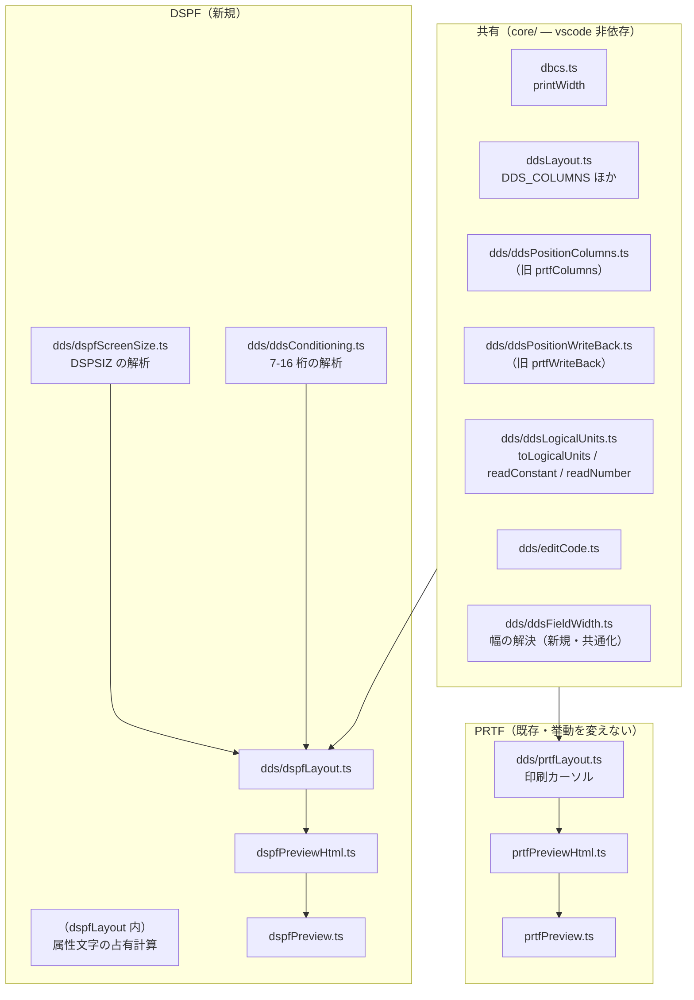

# 仕様: DSPF 画面プレビュー（DBCS 対応・SDA 相当の書き戻し）

## 概要

`.dspf` / `.mnudds` を開いてコマンドを実行すると、A 仕様書を解析して
**5250 画面のイメージを WebView に描く**。DBCS は実機と同じ桁（SO + 全角×2 + SI）で数え、
**属性文字の占有も桁として数える**。項目をドラッグすると位置欄（39-44 桁）だけを書き換える。

PRTF 帳票プレビュー（PR #103）と**同じ 4 層構造**（columns → layout → html → 殻）で作り、
DDS 共通の部品は PRTF から**切り出して共有**する。PRTF 側の挙動は変えない。

## 設計方針

### 方針 1: 共通部品を切り出し、DSPF 固有はレイアウト解決に閉じる

research F6 のとおり、PRTF 実装のうち **DDS 共通のもの**と**PRTF 固有のもの**は
はっきり分かれている。前者を `core/dds/` に切り出し、後者（印刷カーソル）は持ち込まない。



**代替案（PRTF をコピーして改造）を退けた理由**: 同じ計算を 2 つ持たない（AGENTS.md
「同じ概念集合を複数箇所で列挙しない」）。特に `printWidth` と位置欄の桁は
食い違うと発見が遅れる種類の欠陥になる。

**改名を伴う切り出しを選んだ理由**: `prtfColumns` / `prtfWriteBack` は名前が PRTF 固有に
見えるが、中身は 39-44 桁という **DDS 共通の規則**（research F6）。DSPF から
`prtfWriteBack` を呼ぶ形は、次に DDS の別種別が来たときに更に歪む。
改名による PRTF 側の差分は import 文とテストの参照のみで、
**既存の恒等性テスト（実サンプル全行の無変更書き戻し）がそのまま回帰網になる**。

### 方針 2: 「描けないものは描かず、理由を示す」

DSPF は PRTF より**未解決になりうる要素が多い**（参照フィールド・`+n` 相対桁・
キーボードシフトによる表示桁数）。**推測で位置や幅を捏造しない**。
未解決は `widthUnknownReason` / 診断として提示し、描画からは外す。

桁が 1 つずれた絵は、絵が無いことより有害である（competitor の IBM i Renderer が
DBCS で 6 桁ずれるのが、まさにこの失敗）。

### 方針 3: ソースが唯一の真実（PRTF 踏襲）

WebView に状態を持たせない。更新は HTML の丸ごと差し替え。
拡張 → WebView のメッセージは持たない。

## 対象範囲

### 新規追加

| ファイル | 役割 |
|---|---|
| `src/core/dds/ddsLogicalUnits.ts` | `toLogicalUnits` / `LogicalUnit` / `readConstant` / `readNumber` を `prtfLayout.ts` から移設 |
| `src/core/dds/ddsFieldWidth.ts` | 幅の解決（定数=printWidth / 29桁R=参照 / EDTCDE / 長さ欄）を `prtfLayout.ts` から移設 |
| `src/core/dds/dspfScreenSize.ts` | `DSPSIZ` の解析（1次/2次・条件名） |
| `src/core/dds/ddsConditioning.ts` | 条件付け欄（7-16 桁）の解析（標識列 / 画面サイズ条件名） |
| `src/core/dds/dspfLayout.ts` | DSPF のレイアウト解決（本体） |
| `src/language/dspfPreviewHtml.ts` | HTML 生成 |
| `src/language/dspfPreview.ts` | WebView の殻・コマンド登録 |
| `test/unit/dspfScreenSize.test.ts` ほか | 後述のテスト 3 段 |

### 改名（中身は変えない）

| 旧 | 新 |
|---|---|
| `src/core/dds/prtfColumns.ts` | `src/core/dds/ddsPositionColumns.ts` |
| `PRTF_POSITION_ROW` / `PRTF_POSITION_COLUMN` | `DDS_POSITION_ROW` / `DDS_POSITION_COLUMN` |
| `src/core/dds/prtfWriteBack.ts` | `src/core/dds/ddsPositionWriteBack.ts` |

### 変更

- `src/core/dds/prtfLayout.ts` — 移設した関数を import に置き換える（**挙動は不変**）
- `src/language/registration.ts` — `registerDspfPreview(context)` を追加
- `package.json` — `contributes.commands` に 1 件追加

### 変更しない

- `prtfPreviewHtml.ts` / `prtfPreview.ts`（PRTF の殻）
- 設定項目（DSPF は `DSPSIZ` がソースにあるため**設定を増やさない**）

## インターフェース / データ構造

### 画面サイズ（`dspfScreenSize.ts`）

```ts
/** 原典で有効なのは 24x80 と 27x132 の 2 つだけ */
export interface ScreenSize {
  readonly rows: number;      // 24 | 27
  readonly columns: number;   // 80 | 132
}

export interface ScreenSizeEntry {
  readonly size: ScreenSize;
  /** DSPSIZ に添えられた条件名（`*DS3` 等の IBM 提供名 or `*NORMAL` 等のユーザー定義名） */
  readonly conditionName?: string;
  readonly sourceLine: number;
}

export interface ScreenSizes {
  /** 1 次画面サイズ（DSPSIZ 省略時は 24x80） */
  readonly primary: ScreenSizeEntry;
  /** 2 次画面サイズ（あれば） */
  readonly secondary?: ScreenSizeEntry;
  /** DSPSIZ が書かれていたか（false なら既定の 24x80） */
  readonly declared: boolean;
}

export function resolveScreenSizes(units: readonly LogicalUnit[]): {
  readonly sizes: ScreenSizes;
  readonly diagnostics: readonly LayoutDiagnostic[];
};
```

**受理する書式**（research F3）:

```
DSPSIZ(*DS3)                      → 1次 24x80
DSPSIZ(*DS3 *DS4)                 → 1次 24x80 / 2次 27x132
DSPSIZ(24 80 *DS3)                → 1次 24x80（条件名 *DS3）
DSPSIZ(27 132 *WIDE 24 80 *NORMAL) → 1次 27x132(*WIDE) / 2次 24x80(*NORMAL)
（DSPSIZ 無し）                    → 1次 24x80・declared=false
```

- `*DS3` = 24×80 / `*DS4` = 27×132。数値指定は 24 80 と 27 132 のみ有効。
- ユーザー定義条件名は 2-8 文字・先頭 `*`。
- パラメータ値は最大 2 サイズ。3 つ以上・重複・無効サイズは診断。

### 条件付け（`ddsConditioning.ts`）

research F4 のとおり **7-16 桁には 2 形態が入る**。

```ts
export type Conditioning =
  | { readonly kind: "none" }
  /** 標識列（01-99・N 否定・7 桁目の A/O） */
  | { readonly kind: "indicators"; readonly clauses: readonly IndicatorClause[] }
  /** 画面サイズ条件名（8 桁目から・先頭 `*`） */
  | { readonly kind: "screen-size"; readonly name: string };

export interface IndicatorClause {
  /** この行の 7 桁目。既定（ブランク）は "A" */
  readonly join: "A" | "O";
  readonly terms: readonly { readonly indicator: string; readonly negated: boolean }[];
}

export function readConditioning(lines: readonly string[]): Conditioning;
```

**入力が複数行なのは意図的**: 原典より AND は最大 3 標識/行で次行に続き、
「フィールドまたはキーワードは**最後の標識の組み合わせを指定した行と同じ行**に
指定しなければならない」。よって条件は**その項目行を含む先行の継続行群**に分布する。
`toLogicalUnits` が返す論理単位の行群をそのまま渡す。

**等価判定**（重なり抑止に使う）:

```ts
/** 2 つの条件付けが「同時に成立しえない」と静的に言えるか */
export function isMutuallyExclusive(a: Conditioning, b: Conditioning): boolean;
```

初版の判定は**保守的**にする（詳細は「振る舞いの詳細」）。

### 配置結果（`dspfLayout.ts`）

`PlacedItem` は PRTF の型を土台にし、DSPF 固有の欄を足す。

```ts
export interface DspfPlacedItem {
  readonly kind: "field" | "constant";
  readonly name?: string;
  readonly text?: string;
  readonly row: number;              // 1 始まり
  readonly column: number;           // 1 始まり = データの開始桁
  readonly width: number | undefined;
  readonly widthUnknownReason?: WidthUnknownReason;
  readonly recordName?: string;
  readonly sourceLine: number;       // 1 始まり
  /** 38 桁目。I=入力 / O=出力 / B=両方 / H=潜在 / P=プログラム間 */
  readonly usage?: string;
  readonly conditioning: Conditioning;
  /** 属性文字を含む実効占有 [start, end]（1 始まり・両端含む） */
  readonly occupancy: { readonly start: number; readonly end: number };
}

export type DspfDiagnosticCode =
  | "overlap"                      // 条件が同じ項目どうしの重なり
  | "overflow"                     // 画面をはみ出す
  | "invalid-position"             // 位置欄が数値でない・行桁の一方だけ
  | "column-one-reserved"          // 1 桁目に置いた（属性文字の予約桁）
  | "missing-position"             // 位置欄が空で配置できない
  | "relative-position-unresolved" // `+n` 相対桁（初版は未解決）
  | "invalid-screen-size";         // DSPSIZ の書式・値が不正

export interface DspfLayout {
  readonly screen: ScreenSize;          // 描画に使った画面サイズ（= 1 次）
  readonly sizes: ScreenSizes;
  readonly items: readonly DspfPlacedItem[];
  readonly diagnostics: readonly LayoutDiagnostic[];
}

export function resolveDspfLayout(lines: readonly string[]): DspfLayout;
```

`resolveDspfLayout` は **vscode を import しない純粋関数**（PRTF 踏襲）。
オプション引数を持たない — 画面サイズはソースの `DSPSIZ` が決めるため。

### WebView メッセージ契約（PRTF と同一）

```
{ type: 'reveal', sourceLine: number }
{ type: 'move',   sourceLine: number, row: number, column: number }
```

**PRTF と同じ形にすることが要件**（「PRTF プレビューと操作を揃える」）。
拡張 → WebView のメッセージは持たない。

### コマンド / 登録

| 項目 | 値 |
|---|---|
| コマンド ID | `rpgClSupport.showDspfPreview` |
| タイトル | `画面プレビュー: 表示イメージを表示` |
| category | `RPG/CL Support` |
| viewType | `rpgClSupport.dspfPreview` |
| 対象判定 | `resolveDdsType(fsPath) === "DDS-DSPF"` |
| アクティベーション | 既存の `onStartupFinished`（追加しない） |

**対象判定に `resolveDdsType` を使う**（PRTF の `isPrtf` のような独自判定を作らない）。
これで `.mnudds` が自動的に含まれ、拡張子の列挙が二重化しない（AGENTS.md
「同じ概念集合を複数箇所で列挙しない」）。

## 振る舞いの詳細

### 1. 属性文字の占有（DSPF 固有の核心）

原典（research F2）より確定した規則をそのまま実装する。

```
位置欄の桁 = データが始まる桁 (column)
開始属性文字 = column - 1
終了属性文字 = column + width
実効占有 occupancy = [column - 1, column + width]
```

- **隣接項目は終了属性文字と開始属性文字を共有できる**ので、
  重なり判定は `occupancy` の**端点の一致を許す**（`a.end === b.start` は重なりとしない）。
  端点を超えて食い込んだ場合のみ重なりとする。
- **定数（固定情報フィールド）も属性文字を要する**（research F2・F5）。同じ規則を適用する。
- **`column === 1` は診断 `column-one-reserved`**（原典「フィールドは表示画面の最初の桁を
  占めることはできません。最初の桁は属性文字のために予約されています」）。
  この場合も**描画はする**（位置は既知なので）。診断で示すに留める。
- **幅不明の項目は `occupancy.end` を求められない**。`end = column`（データ 1 桁分）として
  扱い、重なり判定の対象から外す（誤検出を避ける）。

### 2. 幅の解決

PRTF から移設する `ddsFieldWidth.ts` の規則をそのまま使う。

| 条件 | 幅 |
|---|---|
| 定数（名前なし・キーワード欄が引用符リテラル） | `printWidth(リテラル本体)` |
| 29 桁目が `R`（参照） | **不明** `reason: "reference"` |
| 桁数欄が `+n` / `-n`（参照フィールドの増減形） | **不明** `reason: "reference"` |
| `EDTCDE` あり | `editedWidth(...)` |
| 桁数欄が数値 | その値 |
| 桁数欄が空・上記に当たらない | **不明** `reason: "no-length"` |

**キーボード・シフト（35 桁目）による表示桁数の拡大は初版では見ない**（research F5・残課題）。
プログラム桁数で描く。原典は「表示桁数はプログラム桁数と同じかまたはそれより大きくなる」と
述べるが、対応表が未取得のため。**過小に描くことになる場合がある**旨を
プレビューの注記に出す（後述「9. 未解決の提示」）。

### 3. 位置の解決（`+n` は初版で未解決とする）

- 39-41 桁が行、42-44 桁が桁。**両方とも必須**。
- 片方だけ埋まっている → `invalid-position`。
- 両方空で、かつ配置対象（名前あり or 定数）→ `missing-position`。
  **PRTF と違い前の行から流さない**（research F1: DSPF に `SPACE`/`SKIP` は無い）。
- **桁欄が `+n` 形式** → `relative-position-unresolved` を出し、**その項目は描画しない**。

`+n` を初版で解決しない理由（research F1・残課題）:
原典は「プラスの値で示されたフィールドの位置が 80 桁目を超えた場合には、
フィールドの位置は画面サイズに応じて決まります」とだけ述べ、
**算出方法（次行送りか切り捨てか）を明示していない**。属性文字を含めた起点も曖昧。
推測で描くと方針 2 に反するため、**未解決として明示する**。
実機で拡張ソース印刷出力を見て確定してからの対応とする（follow-up）。

### 4. 画面サイズと画面サイズ条件名

- **描画するのは 1 次画面サイズのみ**。
- 条件付けが `kind: "screen-size"` の項目は、**その条件名が 1 次画面サイズの条件名と
  一致する場合のみ配置**する。一致しなければ配置しない（2 次画面専用の位置指定であり、
  **これは正当なので診断を出さない**）。
- 2 次画面サイズの描画は**初版の対象外**（要件の「対象外」に準じ、follow-up）。
  ただし `DspfLayout.sizes` に保持し、プレビュー上に「2 次: 27×132 あり」と注記する。

### 5. 重なり判定（誤検出しないことが受け入れ基準）

**同一レコード様式内**の項目どうしのみを対象とする
（レコード様式は排他的に表示されるため、様式をまたぐ重なりは正当）。

`occupancy` が重なり、**かつ** `isMutuallyExclusive(a.conditioning, b.conditioning)` が
`false` のときだけ `overlap` を出す。

`isMutuallyExclusive` の初版の判定（**保守的 = 疑わしきは重なりとしない**）:

| a | b | 排他か |
|---|---|---|
| `none` | `none` | **いいえ**（両方無条件 → 重なりとする） |
| `none` | 何か | **はい**（条件付き項目は出ないことがある） |
| `indicators` | `indicators` | **はい**（初版は標識の一致まで見ない） |
| `screen-size` | 任意 | **はい** |

つまり**初版は「両方とも条件付けが空のときだけ重なりとする」**（research F4 の
最低ライン）。標識の同値判定まで踏み込むと `01` と `N01` の関係など
偽陽性・偽陰性の両方を生むため、精度は follow-up で上げる。

サンプル `CUSTMNT.dspf` は条件付けが 1 件も無いため、この判定でも
**診断ゼロ**になる（受け入れ基準を満たす）。

### 6. 画面外の検出

`occupancy.end > screen.columns` または `row > screen.rows` または
`row < 1` → `overflow`。幅不明の項目は `column > screen.columns` のみで判定する。

### 7. 描画

PRTF の `prtfPreviewHtml.ts` の方針をそのまま踏襲する。

- 桁は CSS 変数 `--cell` の**整数倍**で絶対配置。文字幅に依存しない。
- 画面の箱（`screen.rows` × `screen.columns`）が権威。`overflow: hidden`。
- 上端に `buildRuler(columns)` の目盛り（SEU と同じ `....+....1`）。
- 各項目に `data-source-line` / `data-row` / `data-column`。
- カーソル行の項目に `.active`。
- **属性文字の桁を薄く表示する**（DSPF 固有）。`occupancy.start` と
  `occupancy.end` の 1 桁を、項目本体と区別できる淡色のマーカーで描く。
  これがあると「なぜ隣に置けないか」が目で分かる。
- 幅不明の項目は**破線の枠**で 1 桁分だけ描き、名前を添える。
- **`printWidth` で桁を数えるのは幅の計算のみ**。HTML には元の文字列を出す
  （SO/SI はソースに無いため、ブラウザ上の見た目と桁数はもともと一致しない。
  箱の幅を `width` から決めることで桁を合わせる — PRTF と同じ考え方）。

### 8. 書き戻し

`ddsPositionWriteBack.writeBackPosition` を**そのまま使う**。

- **PRTF にある modal 確認は出さない**。PRTF の確認は「行番号を書くと SPACE/SKIP が
  無効になる」という PRTF 固有の意味論に由来する。DSPF は常に絶対位置なので
  確認する内容が無い。
- 移動先が 1 桁目のときは、**書き戻しはするが**次の再描画で
  `column-one-reserved` 診断が出る（実機でも `CPF` エラーになる指定なので、
  書けてしまうより気付ける方がよい）。

### 9. 未解決の提示

プレビュー上部に、解決できなかったものを**件数付きで**出す。

- 幅不明 n 件（参照 / 桁数欄なし）
- `+n` 相対桁 n 件（未対応）
- キーボード・シフト未考慮（表示桁数がプログラム桁数より大きい場合がある）
- 2 次画面サイズあり（初版は 1 次のみ描画）

## ドメイン固有の考慮

### AGENTS.md 由来

- **原典から機械的に決まるものは書き起こさない**: 桁は `DDS_COLUMNS` を使う。
  `dspfLayout.ts` に 39/42/44 等の数値を直接書かない。
- **同じ概念集合を複数箇所で列挙しない**: 対象拡張子は `resolveDdsType` 経由。
  `isDspf` のような独自判定を作らない。
- **追加したリソースは到達可能になって初めて完了**: コマンドを足すだけでなく、
  **配線の到達性テスト**（`dspfPreviewWiring.test.ts`）で
  「コマンドを実際に実行して `panel.webview.html` に中身が入る」ことまで見る。
- **languageId に触らない**: 拡張子判定＋`onStartupFinished` で完結させる。
  `contributes.languages` は変更しない（表示系と同じ方針）。
- **競合との共存**: IBM i Renderer は DSPF のスクリーンデザイナを持つため、
  コマンド ID・viewType・タイトルを明確に分ける。キーバインドは割り当てない。

### DBCS

- `printWidth` を**幅計算の唯一の経路**にする。`.length` を使わない。
- サンプルの `'顧客保守'` は SO(1) + 全角 4×2 + SI(1) = **10 桁**。
  占有は `[25-1, 25+10] = [24, 35]`。

## エラー処理 / 異常系

| 事象 | 扱い |
|---|---|
| 対象拡張子でない / エディタ無し | コマンドは何もしない（PRTF と同じ） |
| `DSPSIZ` の書式が不正 | `invalid-screen-size` 診断＋**既定 24×80 で描画を続行** |
| `DSPSIZ` に 3 つ以上のサイズ | 先頭 2 つを採用し診断 |
| 位置欄が数値でない | `invalid-position`。その項目は描画しない |
| レコード様式が 1 つも無い | 空の画面を描く（診断なし。ファイル・レベルのみのソースは正当） |
| 行が 44 桁より短い | `ddsField` が空文字を返す前提で扱う（既存の規約） |
| 幅不明の項目だけの画面 | 破線枠で描く。診断は幅不明の注記のみ |

**例外を投げない**。`resolveDspfLayout` は常に `DspfLayout` を返し、
問題は `diagnostics` で表す（PRTF 踏襲）。

## テスト

PRTF と同じ 3 段構成にする。

**(a) 純粋関数の単位テスト**
- `dspfScreenSize.test.ts` — 5 つの書式・省略時 24×80・不正値・3 つ以上
- `ddsConditioning.test.ts` — 標識列（A/O・N 否定・複数行）/ 画面サイズ条件名 /
  7 桁目ブランクが A 既定 / `isMutuallyExclusive` の表
- `ddsLogicalUnits.test.ts` — `prtfLayout.test.ts:110` の D4 回帰を移設

**(b) 実サンプルに対する結合テスト**
- `dspfLayout.test.ts` — `docs/src/CUSTMNT.dspf`（実機コンパイル確認済み）について
  - `'顧客保守'` が row=1 col=25 width=**10**、occupancy=`[24, 35]`
  - `'顧客番号'` が row=2 col=5 width=10
  - `CUSTNO` / `CUSTNM` が `widthUnknownReason: "reference"`
  - `MSGTXT` が row=23 col=2 width=50、occupancy=`[1, 52]`
  - 画面サイズが `DSPSIZ(24 80 *DS3)` から **24×80**
  - **診断ゼロ**
- 属性文字の占有・1 桁目検出・重なりの誤検出しないこと（合成ソース）

**(c) 配線の到達性テスト**
- `dspfPreviewWiring.test.ts` — vscode stub でコマンドを実行し
  `panel.webview.html` に中身が入る。`.mnudds` でも開けること。
  `.prtf` では DSPF コマンドが何もしないこと。

**(d) 退行なし（既存）**
- `npm test` 全体。特に `prtfWriteBack.test.ts` の**実サンプル全行の恒等性テスト**が
  改名後も通ること＝ PRTF の書き戻しに退行が無いことの担保。

## 受け入れ基準との対応

| requirement の完了条件 | 満たし方 |
|---|---|
| `.dspf` を開いてコマンドで表示 | `rpgClSupport.showDspfPreview` / `resolveDdsType` 判定 / 配線テスト (c) |
| 行位置・桁位置が位置欄どおり | 「振る舞い 3」＋テスト (b) |
| 定数 `'顧客保守'` の幅が 10 桁 | `printWidth` 共有＋テスト (b) |
| `CUSTNO`/`CUSTNM` が幅不明（参照） | 「振る舞い 2」の 29 桁目 `R` ＋テスト (b) |
| `MSGTXT` が幅 50 | 桁数欄＋テスト (b) |
| 属性文字が桁として数えられている | `occupancy = [column-1, column+width]`＋テスト (b) |
| 画面サイズが `DSPSIZ` から 24×80 | `dspfScreenSize.ts`＋テスト (a)(b) |
| 1 桁目の項目を検出 | `column-one-reserved` 診断＋テスト (b) |
| 条件付けが違う項目の重なりを誤検出しない | `isMutuallyExclusive`（保守的判定）＋テスト (b) |
| 項目を動かすと位置欄が更新され他の桁が変化しない | `ddsPositionWriteBack` 共有＋既存の恒等性テスト |
| IBM i Renderer と干渉しない | 拡張子判定・別コマンド ID・別 viewType・キーバインドなし |
| 既存機能に退行がない | 改名は import のみ・PRTF の挙動不変・`npm test` 全体 (d) |

## 初版で扱わないもの（要件の「対象外」に加えて spec で決めたもの）

| 項目 | 理由 | 提示のしかた |
|---|---|---|
| `+n` 相対桁の解決 | 原典に折り返し規則の明示が無い（research 残課題）。実機確認が要る | 診断 `relative-position-unresolved` |
| 2 次画面サイズの描画 | 初版は 1 次のみ。切り替え UI は状態を持つことになる | 注記「2 次: 27×132 あり」 |
| キーボード・シフトによる表示桁数 | 対応表が未取得（research 残課題） | 注記 |
| 標識の同値判定（`01` と `N01` 等） | 偽陽性・偽陰性の両方を生む。保守的に倒す | — |
