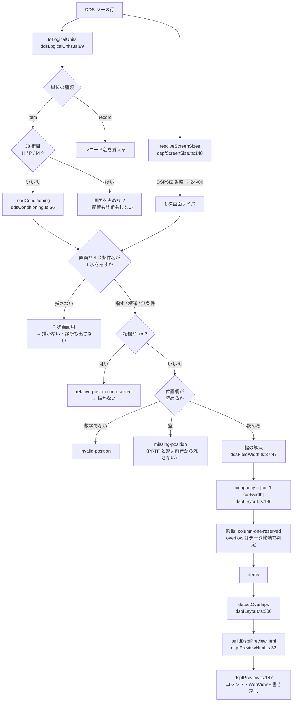

# レビューガイド: DSPF 画面プレビュー（DBCS 対応）

## 変更概要 / 目的

`.dspf` / `.mnudds` を開いて画面イメージを見ながらレイアウトを組めるようにする（SDA 相当）。
**日本語を含む画面でも実機の 5250 表示と桁が一致する**ことが目的。

競合（IBM i Development Extension Pack 同梱の IBM i Renderer）は DSPF が主対象だが、
**DBCS/SOSI の処理が 0 件**で `'顧客保守'` を 4 桁として描く（実機は 10 桁）。
さらに**属性文字も数えていない**ので、桁が二重にずれる。

先行する PRTF 帳票プレビュー（PR #103）の資産を共有層に切り出して再利用している。

**規模**: 新規 8 ファイル / 改名 3 / 変更 5。テスト 338 → **395**（+57）。

---

## レビューの勘所は 2 つだけ

差分は広いが、**新しい判断が要る箇所は 2 つ**に集中している。残りは PRTF の写しか機械的な改名。

### ① 属性文字が画面の桁を消費する（この機能の芯）

DSPF 固有の核心で、requirement が「**これを誤ると全項目が 1 桁ずれる**」と名指しした論点。

原典（`位置 (39 - 44 桁目)` / `桁数 (30 - 34 桁目)`）:

> 表示される各フィールドについて、…**属性文字が 1 つ必要**です。
> フィールドの終了属性文字は次のフィールドの開始属性文字に**重ねることができ**、
> フィールドとフィールドの間に必要なスペースは **1 文字分だけ**です。
> **フィールドは、表示画面の最初の桁を占めることはできません。**

```
位置欄の桁 = データが始まる桁 (column)
開始属性文字 = column - 1        終了属性文字 = column + width
実効占有 occupancy = [column - 1, column + width]
```

- `vscode-extension/src/core/dds/dspfLayout.ts:136` — `occupancyOf`
- `vscode-extension/src/core/dds/dspfLayout.ts:149` — `overlaps`。
  **端点の一致は重なりとしない**（属性文字を共有できるため）
- `vscode-extension/src/language/dspfPreviewHtml.ts:230` — `renderAttributes`。
  属性文字を淡色マーカーで描く。これがあると「なぜ隣に置けないか」が目で分かる

**ここが review で 1 件目の指摘になった箇所でもある**（下記③）。

### ② 条件付け欄（7-16 桁）には 2 種類のものが入る

research 段階で原典から判明し、**当初の理解を覆した**点。

> **画面サイズ条件名** … DSPSIZ キーワードに指定した画面サイズ条件名によって、
> キーワードの使用や**フィールドの位置を条件付ける**ことができます。

標識（`01`-`99`）だけを読むパーサでは、**2 次画面用の位置指定を黙って取りこぼす**。

- `vscode-extension/src/core/dds/ddsConditioning.ts:56` — `readConditioning`。
  7 桁目 = A/O、8-16 桁 = 標識 3 つ **または** 画面サイズ条件名（先頭 `*`）
- `vscode-extension/src/core/dds/ddsLogicalUnits.ts:89` — `toLogicalUnits`。
  **条件は複数行にまたがり、項目は最後の標識と同じ行にある**（原典）。
  キーワード継続行が「直前に付く」のと**向きが逆**なので判別が要る（decisions D2）

---

## 処理フロー



**PRTF との最大の違い**: 印刷カーソル（`SPACEB`/`SKIPA` による逐次の行送り）が無い。
DSPF の位置は常に絶対なので、**位置欄が無ければ流さずに診断する**
（`dspfLayout.ts` の `missing-position`）。

---

## ③ review で見つかった 2 件（特に見てほしい）

どちらも「**テストは通るが動かすと間違っている**」種類で、
実際にコードを動かして確認した。修正前に落ちることも確認済み。

### [must] 画面サイズ条件名を名前の文字列だけで比べていた → 項目が黙って消える

`DSPSIZ` を**数値形式**（`DSPSIZ(24 80 27 132)`）で書くと条件名が付かない。
その状態で `*DS3` に条件付けた項目が、名前比較では一致せず
**配置も診断もされずに消えていた**。原典はこの併用を明示している:

> ユーザー定義の画面サイズ条件名を指定しない場合には、
> **IBM 提供の画面サイズ条件名を使用してフィールドの位置を条件付ける必要があります。**

- `vscode-extension/src/core/dds/dspfScreenSize.ts:110` — `matchesScreenSize`。
  **IBM 提供名はサイズに解決してから**突き合わせ、ユーザー定義名だけ名前で比べる

### [should] はみ出し判定に終了属性文字を含めていた → 原典が認める最大幅を誤検出

> **文字フィールドの最大桁数は、表示画面サイズから 1 を引いた桁数**です
> （この 1 桁は**開始**属性文字のためのスペースです）。

80 桁画面の最大は幅 79（データ 2-80 桁）で、**終了属性文字の置き場所は無いのが正常**。
`occupancy.end` で判定すると、この最大幅を「はみ出し」と誤報していた。

- `vscode-extension/src/core/dds/dspfLayout.ts:125` — `dataEnd`。
  はみ出しは**データの終端**で判定し、`occupancy` は重なり判定にのみ使う

**しかも既存テストが誤った期待値を固定していた**（76 桁目・幅 5 で overflow を期待）。
テストが通っていたのはテスト自体が間違っていたため。

---

## 共有部品の切り出し（振る舞い不変・機械的）

**PRTF の挙動は変えていない**。ここは流し読みでよい。

| 変更 | 内容 |
|---|---|
| 改名 | `prtfColumns.ts` → `ddsPositionColumns.ts`（`DDS_POSITION_ROW`/`_COLUMN`） |
| 改名 | `prtfWriteBack.ts` → `ddsPositionWriteBack.ts`（＋テストファイル名） |
| 移設 | `toLogicalUnits` / `readConstant` / `readNumber` → `ddsLogicalUnits.ts` |
| 移設 | 幅の解決 → `ddsFieldWidth.ts` |
| 移設 | `buildRuler` / `escapeHtml` → `ddsPreviewHtmlShared.ts`（PRTF は再エクスポート） |

**退行していないことの担保**は `ddsPositionWriteBack.test.ts` の
**実サンプル全行の恒等性テスト**（`CUSTRPT.prtf` の各行を無変更で書き戻して一致）。
これが通っている＝ PRTF の書き戻し経路は壊れていない。

改名で唯一注意した点は **`DDS_COLUMNS` の導出に触れないこと**。
`ddsPositionColumns.ts` のヘッダに理由が書いてある（生成物 JSON は位置欄を
39-44 の 1 欄として持つため、42 を足すと `contributesSideEffects.test.ts` が落ちる。
過去に実際に落ちた記録あり）。

---

## 受け入れの証拠（実サンプル）

`docs/src/CUSTMNT.dspf` は**実機 pub400 / IBM i 7.5 でコンパイル確認済み**の fixture。

```
screen {"rows":24,"columns":80}          ← DSPSIZ(24 80 *DS3) から
constant "顧客保守" row 1 col 25 w 10  occ [24,35]   ← SO + 全角4×2 + SI
constant "顧客番号" row 2 col 5  w 10
field CUSTNO row 5 col 20 reference      ← REF は解決しない（幅不明）
field CUSTNM row 6 col 20 reference
field MSGTXT row 23 col 2 w 50  occ [1,52]
diagnostics: []                          ← 実機で通るソースに警告を出さない
```

`vscode-extension/test/unit/dspfLayout.test.ts` の
`DSPF: 実サンプル CUSTMNT.dspf` suite がこの値を固定している。

---

## リスク / 確認してほしい点

### 判断を仰ぎたい点

1. **重なり判定を「両方とも無条件のときだけ」に倒した**
   （`ddsConditioning.ts:112` の `isMutuallyExclusive`）。
   標識の同値判定（`01` と `N01` の背反など）に踏み込むと偽陽性・偽陰性の両方を生むため、
   受け入れ基準「**誤検出しない**」に沿って保守的にした。
   見落とし側に倒れている自覚はあるので、この方針でよいか。

2. **`+n` 相対桁を初版で解決しない**。原典は
   「80 桁目を超えた場合には画面サイズに応じて決まる」とだけ述べ、
   **算出方法を明示していない**（コンパイル・リストの図は画像で読めない）。
   推測で描くと桁がずれた絵になるため、診断を出して描画から外した。
   実機の拡張ソース印刷出力で確定してからの対応としたいが、
   「とりあえず描く」方がよいという判断もありうる。

### 既知の制約（未検証の面）

- **VS Code 実機での目視が未実施**（F5 起動が要る）。WebView の実描画、
  ドラッグ＆ドロップの実操作、属性文字マーカーの見え方。
  `docs/src/CHECKLIST.md` に確認手順を追記済み（「画面プレビュー（DSPF）」節）。
- **`.mnudds` の実物サンプルが無い**。合成ドキュメントで配線までを確認。
- **IBM i Renderer との実同時稼働は未確認**。コマンド ID・viewType の分離と、
  `.prtf` で DSPF コマンドが発火しないことは機械検証済み。
- **キーボード・シフト（35 桁目）による表示桁数の拡大を見ていない**。
  原典に対応表があるはずだが未取得。プログラム桁数で描き、
  **実機より狭く出ることがある**旨をプレビューの注記に出している。

### 影響範囲の確認済み事項

- **言語登録・`activationEvents`・設定項目を増やしていない**
  （表示系は拡張子判定＋`onStartupFinished` という PJ 方針どおり）。
- **キーバインドを割り当てていない**ので `verify-contributes.mjs` の
  拡張子一致検査には影響しない（コマンドパレットのみ）。
- 対象判定は `resolveDdsType` 経由で、拡張子を二重に列挙していない。
- `npm run verify:defs` 10 項目通過、`npm run compile` 通過、`npm test` 395 passing。

### 作業上の注意（decisions D3）

`npm test` は `out-test/` をクリーンしない。**改名を伴う変更の直後は
`rm -rf out out-test` してから走らせること**。今回これで一度テスト件数が
338 → 348 に増えて（旧名の成果物が二重実行されて）混乱した。
