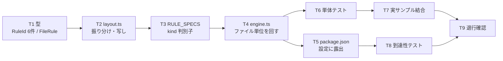

# 計画: レイアウト診断を lint / エディタ診断に届ける

## subtask 分割の判定: 分割しない

変更は **`src/lint/` の中に閉じ**、新規 2 ファイル・変更 4 ファイル。
決定木（`aidev-docs/DESIGN.md`「5.」）に当てると:

- 型の追加・規則の実装・エンジンの口・設定の登録は**相互依存で、単独ではデリバリできない**
  （型だけ足しても何も出ない・規則だけ書いても回らない）＝不可分。
- 規模は 1 PR に十分収まる。protocol.md「2.8」の「小〜中規模 work では使わない」に該当。

→ 単一 tasks.md で進める。

## 実装方針

**「型 → 実体 → 登録 → 配線 → 露出」の順**に積む。各段で `npm test` が通る状態を保つ。

この順にする理由は、**各段の失敗の意味が一意になる**こと。型を先に置けば実装は型に合わせるだけ、
実装を先に固めれば登録は差し込むだけになる。逆順にすると「型が悪いのか実装が悪いのか」で
切り分けが要る。

**AGENTS.md の「到達可能になって初めて完了」を踏まえ、T5（`package.json`）を
実装と同じ回に含める**。`RuleId` を足しただけでは利用者が設定できず、死蔵になる。

## 作業順序と依存関係

1. **T1** 型の追加（依存: なし）
2. **T2** `rules/layout.ts` の実装（依存: T1）
3. **T3** `RULE_SPECS` の拡張と 6 件登録（依存: T2）
4. **T4** `engine.ts` にファイル単位の口（依存: T3）— **ここで初めて動く**
5. **T5** `package.json` への露出（依存: T4）
6. **T6** 単体テスト（依存: T4）
7. **T7** 実サンプル結合テスト（依存: T6）
8. **T8** 到達性テスト（依存: T5）
9. **T9** 退行確認（依存: 全部）

## リスク / 留意点

### R1: PF/LF への誤爆（research F2 の実測 15 件）

振り分けを誤ると**物理／論理ファイルの全フィールドに指摘が出る**。
調査中に実際に踏んだ（`.pf` に DSPF リゾルバを当てて 15 件）。

**対応**: `ddsType` での振り分けを T2 の実装に組み込み、**T6 で `.pf` / `.lf` に
1 件も出ないことを明示的にテスト**する。これは最優先の回帰網。

### R2: 既定 ON を増やすことで既存利用者に新しい指摘が出る

**対応**: ON にするのは spec の表の 4 件（すべて「実機で作成できない」もの）だけ。
T7 で `docs/src/` の DDS 全部に既定の規則を当てて**指摘 0 件**を固定する。
0 件でなければ既定の判断が誤っていたということなので、その場で spec に戻る。

### R3: 同じ解決を 6 回走らせる

6 規則が個別に `resolveDspfLayout` を呼ぶと無駄。

**対応**: 規則の実体を 1 つにして memo する（spec「振る舞い 2」）。
`lintFile` は 1 ファイルを同期的に処理し切るので、キャッシュ 1 件で足りる。
**キャッシュのキーは `lines` 配列の同一性**にし、内容比較はしない。

### R4: 既存 5 規則への波及

`RuleSpec` に判別子を足すので、既存 5 件の定義に `kind: "line"` を書き足すことになる。

**対応**: 既存規則の**実装（`rule` 関数）には触れない**。定義に 1 行足すだけに留める。
T9 で既存規則のテストが全部通ることを確認する。

### R5: `verify-lint-core.mjs` の純粋性検査

`src/lint` から `src/core/dds/*` を import する。両方 `PURE_DIRS` の中なので通るはず
（research F5 で確認済み）だが、**検査は実際に走らせて確かめる**。

**対応**: T9 で `npm run verify:defs` を実行する。

### R6: 桁の直書き

位置欄 39-44・キーワード欄 45 を数値で書くと、`DDS_COLUMNS` との二重管理になる。

**対応**: T2 で `DDS_COLUMNS.position` と `DDS_KEYWORD_AREA_START` から導出する。
review 時に grep で確認する。

## テスト方針

test 工程で確認するのは次の 4 つ。

1. **単体（T6）**: 既定 ON の 4 件が意図した入力で発火する。**`.pf` / `.lf` で 0 件**（R1）。
   既定 OFF の 2 件は明示的に有効化したときだけ出る。
   採らなかった診断（`relative-position-unresolved` / `missing-position` 等）が**出ない**。
   桁が位置欄を指している。
2. **結合（T7）**: `docs/src/` の DDS 全部に既定の規則を当てて**指摘 0 件**（R2）。
3. **到達性（T8）**: `lintFile` の戻り値に含まれること。
   `package.json` の `lint.rules` に 6 件が載っていること。
   （エディタ・CLI は `lintFile` を呼ぶだけなので、ここが通れば両方に届く）
4. **退行（T9）**: `npm test` 全体、`npm run verify:defs`、`npm run compile`。

**受け入れ基準に無いものをテストで足さない**。診断そのものの正しさは
`dspfLayout.test.ts` / `prtfLayout.test.ts` が既に見ている。ここで見るのは**届いているか**。
