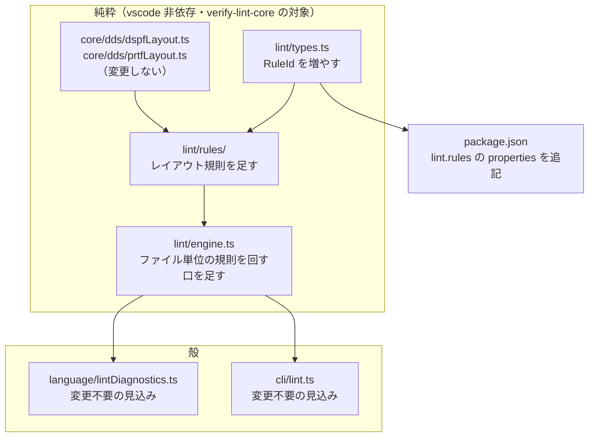

# 調査: レイアウト診断を lint / エディタ診断に届ける

`requirement.md` の未確定事項を、既存コードの直読と**実測**で解消した。
原典照合は AGENTS.md に従い主エージェントが生テキストを直読した。

## 調査の問い

- **Q1**: 実機コンパイル確認済みのサンプルに当てると偽陽性は何件出るか（既定 ON/OFF の判断材料）
- **Q2**: 既存 `Rule` の枠組み（行単位）にレイアウト診断は乗るか
- **Q3**: `RuleId` の粒度と、PRTF / DSPF で同名の診断の扱い
- **Q4**: `LintFinding` が要求する桁情報をどう埋めるか
- **Q5**: `lint` core の純粋性を保てるか

## まとめ: 「偽陽性 0 だから既定 ON」とは言えない

実測は 0 件だったが、**それを根拠に既定 ON にはできない**。理由が 2 つある。

1. **母数が 2 ファイルしかない**（F1）。既存 4 規則は RPG も含む広い母数で
   30 件を実測して既定を決めたが、レイアウト診断にはその材料が無い。
2. **原典上、有効なソースでも出うる診断がある**（F4）。件数の問題ではなく
   **性質の問題**なので、母数を増やしても解決しない。

## 判明した事実

### F1: 実測は 0 件。ただし母数は 2 ファイルだけ

`docs/src/` の DDS を種別で振り分けて当てた結果:

```
CUSTLF1.lf       DDS-PF    （レイアウト解決の対象外）
CUSTMNT.dspf     DDS-DSPF  items=5 diag=0
CUSTMST.pf       DDS-PF    （レイアウト解決の対象外）
CUSTRPT.prtf     DDS-PRTF  items=4 diag=0
DBCSSAMP.pf      DDS-PF    （レイアウト解決の対象外）
```

**リポジトリ内の DSPF / PRTF は上記 2 本で全部**（`find` で確認）。
`.mnudds` は 1 本も無い。

→ 「偽陽性 0」は**事実だが、母数 2 では既定 ON の根拠として弱い**。

### F2: 種別の振り分けを誤ると PF/LF に大量の偽陽性が出る（実測 15 件）

最初の測定で `.pf` / `.lf` に DSPF リゾルバを当てたところ、
**全フィールドに `missing-position` が出た**（CUSTMST.pf 6 件 / CUSTLF1.lf 5 件 /
DBCSSAMP.pf 4 件 = 15 件）。物理／論理ファイルに位置欄は無いので当然。

これは測定のミスだが、**配線を誤ると同じことが利用者に起きる**ことを示している。
`lintFile` は既に `kind.ddsType` を持っている（`src/lint/engine.ts:27`）ので、
そこで振り分ければ PF/LF は自然に対象外になる。**振り分けは必須の要件**。

### F3: `lintFile` は既にファイル単位。ただし `Rule` の型は行単位

`src/lint/engine.ts:26` の `lintFile(request)` は `request.lines`（ファイル全行）を
受け取る。ヘッダコメントに理由がある:

> **ファイル単位にしている理由**: ILE の I/O 仕様書は変種が F 仕様書 22 桁目に
> 依存するため、判定に先行行が要る。行単位 API では成立しない。

つまり**入口はファイル単位で、行ごとの `forEach` は内部の都合**（`engine.ts:46`）。
一方 `Rule` は 1 行分の `context`（`line` / `lineNumber` / `definition` /
`specKeyword` / `dialect`）を受け取る形（`engine.ts:62-68`）で、
**ファイル全体を見る規則は現在の型では書けない**。

→ 枠組みの拡張が要る（「ファイル単位の規則」を足す）。既存 5 規則の型は変えずに
済む形にできるかが spec の論点。

### F4（最重要）: 原典上、**有効なソースでも出る診断がある**

件数ではなく**性質**の問題。以下は「実機で通るのに指摘が出る」ことが原典から確定する。

**`relative-position-unresolved`（DSPF）— 確実に偽陽性になる**

`+n` の相対桁は原典が正式に認める書き方（`DSPSIZ` キーワード 例 4「DDS の
**プラス機能**」）。この診断は「本 PJ が解決しない」という**実装の都合の通知**であって、
ソースの誤りではない。**lint に出してはいけない**（出すなら情報レベルの別扱い）。

**`overflow`（DSPF）— 出うる**

原典（`DSPSIZ` 例 1）:

> FIELDB は 80 桁目を超えており、FIELDC は 24 桁目を超えています。したがって、
> データ記述処理プログラムは、…拡張ソース印刷出力で ***NOLOC の位置*を
> この 2 つのフィールドに割り当てます。**

はみ出したフィールドは `*NOLOC` になるだけで**ファイルは作成される**。
2 つの画面サイズを持つファイルでは正当な書き方でもある。

**`overlap`（DSPF）— 出うる**

原典（`位置 (39 - 44 桁目)`）:

> 1 つのレコード様式内で、フィールドを他のフィールドまたは属性文字と
> オーバーラップ（重複）するように**定義することができます**。

重なり自体が合法。本 PJ は「両方とも条件付けが空のとき」に絞っているが、
条件を標識ではなくプログラム側で制御する書き方は排除できない。

**逆に、有効なソースには出えないもの（既定 ON の候補）**

| 診断 | 根拠 |
|---|---|
| `invalid-position`（DSPF/PRTF） | 位置欄が数字でない。実機で作成できない |
| `column-one-reserved`（DSPF） | 原典「フィールドは、表示画面の最初の桁を占めることはできません」。実機も `CPF` で落ちる |
| `invalid-screen-size`（DSPF） | `DSPSIZ` の書式・値が不正。実機で作成できない |
| `spacing-with-line-number`（PRTF） | `CHECKLIST.md` に実例あり: 「`SPACEA`/`SKIPB` を使う様式で行番号を書いていた（**CPD7860**）」 |

`missing-position`（DSPF）は原典が「位置の指定は必須」と書くので本来は安全側だが、
**潜在／メッセージ／プログラム間フィールドを除外できているか**に依存する
（現状は 38 桁目で除外済み）。母数が少ないため要注意。

`possible-overprint`（PRTF）は「行番号もスキップもスペースも無い」で発火する。
原典は 2 重印刷になり得ると述べるが**エラーではない**ので、既定 OFF が妥当。

### F5: `LintFinding` は桁を要求するが、レイアウト診断は行しか持たない

`src/lint/types.ts` の `LintFinding` は `line` / `startColumn` / `endColumn` を持つ
（`engine.ts:79` の並べ替えも `startColumn` を使う）。
一方 `LayoutDiagnostic` / `DspfDiagnostic` は `sourceLine` のみ。

→ 桁を埋める材料は診断側に無い。**位置欄（39-44 桁）を指す**のが自然だが、
`invalid-screen-size` は `DSPSIZ` の行を指すなど、診断ごとに妥当な桁が違う。
「行全体を指す」で始めるのが無難かは spec で決める。

### F6: `RuleId` は文字列ユニオン。PRTF / DSPF で同名の診断が 3 つある

`src/lint/types.ts` の `RuleId` は 5 つの文字列ユニオン。
`package.json` の `rpgClSupport.lint.rules` の `properties` にも同じ名前が並ぶ
（`verify-contributes.mjs` の対象ではないが、手で同期している）。

重複するコード: `overlap` / `overflow` / `invalid-position`（PRTF・DSPF 双方にある）。
種別が違えば同時に発火しないので 1 つの ID にまとめられるが、
**既定を別々にしたい場合は分ける必要がある**（例: `overflow` は DSPF で OFF、
PRTF で ON にしたい、など）。

### F7: 純粋性は保てる

`verify-lint-core.mjs` の `PURE_DIRS` は `src/core` / `src/lint` / `src/cli`。
`dspfLayout.ts` / `prtfLayout.ts` は `src/core/dds/` にあり**既に純粋性検査の対象**で、
vscode を import していない。`src/lint` から import しても検査は通る。

## 影響範囲



既存 5 規則・プレビュー・書き戻しには触れない見込み。

## 実現性 / リスク

- **実現可能**。枠組みは揃っており、`lintFile` が既にファイル単位・`ddsType` を
  持っているので、振り分けと「ファイル単位の規則」の追加で届く。
- **最大のリスクは既定 ON の判断**（F1・F4）。母数 2 では実測が根拠にならず、
  性質上出うるものは母数を増やしても解決しない。
- **`relative-position-unresolved` を素直に lint へ流すと確実に偽陽性**（F4）。
  これは「実装が未対応」という通知で、ソースの誤りではない。

## spec への申し送り

### 設計に必ず反映すること

- **DDS 種別で振り分ける**（F2）。`lintFile` が持つ `kind.ddsType` を使い、
  PF/LF にはレイアウト規則を回さない。**回すと全フィールドに `missing-position`**（実測 15 件）。
- **`relative-position-unresolved` は lint に流さない**（F4）。原典が認める書き方で、
  ソースの誤りではない。プレビューの注記に留める。
- **既定 ON は「有効なソースに出えない」と原典で言い切れるものだけ**（F4 の表）。
  実測 0 件を根拠にしない。母数が 2 しかないことを型のコメントに残す。
- **ファイル単位の規則を足す**（F3）。既存 `Rule`（行単位）の型は変えない方向で。
- **`lint` core の純粋性を保つ**（F5）。`src/core/dds/*` の import は問題ない。

### spec で決める点

- **`RuleId` の粒度**（F6）。同名診断 3 つを 1 ID にまとめるか、
  `dspf-layout` / `prtf-layout` のように種別で分けるか、診断ごとに 1 ID にするか。
  **既定を診断ごとに変えたいなら細かく分ける必要がある**（F4 の表は診断ごとに違う）。
- **桁の埋め方**（F5）。位置欄（39-44）を指すか、行全体か、診断ごとに変えるか。
- **severity**。`invalid-position` は error、`overlap` は warning、など。
- **`missing-position` を既定 ON にするか**（F4 の注記）。原典は安全側だが母数が薄い。

### 残った未確定（coding 前に潰す）

- **サンプルを増やすか**。母数 2 を増やすには DDS を書いて**実機でコンパイル確認**が要る
  （`ibmi-remote` skill）。retro の issue 候補 5（`.mnudds` の実物追加）と重なる。
  増やさない場合、既定 ON は F4 の原典判断だけを根拠にすることになる。
- **わざと壊したソースでの発火確認**。「有効なソースで出ないこと」は測れたが、
  「**誤ったソースでちゃんと出ること**」は未測。テストで合成ソースを使う想定だが、
  実機でエラーになる実物があるとより強い（CHECKLIST に過去の失敗例が 6 件ある）。
