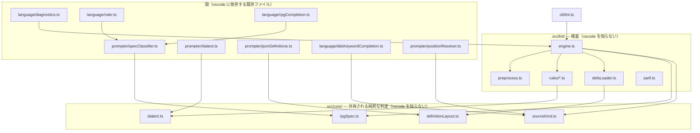
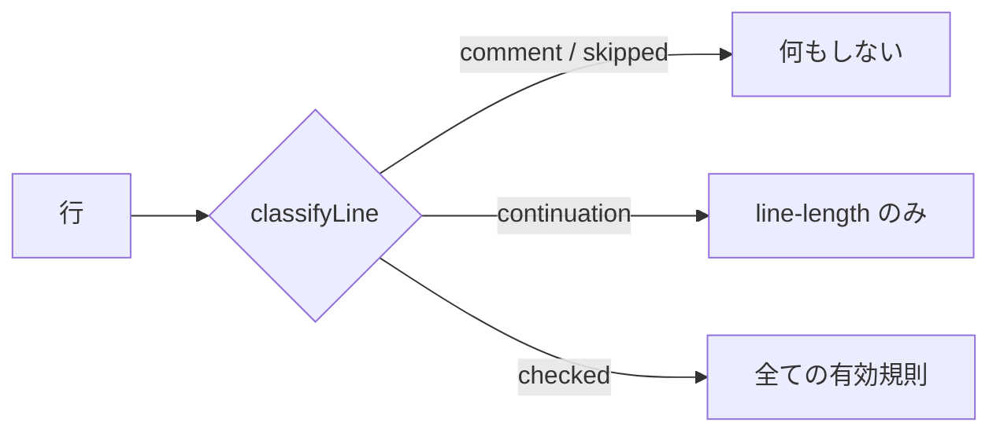
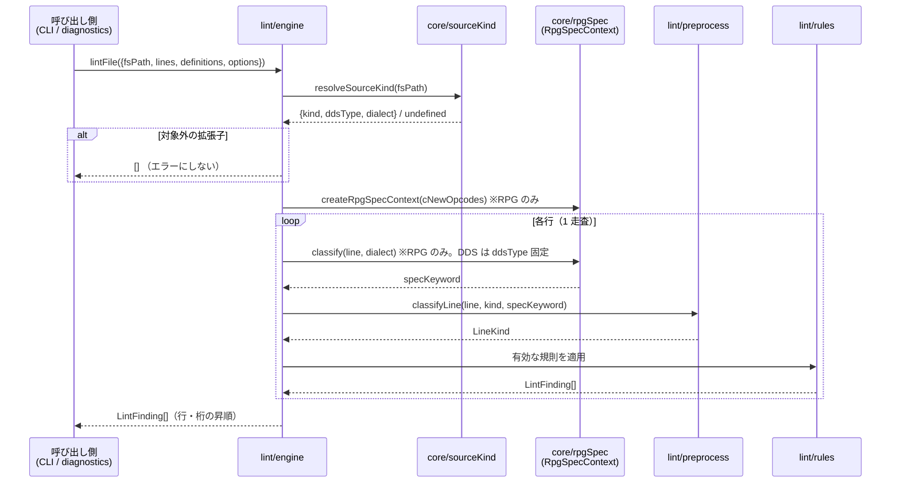

# 設計: lint core（桁位置検査）

`spec.md` を実装するための構造を確定する。焦点は
**「vscode 非依存の境界をどこに引くか」**と**「既存資産を写さずに共有する形」**。

## アーキテクチャ概要

3 層に分ける。**依存は上から下への一方向**で、下の層は上を知らない。



## コンポーネント / モジュール

### `src/core/` — 共有される純粋な判定

| モジュール | 責務 | 由来 |
|---|---|---|
| `rpgSpec.ts` | RPG 仕様書種別の判定。既定 C-NEW オペコード集合を持つ | `prompter/specClassifier.ts` の純粋部を移設 |
| `dialect.ts` | `DEFAULT_DIALECT_BY_EXTENSION` / `normalizeOverrides` / `resolveDialectFromPath` | `prompter/dialect.ts:15-211` を移設 |
| `sourceKind.ts` | 拡張子 → `{kind, ddsType, dialect}` の解決 | `positionResolver.ts:104-122` の正規表現と `ddsKeywordCompletion.ts:91-97` を統合 |
| `definitionLayout.ts` | 定義 JSON の置き場所（`definitionSubPath` / `definitionFileName`） | `jsonDefinitions.ts:26-28,158-168` を移設 |

### `src/lint/` — 検査

| モジュール | 責務 |
|---|---|
| `types.ts` | `RuleId` / `Severity` / `LintFinding` / `LintOptions` |
| `defsLoader.ts` | `node:fs` で定義 JSON を読む。`definitionLayout` に従う |
| `preprocess.ts` | 行の分類（`comment` / `continuation` / `checked` / `skipped`） |
| `rules/lineLength.ts` | `line-length` |
| `rules/numericField.ts` | `numeric-field` / `numeric-alignment` |
| `rules/index.ts` | RuleId → 実装 と既定 ON/OFF・既定 severity の表 |
| `engine.ts` | `lintFile()`。1 走査で分類→種別判定→規則適用 |
| `sarif.ts` | `LintFinding[]` → SARIF 2.1.0 |

### `src/cli/lint.ts`

引数解析・ファイル読み込み・`lintFile` の呼び出し・出力・終了コード。

## 設計判断

### D1. `fileScope.ts`（`TARGET_EXTENSIONS`）は**移設しない**

**採用: 移設せず、別概念として `core/sourceKind.ts` を新設する。**

移設を退けた決定的な理由は 2 つ。

1. **`docs/origin/verify-contributes.mjs:23-28` が `src/utils/fileScope.ts` を
   正規表現でソース解析している**。
   ```js
   const source = readFileSync(join(EXT, "src/utils/fileScope.ts"), "utf8");
   const block = /TARGET_EXTENSIONS\s*=\s*\[([\s\S]*?)\]/u.exec(source);
   ```
   再エクスポートに変えると配列リテラルが消え、`✗ fileScope.ts の TARGET_EXTENSIONS が
   読めない` で **CI が落ちる**。issue #41 の再発防止装置なので、これを弱めたくない。
2. **概念が違う**。`TARGET_EXTENSIONS` は「表示系・入力補助を有効にする範囲」で、
   `.clp` `.cmd` を含む。lint が要るのは「桁として解釈できる種別」で、CL / `.cmd` は
   含まない。同じ配列を両方の意味で使うと、片方の都合で他方が壊れる。

**ドリフト対策**: `sourceKind.ts` が挙げる拡張子が `TARGET_EXTENSIONS` の部分集合で
あることを `verify-lint-core.mjs` で検査する。列挙が 2 つに増えることを許すが、
**関係を機械で固定する**（AGENTS.md「やむを得ず重複させるときはその場で検査を足す」）。

### D2. `resolveDdsType` は `core/sourceKind.ts` に統合する

`positionResolver.ts:110` の `/\.(pf|lf|dspf|prtf|mnudds|dds)$/` と
`ddsKeywordCompletion.ts:91-97` の `resolveDdsType` は**同じ知識の 2 表現**で、
すでに食い違っている（`.dds` は前者で `dds` 言語になるが後者は `undefined` を返し、
結果として `keyword=""` で解決に失敗する）。lint が 3 つ目の写しを作れば悪化するだけ。

`core/sourceKind.ts` に一本化し、`ddsKeywordCompletion.ts` は re-export、
`positionResolver.ts` はこれを呼ぶ。**挙動は現状維持**（`.dds` は種別が決まらないまま）で、
統合そのものが目的。

### D3. 殻は「シグネチャを変えずに設定を注入する」形にする

既存 3 利用元（`ruler.ts` / `positionResolver.ts` / `rpgCompletion.ts`）と
既存テスト（`dialect.test.ts` / `editingBehaviors.test.ts`）の
**import パスも呼び出し形も変えない**。

```ts
// src/core/rpgSpec.ts（純粋）
export const DEFAULT_C_NEW_OPCODES: ReadonlySet<string> = new Set([...]);
export interface RpgSpecContext { /* D5 参照 */ }
export function createRpgSpecContext(cNewOpcodes?: ReadonlySet<string>): RpgSpecContext;
export function classifyRpgSpecKeyword(
  text: string,
  options?: {
    dialect?: Dialect;
    precedingLines?: readonly string[];
    cNewOpcodes?: ReadonlySet<string>;
  }
): string | undefined;

// src/prompter/specClassifier.ts（殻・既存シグネチャを維持）
export function classifyRpgSpecKeyword(
  text: string, dialect?: Dialect, precedingLines?: readonly string[]
): string | undefined {
  return core.classifyRpgSpecKeyword(text, {
    dialect, precedingLines, cNewOpcodes: getCNewOpcodes()
  });
}
export function getCNewOpcodes(): Set<string> { /* 既存のまま。vscode 設定を読む */ }
```

`getCNewOpcodes` は `specClassifier.ts` 内でしか使われていない（確認済み）が、
export されているので**そのまま残す**。

`dialect.ts` / `ddsKeywordCompletion.ts` は単純な re-export で足りる。

```ts
// src/prompter/dialect.ts
export { DEFAULT_DIALECT_BY_EXTENSION, resolveDialectFromPath } from "../core/dialect";
export function resolveDialect(document: vscode.TextDocument): Dialect { /* 既存 */ }
```

### D4. 定義ローダーは「置き場所の知識」だけ共有し、I/O は共有しない

`jsonDefinitions.ts` は `vscode.workspace.fs`、lint は `node:fs` で、**I/O は共有できない**。
共有すべきなのは**どこに何があるか**の知識だけ。

```ts
// src/core/definitionLayout.ts
export function definitionFileName(keyword: string): string;
export function definitionSubPath(
  language: LanguageId, dialect: Dialect | undefined, uiLanguage: "ja" | "en"
): string[];
```

現在の `resolveSubPath`（`jsonDefinitions.ts:158-168`）は内部で
`resolveDefinitionLanguage()`（vscode 設定）を呼んでいる。**表示言語を引数に外出し**して
純粋にする。`jsonDefinitions.ts` は `resolveDefinitionLanguage()` を渡し、
lint は **`"ja"` 固定**を渡す。

lint が `ja` 固定でよい理由: 構造（桁・属性）は言語間で同一であることが
`verify-rpg-spec-definitions.mjs` で担保されており、lint は表示文字を使わない。
RPG III は英語版が存在しないため、`ja` 固定は fallback も不要にする。

**lint は利用者の上書き（`.rpg-cl/`）を読まない**。CI の結果が作業ディレクトリの
内容で変わるのは望ましくないため。同梱定義のみを対象とする。

### D5. I/O 仕様書の文脈は「蓄積するコンテキスト」にして O(n) にする

現在の `classifyIoSpec` は `precedingLines` を毎回走査する。
`resolveFileDescription`（`specClassifier.ts:322-338`）は先頭から全走査し、
`findRecordNameAbove`（`:299-313`）は末尾から遡る。
`positionResolver.ts:61-77` はこれを**1 行解決するたびに 0 行目から作り直す**ため、
ファイル全体を検査すると O(n²) になる。

**同じ判定ロジックのまま O(n) にする**ため、蓄積型のコンテキストを導入する。

```ts
export interface RpgSpecContext {
  /** 1 行を読ませ、種別を返す。内部の索引を更新する。 */
  classify(text: string, dialect?: Dialect): string | undefined;
}
```

内部状態は 2 つだけで、既存の意味と一致させる。

| 状態 | 意味 | 既存ロジックとの対応 |
|---|---|---|
| `fileDescription: Map<string, "PGM" \| "EXT">` | F 仕様書の 7-16 桁名 → 22 桁目が `E` か | `resolveFileDescription` は**先頭から最初に一致したもの**を返すので、**既出の名前は上書きしない** |
| `lastRecordName: { I?: string; O?: string }` | 直近のレコード識別行の名前 | `findRecordNameAbove` は**末尾から最初に見つかったもの**を返すので、**毎回上書きする** |

既存の `classifyRpgSpecKeyword(text, {precedingLines})` は、
**その場でコンテキストを作って `precedingLines` を流し込んでから 1 行分類する**
薄いラッパーにする。実装は 1 つだけなので、プロンプターと lint で食い違いようがない
（AGENTS.md「写しを手書きしない」）。

### D6. 純粋性の担保は grep ではなく **tsc の型解決**で行う

`tsconfig.json` は `types: ["node","mocha","vscode"]` を指定している。
`@types/vscode` はアンビエント宣言なので、`types` から外せば `"vscode"` は
**解決できないモジュール**になる。

```jsonc
// tsconfig.core.json
{
  "extends": "./tsconfig.json",
  "compilerOptions": { "types": ["node"], "noEmit": true },
  "include": ["src/core", "src/lint", "src/cli"]
}
```

`tsc -p tsconfig.core.json` が通ることが純粋性の証明になる。
**tsc は import 先を推移的に型検査する**ので、`src/lint/x.ts` が
`src/prompter/y.ts` 経由で vscode に触れる**間接的な漏れも検出できる**。
正規表現によるソース走査（コメントや文字列に弱い）より強く、
`verify-contributes.mjs` の教訓（ソース解析の脆さ）も繰り返さない。

`verify-lint-core.mjs` の役割は D1 の**拡張子の部分集合検査だけ**に絞る。

### D7. 前処理と規則の責務境界

**前処理は「その行を定位置として読んでよいか」だけを決め、規則は分類を再導出しない。**



`continuation` で `line-length` だけを回すのは、継続行にも桁数の上限は効くため。
定位置の欄は存在しないので `numeric-*` は回さない。

規則の署名は分類を受け取らない —— 受け取ると規則側で再判定する誘惑が生まれる。

```ts
export interface RuleContext {
  readonly line: string;
  readonly lineNumber: number;          // 1 始まり
  readonly definition?: PrompterDefinition;
  readonly specKeyword?: string;
}
export type Rule = (ctx: RuleContext) => readonly LintFinding[];
```

## 処理フロー / シーケンス



DDS は種別がファイル単位で決まるため、行ごとの種別判定は不要。
RPG のみ `RpgSpecContext` を通す。

## インターフェース / データモデル

`spec.md`「インターフェース / データ構造」に定義したものを踏襲する。design で追加・変更する点のみ:

- `lintFile` の `LintRequest.definitions` は `DefinitionSet`（`spec.md`）のまま。
  CLI は起動時に 1 度 `loadDefinitions()` し、VS Code 側はモジュールロード時に 1 度読む。
- `RpgSpecContext` を `core/rpgSpec.ts` に追加（D5）。
- `core/sourceKind.ts`:
  ```ts
  export type SourceKind = "rpg" | "dds" | "cl" | "cmd";
  export interface SourceKindInfo {
    readonly kind: SourceKind;
    readonly ddsType?: "DDS-PF" | "DDS-DSPF" | "DDS-PRTF";
    readonly dialect?: Dialect;   // kind==="rpg" のとき
  }
  export function resolveSourceKind(
    fsPath: string, dialectOverrides?: Readonly<Record<string, Dialect>>
  ): SourceKindInfo | undefined;
  export const LINTABLE_EXTENSIONS: readonly string[];  // D1 の部分集合検査用
  ```

## plan への申し送り

### 分割単位と順序

**依存の下から積む**。各段でテストが書ける。

1. **`src/core/` の切り出し（振る舞い変更なし）** — `rpgSpec` / `dialect` /
   `sourceKind` / `definitionLayout` を作り、既存 4 ファイルを殻にする。
   `tsconfig.core.json` もここで入れる。
   **受け入れ**: 既存テストが全て通る（`npm test`）／`npm run verify` が通る／
   `tsc -p tsconfig.core.json` が通る。**この段では新機能ゼロ**。
2. **`RpgSpecContext` の導入（D5）** — 蓄積型に置き換え、既存 API をラッパーにする。
   **受け入れ**: `verify-rpg-roundtrip.mjs` の 11 サンプルと既存テストが不変。
3. **lint core 本体** — `types` / `defsLoader` / `preprocess` / `rules` / `engine`。
   **受け入れ**: 規則ごとの単体テスト＋`docs/src/` の検証済み 6 ファイルで指摘ゼロ。
4. **SARIF と CLI** — `sarif.ts` / `cli/lint.ts` / npm script。
   **受け入れ**: SARIF 必須プロパティの検査／終了コード 0・1・2。
5. **VS Code 接続** — `diagnostics.ts` の分岐と設定。
   **受け入れ**: 設定 OFF で診断が消える。
6. **CI** — 純粋性検査・拡張子の部分集合検査・lint 実行をワークフローに追加。

**1 と 2 は振る舞いを変えない再構成**なので、3 以降と PR を分けたくなる粒度だが、
lint core が無い状態で `src/core/` だけ入れても誰も使わない。**1 PR に保ち、
コミットを 1〜6 で分ける**（subtask 分割はしない。高結合だが規模が中）。

### 注意点

- **既存 4 ファイルの import パスと公開シグネチャを変えない**。変えると
  `ruler.ts` / `positionResolver.ts` / `rpgCompletion.ts` と既存テスト 2 本に波及する。
- **`fileScope.ts` は触らない**（D1）。触ると `verify-contributes.mjs` が落ちる。
- **`.dds` の扱いを「勝手に直さない」**。現状 `resolveDdsType` が `undefined` を返すのは
  既存の挙動で、lint も検査しない（`spec.md` の拡張子表）。統合のついでに変えない。
- **`docs/src/` の未検証 3 ファイル（`SLSENT01` / `EMPMNT01` / `RPG3SAMP`）を
  受け入れ基準に入れない**。`research.md` F8 のとおり桁ずれの疑いがあり、
  指摘が出るのが正しい可能性がある。
