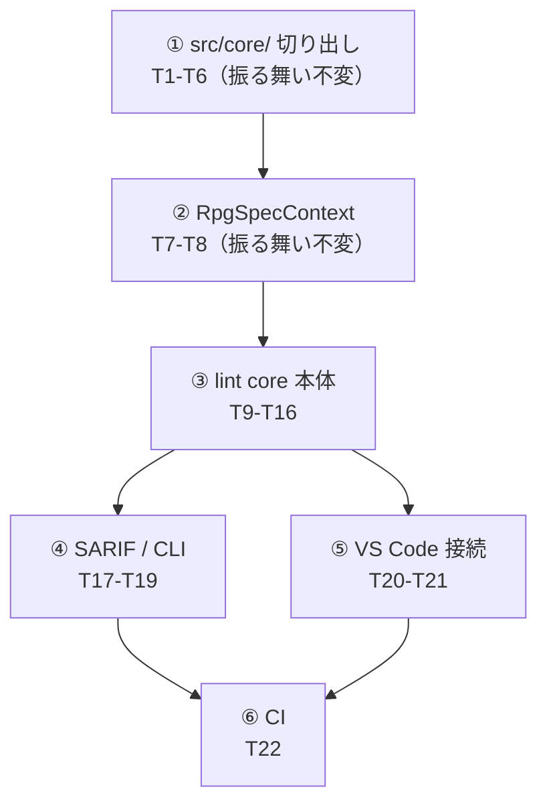

# 計画: lint core（桁位置検査）

## 実装方針

`design.md` の依存関係に従い**下から積む**。各段の終わりで検証でき、
前半（T1-T8）は**振る舞いを変えない再構成**、後半（T9-T22）が新機能。

前半を先に完全に終わらせるのが要点。`src/core/` が無いと lint core は
vscode を引きずり、`RpgSpecContext` が無いと入力時検査が O(n²) になる。
どちらも後から差し込むと lint core 側を書き直すことになる。

### subtask 分割はしない（split 判定）

`aidev-docs/DESIGN.md`「5.」の決定木で判定した。

- **T1-T8 は振る舞い不変の再構成**で、決定木では「別 work/PR の候補（低結合）」に当たる。
  しかし**単独では利用者に何も提供しない**（`src/core/` だけ入れても誰も使わない）。
  別 PR にすると「使われない抽象を先に入れる」レビューになり、
  境界の妥当性を判断する材料が PR に無い。
- **T9-T22 は T1-T8 に強く依存**し、共同でしか検証できない（高結合）。
- 規模は中（新規 13 ファイル・変更 6 ファイル）で、漸進レビューを要するほど大きくない。

→ **不可分として扱い、単一 `tasks.md` ＋ コミット構成で読みやすさを確保する。**
コミットは 6 段（core 切り出し / Context / lint 本体 / SARIF・CLI / VS Code / CI）に分ける。

## 作業順序と依存関係

1. **`src/core/` 切り出し**（依存: なし）— `dialect` → `rpgSpec` → `sourceKind` →
   `definitionLayout` の順。依存の浅いものから。最後に `tsconfig.core.json` と
   拡張子の部分集合検査を入れて、境界を機械で固定する。
2. **`RpgSpecContext`**（依存: 1）— `core/rpgSpec.ts` が存在してから。
3. **lint core 本体**（依存: 2）— `types` → `defsLoader` → `preprocess` → `rules` →
   `engine` → コーパス回帰。
4. **SARIF / CLI**（依存: 3）
5. **VS Code 接続**（依存: 3）— 4 とは独立。並行可。
6. **CI**（依存: 4, 5）

## リスク / 留意点

| リスク | 対応 |
|---|---|
| **殻化で既存の挙動が変わる** | T1-T4 は各タスクごとに `npm test` と `npm run verify` を通す。公開シグネチャと import パスを変えない。差分は「移動」と「再エクスポート」に限る |
| **`fileScope.ts` を触ってしまう** | 触らない。`verify-contributes.mjs:23-28` がソース解析しており CI が落ちる（design D1） |
| **`.dds` の扱いを統合のついでに直してしまう** | `resolveDdsType` が `undefined` を返す現状を維持。lint も検査しない。直すなら別 work |
| **`RpgSpecContext` の同値性が崩れる** | 「既出は上書きしない／毎回上書きする」の非対称（design D5）を T8 のテストで固定する |
| **コーパスが小さく偽陽性ゼロの根拠が弱い** | 受け入れ基準は検証済み 6 ファイル。未検証 3 ファイルは**基準に入れない**（`research.md` F8） |
| **`numeric-alignment` の根拠が他規則より弱い** | severity=warning とし、既定の `--fail-on error` では CI を落とさない |
| **tsc の純粋性検査が通らない形で core が既存を参照する** | T5 を早い段階（T1-T4 直後）に入れ、以降のタスクで常に検査が効く状態にする |

## テスト方針

- **既存の退行防止**: `npm test` / `npm run verify`（`verify:defs` と `verify:roundtrip`）を
  T1 以降の各タスクで通す。特に `verify-rpg-roundtrip.mjs`（11 サンプル）と
  `verify-prompter-roundtrip.mjs`（全定義）が T7 の同値性を守る。
- **純粋性**: `tsc -p tsconfig.core.json` が通ること（design D6）。
  import 先を推移的に型検査するため、間接的な vscode 漏れも落ちる。
- **規則ごとの単体テスト**: 正例（指摘なし）と負例（指摘あり）を桁単位で。
- **偽陽性ゼロの回帰**: `docs/src/` の**実機コンパイル確認済み 6 ファイル**
  （`CUSTMST.pf` / `CUSTLF1.lf` / `CUSTMNT.dspf` / `CUSTRPT.prtf` / `DBCSSAMP.pf` /
  `IOSAMP.rpgle`）で指摘ゼロ。これが本作業の中心的な受け入れ基準。
- **SARIF の妥当性**: 必須プロパティの存在と型を検査する（外部バリデータは依存を増やすため使わない）。
- **CLI**: 終了コード 0（指摘なし）/ 1（error あり）/ 2（使用法エラー）。
- **手動確認**: VS Code で対象拡張子を開き、編集中に診断が更新されること・
  設定 OFF で消えることを見る（`docs/src/CHECKLIST.md` の流儀に合わせる）。
