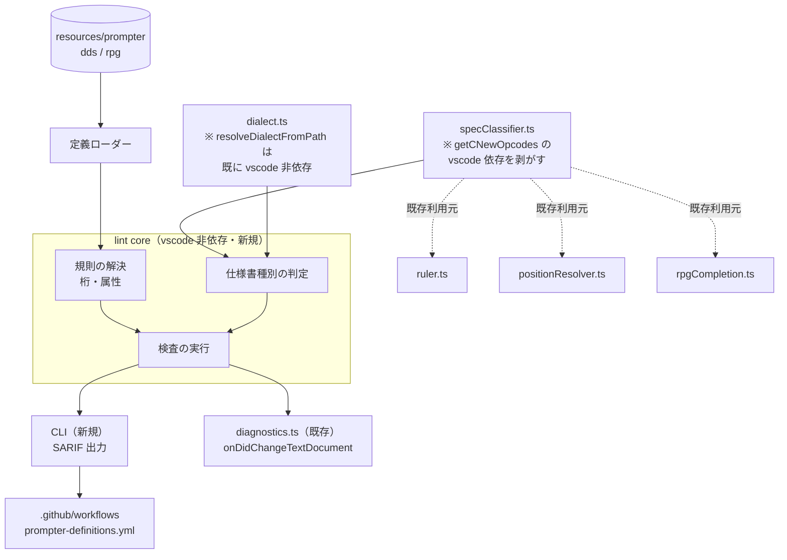

# 調査: lint core（桁位置検査）の前提確認

requirement.md の「未確定事項」を、原典の生テキストと既存コードの直読、および
**実機コンパイル確認済みコーパスへの実測**で解消した。

原典照合は AGENTS.md「2.6/検証の委譲禁止」に従い主エージェントが実施した
（`docs/origin/dds/*.html` / `docs/origin/ilerpg/*.html` の生テキストを直読）。
コード構造の調査のみサブエージェントに委譲した。

## 調査の問い

- **Q1**: 「必須欄の未入力」検査は成立するか（`required` は 346 欄中 22 欄のみ、DDS は 0 欄）
- **Q2**: `options` は制限か候補か。AGENTS.md の「列挙した値＝制限とは限らない」は DDS/RPG にも及ぶか
- **Q3**: `specClassifier.ts` / `dialect.ts` の vscode 依存を剥がす影響範囲
- **Q4**: 注記行・継続行の検査除外条件
- **Q5**: I/O 仕様書の変種判定がファイル全体を要する件の API への影響
- **Q6**: 偽陽性ゼロを検証する材料はあるか

## 最重要の事実: 実測で偽陽性が出た

**実機コンパイル確認済みのソースに 4 規則をそのまま当てて実測した**
（`docs/src/` の 1060 行）。既知の正しいソースなので、**出る指摘はすべて偽陽性**である。

`docs/src/CHECKLIST.md:3-4` は「すべて実機（pub400 / IBM i 7.5）でコンパイルが通ることを
確認済み」と書くが、**同ファイルの表の「作成物」欄は 6 件しか埋まっていない**
（`CUSTMST.pf` / `CUSTLF1.lf` / `CUSTMNT.dspf` / `CUSTRPT.prtf` / `DBCSSAMP.pf` / `IOSAMP.rpgle`）。
`SLSENT01.rpgle` / `EMPMNT01.rpgle` / `RPG3SAMP.rpg` は `—`＝**オブジェクトを作っていない**。
そこで検証済み／未検証で分けて測った。

| | 4 規則そのまま | 緩和後※ |
|---|---|---|
| **検証済み 6 ファイル**（＝出れば偽陽性） | **30 件** | **4 件** |
| 未検証 3 ファイル | 159 件 | 51 件 |
| 合計 | 189 件 | 55 件 |

※緩和 = (a) 空欄は `options` 検査の対象外にする (b) `required` 検査をしない

- **`IOSAMP.rpgle`（唯一のコンパイル確認済み RPG）は緩和前から 0 件**。
  桁定義そのものは正しい。
- **`len > 80` は全 1060 行で 0 件**。桁あふれ規則は今のコーパスでは一度も発火しない。

### 緩和後にも残る 4 件（すべて `options`・すべて DBCS 系）

```
CUSTMST.pf:5   C35(35) = "O"   A            CUSTKN        30O   COLHDG('カナ名')
DBCSSAMP.pf:5  C35(35) = "O"   A            JNAME         20O   COLHDG('漢字専用')
DBCSSAMP.pf:6  C35(35) = "E"   A            MNAME         40E   COLHDG('混在')
CUSTMNT.dspf:13 C38(38) = "O"  A            MSGTXT        50A  O 23  2COLOR(RED)
```

これは**原典を読んだ時点で予測できた欠落が、実測で確認された**もの。

## 判明した事実

### F1（Q2）: `options` は制限的だが、**生成された値集合が原典の注記を取りこぼしている**

原典は明確に制限を書く（`docs/origin/dds/FIELD-PF-ldata.html`）:

> 有効なデータ・タイプ項目は、次のとおりです。 P / S / B / F / A / H / L / T / Z / 5

ところが**同じページの「注」に続きがある**:

> 注: データ・タイプ **J (専用)、E (択一)、O (混用) および G (図形)** は、DBCS を使用する
> DDS データベース・ファイルをサポートします。

`generate-dds-prompter.mjs` の `parseDetail`（`:96-143`）は定義リストと表しか読まないため、
**注記の中の値が落ちる**。同じ欠落が印刷装置にもある（`FIELD-PRTF-prtdata.html` の注に
`O (混用)` `G (グラフィック)`）。

さらに**表示装置の 38 桁目は先頭項目が「ブランクまたは 0」**（`FIELD-DSPF-pos38.html`）で、
1 文字の値を拾う正規表現に合わないため**ブランクも `0` も両方落ちている**。

生成物の実際の値:

| 定義 | 欄 | 生成された値 | 落ちている値 |
|---|---|---|---|
| DDS-PF | C35 データ・タイプ | `P S B F A H L T Z 5` | **J E O G**（原典の注） |
| DDS-PRTF | C35 データ・タイプ | `S A F L T Z` | **O G**（原典の注） |
| DDS-DSPF | C38 使用目的 | `I B H M P` | **ブランク / 0**（原典の先頭項目） |
| DDS-PF | C17 名前タイプ | `(空) R K J S O` | なし（PF と LF の和集合。完全） |
| DDS-PF | C38 使用目的 | `(空) B I N` | なし（完全） |
| DDS-DSPF | C17 名前タイプ | `(空) R H` | なし（完全） |

**加えて、原典自体が実機より狭い箇所がある。** `CUSTMNT.dspf:13` の 38 桁目 `O` は
原典の一覧（ブランク/0・I・B・H・M・P）に無いが、`CRTDSPF` が通っている。
AGENTS.md の既知パターン「**原典が値を取りこぼしていることがある。実機の集合が正**」
（CL では `Rstd=YES` の 840 欄中 59 欄で原典が不足）が DDS にも当てはまる。

**結論**: `options` は制限として使える性質のものだが、**現在の値集合をそのまま検査に使うと
確実に偽陽性を出す**。使うには (1) 生成器に注記の解析を足し (2) 実機の `*CMD` 相当
（DDS はコンパイル可否）で値集合を裏取りする、の 2 段が要る。

### F2（Q1）: `required` は**プロンプターの入力必須フラグであって行の不変条件ではない**

DDS 側は `generate-dds-prompter.mjs:184` で **`required: false` がハードコード**されており、
原典由来の情報が最初から入っていない。DDS で「必須欄の未入力」検査は**材料が存在しない**。

RPG 側（手書き・22 欄）は値が入っているが、**行単位の不変条件としては成立しない**。
実測で 64 件の偽陽性が出た。原因は 2 つとも原典に明記がある。

1. **継続記入行**（`docs/origin/ilerpg/F-SPEC-keywords.html`）:
   > ファイル記述キーワードに追加のスペースが必要な場合には、キーワード・フィールドを
   > 後続の行に継続させることができます。

   実例 `EMPMNT01.rpgle:14` `     F                                     RENAME(EMPMSTR:EMPREC)`
   は 7-16 桁が空の正しい継続行だが、`FILENAME`/`FILETYPE` が required なので指摘される。
   D 仕様書には**継続名前行**もある（`D-SPEC-layout.html`）。

2. **オペランドを取らない命令**: `C-NEW.json` は `COND`(36-80) を required にしているが、
   `ENDIF` / `SELECT` / `OTHER` / `ENDSL` は拡張演算項目 2 を取らない。
   **これ単独で 48 件**。定義側の誤りでもある。

**結論**: 「必須欄の未入力」は初版では**実装しない**のが妥当。実装するなら
「継続行・オペランド無し命令を除外したうえで、行ではなく仕様書の意味単位で判定」が要る。

### F3: `characterSet: "upper"` は原典由来ではない（検査に使えない）

`generate-dds-prompter.mjs:186` で**全欄に一律ハードコード**されている。
とくに `C45`（45-80 桁のキーワード欄）にも付いており、これを検査すると
`TEXT('小文字abc')` や `COLHDG('カナ名')` を含む正常な行をすべて弾く。
**プロンプターの入力補助（大文字化）用のヒントであって制約ではない。**

一方 `numericOnly` は原典由来で信頼できる。生成器は詳細ページの「右寄せ」記述
（`detail.rightAligned`）からのみ立てており、AGENTS.md も
「長さの欄(30-34)は右寄せが必須。原典に明記があり、実機でも左詰めは `CPF7311`」と記録している。
**実測でも検証済みファイルでの偽陽性は 0 件**だった。

### F4（行長）: 81-100 桁は**注記域として原典が規定している**

ILE RPG の全仕様書ページが同じ文を持つ（`F-SPEC-layout.html` / `D-SPEC-layout.html` /
`C-SPEC-layout.html`）:

> 仕様書の注記以外の部分は 7 から 80 桁目です。…**仕様書の注記部分は 81 から 100 桁目です。**

DDS も同じで、SEU 書式行のデータ（`docs/origin/dds-seu-format-lines.json`）は
全テンプレートに `commentRuler: " ...+... 9 ...+... 0"`（81-100 桁の目盛り）を持つ。

**「80 桁超過」をエラーにしてはいけない。** 上限は 100 桁で、81-100 は検査対象外にする。

### F5（Q4）: 注記行の判定条件は原典に明記がある（DDS）

`docs/origin/dds/FIELD-PF-lfcmmt.html`:

> 7 桁目にアスタリスク (*) を入力すると、その行は注記として扱われ、8 から 80 桁目が
> 注記本文として使用されます。**ブランク行 (7 から 80 桁目に文字がまったく指定されていない行)
> も、注記として扱われます。**

既存コードも同じ述語を 3 箇所で持つ（`positionResolver.ts:44-47` / `ruler.ts:556-559` /
`ddsKeywordCompletion.ts:136-138`）— いずれも `text.length > 6 && text.charAt(6) === "*"`。
ただし**ブランク行（7-80 桁が空）の条件は実装されていない**。

RPG も 7 桁目 `*` が注記だが、**`docs/origin/ilerpg/` に該当ページが収集されていない**
（原典で裏取りできていない）。実装上の根拠は `rpgCommentToggle.ts:29-36` の
`base.charAt(6) === "*"`。

**既存実装に非対称がある（本作業の対象外だが lint で繰り返さないこと）**:
`ruler.ts:573-575` は RPG の注記行を除外するが、**`positionResolver.ts` には同じガードが無い**。
そのため `     H* コメント` に F4 を当てると `H-SPEC` として解決される。
`EMPMNT01.rpgle` だけで該当行が 191 行ある。

継続行の既存実装:
- **CL の `+`/`-` は完備**（`clCommandParser.ts:34-65` / `clContinuation.ts:162-192`）
- **DDS のキーワードのみ行は補完のレベル解決だけ**（`ddsKeywordCompletion.ts:60-85` が
  上方向に遡る）。プロンプター側には行ごとの継続認識が無い
- **RPG の F/D 継続行（7-16 桁が空）は未対応**。`specClassifier.ts` の `nameField()` は
  I/O 仕様のレコード/フィールド判別にしか使われていない

### F6（Q5）: `precedingLines` があるので API は既に足りている

`classifyRpgSpecKeyword(text, dialect, precedingLines)` は**先行行を受け取る設計**で、
I/O 仕様の変種（`I-SPEC-REC-EXT` など）を F 仕様書 22 桁目まで遡って決めている
（`specClassifier.ts:287-330`）。**行単位 API では足りないという懸念は解消**。
lint は「ファイル全体を受け取り、行ごとに先行行を渡す」形にすればよい。

ただし `positionResolver.ts:61-77` は毎回 0 行目から `document.lineAt()` で先行行を作り直す
（1 行解決あたり O(n)）。**入力時に全行を検査すると O(n²) になる**ため、lint 側は
ファイルを 1 度走査する形にする。

### F7（Q3）: vscode 依存は 2 箇所だけで、どちらも設定読み

| ファイル | vscode 依存 | 剥がし方 |
|---|---|---|
| `specClassifier.ts:367` | `getCNewOpcodes()` 内の `vscode.workspace.getConfiguration("rpgClSupport")` | オペコード集合を引数で受ける。既定集合は純粋 |
| `dialect.ts:216-220` | `resolveDialect(document)` のみ | **`resolveDialectFromPath(fsPath, overrides)`（`:192-211`）が既に vscode 非依存**。そちらを使う |

`positionResolver.ts` 自体は `document.languageId` / `uri.fsPath` / `lineAt().text` しか
触っておらず、型以外の依存は上記 2 つを経由するだけ。**分離は現実的**。

`jsonDefinitions.ts` は `vscode.workspace.fs` で定義 JSON を読むため、**CLI 側は別の
ローダーが要る**（`node:fs` 直読み）。定義の解釈ロジックとローダーを分ける必要がある。

### F8（Q6）: 偽陽性の検証材料は `docs/src/` にある（ただし一部は未検証）

- **`verify-prompter-roundtrip.mjs` は偽陽性コーパスにならない**。定義 JSON から値を
  合成し、**定義ごとに 1 行だけ**の完全記入行を作る（`:117-171`）。注記行も継続行も
  複数行レコードも含まないため、lint を流す意味がない。
- **`docs/src/` の 12 ファイル 1488 行が唯一の実ソース**。うち**コンパイル確認済みは 6 件**
  （前掲）。これを回帰の基準にする。
- **未検証 3 ファイルには実際の桁ずれがあるとみられる**。`EMPMNT01.rpgle:27`
  `     D  SDATE                  8S 0` は長さ `8` が **32 桁目**で終わっており、
  ILE D 仕様の「33-39 桁＝長さ（右寄せ）/ 40 桁＝データ・タイプ / 41-42 桁＝小数部」に
  合っていない。コンパイル確認済みの `IOSAMP.rpgle:4`
  `     D TOTAL           S             11P 2 INZ(0)` は `11` が 39 桁目で終わり、
  `P` が 40 桁目にあり**規定どおり**。`SLSENT01.rpgle` も同様（緩和後 29 件）。
  → **lint はこれを見つけたことになる（真陽性の疑い）**。ただし確定には実機コンパイルが要る。
- `RPG3SAMP.rpg:2` は `FCUSTMAS  IF  E` で `I` が **16 桁目**だが、定義は
  `FILETYPE 15/1`。原典（RPG/400 Reference）が入手できないため
  **定義とサンプルのどちらが誤りか未確定**。AGENTS.md「原典と実機が食い違ったら
  実機のパーサーに判定させる」の対象。

### F9: テスト経路はそのまま使える

`test/support/vscode-stub.js` の `workspace.getConfiguration` は `{ get: () => undefined }`
を返す（＝常に既定値）。vscode 非依存モジュールなら**スタブすら不要**で素の mocha で回る。
CI（`.github/workflows/prompter-definitions.yml`）は既に `npm test` と原典照合を回しており、
lint コマンドはこのワークフローに足せる。

## 影響範囲



- **変更**: `specClassifier.ts`（オペコード集合を注入可能にする）。既存利用元 3 箇所は
  薄いラッパーで挙動を保つ。
- **接続**: `diagnostics.ts`（現状 CL のみ。RPG/DDS 分岐を足す）。
- **新規**: lint core / 定義ローダー（`node:fs`）/ CLI。
- **触らない**: `ruler.ts` / `positionResolver.ts` / `rpgCompletion.ts` の挙動、CL 診断。

## 実現性 / リスク

- **実現可能**。桁定義・属性・仕様書種別判定はすべて既存資産にあり、vscode 依存は 2 箇所の
  設定読みだけ。ランタイム依存ゼロも維持できる（SARIF は素の JSON 出力で足りる）。
- **最大のリスクは規則の選び方**であり、実装方式ではない。実測が示すとおり、
  4 規則をそのまま当てると**検証済みソースに 30 件の偽陽性**が出る。
- **`docs/src/` は小さい**（検証済み 6 ファイル）。偽陽性ゼロをこれだけで主張するのは弱い。
  コーパスの拡充（実機でコンパイルを通したサンプルの追加）が望ましい。
- **`options` 修復には実機が要る**。`CUSTMNT.dspf` の 38 桁 `O` のように、原典にも無いが
  実機は受ける値がある。原典の注記を拾うだけでは足りない。

## spec への申し送り

### 初版に入れる規則（実測で偽陽性 0）

1. **桁あふれ**: 100 桁超過のみをエラーにする。**80 桁超過は検査しない**（81-100 は注記域、F4）。
2. **`numericOnly` / 右寄せ**: 原典由来（「右寄せ」記述）で実機の裏付けもある（`CPF7311`）。
   検証済みコーパスで偽陽性 0（F3）。

### 初版で見送る規則（材料不足・偽陽性確実）

3. **必須欄の未入力**: DDS は材料が存在せず（`required: false` ハードコード）、RPG は
   継続行とオペランド無し命令で 64 件の偽陽性（F2）。**見送る**。
4. **定義済み値以外**: 値集合が原典の注記を取りこぼし、原典自体も実機より狭い（F1）。
   **修復を別タスクに切り出し、修復後に有効化する**。
   修復の中身: (a) `generate-dds-prompter.mjs` に注記の解析を足す
   (b) 実機コンパイルで値集合を裏取り (c) `verify-dds-prompter.mjs` に検査を足す。

要件の受け入れ基準「上記 4 種の検査が動く」は**この調査結果と両立しない**。
偽陽性ゼロ優先という制約の方を優先し、**初版は 2 規則**とすることを spec で提案する。
3・4 は規則 ID 単位の無効化（要件にある）を使って**既定オフで枠だけ用意する**のが妥当。

### 設計上の申し送り

- **注記行・継続行の除外は規則ではなく前処理**にする。除外条件:
  DDS = 7 桁目 `*` または 7-80 桁が全空白（原典、F5）／
  RPG = 7 桁目 `*` または行が空／
  RPG の F・D 仕様は 7-16 桁が空なら継続行として定位置検査から外す（原典、F2）。
- **`characterSet: "upper"` は検査に使わない**（原典由来ではない。F3）。
- **API はファイル単位**にする。`precedingLines` が要る（F6）ため、行単位 API にしない。
  `positionResolver` の O(n) 再走査を持ち込まない。
- **`specClassifier` は引数注入で vscode を剥がす**。既存 3 利用元の挙動を変えないこと
  （`ruler.ts` / `positionResolver.ts` / `rpgCompletion.ts`）。
- **定義ローダーを分離**する。`jsonDefinitions.ts` は `vscode.workspace.fs` に依存するため
  CLI では使えない（F7）。
- **回帰テストは `docs/src/` のコンパイル確認済み 6 ファイルに対する「指摘ゼロ」**を
  受け入れ基準にする（F8）。`verify-prompter-roundtrip.mjs` は流用しない。

### 本作業の外に出す発見（follow-up 候補）

- **`docs/src/EMPMNT01.rpgle` / `SLSENT01.rpgle` の D 仕様書に桁ずれがある疑い**（F8）。
  実機で確認し、誤りなら修正する。`CHECKLIST.md` は「すべてコンパイル確認済み」と書くが
  表の「作成物」は 6 件しか埋まっていない。記述と実態が食い違っている。
- **`RPG3SAMP.rpg` の F 仕様書と `rpg3/F-SPEC.json` の桁が 1 桁食い違う**（F8）。
  実機のコンパイラに判定させる（AGENTS.md の規約）。
- **`positionResolver.ts` に RPG 注記行のガードが無い**（F5）。F4 が注記行で `H-SPEC` を開く。
