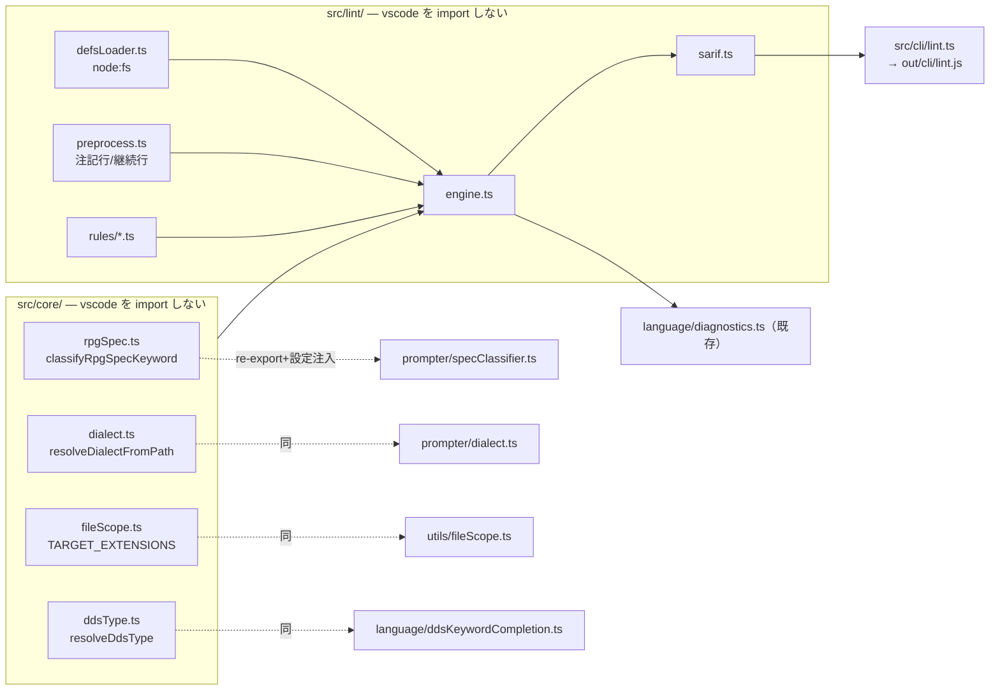

# 仕様: lint core（桁位置検査）

## 概要

固定長ソース（RPG / DDS）の桁位置の誤りを、VS Code にも実機にも依存せずに検出する
モジュール `lint core` を作り、**CLI（SARIF 出力・CI 実行）**と
**VS Code の入力時診断**の 2 経路から同じロジックを使う。

`research.md` の実測（実機コンパイル確認済み 1060 行に対し 4 規則で偽陽性 30 件）に基づき、
**初版で有効にする規則は 2 つ**に絞る。残り 2 つは規則 ID を予約し既定オフで枠だけ用意する。

## 設計方針

### 方針 1: vscode 非依存の境界を `src/core/` に置き、既存モジュールは「注入する薄い殻」にする

lint core が必要とする判定（仕様書種別・方言・DDS 種別・対象拡張子）は**すべて既存実装にある**が、
いずれも vscode に依存したファイルの中にある。ここで**写しを作ると必ずドリフトする**
（AGENTS.md「同じ概念集合を複数箇所で列挙しない」／`binding.ts` の手書き写しが実際にその状態）。

そこで**純粋な部分を `src/core/` へ移し、既存ファイルは re-export + 設定注入の殻にする**。
既存の 3 利用元（`ruler.ts` / `positionResolver.ts` / `rpgCompletion.ts`）と既存テスト
（`dialect.test.ts` は `resolveDialectFromPath` を import）は**import パスも挙動も変えない**。



**代替案「lint 側で桁定義を持ち直す」は採らない。** 原典の書き方の揺れの吸収は
`generate-dds-columns.mjs` 側に集約されており、作り直すと同じ罠を二度踏む
（AGENTS.md に明記のある既知の失敗）。

**代替案「別 npm パッケージ（モノレポ）にする」も採らない。** 利用者の要望は
「lint コマンドだけ CI に切り出せる」ことで、`out/cli/lint.js` を素の node で叩ければ満たせる。
`vscode-extension` は `dependencies: {}` を維持する。

### 方針 2: 除外は規則ではなく前処理

注記行・継続行は「規則が例外を持つ」形にすると各規則が同じ判定を重複して持つ。
**行を分類する前処理を 1 か所に置き、検査対象の行だけを規則に渡す**。

### 方針 3: 規則は「原典で裏が取れ、実測で偽陽性 0」のものだけ既定オンにする

`research.md` の実測結果をそのまま採用する。規則の有効・無効は ID 単位で切り替えられる。

## 対象範囲

### 追加

| パス | 役割 | vscode |
|---|---|---|
| `src/core/rpgSpec.ts` | 仕様書種別の判定（`specClassifier.ts` の純粋部を移設） | 依存しない |
| `src/core/dialect.ts` | 方言の解決（`DEFAULT_DIALECT_BY_EXTENSION` / `resolveDialectFromPath`） | 依存しない |
| `src/core/fileScope.ts` | `TARGET_EXTENSIONS`（単一の真実源） | 依存しない |
| `src/core/ddsType.ts` | 拡張子 → DDS 種別 | 依存しない |
| `src/lint/types.ts` | `LintFinding` / `LintOptions` / `RuleId` | 依存しない |
| `src/lint/defsLoader.ts` | プロンプター定義 JSON の読み込み（`node:fs`） | 依存しない |
| `src/lint/preprocess.ts` | 行の分類（注記／継続／検査対象） | 依存しない |
| `src/lint/rules/lineLength.ts` | 規則 `line-length` | 依存しない |
| `src/lint/rules/numericField.ts` | 規則 `numeric-field` / `numeric-alignment` | 依存しない |
| `src/lint/engine.ts` | ファイル 1 本を検査する入口 | 依存しない |
| `src/lint/sarif.ts` | SARIF 2.1.0 への変換 | 依存しない |
| `src/cli/lint.ts` | CLI 本体 | 依存しない |
| `scripts/verify-lint-core-purity.mjs` | `src/core` `src/lint` `src/cli` に vscode import が無いことを検査 | — |
| `test/unit/lintCore.test.ts` | 規則の単体テスト | — |
| `test/unit/lintCorpus.test.ts` | `docs/src/` の検証済み 6 ファイルで指摘ゼロ | — |

### 変更

| パス | 変更内容 |
|---|---|
| `src/prompter/specClassifier.ts` | 純粋部を `core/rpgSpec` へ移し re-export。`getCNewOpcodes()`（設定読み）はここに残す |
| `src/prompter/dialect.ts` | 純粋部を `core/dialect` へ移し re-export。`resolveDialect(document)` はここに残す |
| `src/utils/fileScope.ts` | `TARGET_EXTENSIONS` を `core/fileScope` から re-export |
| `src/language/ddsKeywordCompletion.ts` | `resolveDdsType` を `core/ddsType` から re-export |
| `src/language/diagnostics.ts` | RPG / DDS の分岐を足し lint core を呼ぶ |
| `package.json` | `scripts.lint` / `contributes.configuration` に `rpgClSupport.lint.*` |
| `.github/workflows/prompter-definitions.yml` | lint の実行と純粋性検査を足す |

### 触らない

`ruler.ts` / `positionResolver.ts` / `rpgCompletion.ts` の挙動、既存の CL 診断
（`parseClDocument`）、プロンプター定義 JSON そのもの。

## インターフェース / データ構造

### lint core の入口

```ts
// src/lint/types.ts
export type RuleId =
  | "line-length"        // 既定 ON  : 100 桁超過
  | "numeric-field"      // 既定 ON  : 数値欄に非数字
  | "numeric-alignment"  // 既定 ON  : 数値欄が右寄せでない（severity=warning）
  | "required-field"     // 既定 OFF : 必須欄の未入力（材料不足。research F2）
  | "restricted-value";  // 既定 OFF : 定義済み値以外（値集合が不完全。research F1）

export type Severity = "error" | "warning";

export interface LintFinding {
  readonly ruleId: RuleId;
  readonly severity: Severity;
  readonly message: string;
  readonly line: number;        // 1 始まり
  readonly startColumn: number; // 1 始まり・桁（source column）
  readonly endColumn: number;   // 1 始まり・終端を含まない
  readonly specKeyword?: string;   // 例 "D-SPEC" / "DDS-PF"
  readonly parameterName?: string; // 例 "LEN" / "C30"
}

export interface LintOptions {
  readonly enabledRules?: readonly RuleId[]; // 未指定なら既定 ON のもの
  readonly dialectOverrides?: Readonly<Record<string, "ile" | "rpg3">>;
  readonly cNewOpcodes?: ReadonlySet<string>;
}
```

```ts
// src/lint/engine.ts
export interface LintRequest {
  readonly fsPath: string;                 // 種別・方言の判定に使う（読み込みはしない）
  readonly lines: readonly string[];       // ソース行（改行を含まない）
  readonly definitions: DefinitionSet;     // 事前に読み込んだ定義
  readonly options?: LintOptions;
}

export function lintFile(request: LintRequest): readonly LintFinding[];
```

**ファイル単位にする理由**: ILE の I/O 仕様書は変種が F 仕様書 22 桁目に依存するため、
判定に先行行が要る（research F6）。行単位 API では成立しない。
`positionResolver.ts` のように 1 行ごとに先行行を作り直すと O(n²) になるため、
`lintFile` はファイルを 1 度だけ走査し、先行行を蓄積しながら進む。

### 定義の読み込み

```ts
// src/lint/defsLoader.ts
export interface DefinitionSet {
  get(languageId: "rpg-fixed" | "dds", dialect: Dialect, keyword: string):
    PrompterDefinition | undefined;
}
export function loadDefinitions(resourcesDir: string): DefinitionSet;
```

`jsonDefinitions.ts` は `vscode.workspace.fs` に依存するため CLI から使えない（research F7）。
**同じ JSON を `node:fs` で読む別ローダー**を用意する。読む先は日本語版（`ja`）に固定する
—— 構造（桁・属性）は言語間で同一であることが `verify-rpg-spec-definitions.mjs` で
担保されており、lint は表示文字を使わないため。

### 行の分類（前処理）

```ts
// src/lint/preprocess.ts
export type LineKind = "comment" | "continuation" | "checked" | "skipped";
export function classifyLine(
  text: string, languageId: "rpg-fixed" | "dds", specKeyword: string | undefined
): LineKind;
```

### CLI

```
node out/cli/lint.js [オプション] <ファイル…>

  --format <sarif|text>   既定 sarif
  --output <path>         既定 標準出力
  --rule <id>             有効にする規則（繰り返し可。指定時は既定を置き換える）
  --no-rule <id>          個別に無効化（繰り返し可）
  --fail-on <error|warning|never>  既定 error
```

終了コード: `0`=閾値以上の指摘なし / `1`=閾値以上の指摘あり / `2`=使用法・内部エラー。

SARIF は 2.1.0。`runs[0].tool.driver.rules[]` に全 RuleId を出し（無効なものも
`defaultConfiguration.level` 付きで列挙）、`results[]` に
`ruleId` / `level` / `message.text` / `locations[0].physicalLocation`
（`artifactLocation.uri` は起動ディレクトリからの相対 POSIX パス、
`region.startLine` / `startColumn` / `endColumn`）を持たせる。

### VS Code 設定

| キー | 型 | 既定 |
|---|---|---|
| `rpgClSupport.lint.enable` | boolean | `true` |
| `rpgClSupport.lint.rules` | object | `{}`（`{"<RuleId>": boolean}` で個別に上書き） |

## 振る舞いの詳細

### 対象の決定

拡張子で決める（`positionResolver.ts` と同じ規約を `core/` から共有する）。

| 拡張子 | 扱い |
|---|---|
| `.rpgle` `.sqlrpgle` | RPG / dialect=ile |
| `.rpg` `.sqlrpg` | RPG / dialect=rpg3 |
| `.pf` `.lf` | DDS-PF |
| `.dspf` `.mnudds` | DDS-DSPF |
| `.prtf` | DDS-PRTF |
| `.dds` | **検査しない**（種別が決まらない。`resolveDdsType` が `undefined` を返す既存規約） |
| `.clp` `.clle` `.cmd` | **検査しない**（自由形式。桁の規定が原典に無い） |

### 行の分類（原典由来。research F5 / F2）

| 言語 | 注記として除外 | 継続行として定位置検査から除外 |
|---|---|---|
| DDS | 7 桁目が `*`、または **7-80 桁が全て空白** | 17 桁目と 19-28 桁目がともに空（キーワードのみの行） |
| RPG | 7 桁目が `*`、または行全体が空 | F / D 仕様書で **7-16 桁が空** |

- DDS のブランク行は原典が明示的に注記と定めている（`FIELD-PF-lfcmmt.html`）。
  既存コードはこの条件を持っていないので、ここで足す。
- RPG の注記行は既存実装（`rpgCommentToggle.ts`）と `ruler.ts` の述語に合わせる。
  **`positionResolver.ts` には同じガードが無い**（research F5）が、それは別件として扱い
  lint 側では正しく除外する。
- 継続行は「定位置検査から外す」だけで、`line-length` の対象からは外さない。

### 規則の詳細

#### `line-length`（既定 ON / severity=error）

行の長さが **100 桁を超えたら**指摘する。範囲は 101 桁目から行末。

**80 桁超過は検査しない。** 原典が全仕様書で「仕様書の注記部分は 81 から 100 桁目です」と
規定しており（`F-SPEC-layout.html` 等）、DDS の SEU 書式行も 81-100 の目盛りを持つ
（`dds-seu-format-lines.json` の `commentRuler`）。research F4。

#### `numeric-field`（既定 ON / severity=error）

`attributes.numericOnly` を持つ欄の値が空でなく、`/^\d+$/` に一致しないとき指摘する。
範囲はその欄の桁範囲。

根拠: `numericOnly` は原典の「右寄せ」記述からのみ立てられており（`generate-dds-prompter.mjs`）、
実機でも左詰めは `CPF7311` で作成できない（AGENTS.md）。検証済みコーパスで偽陽性 0（research F3）。

#### `numeric-alignment`（既定 ON / severity=warning）

`numericOnly` の欄の値が右寄せでない（＝末尾に空白がある）とき指摘する。

`error` ではなく `warning` にするのは、右寄せ必須の根拠が原典で明示されているのは
**DDS の長さ欄（30-34）**であり、RPG 側の `numericOnly` 欄すべてに同じ強さの根拠が
あるとは確認できていないため。既定の `--fail-on error` では CI を落とさない。

#### `required-field` / `restricted-value`（既定 OFF）

ID と実装の枠だけ用意し、既定では動かさない。有効化すると偽陽性が出ることが
実測で分かっている（research F1 / F2）。

- `restricted-value` は、有効化しても **`attributes.restricted === true` の欄に限る**。
  `types.ts:197` が「`restricted` が false のとき options は候補であって制限ではない」と
  定めており、DDS / RPG の定義はこれを設定していない。つまり有効化しても現状は何も
  検出しない —— これは意図した安全側の挙動で、値集合の修復とセットで初めて機能する。

### VS Code 側の振る舞い

`diagnostics.ts` の `refresh()` に RPG / DDS の分岐を足す。既存の CL 分岐は変えない。

- 発火は既存どおり `onDidOpenTextDocument` / `onDidChangeTextDocument`（＝入力時）
  / `onDidCloseTextDocument`。**新しいイベント登録はしない。**
- 定義はモジュールロード時に一度読み、以後は再利用する。
- `rpgClSupport.lint.enable` が `false` なら診断を出さず、既存の収集を消す。
- `severity` は `error` → `vscode.DiagnosticSeverity.Error`、
  `warning` → `Warning` に写す。

## ドメイン固有の考慮

- **桁定義を作り直さない**（AGENTS.md）。規則はプロンプター定義 JSON の
  `sourceStart` / `sourceLength` / `attributes` からのみ導く。
- **`characterSet: "upper"` は使わない**。`generate-dds-prompter.mjs:186` で全欄に
  ハードコードされており原典由来ではない。45-80 桁のキーワード欄にも付いているため、
  検査すると `COLHDG('カナ名')` を含む正常行を弾く（research F3）。
- **`.cmd` / CL は桁検査の対象にしない**。原典に桁の規定が無く自由形式（AGENTS.md）。
- **73-80 桁を無視しない**。RPG では 73-80 も仕様書の一部（注記は 81 桁目から）。
- **拡張子の真実源は `TARGET_EXTENSIONS`**。lint 用に列挙し直さず `core/fileScope` を共有する。
- **DBCS / SOSI**: 桁は**文字数**で数える（既存の桁定義と同じ規約）。
  `String.prototype.slice` のコード単位で扱い、サロゲートペアは初版では考慮しない
  （既存の `positionResolver` / `applyChanges` と同じ扱いに揃える）。

## エラー処理 / 異常系

| 事象 | 扱い |
|---|---|
| 定義 JSON が見つからない / 壊れている | CLI は exit 2 とメッセージ。VS Code 側は診断を出さず握りつぶす（既存ローダーと同じ姿勢） |
| 対象外の拡張子 | 指摘ゼロで正常終了（エラーにしない） |
| 仕様書種別が判定できない行 | その行は検査しない（`skipped`） |
| 行が短く欄が存在しない | 欄が無いものとして扱い、指摘しない |
| CLI にファイルが 1 つも渡されない | exit 2 と使用法 |

## 受け入れ基準との対応

| requirement の完了条件 | 満たし方 |
|---|---|
| 検査モジュールが `vscode` を import せずに動作する | `src/core` `src/lint` `src/cli` を `verify-lint-core-purity.mjs` で機械検査し `npm run verify` と CI に載せる |
| RPG（ILE / RPG III）と DDS 全種別で検査が動く | 拡張子表のとおり。`lintCorpus.test.ts` が `docs/src/` の各種別を通す |
| CLI が SARIF を出力し妥当である | SARIF 2.1.0 を出力。単体テストで必須プロパティを検査 |
| CLI が node のみで動作し終了コードを返す | `out/cli/lint.js` を素の node で実行。exit 0/1/2 |
| VS Code で編集中に診断が更新される | 既存 `onDidChangeTextDocument` に接続 |
| **正常なソースへの検出がゼロ** | `lintCorpus.test.ts` が **実機コンパイル確認済み 6 ファイル**（`CUSTMST.pf` / `CUSTLF1.lf` / `CUSTMNT.dspf` / `CUSTRPT.prtf` / `DBCSSAMP.pf` / `IOSAMP.rpgle`）で指摘ゼロを検査 |
| 規則 ID 単位で無効化できる | CLI `--no-rule` / 設定 `rpgClSupport.lint.rules` |
| lint の桁定義がプロンプター／ルーラーと一致 | 桁を持たず定義 JSON を直接読むため構造的に一致。既存の `verify-dds-prompter.mjs`（プロンプターとルーラーの一致）がそのまま効く |
| 既存機能に退行がない | 既存 3 利用元の import パスと挙動を変えない。既存テストを維持 |

### requirement からの意図的な逸脱

requirement の「検査項目（4 種）」のうち **2 種（必須欄の未入力／定義済み値以外）は
初版で有効にしない**。research の実測で、有効にすると実機コンパイル確認済みのソースに
偽陽性が出ることが確定したため、requirement のもう一方の制約
「**偽陽性ゼロを優先する**」を優先した。ID と枠は用意する。

## 未確定事項（plan / coding で確定してよい範囲）

- `docs/src/` を単体テストから参照するパス解決（`out-test` からの相対）。
- SARIF の `artifactLocation.uri` を絶対にするか相対にするか（CI の見え方で決める）。
