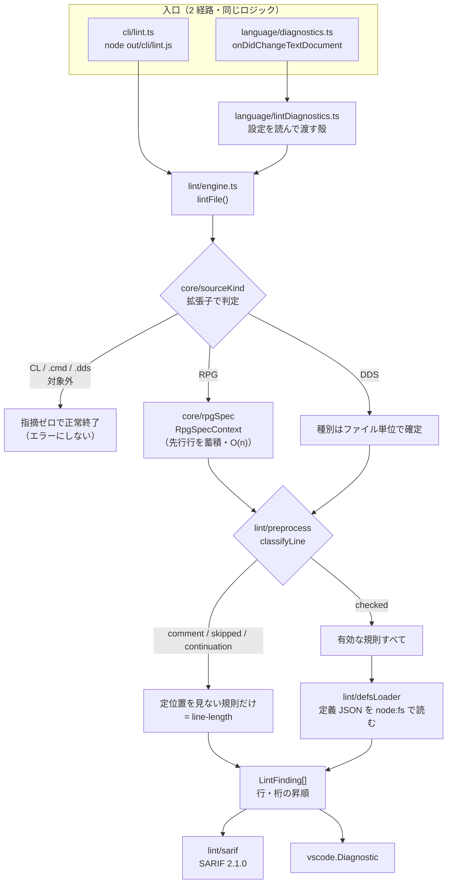

# レビューガイド: lint core（桁位置検査）

## 変更概要 / 目的

固定長ソース（RPG / DDS）の**桁位置の誤りを、実機に接続せずその場で指摘する**。
これまで `CPF7311` などでコンパイル時に初めて分かっていた誤りを、編集中と CI で捕まえる。

検査ロジックは VS Code に依存しない単一のモジュールに置き、
**CLI（SARIF・CI 実行）**と**編集中の診断**の 2 経路から同じものを使う。
同じロジックが両方で動くので「エディタでは出ないが CI で落ちる」食い違いが構造的に起きない。

材料はすべて既存資産。プロンプター定義 JSON が持つ `sourceStart` / `sourceLength` /
`attributes` を規則の供給源にしており、**lint 用の桁表は 1 つも作っていない**。

## まず読み分けてほしいこと

**このPRは前半が「振る舞い不変の再構成」、後半が「新機能」**です。差分の性質が違うので、
見るべき点も違います。

| コミット | 性質 | 見てほしい点 |
|---|---|---|
| `3148ec5` refactor(core) | **振る舞い不変** | 既存の import パス・公開シグネチャ・挙動が変わっていないか |
| `1b2fd5d` perf(core) | **振る舞い不変** | 蓄積型にしても判定結果が同じか（2 つの非対称） |
| `1c350fa` feat(lint) | 新機能 | 規則の選び方と偽陽性 |
| `bc52883` feat(lint) | 新機能 | SARIF の形・終了コード |
| `3916a86` feat(lint) | 新機能 | 既存の診断経路を壊していないか |
| `2dbb1c1` ci | 新機能 | CI に載る対象の選び方 |
| `840261e` fix / `43bc051` fix | 欠陥修正 | test / review で見つけた 3 件（後述） |

前半 2 コミットの受け入れ基準は「**既存テストが全て通る・新機能ゼロ**」です。
`git show 3148ec5 --stat` と `git show 1b2fd5d --stat` だけ先に見ると読みやすいはずです。

差分の内訳（`.aidev/` の成果物 1718 行を除くと実質 2560 行）:

| | 行数 |
|---|---|
| 実装（`src/`） | +1527 / −247 |
| テスト | +852 |
| 検査・CI・設定 | +181 |
| 成果物 md（`.aidev/`） | +1718 |

## 重要ポイント（特に見てほしい所）

### 1. なぜ `src/core/` を新設したか — 写しを作るとドリフトするため

lint に必要な判定（仕様書種別・方言・DDS 種別・定義の置き場所）は**すべて既存実装に
ありましたが、どれも vscode に依存したファイルの中**にありました。

写しを作る選択肢は退けています。この PJ は `binding.ts` で「同一の評価を手書きで写した
結果、片方だけ直すと食い違う」状態を既に踏んでいるためです（AGENTS.md）。

そこで**純粋な部分を `src/core/` に移し、既存ファイルは設定を注入する薄い殻**にしました。

- `src/prompter/dialect.ts:1` — 30 行の殻。`resolveDialect(document)` だけが残る
- `src/prompter/specClassifier.ts:1` — 46 行の殻。**位置引数のシグネチャは維持**して
  `getCNewOpcodes()` を注入するだけ

既存 3 利用元（`ruler.ts` / `positionResolver.ts` / `rpgCompletion.ts`）と
既存テスト 2 本は**1 行も変えていません**。

### 2. `fileScope.ts` だけ移設しなかった理由

`TARGET_EXTENSIONS` も core に寄せたくなりますが、**やってはいけません**。

`docs/origin/verify-contributes.mjs:23-28` が**そのファイルを正規表現でソース解析**しています。

```js
const source = readFileSync(join(EXT, "src/utils/fileScope.ts"), "utf8");
const block = /TARGET_EXTENSIONS\s*=\s*\[([\s\S]*?)\]/u.exec(source);
```

再エクスポートに変えると配列リテラルが消えて CI が落ちます。しかもこれは issue #41
（拡張子を足したのに F4 が発火しなかった）の再発防止装置なので弱めたくありません。

加えて**概念も違います**。`TARGET_EXTENSIONS` は「表示系を有効にする範囲」で `.clp` `.cmd`
を含みますが、lint が要るのは「桁として解釈できる種別」です。

代わりに `src/core/sourceKind.ts:81` に `LINTABLE_EXTENSIONS` を置き、
**`TARGET_EXTENSIONS` の部分集合であることを機械検査**しています
（`scripts/verify-lint-core.mjs`）。列挙が 2 つに増えることを許す代わりに、関係を固定しました。

### 3. `RpgSpecContext` の 2 つの非対称が何を守っているか — `src/core/rpgSpec.ts:100`

I/O 仕様書の桁の意味は「プログラム記述か外部記述か」で変わり、それは**その行ではなく
F 仕様書 22 桁目**で決まります。従来は 1 行解決するたびに先頭から先行行を走査しており
（`positionResolver.ts`）、ファイル全体に回すと O(n²) になります。lint は全行を検査するので
そのままでは入力のたびに重くなります。

蓄積型にするにあたり、**元の実装の非対称をそのまま写す必要**がありました。

| 状態 | 挙動 | 元の実装 |
|---|---|---|
| `fileDescription` | **既出の名前を上書きしない** | `resolveFileDescription` は先頭から走査し**最初に一致**したものを返す |
| `lastRecordName` | **毎回上書きする** | `findRecordNameAbove` は末尾から遡り**最初に見つかった**ものを返す |

**片方でも逆にすると I/O 仕様書の桁が変わり、ルーラーとプロンプターが別の欄を指します**
（黙って壊れる種類）。`test/unit/rpgSpecContext.test.ts:76,89` がこれを固定しており、
**どちらを逆にしても落ちる**ことを確認済みです。

なお `precedingLines` の**未指定（→PGM）と空配列（→EXT）は意味が違います**。
既存の呼び出し元は常に配列を渡しますが、差は保持しました
（`test/unit/rpgSpecContext.test.ts:145`）。

### 4. 4 検査項目のうち 2 つを初版で見送った — 実測 30 件の偽陽性

要件では検査項目が 4 つでしたが、**実機コンパイル確認済みのソース 1060 行に 4 規則を
そのまま当てて実測**したところ、**正しいソースに 30 件の指摘**が出ました（`research.md`）。

要件のもう一方の制約「**偽陽性ゼロを優先する**」を優先し、初版は 2 規則に絞っています。
判断は `spec.md`「requirement からの意図的な逸脱」に記録しました。

| 規則 | 既定 | severity | 根拠 |
|---|---|---|---|
| `line-length` | ON | error | 100 桁超のみ。原典が **81-100 桁を注記域**と規定するので 80 桁超は見ない |
| `numeric-field` | ON | error | 原典の「右寄せ」記述由来＋実機 `CPF7311`。実測で偽陽性 0 |
| `numeric-alignment` | ON | **warning** | 右寄せ必須の明示根拠が DDS 長さ欄のみ。既定の `--fail-on error` では CI を落とさない |
| `required-field` | OFF | — | DDS は定義の `required` が生成時 `false` 固定で材料が無く、RPG は継続記入行と `ENDIF` 等で偽陽性（実測 34 件） |
| `restricted-value` | OFF | — | 値集合が原典の**注記**（DBCS のデータ・タイプ J/E/O/G）を取りこぼし、原典自体も実機より狭い |

`restricted-value` には安全弁が効いています。有効化しても
**`attributes.restricted === true` の欄に限る**設計で（`src/lint/rules/restrictedValue.ts:33`）、
DDS/RPG 定義はこれを設定していないため**有効化しても現状は何も検出しません**。
`types.ts:197` の既存規約（「restricted が false のとき options は候補であって制限ではない」）が
そのまま安全側の設計になっていました。

### 5. `characterSet: "upper"` を検査に使っていない

DDS 定義は全欄に `characterSet: "upper"` を持ちますが、これは
`generate-dds-prompter.mjs:186` が**ハードコードしたもので原典由来ではありません**。
45-80 桁のキーワード欄にも付いているため、検査すると `COLHDG('カナ名')` を含む
正常な行を全部弾きます。理由は `src/lint/rules/numericField.ts:12` に残してあります。

## 処理フロー



**規則の適用範囲は「行の種類」ではなく「規則の性質」で決めています**
（`src/lint/rules/index.ts:22`）。`positional: false` の規則（行長）は行の種類を問わず
適用し、`true` の規則は欄が存在する行でだけ回します。行の種類が増えても
規則ごとの例外を足さずに済む形です。

## 主要な変更箇所

| ファイル | 要点 |
|---|---|
| `src/core/rpgSpec.ts:100` | `RpgSpecContext`。2 つの非対称（上記 3） |
| `src/core/sourceKind.ts:44` | 拡張子 → 言語 / DDS 種別 / 方言。`positionResolver` の分岐と `resolveDdsType` が**同じ知識の 2 表現ですでに食い違っていた**ので一本化。ただし `.dds` が種別未決定のままである**現状の挙動は変えていない** |
| `src/lint/engine.ts:26` | `lintFile()`。ファイル単位 API（I/O 変種に先行行が要るため）。1 走査 |
| `src/lint/preprocess.ts:32` | 注記行の判定。**DDS のブランク行（7-80 桁が全空白）は原典が注記と定めている**が既存コードは見ていなかったので足した |
| `src/lint/rules/index.ts:32` | 規則の表。既定 ON/OFF と根拠がここに集約 |
| `src/language/lintDiagnostics.ts:88` | `cNewOpcodes` の伝播（後述の欠陥 3） |
| `scripts/verify-lint-core.mjs:1` | 純粋性と拡張子の部分集合を機械検査 |

## 工程中に見つけた欠陥 3 件（すべて修正済み）

**いずれも「動かすと分かるがテストは通る」種類**でした。同種の再発を防ぐテストを入れてあります。

### 欠陥 1（coding 中に発見）— 定義が読めないと黙って指摘ゼロになる

`defaultResourcesDir` を相対の段数で決め打ちしていたところ、`out/lint/` と
`out-test/src/lint/` で深さが 1 段違い、テスト側では**定義が 1 つも読めていません**でした。
しかも例外にならず**指摘ゼロ**になるので「検査が通った」と区別が付きません。

→ 上位探索に変更（`src/lint/defsLoader.ts:70`）。`decisions.md` D2。

### 欠陥 2（test 工程で発見）— `line-length` が注記行に効かない

`engine` が注記行・種別不明行を**規則にかける前に落として**おり、100 桁を超えても
`line-length` が働いていませんでした。**桁あふれは日本語の注記でこそ起きやすい**ので、
いちばん効いてほしい所で効いていなかったことになります。

→ 規則の分類を `appliesToContinuation` から `positional` に組み替え。`decisions.md` D3。

### 欠陥 3（review 工程で発見）— 設定 1 つで偽陽性が出る

`lintDiagnostics` が `dialectOverrides` は渡していたのに **`cNewOpcodes` を渡していません**でした。
利用者が `rpgClSupport.cNewOpcodes` にオペコードを足すと:

- ルーラー / プロンプター → **C-NEW**
- lint → **C-SPEC**

C-SPEC だけが `FIELDLEN`(64-68) / `DECPOS`(69-70) を数値欄に持つため、拡張演算項目 2 が
その桁まで伸びた**正しい行を弾きます**。

```
     C                   MONITOR   TOTAL = AMOUNT + TAX + FREIGHT + X
→ ★ numeric-field FIELDLEN(64-68) "HT +" が入っています
```

**受け口（`LintOptions.cNewOpcodes`）は既にあり、殻が埋めていないだけ**という形でした。
AGENTS.md が繰り返し記録している「プロンプターは『モデルまで』では届いていない」と同じ型です。

→ `getCNewOpcodes()` を渡す。CLI にも `--c-new-opcode` を追加（VS Code 設定は CLI から
読めないため、渡さないとエディタと CI で食い違う）。

## 設計文書の訂正（レビュー時に注意）

**`design.md` の D6 は誤りです。** 「`types` から `vscode` を外した tsconfig で
コンパイルが落ちること」で純粋性を担保する設計でしたが、**実装して違反コードを
置いたら素通りしました**。`types` は自動読み込みを絞るだけで `import "vscode"` の
モジュール解決を止めません（`--listFiles` で `@types/vscode` が読まれていることを確認）。
`typeRoots` も `paths` も通常の node 解決にフォールバックします。

→ TypeScript の `ts.preProcessFile()` で import を構文的に抽出する方式に変更。
`decisions.md` D1 が正で、**D6 を参照する際は D1 を優先**してください。

## リスク / 確認してほしい点

### 判断を仰ぎたい点

- **偽陽性ゼロの根拠となるコーパスが 6 ファイルと小さい**。実機でコンパイルを通した
  サンプルの追加が望ましい状態です。現状で CI に載せてよいかは判断が要ります。
- **`numeric-alignment` を warning にした判断**。右寄せ必須の明示的な根拠が原典にあるのは
  DDS の長さ欄（30-34 桁）で、RPG 側の `numericOnly` 欄すべてに同じ強さの根拠を
  確認できていません。error に上げるべきかは意見が欲しいところです。

### 既知の制約

- **拡張機能ホストでの目視確認が未実施**。配線の到達性は `RpgClDiagnostics.refresh` を
  実際に通すテストで確認済み（`test/unit/lintDiagnostics.test.ts:98`）ですが、
  実際の入力に追従する様子は見ていません。
- **桁を「文字数」で数えている**。DBCS は実機で 2 バイト＋SO/SI を占めるため、
  日本語を含む行では JS の文字数と実機の桁がずれ、`line-length` は**過小評価**になります。
  `spec.md` で「既存の `positionResolver` / `applyChanges` と同じ扱いに揃える」と決めた
  意図的な制約です。
- **RPG III には `numericOnly` の欄が定義に 1 つも無い**ため、`.rpg` / `.sqlrpg` に届くのは
  `line-length` だけです。lint 側ではなく定義側のギャップで、RPG/400 Reference が
  入手できないため原典照合で属性を足せません（follow-up）。

### follow-up 候補（本 PR の外）

- **`docs/src/CHECKLIST.md` の記述と実態が食い違う**。「すべてコンパイル確認済み」と
  書かれていますが「作成物」欄は 6 件しか埋まっていません。
- **lint が `EMPMNT01.rpgle` に 12 件・`SLSENT01.rpgle` に 18 件を検出**しています。
  D 仕様書の長さ欄が 33-39 桁に収まっていない疑いで、コンパイル確認済みの
  `IOSAMP.rpgle` は規定どおりです。**真陽性かどうかは実機でしか確定できません。**
- **`positionResolver.ts` に RPG 注記行のガードが無い**（`ruler.ts` にはある）。
  `     H* コメント` に F4 を当てると `H-SPEC` として解決されます。本 PR の対象外です。
- RPG III の桁属性を実機のコンパイラで確定する（`probe-rpg3-opcodes.sh` と同じ手法）。
