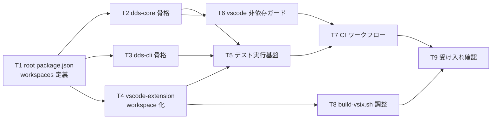

# 計画: 01-workspace（npm workspaces 骨格・CI・非依存ガード）

**subtask のため scope は再決定しない**（割れ目は親 plan が凍結済み。`protocol-subtask.md`）。
本 plan は自分の slice の tasks 分解に限定する。

## 実装方針

親 spec の **D1（npm workspaces による 3 パッケージ構成）**を、コードを 1 行も書かずに成立させる段階。
以降の全 subtask がこの上に乗るので、**「型と CI が先に効く状態」を作ることが唯一の目的**。

順序の要点:

1. **root `package.json` を先に置く。** これが無いと workspaces が成立せず、
   既存の孤児 `package-lock.json`（root に `package.json` が無いのに存在する）も解消できない。
2. **`packages/dds-core` に `@types/vscode` を入れない。** これが AC9 の本体で、
   以降 `import * as vscode` を書いた瞬間に `tsc` が落ちる状態を最初から作る。
3. **CI を最後に回さない**（親 plan R1）。テスト基盤がゼロ（research F12）なので、
   ここで枠を立てないと「書いたテストが CI に載っていない」状態が長く続く。
4. **VSIX が生成できることを必ず確認する**（親 plan R5）。workspaces 導入は
   `build-vsix.sh` の `cd vscode-extension` → `npm install` を壊しうる。

## 作業順序と依存関係

## リスク / 留意点

- **既存の `vscode-extension/` を移動しない。** 移動すると `build-vsix.sh`・`.vscode` 設定・
  ドキュメントのパス参照が一斉に壊れる。workspaces のメンバ指定で足りる。
- **hoisting でモジュール解決が変わる。** `npm install` を root で行うと依存が root の
  `node_modules` に巻き上げられる。`vsce package` が必要な依存を見つけられるかを T8 で確認する。
- **`tsconfig` の `include` に `test` を足すと、既存の未ビルドテストが初めてコンパイルされる**
  （research F12）。**この時点でコンパイルエラーが出る可能性がある**ので、T4 で顕在化させて潰す。
  ここを T7（CI）まで持ち越すと、CI が最初から赤くなる。

## テスト方針

本 subtask は**コードを書かないため、検証はすべて「通ること」の確認**になる（親 plan のテスト方針 `01` 行）。

- root と各パッケージで `tsc` が通る。
- `packages/dds-core/src` に意図的に `import * as vscode from "vscode"` を置くと
  **`tsc` が失敗し、ガードスクリプトも検出する**ことを確認する（**ガードが実際に効くことの確認**。
  置いた後は必ず戻す）。
- `node --test` が core / cli で起動する（テストが 0 件でも成功終了すること）。
- CI が push で起動し、緑になる。
- `build-vsix.sh` が VSIX を生成できる。

結合検証（他 subtask との連携）は**親の統合 test に集約**する。
