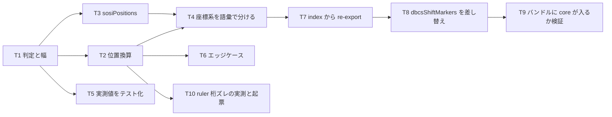

# 計画: 02-encoding（表示桁換算・DBCS 判定の正本）

**subtask のため scope は再決定しない**（割れ目は親 plan が凍結済み。`protocol-subtask.md`）。
本 plan は自分の slice の tasks 分解に限定する。

## 実装方針

spec **D3（換算を 1 モジュールに閉じ込める）** と **D4（`isDbcsCodePoint` の正本を core へ）** を実装する段階。
`text/encoding` は design の依存図で**葉（依存なし）**であり、**この位置づけこそが「換算は 1 か所」を構造で保証する**。
ここに他モジュールへの import を足すと、その保証が崩れる。

実装の拠り所は research の**実測値**であって、DBCS の一般論ではない。

実機メンバの生バイトと、UTF-8 へ変換した後を並べると:

| | 内容 | 長さ |
|---|---|---|
| 実機（EBCDIC） | `c1 e7 28 0e 45e2 45c9 0f c3 c4`（A X - SO 設 計 SI C D） | 11 バイト = **11 表示桁** |
| UTF-8 変換後 | `41 58 c288 e8a8ad e8a888 43 44` | **7 文字**（SO/SI は消滅） |

したがって換算式は（research F6）:

```
表示桁 = Σ(SBCS 文字 = 1, DBCS 文字 = 2) + (DBCS run ごとに SO 1 桁 + SI 1 桁)
```

**11 表示桁 対 7 文字**という乖離が、このモジュールが存在する理由そのもの。テストの中核に据える。

### 決めておく前提（実装前に固定する）

- **索引は UTF-16 コード単位（JS の文字列添字）とする。** コードポイント単位にしない。
  既存 `dbcsShiftMarkers.ts` が code unit で走査しており、VSCode の Position も UTF-16 基準なので、
  ここを揃えないと呼び出し側で常時変換が要る。
- **既存の DBCS 判定範囲を一字一句変えない**（AC8）。現行は
  `3040-30FF` / `3400-9FFF` / `F900-FAFF` / `FF01-FF60` / `FFE0-FFE6`。
  **すべて BMP なので、サロゲートペア（0xFFFF 超）は「DBCS ではないが 2 コード単位を消費する」**という
  現行の挙動になる。**これを再現する**（改善は本 subtask でやらない。判定の変更は別途 requirement が要る）。
- **桁は 1 始まり**（DDS の桁表記に合わせる）。**索引は 0 始まり**（JS に合わせる）。
  **混同が最大の事故源なので、関数名と JSDoc の両方で明示する。**

## 作業順序と依存関係



## リスク / 留意点

- **R1: `dbcsShiftMarkers` の差し替えは挙動不変が絶対条件**（AC8）。
  現行ロジックを**移送**するのであって、書き直しではない。同値性をテストで担保する。
  「ついでに改善」を混ぜると、非後退の検証が成立しなくなる。
- **R2: 境界の丸めを黙って行わない**（spec のエッジケース）。桁が DBCS の 2 桁目・SO・SI を
  指した場合は `straddles: true` を返し、**呼び出し側に判断させる**。ここで丸めると 1 桁ずれが静かに混入する。
- **R3: T8 は D1 の前方配線を初めて実地で使う。** これまで `@as400/dds-core` は依存宣言だけで
  未使用だった。差し替えによって**拡張が初めて core を import する**ので、
  esbuild のバンドルに core が実際に含まれるかを確認する必要がある（T9）。
- **R4: `ruler.ts` の桁ズレは「視覚的な」問題**で、表示環境の無い本環境では目視確認ができない。
  **決定論的な証拠（ルーラー文字数 対 実際の表示桁数）を計算で示す**に留め、
  視覚確認が未実施であることを起票に明記する。修正は本 subtask ではしない（ユーザー決定）。
- **R5: 起票は外向きの操作。** GitHub issue を立てる前にユーザーに確認する。
  既定は `.aidev/backlog/` へのローカル起票に留める。

## テスト方針

子 test は**単独検証可能な範囲に限定**する（`protocol-subtask.md`）。結合は親の統合 test。

- **実測由来のテスト（中核）**: research F1〜F6 の値をそのままケースにする。
  - 実機メンバ相当の文字列で **`displayWidth` が 11**（A 1 + X 1 + U+0088 1 + SO 1 + 設 2 + 計 2 + SI 1 + C 1 + D 1）。
  - 同じ文字列の **UTF-16 長が 7** であること（乖離そのものをテストで固定する）。
- **境界**: 索引 0 / 末尾 / 空文字列 / DBCS run が先頭・末尾に接する場合 /
  run が終わる直後の索引で **SI が数え込まれる**こと。
- **straddles**: DBCS の 2 桁目・SO の桁・SI の桁を指したとき `true` になること。
- **往復**: `charIndexToColumn` の結果を `columnToCharIndex` に戻すと元の索引になること（straddles でない位置で）。
- **同値性（AC8）**: 移送前の `isDbcsCodePoint` と移送後で、
  代表コードポイント群（各範囲の境界値を含む）に対し判定が一致すること。
- **サロゲートペア**: DBCS 判定は false・2 コード単位を消費、という**現行挙動の再現**。
- **バンドル**: 差し替え後の `dist/extension.js` に core のコードが含まれること（T9）。

`ruler.ts` の桁ズレ検証は**テストではなく調査**として扱い、結果を起票に回す（修正しないため）。
