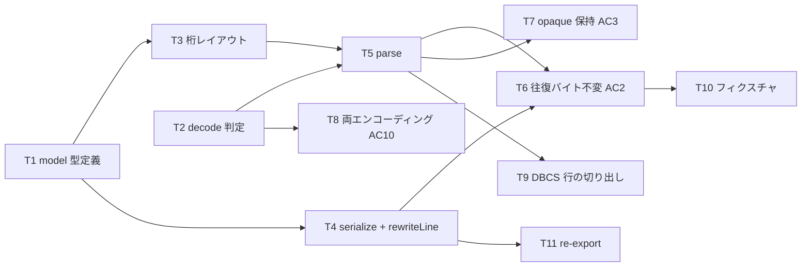

# 計画: 03-parse-serialize（モデル・パーサ・シリアライザ）

**subtask のため scope は再決定しない**（割れ目は親 plan が凍結済み。`protocol-subtask.md`）。

## 実装方針

spec **D2（バイト保存は「行の raw 保持＋桁範囲の局所置換」で実現する）** を実装する段階。
**本 work で最も価値の重い AC がここで確定する**（AC2 バイト不変 / AC3 opaque 保持 / AC10 両エンコーディング）。
GUI を待たずに、DDS エディタ最大の失敗モード（全行再生成による差分爆発）を構造的に排除できたかが決まる。

### 中核の設計

**モデルは行の `raw` を必ず持つ。** 解釈できた行も、できなかった行も、生テキストを捨てない。

```
serialize(doc) = lines.map(l => l.raw).join(eol) [+ BOM]
```

シリアライズは**単なる連結**にする。これで「編集していない行は定義上バイト不変」になり、
AC2 が実装の注意深さではなく**構造**で保証される。

では編集はどこで行うか。**行の書き換えは `rewriteLine(raw, changes)` という別の関数**が担う:

```
rewriteLine("     A            EIN1          10O  O  7 30", [{col: 42, width: 3, text: " 35"}])
  → 指定の桁範囲だけを差し替え、それ以外は 1 文字も触らない
```

`patch/ops`（04）はこれを呼んで `raw` を作り直し、`serialize` は結果を連結するだけ。
**「どこを書き換えるか」の知識を 1 か所に閉じ込める**のが狙い。

### 桁の切り出しは換算層を通す

DDS の桁割りは research F8 で実ソースから確認済み:

| 桁 | 意味 | 桁 | 意味 |
|---|---|---|---|
| 6 | form type (`A`) | 35 | データ型 |
| 7-16 | 条件（標識） | 36-37 | 小数 |
| 17 | 型（`R`=レコード） | 38 | 使用 |
| 19-28 | 名前 | 39-41 | 行 |
| 30-34 | 長さ（右詰） | 42-44 | 桁 |
| 45-80 | 機能キーワード | | |

**桁 1-44 は実務上つねに SBCS** なので「桁 = 文字索引 + 1」が成り立つが、
**機能欄（45 桁以降）には DBCS リテラルが入る**。ここで素朴な添字を使うと、
定数の表示上の占有範囲を誤る。**切り出しは `sourceColumnToCharIndex`（02-encoding）を通す。**

### エンコーディング判定（AC10）

**実現性は確認済み**（本 plan 作成時に実測）:

- `new TextDecoder("shift_jis")` が動く（この Node は full ICU）。`windows-31j` も可。
- `new TextDecoder("utf-8", {fatal:true})` は Shift_JIS のバイト列で**例外を投げる** → 判別に使える。

判定の順序:

1. **UTF-8 BOM** があれば UTF-8（BOM は保持し、書き戻しで復元する）。
2. **UTF-8 strict** でデコードできれば UTF-8（純 ASCII もここに入る）。
3. 失敗したら **Shift_JIS**。
4. Shift_JIS でも失敗したら **UTF-8 の非 strict で読み、警告を返す**
   （spec「エラー処理」: 黙って化けさせない）。

**判定の責務はコアに置く。** VSCode はホスト側でデコード済みの文字列を渡してくるが、
CLI はバイト列から読む。コアに置けば両方が同じ判定を使い、テストもファイル無しで書ける。

## 作業順序と依存関係



## リスク / 留意点

- **R1: `serialize` に賢さを入れない。** 整形・正規化・空白の詰めを一切しない単なる連結にする。
  ここに「気を利かせる」処理が入った瞬間、AC2 の構造的保証が崩れて注意深さ頼みになる。
- **R2: 行末の扱い。** 元ファイルの改行（CRLF / LF）と、**最終行に改行があるか無いか**を保持する。
  ここを揃えないと「編集していないのに全行差分」が出る（最も気付きにくい形の AC2 違反）。
- **R3: 行幅を伸ばさない**（spec のエッジケース）。元が 80 桁なら 80 桁のまま。
  `rewriteLine` は右端を越える変更を拒否する。
- **R4: `TextDecoder` の Shift_JIS は ICU 依存。** Node が small-icu ビルドだと使えない。
  CI（`actions/setup-node`）は full ICU なので通るが、**判定が失敗したときに黙って化けさせない**
  設計（上記 4.）にしておくこと。
- **R5: Shift_JIS が偶然 UTF-8 として妥当になる可能性**。理論上ありうるが、日本語を含む実ソースでは
  ほぼ起きない。**起きたときに気付けるよう、判定結果をモデルに載せて返す**（隠さない）。
- **R6: 継続行（`+` / `-`）は opaque として素通しする。** 本 subtask では解釈しない。
  キーワードの構造化は L3（後続 work）の仕事。ただし**失わないこと**は AC3 で担保する。

## テスト方針

子 test は**単独検証可能な範囲に限定**する。結合は親の統合 test。

- **往復バイト不変（AC2・最重要）**: 代表 DDS を `parse` → `serialize` して**元と 1 バイトも違わない**こと。
  文字列比較ではなく**バイト列比較**で行う（改行・BOM・行末空白の差を取り逃がさないため）。
- **opaque 保持（AC3）**: コメント行（7 桁目 `*`）・継続行・未対応キーワードを含む DDS で、
  往復後にそれらが残っていること。
- **両エンコーディング（AC10）**: 同一内容の UTF-8 版と Shift_JIS 版から**同一のモデル**が得られること。
  かつ判定結果（`encoding`）が正しく返ること。
- **DBCS 行の切り出し**: 機能欄に日本語定数を含む行で、リテラルの範囲が正しく取れること。
  02-encoding の換算を通していることの確認。
- **`rewriteLine`**: 指定桁範囲だけが変わり、他が 1 文字も変わらないこと。右端超過を拒否すること。
- **行末の保持**: CRLF / LF、最終行の改行有無、行末空白のそれぞれで往復不変。

`render` / `validate` に関わる検証は本 subtask では行わない（04・05 の担当）。
