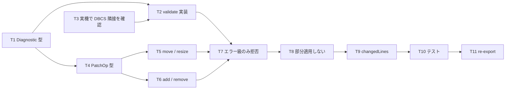

# 計画: 04-validate-patch（検証と構造化パッチ）

**subtask のため scope は再決定しない**（割れ目は親 plan が凍結済み）。

## 実装方針

`dds/validate`（配置の検証）と `patch/ops`（L1 の 4 操作）を実装する段階。
**AC4（CLI が GUI と同等）の土台**がここでできる — GUI も CLI も同じ `applyOps` を呼ぶ構造にする。

### 検証規則は実機で確定済み（spec D7）

属性バイトの規則は**推測ではなく実機の `CRTDSPF` で確定**している。そのまま実装に落とす。

> **同一行の隣接する 2 要素は、データ範囲の間に最低 1 桁の空きが必要**
> （A のデータが `a1..a2`、B が `b1..` のとき、`b1 < a2 + 2` が違反）。
> 桁 1 の開始と画面右端での終了は対象外。

**重大度が肝**: 実機はこれを `CPD7866` **severity 10 = 警告**として扱い、
**コンパイルは通る**。したがって:

- `validate` は**警告**として返す。エラーにしない。
- **`patch` は警告では拒否しない。** 実機が通すものをエディタが止めるのは過剰。
- 拒否するのは**エラー級の違反だけ**（桁溢れ・行範囲外・欄に収まらない長さ）。

spec「エラー処理」の「検証違反を生むパッチは適用前に拒否」は、**エラー級に限る**と
spec D7 で明確化済み。

### 要素の占有幅

| 種別 | データ幅 |
|---|---|
| フィールド | `length`（DDS の長さ欄。表示桁数として扱う） |
| 定数 | `displayWidth(text)`（**SO/SI 込み**。`社員マスタ保守` なら 16 桁） |

**フィールドの `length` を表示桁数と同一視するのは skeleton の割り切り**。
DBCS 対応の型（`O`/`E`/`G`/`J`）では長さの意味が変わるが、標識・DBCS フィールドは後続 work の範囲。
**限界として明記し、テストでも SBCS フィールドに限定する。**

### ID の安定性（設計上の重要な制約）

`applyOps` は適用後に**再パースして新しいモデルを返す**。パーサを唯一の解釈経路に保つためだが、
副作用として **`addItem` / `removeItem` の後は ID が振り直される**
（`REC1#1` を消すと、元の `REC1#2` が新しい `REC1#1` になる）。

したがって **ID は「その版のモデル」の中でだけ有効**とする:

- `moveItem` / `resizeItem`（構造を変えない）→ **ID は変わらない**。
- `addItem` / `removeItem`（構造を変える）→ **ID が振り直される**。呼び出し側は返された
  新しいモデルから ID を取り直す。

代替案（ID をファイルに書く / 行番号を ID にする）はいずれもファイルを汚すか同じく不安定。
**再パースを唯一の解釈経路に保つ価値のほうが大きい**と判断する。
API のドキュメントとテストで明示する。

### 部分適用しない

複数の操作を渡されたとき、**全部適用するか、何もしないか**のどちらかにする（spec「エラー処理」）。
途中でエラーになった状態を返すと、呼び出し側が「どこまで適用されたか」を知る手段がない。

## 作業順序と依存関係

## リスク / 留意点

- **R1: 警告で止めない。** 実機が通す配置をエディタが拒否すると、既存 DDS を開いて
  一部を直すという本来の使い方ができなくなる（requirement US2 が死ぬ）。
  **重大度の扱いを間違えると機能そのものが使えなくなる**ので、ここは慎重に。
- **R2: DBCS 要素の隣接規則は未確認**（spec D7 の未確定事項）。SO/SI 自体が桁を消費するため、
  属性バイトとの相互作用がありうる。**T3 で実機に投げて確定させてから T2 を仕上げる。**
- **R3: ID の振り直しを隠さない。** 構造変更後に古い ID を使うと**別のアイテムを操作してしまう**。
  API のドキュメント・戻り値・テストの 3 か所で明示する。
- **R4: `addItem` の挿入位置**。レコード様式の末尾に足すのが自然だが、
  **継続行（opaque）の途中に割り込まない**よう注意する。
  直前のアイテム行の**次の非継続行の位置**に入れる。
- **R5: 検証は「配置」に限る。** キーワードの妥当性・型の整合は**やらない**
  （原典が未収集で、L3 の範囲。research F14）。踏み込むと根拠のない検証を作ることになる。

## テスト方針

子 test は**単独検証可能な範囲に限定**する。

- **属性バイトの隣接規則**: spec D7 の実測表 8 ケースを**そのままテストにする**
  （定数 2-6 ＋ フィールド 7 桁目 → 違反 / 8 桁目 → OK、など）。
  **実機で確定した値がそのまま回帰テストになる。**
- **桁溢れ**: データ範囲が 80 桁を超えたらエラー。**属性バイトは桁溢れ判定に含めない**
  （76-80 のフィールドは後続属性が 81 桁目になるが実機は通す）。
- **重大度**: 隣接違反は警告、桁溢れはエラー。**警告ではパッチが拒否されない**こと。
- **4 操作**: それぞれの適用結果と、対象行以外がバイト不変であること。
- **部分適用しない**: 2 つ目の操作がエラーになるとき、1 つ目も適用されていないこと。
- **ID の安定性**: `moveItem` 後は ID 不変、`removeItem` 後は振り直されること（**両方を固定する**）。
- **`changedLines`**: 変更範囲が正しく返ること。

`render` / 実機ゴールデンは 05 の担当。CLI 表面は 06 の担当。
