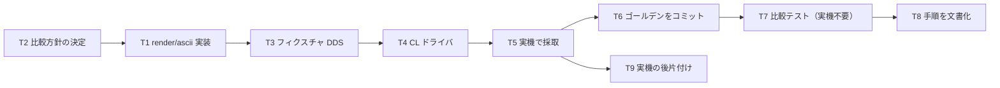

# 計画: 05-render-golden（ASCII レンダラと実機ゴールデン）

**subtask のため scope は再決定しない**（割れ目は親 plan が凍結済み）。

## 実装方針

**AC5・AC6 を確定させる段階**。ここまでのすべて（換算・パーサ・検証）が、
**「実機と同じ絵になるか」という 1 つの問いに集約される**。

### 出力契約は実機の `get_screen` に合わせる（plan 作成時に実測で確定）

ゴールデンの形式を自分で決めるのではなく、**実機から採れる形に合わせる**。
`get_screen` のグリッドを実測した結果:

| 事実 | 内容 |
|---|---|
| 行の長さ | **各行きっかり 80 JS 文字**（24 行） |
| 全角文字 | **1 文字ぶんの位置を占め、次のセルは空白**（2 表示桁を「文字＋空白」で表す） |
| SO / SI | **空白として現れる**（可視文字にならない） |
| 属性バイト | **空白として現れる** |

したがって `render/ascii` の出力も**同じ形**にする:

```
80 文字 × 24 行。全角は開始桁のセルに文字を置き、次のセルは空白。
SO/SI と属性バイトのセルは空白のまま。
```

**この一致があって初めて、機械比較が意味を持つ。** 形式を自分で決めると、
「レンダラの出力とゴールデンの形式を揃える変換」がもう 1 段必要になり、
そこがバグの温床になる。

### フィールドのプレースホルダ

SDA と同じ流儀で、**型に応じた反復文字**を置く:

- 英数字型（`A` 等）→ `X` の反復
- 数値型（`S`/`Y` 等）→ `9` の反復

**実機の画面には実際の値（実行時は空白）が出る**ため、ゴールデンとの比較では
**フィールド領域を「実機では空白／レンダラではプレースホルダ」として扱い分ける**必要がある。
これをどう扱うかが本 subtask の最大の設計判断（下記 R1）。

## 作業順序と依存関係



## リスク / 留意点

- **R1（最大）: レンダラと実機で「フィールドの中身」が違う。**
  レンダラは `XXXXX` のようなプレースホルダを描くが、実機の画面には**実行時の値（初期状態は空白）**が出る。
  そのまま比較すると必ず食い違う。取りうる方針は 2 つ:
  1. **比較を「定数とフィールドの占有範囲」に正規化する**——実機のキャプチャから
     フィールド領域をプレースホルダに置き換えてからゴールデン化する。
  2. **CL ドライバでフィールドに既知の値を書き込む**——`XXXXX` を実際に表示させる。
  **後者を採る**。実機に実際に描かせたものをそのまま保存できるので、
  「加工したゴールデン」にならない。加工すると、加工の側にバグが入っても気付けない。
- **R2: CL ドライバの作成を見積もりから落とさない**（親 plan R2）。
  DSPF 単体では画面が出せない。`DCLF` + `SNDRCVF` の CL が要る。
  実機の `ASAOLIB` に `GRIDCL` / `MSKCL` / `REVCL` という先例がある。
- **R3: 対話セッションの後始末。** `SNDRCVF` は入力待ちで止まる。
  キャプチャ後に確実に抜ける（`F3` 等）手順を用意し、**セッションを閉じる**。
  ジョブが残ると次回の採取が失敗する。
- **R4: ゴールデンは「採取したまま」保存する。** 整形・トリムをしない。
  行末の空白も含めてそのまま保存する（`render/ascii` も同じく 80 桁を維持する）。
- **R5: 実機が使えない環境では採取できない。** CI はコミット済みゴールデンとの比較のみ
  （親 plan「CI に載せるもの / 載せないもの」）。**採取手順を文書化して属人化を避ける。**

## テスト方針

- **ゴールデン比較（AC5）**: `render/ascii` の出力が、実機採取のゴールデンと**文字単位で一致**。
  実機不要で回る。
- **DBCS ケース（AC6）**: 日本語定数を含む様式をゴールデンに含める。
  **全角が「文字＋空白」の 2 セルで出る**ことと、SO/SI が空白になることを確認する。
- **属性バイトの見え方**: フィールドの前後 1 桁が空白として現れることを、
  ゴールデン上で確認する（04 で確定した規則の視覚的な裏付け）。
- **差分の読みやすさ**: 不一致時に「何行目の何桁目がどう違うか」が分かる出力にする。
  80×24 の文字列を丸ごと出されても原因が分からない。
- **レンダラ単体**: ゴールデンなしでも、配置・プレースホルダ・DBCS 幅の単体テストを書く。

`CLI` 表面は 06、`RenderModel`（GUI 向け）は 07 の担当。
本 subtask が作るのは **ASCII 出力とゴールデン基盤**まで。
