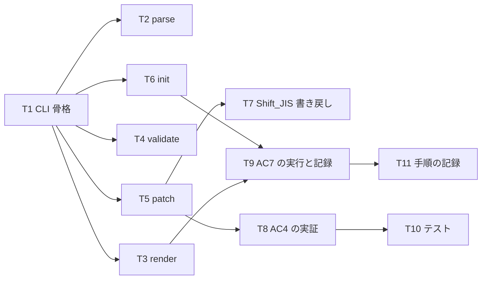

# 計画: 06-cli（CLI 表面と AC7 の実証）

**subtask のため scope は再決定しない**（割れ目は親 plan が凍結済み）。

## 実装方針

`packages/dds-cli` に `parse` / `render` / `validate` / `patch` を実装し、
**AC4（CLI が GUI の L1 と同等）と AC7（AI が CLI のみで DSPF を 1 本作る）を確定させる**。

### AC4 は構造で保証されている（示すだけ）

GUI も CLI も**同じ `applyOps` を呼ぶ**（spec「パッチ操作」）。
04 で `PatchOp` を 4 種に定めたときに、**GUI の L1 操作と 1:1 対応**させてある。
したがって本 subtask の仕事は「同等にする」ことではなく、**同等であることを示す**こと。

### AC7 には**現在の操作集合では足りない**（plan 時点で判明）

`PatchOp` は 4 種ともアイテム単位で、`addItem` は**既存のレコード様式を要求する**
（`insertionPoint` が見つからなければ `PatchRejectedError`）。
つまり **空の状態から DSPF を作る手段が無い**。AC7 は「新規 DSPF を 1 本作成」なので、このままでは達成できない。

取りうる案:

1. **`addRecord` 操作を足す** — 様式の追加は requirement の **L4**（後続 work）に置いた範囲。
   ここで足すと walking skeleton のスコープが広がる。
2. **CLI に `init` を足す** — 「ファイルを新規に作る」は**編集操作ではなく足場作り**。
   GUI で言えば「新規ファイル」に当たる。L1 の操作集合を広げずに AC7 を満たせる。

**案 2 を採る。** 理由:
- `PatchOp` を 4 種に保てる。**AC4 の「GUI と 1:1」という主張が濁らない**。
- `init` は GUI にも「新規作成」として自然に対応し、**CLI だけの特権機能にならない**。
- L4（様式の追加・削除・並べ替え）を skeleton に前倒ししない。

**ただし正直に記す**: `init` は編集操作ではないので、**AC4 の「同等」の対象外**である。
AC4 が言う同等は L1 の編集能力（move / resize / add / remove）についてであり、
足場作りは別物、と成果物に明記する。

### Shift_JIS の書き戻し（03 から申し送り）

03 の `decisions.md` D4 で「Shift_JIS の**読み込み**は検証済み、**書き戻しは 06 送り**」とした。
Node には Shift_JIS の**エンコーダが無い**（`TextDecoder` はデコード専用）。案:

1. **`iconv-lite` を `dds-cli` に足す** — `dds-core` は依存ゼロのまま保てる。
2. **`TextDecoder` から逆引き表を組み立てる** — 起動時に 2 バイト列を総当たりでデコードして
   char → bytes の表を作る。依存ゼロだが自前実装が増える。
3. **書き戻しは UTF-8 のみとし、Shift_JIS 入力には警告を出して拒否する** — 最も小さいが、
   Shift_JIS のファイルを編集できない。

**判断は coding で行う**（実装コストを見てから）。**どれを採っても「黙って化けさせない」ことは守る。**

## 作業順序と依存関係

## リスク / 留意点

- **R1: AC7 は「私が被験者」である。** 私が CLI だけで DSPF を作れなければ、
  それは**私の能力の問題ではなく CLI 表面の穴**である。詰まった箇所は
  「エージェントが自力で到達できなかった点」として**記録する**。取り繕って手で補うと、
  AC7 が検証している当のもの（表面の完全性）が測れなくなる。
- **R2: `parse --json` が ID を返さないとエージェントが操作できない。**
  `patch` は ID で対象を指すので、`parse` の出力に ID が含まれていることが**必須**。
  ここが欠けると CLI だけでは編集が始められない。
- **R3: 構造変更後は ID が振り直される**（04 の設計）。
  エージェントが `addItem` の後に古い ID を使うと**別のアイテムを操作する**。
  CLI の出力・ヘルプでこれを伝える。
- **R4: 終了コードを実装しないと自動化に使えない。** 0/1/2/3 の規約（spec）を守る。
  エージェントは終了コードで成否を判断する。
- **R5: 実機確認を含む。** AC7 は「実機表示がゴールデンと一致」まで。
  05 で確立した手順（`docs/dds-golden/README.md`）をそのまま使い、**後片付けまで行う**。

## テスト方針

- **各コマンドの終了コード**: 正常 0 / 使用法エラー 1 / パース失敗 2 / 検証違反 3。
- **`parse --json`**: ID・種別・位置・キーワードが出ること（**エージェントが操作に使える形か**）。
- **`render`**: 05 のゴールデンと同じ出力になること（コアと同じ経路を通っている確認）。
- **`patch`**: ファイルを書き換えること・`--stdout` で書き換えないこと・
  **対象行以外がバイト不変**であること。
- **`init`**: 生成した DDS が `validate` を通り、`parse` できること。
- **AC4**: CLI の `patch` と、コアの `applyOps` を直接呼んだ結果が**同一**であること
  （同じ経路を通っている証明）。
- **AC7**: 実行の記録（下記 T9）。**自動テストにはしない**——エージェントが要る。

実機ゴールデンの採取は 05 で確立済み。本 subtask では**新規作成した DSPF について**同じ手順を回す。
