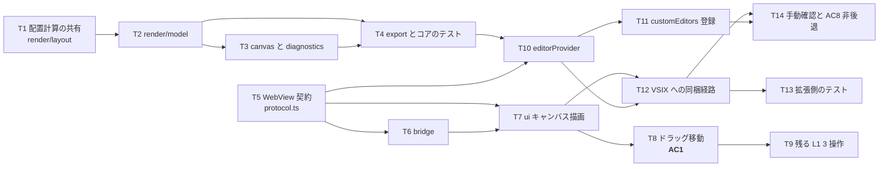

# 計画: 07-editor-webview（GUI と AC1）

**subtask のため scope は再決定しない**（割れ目は親 plan が凍結済み）。
本 subtask の責務は親 plan のとおり **`render/model` ＋ `CustomTextEditorProvider` ＋ WebView UI（DOM 絶対配置）
＋ `contributes.customEditors`**、確定する AC は **AC1**。

## 実装方針

design の通奏低音をそのまま構造にする:
**判断はすべて `dds-core` に置き、WebView とホストは「描く」「繋ぐ」だけにする。**

```
dds-core/render/model   … RenderModel を作る（widthCols も core が計算・DD3）
  ↓ RenderModel
editorProvider          … TextDocument ⇄ core ⇄ postMessage の仲介のみ（DD6）
  ↓ postMessage
webview/bridge          … acquireVsCodeApi の唯一の呼び出し箇所
  ↓ プレーン関数
webview/ui              … DOM 絶対配置。px ⇄ セルの線形変換だけ（DD1・DD2）
```

### 05 のゴールデンを 07 の配置の担保にする（構造で繋ぐ）

design は「`render/ascii` と `render/model` は**同じ配置計算**を使う」としている。
これを散文の約束にせず、**配置計算を 1 モジュールへ切り出して両方が通る形**にする（T1）。
そのうえで「model の占有セルが ascii のグリッド上の占有と一致する」テストを置く（T4）。

こうすると **05 で取れた実機ゴールデン一致（AC5 / AC6）が、そのまま GUI の配置の担保になる**。
別実装のままだと、ゴールデンが緑でも GUI だけ桁がずれる状態が起こりうる。

### AC1 の経路（本 subtask の主経路）

ドラッグ移動 → `moveItem` → `applyOps` → **`changedLines` の範囲だけ `WorkspaceEdit`** →
`onDidChangeTextDocument` → `parse` → `buildRenderModel` → `applied` → 再描画。

**全文置換にしない**（DD6）。undo 粒度が壊れ、並べたテキストエディタのカーソルが飛ぶ。
また AC2（編集行以外がバイト不変）は 03 で `raw` 保持により構造的に確定しているが、
**provider が全文置換するとここで台無しになる**——AC2 を守る最後の関門はこの 1 か所にある。

### 「最小 GUI」の線引き（再決定ではなく、requirement / spec に照らした確認）

親 plan が凍結した slice の内側で、何をどこまで作るかを先に確定させる。

| 項目 | 本 subtask | 根拠 |
|---|---|---|
| L1 の 4 操作（移動・リサイズ・追加・削除）を GUI に載せる | **やる** | requirement 機能要件 6。AC4 の「GUI の L1 と同等」が指す実体 |
| 定数テキストのその場編集（design の状態遷移図の `Editing`） | **やらない** | 下記 R2。**現在の `PatchOp` 4 種に対応する操作が無い**うえ、属性編集は L2＝requirement 対象外 |
| スタンドアロンホスト（ファイル操作 / undo / コマンドパレット / ショートカット一覧 / ステータスバー） | **やらない。継ぎ目だけ作る** | requirement「ゴール範囲」。07 は `Host` 型（DD8）と bridge の分離まで |
| DD8 の 5 件の衝突（キーバインド取り合い等）の解消 UI | **やらない。記録する** | スタンドアロン実装が無い段階では衝突が発生しない。ゴール範囲の課題として `decisions.md` に残す |
| 属性バイト占有の視覚化（DD9） | **やらない** | spec D7「walking skeleton では必須としない」 |

## 作業順序と依存関係



**core 側（T1〜T4）と WebView 側（T5〜T9）は独立に進められる。** 繋ぐのは T10。

## リスク / 留意点

- **R1: WebView 資産は素直に置くと VSIX に入らない。**
  `.vscodeignore` が `src/**` と `**/*.ts` を除外している。design が示す `src/dds/webview/*` に
  HTML/CSS/JS を置いたままだと、**開発機では動くのに VSIX では真っ白**になる。
  esbuild に webview エントリを足して `dist/webview/` へ出す（T12）。**最後に気付くと痛い種類の罠**なので、
  UI を書き始めた直後に経路を通す。

- **R2: 定数テキストの編集に対応する `PatchOp` が無い**（plan 時点で判明）。
  design の状態遷移図は `Editing`（定数をダブルクリック → IME 確定 → patch）を含むが、
  `PatchOp` は `moveItem` / `resizeItem` / `addItem` / `removeItem` の 4 種で、
  **既存アイテムのテキストを変える操作が無い**。`resizeItem` は長さだけを変える。
  - 取りうる案: (a) skeleton では実装しない / (b) `removeItem` + `addItem` の対で実現する /
    (c) 操作を足す。
  - **(a) を採る。** (c) は 06 の `init` と違い**明確に L2（基本属性の編集）＝requirement 対象外**。
    (b) は ID が振り直され（04 の設計）、行位置も動くため「テキストを直しただけ」に見えない。
  - **AC1 は移動で満たされる**ので skeleton の完了条件には影響しない。`decisions.md` に残し、
    L2 の work へ申し送る。

- **R3: セル幅の測定を誤ると全桁がずれる**（design DD2 / 親 plan R6）。
  CSS の `ch` を使わず実測する。**測定値をデバッグ表示に出す**（T7）。ここが唯一「UI 側が数値を持つ」
  箇所なので、疑わしいときに最初に見る場所を用意しておく。

- **R4: 自分の `WorkspaceEdit` が `onDidChangeTextDocument` で戻ってくる。**
  再描画 → 再送 → …のループを作らない。**再描画は冪等**（`applied` はモデルを丸ごと差し替えるだけ）にし、
  `Pending` 中は追加の編集を受け付けない（design の状態遷移）。

- **R5: 画面サイズ（`DSPSIZ`）はモデルから読めない。**
  ファイルレベルのキーワードは `opaque` 行として素通ししており（03 の設計）、解釈していない。
  よって `RenderModel.canvas` は **既定 24×80（`DEFAULT_SCREEN`）** とし、オプションで上書き可能にする（T3）。
  「読めていない」ことを黙って 24×80 に見せかけない——`decisions.md` に明記する。

- **R6: DBCS の描画は幅と文字を分けて考える。**
  占有幅は core が返す `widthCols`（SO/SI 込み）だが、**描く文字はリテラルそのもの**。
  ascii レンダラは「全角＝文字＋空白」「SO/SI＝空白」というグリッド表現を実機に合わせているが、
  DOM ではフォントが全角を 2 セル幅で描く。**幅の確保は `widthCols`、文字は素で流す**と揃う（T7）。
  ここを取り違えると DBCS だけ 1 桁ずれる。

- **R7: undo は VSCode に一本化する。** WebView 側に undo スタックを持たない。
  `CustomTextEditorProvider` は `TextDocument` を共有するので、undo は VSCode 側で成立する（spec D5）。
  DD8 の「undo スタックの二重化」はスタンドアロン実装を持ったときの課題で、**今は作らないことで回避する**。

- **R8: 統合テストは CI に載らない**（親 plan「CI に載せるもの / 載せないもの」）。
  したがって **vscode に触らない純関数をどれだけ切り出せるか**が、この subtask で機械的に守れる範囲を決める。
  メッセージの型検証・`changedLines` → 置換範囲の写像・座標変換は provider から切り出して単体化する（T13）。

- **R9: `contributes.languages` / `grammars` を触らない**（AGENTS.md の波及チェック / research F11）。
  カスタムエディタは `filenamePattern` で登録できる。`priority` は **`"option"`**——既定にすると
  `.dspf` でテキストエディタが開かなくなり、ルーラー / SOSI が失われる（**AC8 違反**）。

## テスト方針

親 plan の「`07`: `RenderModel` 生成のユニットテスト。WebView は手動確認＋メッセージ契約のテスト」に従う。
**結合検証（AC1 の実機動作）は親の統合 test に集約**する（`protocol-subtask.md`）。

### コア（`packages/dds-core/test/`・CI に載る）

- `buildRenderModel` の配置・`widthCols`・プレースホルダ・`editable` 等の拡張点の既定値。
- **DBCS を含むフィクスチャ**での `widthCols`（SO/SI 込み）。
- `diagnostics` が `validate` の結果（`sourceLine` 含む）を落とさず載せること。
- **ascii との一致**: 同一フィクスチャで、model の各アイテムの占有セル範囲が
  `renderAscii` のグリッド上の占有と一致すること（配置計算共有の証明）。

### 拡張（`vscode-extension/test/unit/`・CI に載る＝型検査＋単体）

- WebView からのメッセージの型検証（不正メッセージを弾き、例外を投げない）。
- `changedLines` → 置換範囲の写像（**全文置換にならない**ことを含む）。
- px ⇄ セルの線形変換。

### 手動（CI に載せない）

- `.dspf` をダブルクリック → **テキストエディタが開く**・ルーラー / SOSI が従来どおり（**AC8**）。
- 「エディタで開く」から GUI を開き、ドラッグ移動 → 保存で 39-44 桁が更新される（**AC1** の下見）。
- 表示環境が無く実施できない場合は、**できなかったことを記録**して親の統合 test へ申し送る。
