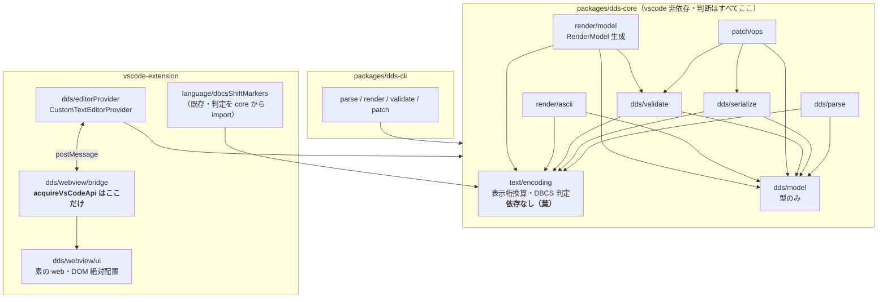
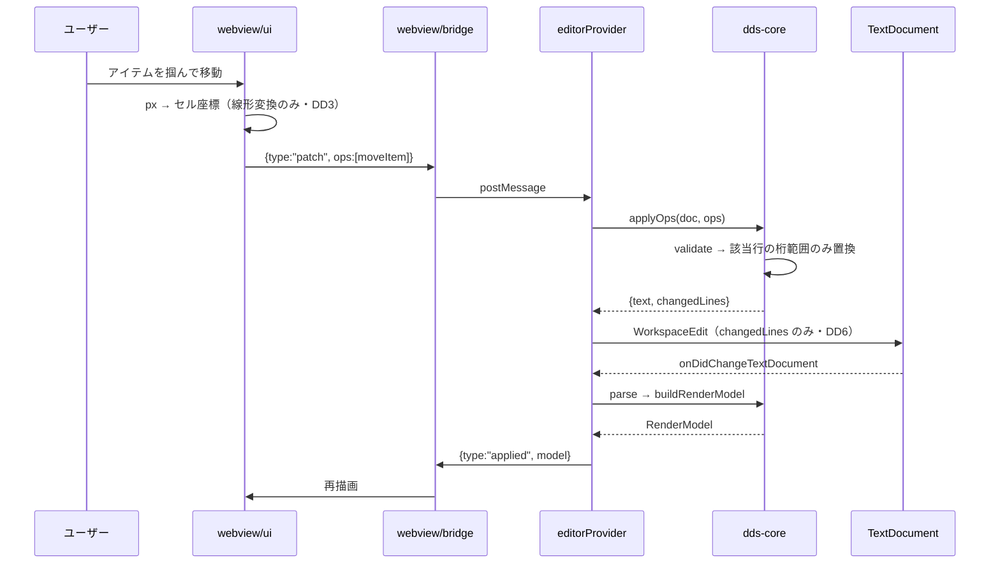
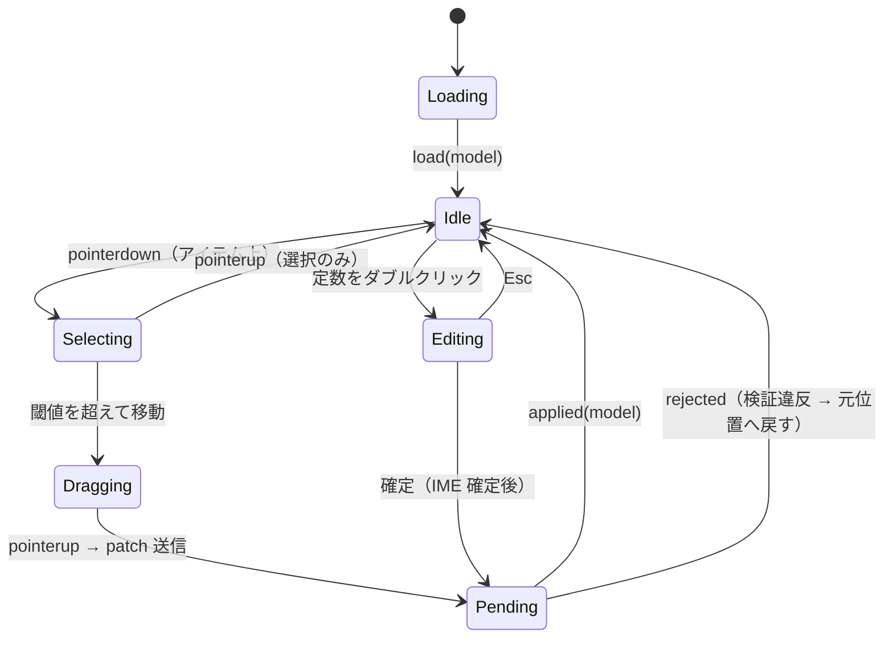

# 設計: DDS ビジュアルエディタの構造

spec.md の D1〜D6 を実装可能な構造まで具体化する。
**spec が意図的に未決にした「キャンバス UI の実装手段」を本工程で確定する**（spec「未確定事項」）。

設計の通奏低音は 1 つ:
**判断はすべて `dds-core` に置き、WebView とホストは「描く」「繋ぐ」だけにする。**
換算・条件評価・検証を UI 側に持たせた瞬間、真実源が 2 つになって桁が食い違う（spec D3 の帰結）。

## アーキテクチャ概要



**循環依存なし。`text/encoding` が葉であることが、spec D3 の「換算は 1 か所」を構造で保証する。**

## コンポーネント / モジュール

### packages/dds-core

| モジュール | 責務 | 依存 |
|---|---|---|
| `text/encoding` | 表示桁 ⇄ 文字位置の換算、DBCS 判定、SO/SI 位置算出 | **なし** |
| `dds/model` | `DdsDoc` / `DdsLine` / `DdsItem` の型定義 | なし |
| `dds/parse` | 固定長テキスト → `DdsDoc`（`raw` 保持・opaque 素通し） | encoding, model |
| `dds/serialize` | `DdsDoc` → テキスト（**変更行の該当桁範囲のみ置換**） | encoding, model |
| `dds/validate` | 桁溢れ・重なり・規則違反の検出 | model, encoding |
| `patch/ops` | `PatchOp` の定義と適用（適用前に validate） | model, validate, serialize |
| `render/ascii` | ASCII 描画（CLI・ゴールデン比較が共用） | model, encoding |
| `render/model` | **`RenderModel` 生成**（WebView へ渡す描画専用の形） | model, encoding, validate |

`render/ascii` と `render/model` は**同じ配置計算**を使う。
ゴールデンで検証されるのは `ascii` だが、**配置計算が共通なので GUI の正しさも同時に担保される**
（AC5/AC6 が GUI にも効くのはこの共有による）。

### vscode-extension

| モジュール | 責務 |
|---|---|
| `dds/editorProvider` | `CustomTextEditorProvider`。TextDocument ⇄ core ⇄ postMessage の仲介**のみ** |
| `dds/webview/bridge` | `acquireVsCodeApi` の**唯一の呼び出し箇所**。UI とはプレーンな関数で会話 |
| `dds/webview/ui` | キャンバス描画・選択・ドラッグ。**判断を持たない** |
| `language/dbcsShiftMarkers` | 既存。判定を `dds-core` の `isDbcsCodePoint` に置換（spec D4） |

## 設計判断

### DD1. キャンバスは **DOM 絶対配置**（Canvas 2D / SVG を退ける）

**採用: 各アイテムを絶対配置の DOM 要素として描き、グリッド・ルーラーは CSS background で描く。**

| 観点 | DOM 絶対配置（採用） | Canvas 2D | SVG |
|---|---|---|---|
| **IME / 日本語入力** | `<input>` / `contenteditable` がそのまま動く | 隠し input を重ねる自前実装。変換中の表示ずれが定番の地雷 | `foreignObject` が必要で結局 DOM |
| ヒット判定・ドラッグ | ブラウザ任せ | 全部自前 | 要素単位で可 |
| VSCode テーマ追従 | CSS 変数がそのまま | 自前で色を読む | CSS 可 |
| **レイヤー（ゴール範囲）** | `opacity` + `pointer-events:none` で「薄く表示・掴めない」がそのまま | 自前 | 可 |
| 要素数の耐性 | アイテム単位なら数百規模で十分 | 最強 | 中 |

**決め手は IME とレイヤーの 2 点。**
DDS の定数は日本語を含み（research F1）、その場編集が要る。Canvas / SVG では日本語変換中の表示を
自前で合わせることになり、**この機能の中心である「桁が正しく見える」ことを最も壊しやすい箇所**に
自前実装を持ち込むことになる。
またレイヤー方式（requirement Q2b で決定：複数様式を表示しアクティブ 1 つだけ編集可）は、
CSS の `opacity` と `pointer-events: none` に**そのまま対応する**。

**要素数の懸念について**: 24×80 の 1920 セルを個別 DOM にするのではなく、
**アイテム（フィールド / 定数）単位で 1 要素**にする。実務 DSPF の 1 様式あたりのアイテム数は
数十オーダー（research F15 の実資産は最大 86 行）なので、DOM で十分に軽い。

### DD2. セル幅は実測する。CSS の `ch` を使わない

`ch` は「`0` の文字送り幅」であり、**日本語混在の等幅フォントで DBCS 幅と一致する保証がない**。
起動時に測定用要素で **SBCS 1 文字の実幅**を測り、CSS 変数 `--cell-w` に入れる。
DBCS は `2 * --cell-w`、SO/SI も各 `1 * --cell-w` を占める。

**この measurement を誤ると全桁がずれる**ので、測定値をデバッグ表示に出せるようにする。

### DD3. WebView は換算しない。幅は core が計算して渡す

`RenderItem.widthCols`（表示桁数。DBCS / SO/SI 込み）を **core が計算して RenderModel に載せる**。
WebView は `widthCols * --cell-w` で描くだけ。

**WebView が自分で文字幅を数え始めた時点で、換算が 2 か所になって spec D3 が破れる。**
UI 側にあるのは「セル座標 ⇄ ピクセル」の線形変換だけで、これは文字に依存しない。

### DD4. 標識の条件評価も core が持つ（ゴール範囲への備え）

L4（標識）に進んだとき、**`RenderModel` に載るのは「解決済みの結果」**とする。
WebView が条件式を評価することはない。`indicatorSet` を core に渡し、core が可視アイテムを決めて返す。

同じ原則で、L2/L3 のキーワード解釈も core 側に置く。

### DD5. walking skeleton の型に、ゴール範囲の拡張点を最初から刻む

後から型を変えると呼び出し側が広範囲に壊れるため、**今は使わないフィールドを型に置いておく**。

| 拡張点 | skeleton での扱い | 将来 |
|---|---|---|
| `RenderModel.kind: "dspf" \| "prtf"` | 常に `"dspf"` | PRTF 対応で分岐（種別プロファイル） |
| `canvas.lineMode: "absolute" \| "relative"` | 常に `"absolute"` | PRTF は `"relative"`（様式内相対行） |
| `RenderModel.records: RenderRecord[]` | 常に 1 要素 | レイヤー方式で複数 |
| `activeRecordId` | その 1 件 | アクティブ様式の切替 |
| `RenderItem.editable` | 常に `true` | 非アクティブ様式は `false` |
| `DdsItem.keywords: string[]` | 未解釈の文字列配列 | L3 で `Keyword[]` へ段階移行 |
| `RenderModel.diagnostics` | validate の結果 | そのまま |

**`records` を最初から配列にし、`activeRecordId` を持たせておく**ことが特に効く。
レイヤー方式の導入が「配列に 2 件目が入るだけ」になり、UI の構造変更が要らない。

### DD6. `editorProvider` は仲介のみ。ロジックを置かない

`WorkspaceEdit` は**変更行だけを置換**する（spec の振る舞い詳細）。
全文置換すると undo 粒度が壊れ、並べたテキストエディタのカーソルが飛ぶ。
core の `applyOps` が**変更行範囲を返す**設計にして、provider はそれを `Range` に写すだけにする。

## インターフェース / データモデル

### RenderModel（host → webview）

```ts
type RenderModel = {
  readonly kind: "dspf" | "prtf";
  readonly canvas: {
    readonly rows: number;                       // 24 / 27
    readonly cols: number;                       // 80 / 132
    readonly lineMode: "absolute" | "relative";
  };
  readonly records: readonly RenderRecord[];
  readonly activeRecordId: string;
  readonly diagnostics: readonly RenderDiagnostic[];
};

type RenderRecord = {
  readonly id: string;
  readonly name: string;
  readonly items: readonly RenderItem[];
};

type RenderItem = {
  readonly id: string;          // DdsItem.id と同一（PatchOp の宛先）
  readonly kind: "field" | "constant";
  readonly line: number;        // 1 始まり
  readonly pos: number;         // 1 始まり・表示桁
  readonly widthCols: number;   // ★ core が計算（DD3）
  readonly text: string;        // 描画用テキスト
  readonly editable: boolean;
};

type RenderDiagnostic = {
  readonly severity: "error" | "warning";
  readonly message: string;
  readonly itemId?: string;
  readonly sourceLine?: number; // 0 始まり・エディタへのジャンプ用
};
```

- **フィールドの `text` はプレースホルダ**（`A` 型 → `X` の反復、数値型 → `9` の反復）。
  SDA と同じ流儀で、長さと位置が視覚的に分かる。定数は**リテラルそのもの**。
- `id` は `${record}#${ordinal}`。**ファイルには書かない**（spec のとおり）。

### 換算 API の適用先を型で分ける（spec D3 の 2 座標系）

```ts
// ソース行内の桁（DDS の各欄がソース行のどこにあるか）
export function sourceColumnToCharIndex(rawLine: string, column: number): CharPos;
export function charIndexToSourceColumn(rawLine: string, index: number): number;

// 画面上の表示桁（フィールドが 5250 画面のどこに出るか）
export function displayWidthOf(text: string): number;
```

名前で適用対象を強制し、取り違えを型と語彙の両方で防ぐ。

### PatchOp（spec のとおり・再掲せず参照）

GUI の L1 操作 4 種と 1:1。**GUI も CLI も同じ `applyOps` を呼ぶ**。

## 処理フロー / シーケンス

### ドラッグによる移動



**テキストエディタ側で編集された場合も、同じ `onDidChangeTextDocument` から下流が動く**
（`CustomTextEditorProvider` が TextDocument を共有するため。spec D5）。
双方向同期のために別経路を作らない。

### WebView の状態遷移



- **`Pending` 中は追加の編集を受け付けない。** 楽観更新をしない（core の判定が唯一の正）。
  ドラッグ中の見た目だけは即時追従させ、確定は往復後に反映する。
- **`Editing` は IME 確定を待つ**（`compositionend`）。変換中に patch を投げない。

## plan への申し送り

### 分割の単位（依存順）

1. **workspaces 骨格**（root `package.json`・`packages/dds-core`・`packages/dds-cli` の空パッケージ・
   `tsc` が通る状態・CI の枠）— **最初に置く。** 以降すべての土台で、AC9 のガードもここで効き始める。
2. **`text/encoding`**（葉・依存なし）— **単体で完結し、実機ゴールデンなしでテストできる。**
   research F1〜F6 の実測値をそのままテストケースにできる（`0e 45e2 45c9 0f` = 11 桁）。
3. **`dds/model` + `dds/parse` + `dds/serialize`** — 往復（parse → serialize）で
   **バイト不変（AC2）とopaque 保持（AC3）をここで確定**できる。GUI より先に効く。
4. **`dds/validate` + `patch/ops`** — L1 の 4 操作。
5. **`render/ascii`** — ここで初めてゴールデン比較が可能になる。
6. **フィクスチャ + 実機ゴールデン採取**（CL ドライバ含む）— 5 と対で必要。
7. **`packages/dds-cli`** — 1〜5 の上に薄く載る。**AC4/AC7 はここで満たされる。**
8. **`render/model` + カスタムエディタ + WebView UI** — **最後。** GUI は core が全部揃ってから。
9. **`dbcsShiftMarkers` の判定差し替え**（spec D4）— 2 の完了後ならいつでも可。
   **既存挙動の非後退（AC8）の確認が要る**ので、独立したタスクにする。
10. **`ruler.ts` の DBCS 桁ズレの実測と起票** — 修正はしない（ユーザー決定）。

**この順序の要点: 価値の重い検証（AC2 / AC3 / AC5 / AC6）が GUI より前に済む。**
GUI は最後に載るので、もし時間が尽きても core + CLI で AC の大半が満たされた状態で止まれる。

### 並行化できる箇所

- 2（encoding）と 6（フィクスチャ作成・実機採取）は**独立**。実機作業は待ち時間が出るので先行させてよい。
- 9（`dbcsShiftMarkers` 差し替え）と 8（GUI）は独立。

### 注意（plan で見落としやすい点）

- **1 の CI 枠を後回しにしない。** research F12 のとおりテスト基盤がゼロなので、
  後から入れると「動くはずのテストが CI に載っていない」状態が長く続く。
- **6 の実機採取は CL ドライバの作成を含む。** DSPF 単体では画面を出せない。
  タスクの見積もりから漏らしやすい。
- **8 の WebView は素の web として書く**（`acquireVsCodeApi` は bridge だけ）。
  ゴール範囲のスタンドアロンホストへの分岐点なので、ここを崩すと後で全面書き直しになる。

---

## 追記（2026-08-26）: 実機検証とモックアップから確定した 3 件

以下は design 承認後の追記。**構造の方針を変えるものではなく、決定を確定させ、
未決だった点を埋めるもの**。

### DD7: 画面構成は「スタンドアロン優先」で設計する

**当初 B 案（VSCode 統合型）を基準にしかけたが、主従が逆だった。**
本 PJ の意図は「VSCode 非依存の独立したエディタとして作り、VSCode 拡張はそれを取り込む」であり、
スタンドアロンが本体・VSCode は埋め込み先の 1 つにすぎない。

- **既定はスタンドアロン。** VSCode の idiom（アクティビティバー / タブ / ステータスバー / 「問題」タブ）を
  模倣しない。DDS デザイナとして自然な自前の外観を持つ。
- **減算ではなく加算にする。** 「VSCode で作ってスタンドアロンでは消す」のではなく、
  「スタンドアロンで完結させ、ホストが肩代わりする分を降ろす」。
- 3 ペイン（左: 様式ツリー＋標識 / 中央: 24×80 キャンバス / 右: プロパティ＋対応ソース）は
  **両モードで不変**。ここが移植可能性の核心。
- モックアップで確認したところ、**レイアウトは VSCode に無改造で収まった**（1px も変えずに済んだ）。

### DD8: ホスト能力の宣言（`hostCapabilities`）

配色マッピング・`acquireVsCodeApi` のブリッジと並ぶ **3 つ目の移植の継ぎ目**。
`host` の意味は「何が使えるか」ではなく **「ホストが何を肩代わりするか」**とする。

```ts
type Host = {
  readonly name: "standalone" | "vscode";
  // ホストが肩代わりするもの（true なら自前 UI を降ろす）
  readonly providesFileIO: boolean;
  readonly providesUndo: boolean;
  readonly providesCommandPalette: boolean;
  // ホスト固有の追加機能（true なら足す）
  readonly canOpenTextEditor: boolean;
  readonly hasPrompter: boolean;
};
```

**スタンドアロンを基準に据えて初めて、自前で持つ必要のある部品が見えた**:
ファイル操作 / undo・redo / コマンドパレット / ショートカット一覧 / ステータスバー。
これらは VSCode 基準で設計していたとき「ホストがあるから不要」と暗黙に外部化されていた。

#### 隠すだけでは解けない衝突（既知・未解決）

モックアップで VSCode へ埋め込んだ結果、**レイアウトは収まったが 5 件の衝突が残った**。
07-editor-webview で扱う。

- **キーバインドの取り合い（最大の問題）**。保存・undo・パレットはホストへ委譲できるが、
  **降ろせないものが 4 つある**（キャンバスのズーム、検証へ移動、ヘルプ）。
  VSCode が先に解決するため両立しない。**アプリ側で衝突を検出して利用者に見せる**しかない。
- **undo スタックの二重化**。モデル層に分岐が残る（未解決）。
- **dirty 表示の粒度低下** / **ステータス項目の置き場**（`host` API の拡張が要る・部分解決）。
- **テーマ不一致**（スタンドアロンを正とした意図的な帰結）。

### DD9: 属性バイトの占有を検証に組み込む

**実機（`SR-OSAKA`）で `CRTDSPF` を実行して確定した事実**。詳細と実測表は `spec.md`「D7」。

- フィールドにも**定数にも**前後 1 桁ずつ属性バイトが付く。
- 隣接違反は `CPD7866`（**severity 10 = 警告**。エラーではなくコンパイルは通る）。
- 規則: **同一行の隣接 2 要素は、データ範囲の間に最低 1 桁の空きが必要**
  （`b1 < a2 + 2` が違反）。桁 1 の開始と画面右端は対象外。

構造への影響:

- `dds/validate` が隣接違反を**警告**として返す。`patch/ops` は**警告では拒否しない**
  （実機がコンパイルを通す以上、エディタが止めるのは過剰）。
- `render/model` の `RenderDiagnostic` に載せ、キャンバス上でマークする。
- **`text/encoding` は属性バイトを扱わない。** 属性バイトは**配置の検証**の概念であって、
  文字列の表示幅ではない。ここを混ぜると換算層の責務が壊れる。
