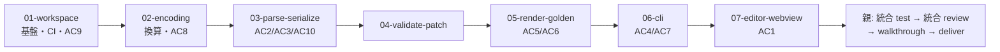

# 計画: DDS ビジュアルエディタ walking skeleton（メタ plan・subtask 分割）

**本 work は subtask に分割する**（protocol.md「2.8」/ `protocol-subtask.md`）。
この plan.md は**割れ目（subslug 境界）と producer→consumer の順序を凍結するメタ plan** であり、
各 subtask の詳細タスクは**それぞれの subtask の plan 工程**で作る（ここでは作らない）。

## 分割判定の根拠

決定木（`aidev-docs/DESIGN.md`「5.」）の discriminator は **「単独で検証・デリバリ可能か」**。

- 各層（encoding / parse・serialize / validate・patch / render / CLI / GUI）は
  **単独で「検証」はできる**が、**単独で「デリバリ」はできない**。
  パーサだけの PR は利用者のいない死蔵コードで、レビュアーが必要性を判断できない。
  価値が出るのは縦に繋がったときだけ ＝ **高結合**。
- 規模は明らかに 1 PR に収まらない（3 パッケージ新設・約 10 モジュール・WebView UI・CI 新設・
  実機ゴールデン採取）。
- → 決定木の**中段（subtask 分割）**。1 PR を保ったまま内部で漸進レビューする。

## 実装方針

design.md「plan への申し送り」の依存順をそのまま割れ目にする。
**核となる方針は「価値の重い検証を GUI より先に済ませる」**こと。

- **AC2（バイト不変）・AC3（opaque 保持）は `03` で確定**する。GUI を待たない。
- **AC5・AC6（実機ゴールデン一致）は `05` で確定**する。GUI を待たない。
- **AC4・AC7（CLI が GUI と同等 / AI が CLI のみで 1 本作る）は `06` で確定**する。
- **GUI（`07`）は最後**。途中で止まっても core + CLI で AC の大半が満たされた状態を保てる。

`render/ascii`（05）と `render/model`（07）は**同じ配置計算を共有**するため、
05 でゴールデン一致が取れていれば **07 の GUI の配置も同時に担保**される（design DD の帰結）。

## 割れ目（subtask 境界）

| subslug | 責務 | 依存 | 確定する AC |
|---|---|---|---|
| `01-workspace` | npm workspaces 骨格・root `package.json`・孤児 lock の正規化・`packages/dds-core` と `packages/dds-cli` の空パッケージ・`tsc` 通過・CI ワークフロー新設・`vscode` 非依存ガード | — | AC9 |
| `02-encoding` | `text/encoding`（表示桁換算・DBCS 判定・SO/SI 位置）＋既存 `dbcsShiftMarkers` の判定差し替え＋`ruler.ts` DBCS 桁ズレの実機実測と起票 | `01-workspace` | AC8 |
| `03-parse-serialize` | `dds/model`・`dds/parse`・`dds/serialize`（`raw` 保持／opaque 素通し／桁範囲の局所置換）・エンコーディング判定 | `02-encoding` | AC2, AC3, AC10 |
| `04-validate-patch` | `dds/validate`＋`patch/ops`（`moveItem`/`resizeItem`/`addItem`/`removeItem`） | `03-parse-serialize` | — |
| `05-render-golden` | `render/ascii`＋フィクスチャ作成＋**実機ゴールデン採取**（DCLF+SNDRCVF の CL ドライバ含む）＋比較テスト | `04-validate-patch` | AC5, AC6 |
| `06-cli` | `packages/dds-cli`（`parse`/`render`/`validate`/`patch`）＋AC7 の手順実行と記録 | `05-render-golden` | AC4, AC7 |
| `07-editor-webview` | `render/model`＋`CustomTextEditorProvider`＋WebView UI（DOM 絶対配置）＋`contributes.customEditors` | `06-cli` | AC1 |

## 作業順序と依存関係

**直列である理由**: 各層が下位層の型と関数に直接依存するため。
ただし **`05` のフィクスチャ作成と実機ゴールデン採取は待ち時間が出る**ので、
`03` / `04` の実装中に**先行して着手してよい**（design「並行化できる箇所」）。
これは subtask の順序を変えるものではなく、`05` 内の作業の前倒しとして扱う。

## リスク / 留意点

- **R1: CI 枠を `01` で必ず立てる。** research F12 のとおり拡張のテストは動作していない
  （`test` はスタブ・`tsconfig` の `include` が `["src"]`・`vscode-test` 未導入・CI は aidev CLI のみ）。
  後回しにすると「書いたテストが CI に載っていない」状態が長く続き、AC5 の回帰検知が形骸化する。
- **R2: `05` の実機ゴールデン採取は CL ドライバ作成を含む。** DSPF 単体では画面を出せない。
  見積もりから漏れやすい。実機の `ASAOLIB` に `GRIDCL` / `MSKCL` / `REVCL` の先例がある（research F15）。
- **R3: `02` の `dbcsShiftMarkers` 差し替えは既存挙動の非後退確認が要る**（AC8）。
  判定ロジックは**現行のまま移送**し、同値性をテストで担保する。挙動改善を混ぜない。
- **R4: `07` の WebView は素の web として書く。** `acquireVsCodeApi` は bridge の 1 か所だけ。
  ゴール範囲のスタンドアロンホストへの分岐点で、崩すと後で全面書き直しになる。
- **R5: `build-vsix.sh` が workspaces 導入で壊れうる**（`cd vscode-extension` → `npm install`）。
  `01` で調整し、**VSIX が生成できることを確認**する。
- **R6: 換算の測定値ずれ**（design DD2）。CSS の `ch` を使わず実測するが、
  測定を誤ると全桁がずれる。`07` でデバッグ表示を用意する。
- **R7: PRTF の実資産が実機に無い**（research F15）。本 work は DSPF のみなので影響しないが、
  後続 work のフィクスチャは完全に自作になる。

## テスト方針

`protocol-subtask.md` に従い、**子 test は単独検証可能な範囲に限定し、結合検証は親の統合 test に集約**する。

### 各 subtask の test（単独検証）

| subtask | 検証内容 |
|---|---|
| `01` | root と各パッケージで `tsc` が通る。CI が起動する。`dds-core` に `vscode` 依存が無いことをガードが検出する。VSIX が生成できる |
| `02` | 換算のユニットテスト。**research F1 の実測値をそのままケースにする**（`0e 45e2 45c9 0f` 相当が 11 表示桁 / UTF-8 では 7 文字）。`isDbcsCodePoint` の移送前後で同値 |
| `03` | parse → serialize の**往復でバイト不変**。opaque 行の保持。UTF-8 版と Shift_JIS 版が同一モデルになる |
| `04` | 4 操作それぞれの適用結果。検証違反の拒否。**部分適用しない**こと |
| `05` | `render/ascii` の出力が**採取済みゴールデンと一致**（実機不要）。DBCS ケースを含む |
| `06` | CLI 4 コマンドの終了コードと出力。`patch` が GUI と同じ `applyOps` を通ること |
| `07` | `RenderModel` 生成のユニットテスト。WebView は手動確認＋メッセージ契約のテスト |

### 親の統合 test

- **AC1**: 実際に `.dspf` を GUI で開き、ドラッグ移動 → 保存 → 行桁が更新されることを確認。
- **AC2**: 上記保存後、**編集行以外がバイト単位で不変**であることを差分で確認。
- **AC7**: **AI エージェントが CLI のみで新規 DSPF を 1 本作り、`validate` を通し、
  実機表示がゴールデンと一致する**ところまで到達できることを、手順に沿って 1 回実行して記録する。
- **AC8**: `.dspf` をダブルクリックしてテキストエディタが開き、ルーラー / SOSI が従来どおり動くこと。

### CI に載せるもの / 載せないもの

- **載せる**: 各パッケージの `tsc`、core / CLI のユニットテスト、ゴールデン比較（実機不要）、`vscode` 非依存ガード。
- **載せない**: 実機接続（ゴールデン採取時のみ人／エージェントが実行）、
  VSCode 拡張の統合テスト（表示環境が要るため。walking skeleton では `tsc` 通過までに留める）。
