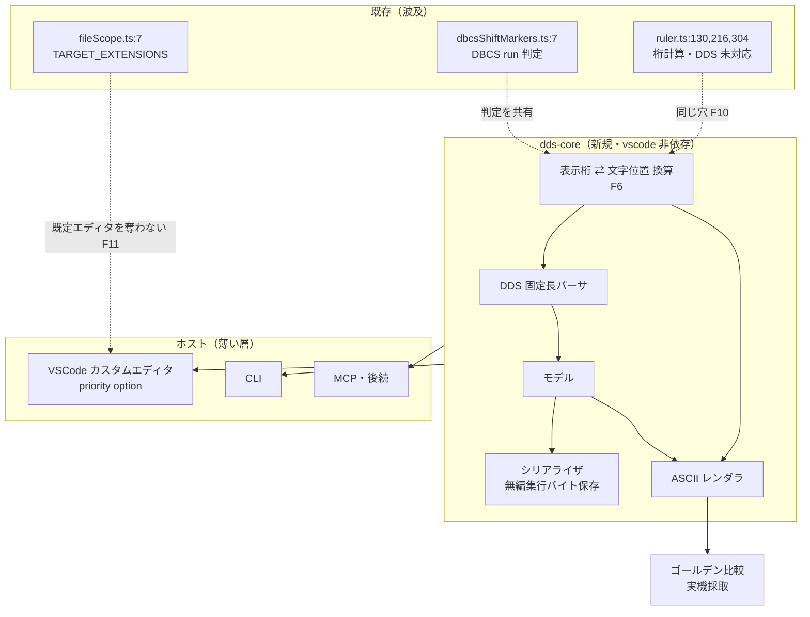

# 調査: DDS ビジュアルエディタ（DSPF/PRTF）の前提事実

requirement.md「未確定事項」の解消と、coding の起点特定を目的とする。
**実機調査は SR-OSAKA（172.21.10.51）の ASAOLIB に対して実施**（ユーザー承認済み）。
調査で作成したオブジェクト（別名2件・メンバ1件・IFS ファイル1件）は**すべて削除済み**で、実機は元の状態。

## 調査の問い

- **Q1**: 実運用の DDS ソースメンバに SO/SI の実バイトは入っているか。
- **Q2**: EBCDIC → UTF-8 変換で SO/SI はどうなるか（＝PC 上の `.dspf` はどう見えるか）。
- **Q3**: UTF-8 → EBCDIC の逆変換で SO/SI は復元されるか（＝エディタは SO/SI を書く必要があるか）。
- **Q4**: DDS 固定長の桁割り（名前・長さ・型・使用・行・桁・機能）は実ソースで確認できるか。
- **Q5**: 既存の表示系（ルーラー / SOSI）は DSPF/PRTF をどこまで扱っているか。
- **Q6**: 拡張機能のテスト / CI 基盤は現状どうなっているか（AC5 の受け皿はあるか）。
- **Q7**: DDS 原典（IBM Documentation）はどう収集するか。実現可能か。
- **Q8**: 実装の起点はどこか。

## 判明した事実

### SO/SI とエンコーディング（Q1〜Q3）— 本 work の設計の中核

- **F1: 実機のソースメンバには SO(0x0E) / SI(0x0F) が実バイトとして存在する。**
  `ASAOLIB/QJPNTEST(JPNATTR)` を IFS 経由で生バイト取得（`/QSYS.LIB/ASAOLIB.LIB/QJPNTEST.FILE/JPNATTR.MBR`、
  base64）した結果:
  ```
  c1 e7 28 0e 45e2 45c9 0f c3 c4 40 40 ...
   A  X  --  SO  設    計   SI  C  D  (以下 EBCDIC 空白 0x40)
  ```
  出典: ts5250 `host_read_file`（encoding=base64）の実測。SO=1 件・SI=1 件。

- **F2: EBCDIC のバイト数と 5250 の表示桁数が一致する。**
  F1 の並びは `A(1) X(1) 0x28(1) SO(1) 設(2) 計(2) SI(1) C(1) D(1) = 11 バイト = 11 表示桁`。
  requirement の「表示桁＝EBCDIC 換算バイト」という定義が**実測で裏付けられた**。

- **F3: UTF-8 へ変換すると SO/SI は完全に消える。**
  `CPYTOSTMF ... STMFCCSID(1208) DBFCCSID(5035)` で UTF-8 ストリームファイル化し読み戻した結果:
  ```
  41 58 c288 e8a8ad e8a888 43 44 0d 0a    → 'AX\x88設計CD\r\n'
  ```
  **SO=0 件・SI=0 件。** 元は 11 表示桁だが、UTF-8 では **7 文字**。
  → **PC 上の `.dspf`（UTF-8）に SO/SI は存在しない。表示桁は文字列から再構成するしかない。**

- **F4: UTF-8 → EBCDIC の逆変換で SO/SI は自動的に再挿入され、元メンバとバイト単位で完全一致する。**
  `CPYFRMSTMF ... STMFCCSID(1208) DBFCCSID(5035)` で戻したメンバの生バイトが、F1 の元メンバ 100 バイトと
  **完全一致**した（base64 文字列が一致）。
  → **エディタは SO/SI をファイルに書き込む必要がない。**「どこに入るか」を計算できれば足りる。
  これは設計を大きく単純化する（書き戻しの責務が減る）。

- **F5: 既存の SOSI 実装（推定復元）は、F3 を前提とすれば正しい設計だった。**
  `dbcsShiftMarkers.ts:7 isDbcsCodePoint` は実バイトを読まず、Unicode コードポイントで DBCS 連続範囲を
  検出して `{` `}` を装飾として重畳している。UTF-8 ソースに SO/SI が無い（F3）以上、これが唯一の方法。
  **本 work の換算層は、この「DBCS run 検出」ロジックと同じ判定を共有すべき**（二重定義を避ける）。

- **F6: 表示桁の計算式**（F2〜F5 から導かれる）:
  `表示桁 = Σ(SBCS 文字 = 1, DBCS 文字 = 2) + (DBCS run ごとに SO 1 桁 + SI 1 桁)`

- **F7: ソースファイルごとに CCSID が違う。**（**2026-08-26 訂正**）
  `QSYS2.SYSCOLUMNS` で確認した結果:
  - `ASAOLIB/QDDSSRC` の `SRCDTA` は **CCSID 1027**（SBCS 日本語 EBCDIC）・長さ 120。
  - `ASAOLIB/QJPNTEST` の `SRCDTA` は **CCSID 5035**（日本語混在）・長さ 100。

  **訂正内容**: 当初「1027 宣言のファイルに DBCS が混在している」と書いたが、**証拠の帰属が誤り**だった。
  SO/SI を含んでいた `JPNATTR` は **5035 の `QJPNTEST`** に属しており、
  1027 の `QDDSSRC` に置かれた `UDCDSPF` には SO/SI が無い（F16）。
  → 正しくは「**ソースファイルの CCSID は一律ではない。DBCS を格納するには
  それを許す CCSID のファイルが要る**」。デコード側の設計（宣言 CCSID に依存せず
  バイト列から判定する）は、この訂正後も妥当。

### DDS 固定長の桁割り（Q4）

- **F8: 実ソースで桁割りを機械的に確認した。** `ASAOLIB/QDDSSRC(UDCDSPF)` の実データ:

  | 桁 | 意味 | 実測例 |
  |---|---|---|
  | 6 | form type | `A` |
  | 7-16 | 条件（標識） | （この例では空白） |
  | 19-28 | 名前 | `EIN1` / `IN2` |
  | 30-34 | 長さ（右詰） | `10`（33-34 桁） |
  | 35 | データ型 | `O` / `A` |
  | 36-37 | 小数 | （空白） |
  | 38 | 使用 | `O` / `B` |
  | 39-41 | 行 | `7` / `9`（41 桁） |
  | 42-44 | 桁 | `30`（43-44 桁） / `2`（44 桁） |
  | 45-80 | 機能キーワード | `DSPATR(MDT)` / `'ECHO'` |

  出典: `SELECT SRCSEQ, HEX(SRCDTA), SRCDTA FROM ASAOLIB.QDDSSRC(UDCDSPF)` の seq 9〜13 を
  1 始まり桁で切り出して検証（数値・名前・キーワードがすべて定説の桁に収まることを確認）。
  **注意: これは実ソースによる裏付けであって IBM 原典そのものではない**（原典は F14 のとおり未収集）。

### 既存の表示系（Q5）

- **F9: ルーラーは DSPF/PRTF で「目盛り段」しか出していない。**
  `ruler.ts:304` に `return undefined; // DDS/DSPF/PRTF/CMD 等は目盛り段のみ`。
  `classifySpec`（`ruler.ts:292`）が RPG / CL 以外を種別なしと判定するため、境界段（フィールド区切り）が出ない。
  **DDS の桁定義はプロジェクトに存在しない**（`resources/navigation/` は RPG と CL のみ）。

- **F10: ルーラーの桁計算は「1 桁 = 1 文字」で、DBCS 幅を考慮していない。**
  `ruler.ts:130` `const width = Math.max(MIN_WIDTH, lineText.length)`（`length` は UTF-16 コード単位）、
  `ruler.ts:216` `buildTensRow` が 1 文字 1 桁で目盛りを組む。
  全角は表示上 2 桁、さらに SOSI の `{` `}` が装飾として 2 桁ぶん挿入されるため、
  **DBCS を含む行では目盛りと本文がズレる**と考えられる。
  → 本 work で作る換算層（F6）は、**既存機能にも同じ穴がある**ことを意味する。
  ただし**実機での目視確認は未実施**なので、「ズレる」は**コードからの推論であって実測ではない**。

- **F11: 表示系の有効化は languageId 非依存（拡張子判定）で行われている。**
  `fileScope.ts:7 TARGET_EXTENSIONS` に `dds` `dspf` `prtf` を含む。
  `.dspf` / `.prtf` は `contributes.languages` に**登録されていない**（`package.json:22`）。
  AGENTS.md の方針どおりで、**本 work もこの方針を維持する必要がある**。

### テスト / CI 基盤（Q6）

- **F12: 拡張機能のテストは動作していない。** 4 点そろって塞がっている:
  - `package.json` の `test` は `echo "Tests are not configured for this environment yet."` のスタブ。
  - `tsconfig.json` の `include` が `["src"]` のみ → `test/` は**コンパイル対象外**。
  - `vscode-test` / `@vscode/test-electron` が **devDependencies にも `node_modules` にも無い**
    （`test/runTests.ts` はこれを import している）。
  - CI（`.github/workflows/aidev-tests.yml`）は **aidev CLI のテストのみ**。拡張の `tsc` すら走らない。
  → **AC5 の「CI で実機なしにゴールデン比較」には受け皿が無い。テスト基盤の新設が本 work のタスクになる。**

### 原典収集（Q7）

- **F13: IBM Documentation は bot に 403 を返す。実測で確認。**
  `curl -A "Mozilla/5.0" https://www.ibm.com/docs/ja/i/7.4.0?topic=files-dds-concepts` → **HTTP 403**。
  `docs/origin/README.md` の記述（403/503 + SPA のため curl/WebFetch では本文が取れない）と一致。
  → **DDS 原典は `WebFetch` では取得できない。Playwright 経由が必須。**

- **F14: DDS 原典は未収集。収集の作法は確立済み。**（**2026-08-26 に解決。下記 F20 参照**）
  `docs/origin/sources.mjs` の `categories` に対象を足し、`fetch-origin.mjs`（Playwright/chromium）で
  取得して `manifest.yml` に記録する。`ilerpg` カテゴリが**明示 URL 指定の先例**（`{ name, url, note }` 形式）。
  npm registry へは到達可能（`registry.npmjs.org/playwright` → HTTP 200）なので**実行自体は可能**。
  **具体的な DDS 原典 URL は未確定**（403 のため未検証。推測で書かない）。

- **F20: DDS 原典を取得した（2026-08-26）。** `ibm.com/docs` からではなく、
  IBM の公開ファイルサーバ `public.dhe.ibm.com` の**公式 PDF** から。

  | ファイル | 内容 |
  |---|---|
  | `docs/origin/dds/DDS-DSPF.pdf` | System i Programming: DDS for display files (V6R1) |
  | `docs/origin/dds/DDS-PRTF.pdf` | System i Programming: DDS for printer files (V6R1) |

  **F13 の再確認**: `ibm.com/docs` は `curl` だけでなく **Playwright の実ブラウザでも 403**
  （`/docs/` のルートすら）。ボット検知の回避は行っていない。

  **制約**: 版が **V6R1**（cl/ilerpg は 7.4。dhe に 7.x が無い）。英語版のみ
  （日本語版は CID フォントでテキスト抽出不可）。詳細は `docs/origin/README.md`「dds の出所」。

  **裏付け**: 抽出テキストに `positions 7 through 16 ... option indicators` および
  `Positions 17 through 38 must be blank. The location of the field is required (positions 39 through 44)`
  があり、**F8 で実ソースから導いた桁割りと一致する**。

### 実機の DDS 資産（フィクスチャの材料）

- **F15: ASAOLIB `QDDSSRC` に DSPF ソースメンバが 15 本ある。**
  `AUDDSPF`(20行) `DTMDSPF`(41) `EDTDSPF`(14) `FFWDSPF`(22) `GRIDTEST`(15) `GRIDTST3`(86)
  `GRIDTST4`(58) `GRIDTST5`(52) `GRIDTST6`(42) `KEYDSPF`(23) `MSKTST`(12) `REVTST`(64)
  `SGNDSPF`(20) `UDCDSPF`(17)。**PRTF メンバは 0 本。**
  出典: `QSYS2.SYSPARTITIONSTAT`（`TABLE_SCHEMA='ASAOLIB'`, `SOURCE_TYPE IS NOT NULL`）。
- **F16: `UDCDSPF` に SO/SI は含まれない**（`LOCATE(X'0E', SRCDTA) > 0` が 0 件）。全 SBCS。
  DBCS の実例は現状 `QJPNTEST(JPNATTR)` のみ。
  → **DBCS を含む DSPF フィクスチャは自作する必要がある**（requirement の「フィクスチャ 0 件」と整合）。

### ts5250 側の観測（本 work の対象外・参考）

- **F17: `host_read_file` の `encoding: utf8` は CCSID 変換をしない。**
  `/QSYS.LIB/.../UDCDSPF.MBR` を utf8 で読むと EBCDIC 生バイトを UTF-8 として解釈した文字化けが返る
  （`0x40` が `@` として並ぶ）。**ソースメンバのテキスト取得には SQL か `CPYTOSTMF` を使う必要がある。**
- **F18: `list_session_configs` が MCP の出力バリデーションで失敗する。**
  保存済みセッション設定の index 3・4 の `sessionType` が許容値 `"display" | "printer"` に不一致。
  `open_session` は `system` ref 指定で回避可能。
- **F19: SQL 結果の CCSID キャストは 1208(UTF-8) 非対応。**
  対応 CCSID は 37, 273, 290, 1027, 930, 939, 1399, 931, 5035, 5026。

## 影響範囲



- **`vscode-extension/package.json`**: `contributes.customEditors` の新設。
  `languages` / `grammars` は**触らない**（F11・AGENTS.md の波及チェック）。
- **`fileScope.ts`**: `.dspf`/`.prtf` は既に対象。**変更不要の見込み**。
- **`dbcsShiftMarkers.ts`**: DBCS 判定を換算層と共有するなら、判定関数の切り出しが必要。
  ただし**現状 `vscode` に依存するファイル内にある**ため、コア側へ移すか判定だけ複製しないよう設計が要る。
- **テスト / CI**: 新設（F12）。既存に載せる先が無い。
- **リポジトリ構成**: `vscode-extension/` 単一パッケージ・素の `tsc`・バンドラ無し・workspaces 無し。
  コアを別ディレクトリに置くならビルド経路の追加が要る。

## 実現性 / リスク

- **実現可能**。最大の不確実性だった SO/SI の扱い（Q1〜Q3）は実測で解消し、
  むしろ **F4 により設計が単純化**した（エディタは SO/SI を書かない）。
- **リスク1: 既存 29 ファイル中 25 が `vscode` を import** しており、vscode 非依存の層構造の前例が無い。
  境界の機械的強制（AC9）を最初に置かないと、なし崩しに依存が入る。
- **リスク2: テスト基盤がゼロからの新設**（F12）。AC5 の前提なので、
  ここが遅れると受け入れ基準の大半が検証できない。walking skeleton の早い段階で立てる必要がある。
- **リスク3: DDS 原典が未収集**（F14）。walking skeleton の桁割りは実ソースで裏付け済み（F8）だが、
  **キーワード（L3 以降）に進む前に原典が要る**。Playwright 導入（chromium ダウンロード）のコストがかかる。
- **リスク4: `ruler.ts` の既存の桁ズレ（F10）は未実測**。本 work で換算層を作る際に実機で検証すべき。
  既存バグなら別 work に切り出す判断もありうる（本 work のスコープを膨らませない）。

## 実装アンカー

- **A1: 表示系の対象拡張子**（`vscode-extension/src/utils/fileScope.ts:7` `TARGET_EXTENSIONS`）
  — `dds`/`dspf`/`prtf` を含む。`isInScopeDocument`（:24）/ `isInScopeUri`（:32）が利用側。
- **A2: DBCS run 判定 / SOSI 復元**（`src/language/dbcsShiftMarkers.ts:7` `isDbcsCodePoint`、
  run 検出は :62 以降のループ）— 換算層（F6）が共有すべき判定。**現状 `vscode` 依存ファイル内**。
- **A3: ルーラーの桁計算**（`src/language/ruler.ts:130` 幅算出 / `:216` `buildTensRow`）
  — DBCS 幅未考慮（F10）。
- **A4: DDS が種別判定から外れている箇所**（`src/language/ruler.ts:292` `classifySpec` / `:304` の
  `return undefined`）— DDS 桁定義を足すならここ。**本 work の必須ではない**（スコープ判断が要る）。
- **A5: 桁定義の読み込み経路**（`src/language/keywordColumns.ts:16` `getRpgKeywordColumns`、
  真実源は `resources/navigation/rpg-fixed-keyword-columns.json`・1 始まり桁）
  — DDS 桁定義を足すならこの形式に倣う。
- **A6: 拡張の contributes**（`vscode-extension/package.json:21` `"contributes"`、
  `:22` `languages` / `:59` `commands` / `:112` `configuration`）— `customEditors` はここに追加。
- **A7: 既存 WebView の作法**（`src/prompter/webview.ts:29` `createWebviewPanel` / `:39` nonce 生成、
  HTML 組み立ては `src/prompter/binding.ts` の `buildHtml`）— カスタムエディタの WebView もこれに倣う。
- **A8: 原典収集**（`docs/origin/sources.mjs` の `categories`、`docs/origin/fetch-origin.mjs`、
  記録は `docs/origin/manifest.yml`）— `ilerpg` が明示 URL 指定の先例。
- **A9: テスト**（`vscode-extension/test/unit/*.test.ts` = 未ビルド、
  `vscode-extension/test/runTests.ts` = `vscode-test` 未導入、`vscode-extension/tsconfig.json` の
  `include: ["src"]`）— すべて要修正。
- **A10: CI**（`.github/workflows/aidev-tests.yml`）— 拡張用のジョブが無い。追加先。
- **A11: dds-core の配置先** — **未特定**。リポジトリ構成の決定（spec/design）待ち。
- **A12: CLI のエントリポイント** — **未特定**。同上。

## 実装時の注意

- **`languageId` を増やさない。** `.dspf`/`.prtf` を `contributes.languages` に登録すると、
  診断・キーバインド・補完など languageId 連動の既存機能が一斉に波及する（AGENTS.md の既知の罠）。
  カスタムエディタは `filenamePattern` で登録できるので、言語登録は不要。
- **カスタムエディタの `priority` を `"option"` にする。** 既定にすると `.dspf` でテキストエディタが
  開かなくなり、ルーラー / SOSI が使えなくなる（AC8 違反）。
- **SO/SI をファイルに書き込まない**（F4）。書くと実機へ戻したとき二重挿入になる恐れがある。
  換算は「表示桁を計算するための内部的な再構成」に留める。
- **DBCS 判定を二重定義しない**（F5・A2）。`isDbcsCodePoint` と換算層の判定がずれると、
  ルーラー / SOSI とビジュアルエディタで桁が食い違う。
- **`SRCDTA` の宣言 CCSID を信用しない**（F7）。1027（SBCS）宣言でも DBCS 混在データが入る。
- **`host_read_file` の `utf8` を使わない**（F17）。ソースメンバのテキスト取得は SQL か `CPYTOSTMF`。
- **ソース物理ファイルの特定メンバを SQL で読むには別名（`CREATE ALIAS`）が要る。**
  素の `SELECT ... FROM lib.file` は *FIRST メンバしか読まない。使い終わったら `DROP ALIAS` する。
- **実機の調査後は作ったオブジェクトを消す。** 今回は別名2件・メンバ1件・IFS ファイル1件を削除済み。

## spec への申し送り

- **設計の中核は「表示桁 ⇄ ソース文字位置」の換算を 1 か所に閉じ込めること**（F6）。
  ここが散らばると DBCS 混じりで必ず破綻する。パーサ・レンダラ・書き戻し・GUI がすべてこの層を通る設計にする。
- **エディタは SO/SI を書かない**（F4）。書き戻しの責務が 1 つ減る。
- **テスト基盤の新設を walking skeleton の早い段階に置く**（F12・リスク2）。AC5 の前提。
- **`dds-core` の配置とビルド経路を決める**（A11・A12）。
  現状は単一パッケージ・素の `tsc`・バンドラ無し・workspaces 無し。
  requirement の非機能要件「コアに `vscode` 依存が無いことを機械検証」（AC9）をどう実装するかも併せて決める。
- **DBCS 判定の共有方法を決める**（F5・A2）。`isDbcsCodePoint` は現状 `vscode` 依存ファイル内にあるため、
  コアへ移す / コアに置いて既存が参照する / のいずれか。**移すなら既存挙動の非後退確認が要る。**
- **残る未確定事項**:
  - **DDS 原典の URL 特定と収集**（F14）。L3（キーワード編集）に入る前に必要。
    Playwright 導入コストがあるため、独立したタスク（または別 work）として切り出す判断もありうる。
  - **`ruler.ts` の DBCS 桁ズレ（F10）が実際に起きているかの実測**。
    既存バグなら本 work に取り込むか別 work にするかの判断が要る。
  - **PRTF の実資産が実機に無い**（F15）。PRTF 対応（後続 work）のフィクスチャは完全に自作になる。
