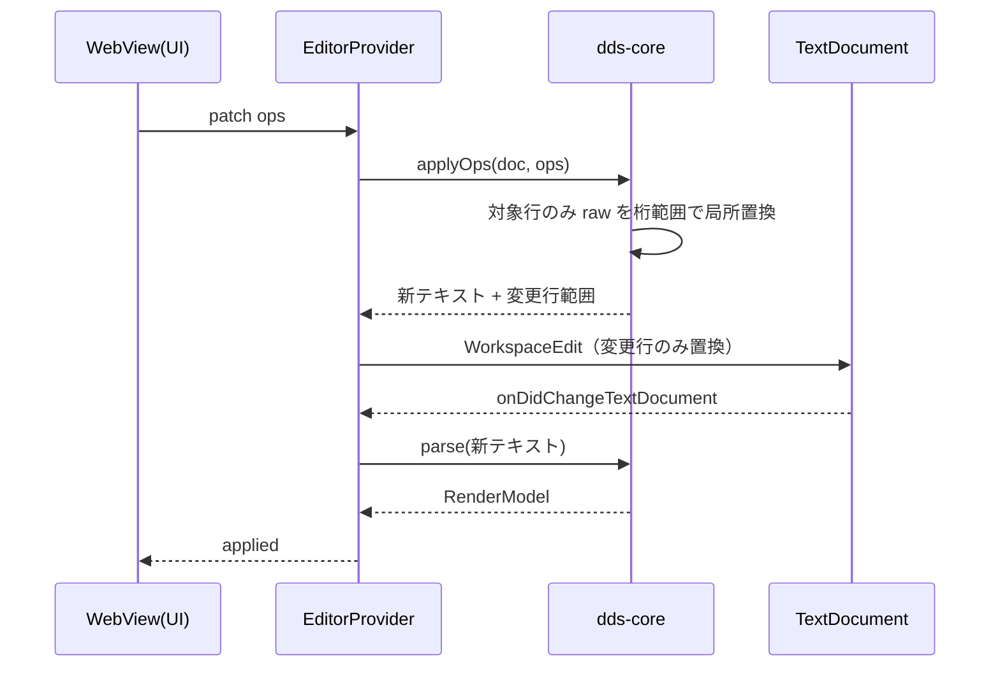

# 仕様: DDS ビジュアルエディタ（walking skeleton）

## 概要

requirement の walking skeleton（DSPF・1 レコード様式・標識なし・L1 編集）を、
**`packages/dds-core` を単一の真実源**として実装し、その上に **CLI**・**VSCode カスタムエディタ**・
**ゴールデン比較**の 3 つの薄い利用者を載せる。

research の F4（UTF-8 → EBCDIC で SO/SI は自動再挿入され元メンバとバイト一致）により、
**エディタは SO/SI をファイルへ書かない**。SO/SI は「表示桁を計算するための内部的な再構成」に留まる。

## 設計方針

### D1. npm workspaces による 3 パッケージ構成

```
/  package.json                      ← 新規（workspaces: ["vscode-extension", "packages/*"]）
   package-lock.json                 ← 既存の孤児ロック（root package.json 不在）を正規化
   packages/dds-core/                ← 新規・**vscode 非依存**
   packages/dds-cli/                 ← 新規・bin を持つ
   vscode-extension/                 ← 既存（移動しない）。dds-core に依存
```

- **`vscode-extension/` を移動しない。** 既存の `build-vsix.sh`（`cd vscode-extension` → `npm install` →
  `npm run compile` → `vsce package`）とパス参照が壊れない。
- **AC9（コアに `vscode` 依存が無いことの機械検証）がパッケージ境界だけで自動的に満たされる。**
  `packages/dds-core/package.json` に `@types/vscode` を入れなければ、`import * as vscode` は
  **型解決に失敗して `tsc` が落ちる**。カスタム lint ルールを書く必要がない。
  加えて明示ガード（`grep` で 0 件）を CI に置き、意図を読み取れるようにする（二重の防御）。
- **CLI を独立パッケージにする。** 単一パッケージ構成だと CLI の `bin` と依存が VSIX に混入する。
- 将来 `packages/dds-mcp` を足すのが自然（ゴール範囲）。

> 代替案「`vscode-extension/src/dds-core/` にディレクトリ境界＋lint 強制」は導入が最も軽いが、
> CLI の同梱問題と、境界の強制を自前 lint に依存する点で退けた。

### D2. バイト保存は「行の raw 保持＋桁範囲の局所置換」で実現する

**本 work で最も重要な設計判断。** モデルは行の生テキストを保持し、編集は行内の**該当桁範囲だけの置換**として適用する。

- 各行は `raw`（元の文字列そのもの）を保持する。
- **編集されなかった行は `raw` をそのまま出力**する → AC2。
- **編集された行も、変更したフィールドの桁範囲だけを置換**し、その行の他の部分（余分な空白・
  機能キーワード欄の書式）は保つ → AC3 の一部。
- 解釈できない行（未知のキーワード・コメント・継続行）は `kind: "opaque"` として `raw` のみ保持し、
  **モデルを経由せず素通し**する → AC3。

これにより「全行を再生成して差分が全行に出る」という DDS エディタ最大の失敗モードを構造的に排除する。

### D3. 表示桁の換算を 1 モジュールに閉じ込める

research F6 の式を `packages/dds-core/src/text/encoding.ts` **だけ**に置く。
パーサ・レンダラ・書き戻し・GUI・CLI はすべてここを通る。

```
表示桁 = Σ(SBCS = 1, DBCS = 2) + (DBCS run ごとに SO 1 桁 + SI 1 桁)
```

**2 つの座標系を明確に分ける**（混同が最大の事故源）:

| 座標系 | 意味 | 影響 |
|---|---|---|
| **ソース行内の桁** | DDS の各欄（名前 19-28 等）がソース行のどこにあるか | 機能欄に DBCS リテラルがあると以降の桁がずれる |
| **画面上の行桁** | 39-41 桁 / 42-44 桁の**値**（5250 画面上の位置） | フィールドの配置そのもの |

どちらも同じ換算関数を使うが、**適用対象が違う**。API 名で区別する。

### D4. `isDbcsCodePoint` の正本を dds-core へ移す

research F5・A2 のとおり、判定が二重定義されるとルーラー / SOSI とビジュアルエディタで桁が食い違う。
**`dds-core` に正本を置き、既存 `dbcsShiftMarkers.ts` はそれを import する**。
判定ロジックは**現行のまま移送し、挙動を変えない**（AC8 の非後退を守る）。同値性はユニットテストで担保。

### D5. `CustomTextEditorProvider` を使う（双方向同期を自前で作らない）

`CustomTextEditorProvider` は **`TextDocument` を共有**するため、
テキストエディタと並べたときの**双方向同期・undo/redo・dirty 状態が VSCode 側で成立する**。
自前で同期を書くと、必ずどこかで整合が崩れる。

- 登録は **`priority: "option"`**。既定を奪わないので `.dspf` は従来どおりテキストで開き、
  ルーラー / SOSI が効く（AC8）。
- **`contributes.languages` は触らない**（AGENTS.md の波及チェック / research F11）。
  カスタムエディタは `filenamePattern` で登録できるので言語登録は不要。

### D6. ゴールデンはテキスト。採取はエージェント運用、比較は CI

- ゴールデンの形式は **ASCII テキスト**（差分が読め、CI で機械比較できる）。画像は使わない。
- **採取**: ts5250 を使えるエージェント / 開発者が手順に従って実機で行う。
  DSPF を表示するには駆動プログラムが要るため、**DCLF + SNDRCVF の CL ドライバ**を各フィクスチャに用意する
  （ASAOLIB の `GRIDCL` / `MSKCL` / `REVCL` が既にこの形なので、実機の慣習に沿う）。
- **比較**: `packages/dds-core` のテストがゴールデンと `render/ascii` の出力を突き合わせる。**実機不要**。

## 対象範囲

### 新規

| パス | 内容 |
|---|---|
| `package.json`（root） | workspaces 定義・横断スクリプト（`build` / `test` / `lint:no-vscode`） |
| `packages/dds-core/src/text/encoding.ts` | 表示桁換算・DBCS 判定の**正本**（D3・D4） |
| `packages/dds-core/src/dds/model.ts` | モデル型定義 |
| `packages/dds-core/src/dds/parse.ts` | 固定長 → モデル（`raw` 保持・opaque 素通し） |
| `packages/dds-core/src/dds/serialize.ts` | モデル → テキスト（桁範囲の局所置換） |
| `packages/dds-core/src/dds/validate.ts` | 桁溢れ・重なり・規則違反 |
| `packages/dds-core/src/render/ascii.ts` | ASCII レンダラ（CLI・GUI・ゴールデンが共用） |
| `packages/dds-core/src/patch/ops.ts` | パッチ操作の定義と適用（L1） |
| `packages/dds-cli/src/main.ts` + `bin` | `parse` / `render` / `validate` / `patch` |
| `vscode-extension/src/dds/editorProvider.ts` | `CustomTextEditorProvider` 実装 |
| `vscode-extension/src/dds/webview/*` | キャンバス UI（素の web・`acquireVsCodeApi` は 1 か所に隔離） |
| `packages/dds-core/test/**` | ユニット＋ゴールデン比較 |
| `packages/dds-core/test/fixtures/*.dspf` | フィクスチャ（自作。DBCS を含むものを必ず 1 本） |
| `packages/dds-core/test/golden/*.screen.txt` | 実機採取したゴールデン |
| `docs/dds-golden/README.md` | ゴールデン採取手順（CL ドライバ・ts5250 操作） |
| `.github/workflows/extension-tests.yml` | 拡張・コア・CLI の CI |

### 変更

| パス | 変更内容 |
|---|---|
| `vscode-extension/package.json` | `contributes.customEditors` 追加・`dds-core` 依存追加・`test` スクリプト実体化 |
| `vscode-extension/tsconfig.json` | `include` に `test` を追加（research F12） |
| `vscode-extension/src/language/dbcsShiftMarkers.ts` | 判定を `dds-core` から import（D4） |
| `vscode-extension/src/extension/extension.ts` | カスタムエディタの登録 |
| `build-vsix.sh` | workspaces 導入に伴う `npm install` 位置の調整 |

### 変更しない（明示）

- `vscode-extension/src/utils/fileScope.ts` — `.dspf`/`.prtf` は既に対象（F11）。**変更不要**。
- `vscode-extension/src/language/ruler.ts` — DBCS 桁ズレ（F10）は**本 work では直さない**。
  実機で実測し、backlog / issue に起票するに留める（ユーザー決定）。
- `contributes.languages` / `grammars` — 触らない。

## インターフェース / データ構造

### モデル

```ts
type DdsDoc = {
  readonly eol: "\r\n" | "\n";
  readonly bom: boolean;
  readonly lineWidth: number;        // ソース行の桁数（実機は 80 / 120 等）
  readonly lines: readonly DdsLine[];
  readonly records: readonly DdsRecord[];
};

type DdsLine =
  | { kind: "opaque"; raw: string }                      // コメント・未対応・継続行
  | { kind: "record";  raw: string; name: string }
  | { kind: "item";    raw: string; item: DdsItem };

type DdsItem = {
  readonly id: string;               // `${record}#${ordinal}` 安定 ID（採番後は再利用しない）
  readonly kind: "field" | "constant";
  readonly name?: string;            // field のみ（19-28 桁）
  readonly text?: string;            // constant のリテラル（機能欄）
  readonly length?: number;          // 30-34 桁
  readonly dataType?: string;        // 35 桁
  readonly usage?: string;           // 38 桁
  readonly line?: number;            // 39-41 桁（画面上の行）
  readonly pos?: number;             // 42-44 桁（画面上の桁）
  readonly keywords: readonly string[]; // 45-80 桁（**未解釈のまま保持**）
};
```

- **`keywords` は walking skeleton では解釈しない**（L3 の仕事）。文字列として保持し、書き戻しでそのまま出す。
- `id` は**モデル内の識別子であり、ファイルには書かない**。`dds parse --json` の出力に含める。

### 表示桁換算 API（D3）

```ts
export function isDbcsCodePoint(cp: number): boolean;
export function displayWidth(text: string): number;                 // 表示桁数（SO/SI 込み）
export function charIndexToColumn(text: string, index: number): number;  // 1 始まり
export function columnToCharIndex(text: string, column: number): { index: number; straddles: boolean };
export function sosiPositions(text: string): { so: number[]; si: number[] };  // 表示桁位置
```

- `straddles` は、指定桁が DBCS 文字の 2 桁目 / SO / SI を指した場合に `true`。
  **境界を跨ぐ指定を黙って丸めない**（丸めると 1 桁ずれが静かに混入する）。

### パッチ操作（L1・AC4）

```jsonc
{"op":"moveItem",   "id":"REC1#3", "line":7, "pos":30}
{"op":"resizeItem", "id":"REC1#3", "length":12}
{"op":"addItem",    "record":"REC1", "item":{"kind":"field","name":"FLD1","length":10,"dataType":"A","usage":"O","line":5,"pos":2}}
{"op":"removeItem", "id":"REC1#3"}
```

**GUI の L1 操作はこの 4 つに 1:1 で対応する**（AC4 の「GUI と同等」を構造で保証する）。
GUI 独自の編集経路を作らない。

### CLI

```
dds parse    <file> [--json]
dds render   <file> [--record NAME] [--format ascii] [--width N] [--height N]
dds validate <file>
dds patch    <file> --ops <file|-> [--write | --stdout]
```

終了コード: `0`=OK / `1`=使用法・入出力エラー / `2`=パース失敗 / `3`=検証違反。

### WebView プロトコル

```
host → webview : {type:"load",   doc: RenderModel}
                 {type:"applied", doc: RenderModel}
webview → host : {type:"patch",  ops: PatchOp[]}
                 {type:"ready"}
```

- **`acquireVsCodeApi` の呼び出しを 1 ファイルに隔離**する。UI 本体は素の web として書き、
  ホストとはこのメッセージだけで会話する（ゴール範囲のスタンドアロンホストに備える）。

## 振る舞いの詳細

### 編集 → 書き戻しの流れ



- **`WorkspaceEdit` は変更行だけを置換する**（全文置換にしない）。全文置換すると undo 粒度が壊れ、
  並べたテキストエディタのカーソルが飛ぶ。
- テキスト側で編集された場合も同じ `onDidChangeTextDocument` を通り、キャンバスが再描画される（D5）。

### エッジケース

- **行がソース行幅より短い**: 右を空白で補って桁範囲を置換し、**元の行末より長くしない**
  （元が 80 桁なら 80 桁のまま）。
- **DBCS が桁境界を跨ぐ**: `straddles: true` を返し、操作を**拒否**する（黙って丸めない）。
- **`length` が桁 30-34 に収まらない**: 検証違反（`validate` が検出、`patch` は拒否）。
- **重なり（属性バイトを含む）**: 下記「D7」の規則で検証し、**警告**とする（walking skeleton では
  **エラーにしない** — 実務 DDS では標識条件で出し分けるため正当なケースがある。標識対応は後続 work）。
- **未知の form type / 解釈不能な行**: `opaque` として保持し、編集対象から外す。

## D7: 属性バイトの占有（2026-08-26 追記・実機で確定）

**この節は spec 承認後の追記である。** requirement / design の方向を変えるものではなく、
**実機で確定した事実の追加**として扱う（`04-validate-patch` の実装に直接効くため、先に確定させた）。

### 事実（実機 `SR-OSAKA` で `CRTDSPF` を実行して確定）

5250 画面では、**フィールドにも定数にも前後 1 桁ずつ属性バイトが付く**。
これを踏まえずに隣接配置すると、コンパイラが `CPD7866` を出す。

```
CPD7866  Severity 10  Field overlaps another field with no conditions specified.
```

**検証した配置と結果**（すべて `CRTDSPF OPTION(*SRC *LIST)` のコンパイルリストで確認）:

| 配置 | 結果 |
|---|---|
| 定数 `ABCDE`(2-6) ＋ フィールド(5桁) を **7 桁目** | **CPD7866 警告**（先行属性が 6 桁目で衝突） |
| 定数 `ABCDE`(2-6) ＋ フィールド(5桁) を **8 桁目** | 警告なし |
| フィールド(8-12) ＋ 定数を **13 桁目** | **CPD7866 警告**（後続属性が 13 桁目で衝突） |
| フィールド(8-12) ＋ 定数を **14 桁目** | 警告なし |
| 定数 `AB`(2-3) ＋ 定数 `CD` を **4 桁目** | **CPD7866 警告**（**定数にも属性バイトがある**） |
| 定数 `AB`(2-3) ＋ 定数 `CD` を **5 桁目** | 警告なし |
| フィールド(5桁) を **1 桁目** | 警告なし（**桁 1 は例外**） |
| フィールド(5桁) を **76 桁目**（76-80、後続属性は画面外） | 警告なし（**右端は例外**） |

### 規則（上記から導かれる唯一の形）

`CD` を 5 桁目に置いたケースが決定的だった。`AB` の**後続属性（4 桁目）**と
`CD` の**先行属性（4 桁目）**が**同じ桁を共有**していて、それでも警告が出ない。
つまり要素間に必要な空きは 2 桁ではなく **1 桁**である。

> **同一行の隣接する 2 要素は、データ範囲の間に最低 1 桁の空きが必要。**
> その 1 桁が、前要素の後続属性と後要素の先行属性を兼ねる。
> **桁 1 での開始と、画面右端での終了は対象外**（隣接する相手がいないため）。

形式的には、同一行の 2 要素 A(データ `a1..a2`) と B(データ `b1..b2`, `b1 > a2`) について:

```
違反 ⟺ b1 < a2 + 2
```

**行の右端（80 桁）を超えるかの判定には属性バイトを含めない。**
`76-80` に置いたフィールドは後続属性が 81 桁目になるが、これは正当（実測）。

### 実装への影響

- **`dds/validate.ts`（04-validate-patch）**: 上記の `b1 < a2 + 2` を隣接違反として検出する。
  重大度は **警告**（実機と同じ severity 10 相当）。**エラーにしない** — 実機でもコンパイルは通る。
- **`patch/ops.ts`**: 隣接違反は**警告なので `patch` を拒否しない**。
  spec「エラー処理」の「検証違反を生むパッチは適用前に拒否」は、**桁溢れ等のエラー級の違反**に限る。
- **`render/model.ts`・GUI（07）**: 属性バイトの占有を視覚化できると、
  隣接違反が起きる前に防げる（モックアップで表現案あり）。**walking skeleton では必須としない。**
- **幅の計算**: 表示桁の計算（`text/encoding`）は属性バイトを含めない。
  属性バイトは**配置の検証**に関わる概念であって、文字列の表示幅ではない。

### 未確定として残るもの

- **標識条件が付いている場合**の扱い。`CPD7866` の文言が
  「with no conditions specified（条件指定なしで）」と限定しているため、
  **条件標識が付いた要素同士の重なりは警告されない**と推測されるが、**未検証**。
  標識対応は後続 work なので、そこで実機確認する。
- ~~**DBCS を含む要素**での属性バイトの扱い~~ → **2026-08-26 に実機で解消**（下記）。

### 追記（2026-08-26）: DBCS 要素でも同じ規則が成り立つ（実機で確定）

D7 で「未検証」としていた **DBCS を含む要素の扱い**を、実機の `CRTDSPF` で確定させた。

**コンパイラ自身の "Expanded Source" が答えを出している**:

```
'社員番号'  →  Field length = 10
```

つまり **DBCS 定数の占有幅は SO(1) + 全角 4 文字 × 2 + SI(1) = 10 桁**。
`text/encoding` の `displayWidth` と**完全に一致**する。

定数を 2 桁目に置く（データ範囲 2〜11）と、フィールドの配置で次のようになった:

| フィールドの桁 | `b1 < a2 + 2`（= 13）の予測 | 実機 |
|---|---|---|
| 10 | 違反 | **CPD7866 警告** |
| 11 | 違反 | **CPD7866 警告** |
| 12 | 違反 | **CPD7866 警告** |
| 13 | OK | 警告なし |

**4 ケースすべて予測どおり**。したがって:

- **要素の占有幅は `displayWidth`（SO/SI 込み）で求めてよい。** DBCS 用の特別扱いは要らない。
- **隣接規則 `b1 < a2 + 2` は DBCS 要素にもそのまま適用できる。**

## ドメイン固有の考慮

- **SO/SI をファイルへ書かない**（research F4）。書くと実機へ戻したとき二重挿入の恐れがある。
- **`SRCDTA` の宣言 CCSID を信用しない**（F7）。1027（SBCS）宣言でも DBCS 混在が入る。
  ローカルファイルの読み取りは UTF-8 / Shift_JIS の判定で行い、CCSID 宣言に依存しない（AC10）。
- **`languageId` を増やさない**（AGENTS.md の波及チェック / F11）。
- **既定エディタを奪わない**（`priority: "option"`。AC8）。
- **DBCS 判定を二重定義しない**（D4）。
- 仕様の根拠は**実ソースによる裏付け（F8）まで**。**IBM 原典は未収集**なので、
  **キーワードの意味解釈には踏み込まない**（walking skeleton が `keywords` を未解釈で保持するのはこのため）。

## エラー処理 / 異常系

| 事象 | 扱い |
|---|---|
| ファイルが DDS として解釈できない | 全行 `opaque`。エディタは「編集可能な項目なし」を表示し、**保存で内容を変えない** |
| パッチ対象 `id` が存在しない | `patch` は**何も適用せず**エラー終了（部分適用しない） |
| 検証違反を生むパッチ | 適用前に拒否（`validate` と同じ判定を使う） |
| Shift_JIS 判定に失敗 | UTF-8 として読み、警告を出す（黙って化けさせない） |
| WebView からの不正メッセージ | 無視してログに残す（ホスト側で型検証） |

## 受け入れ基準との対応

| AC | 満たし方 |
|---|---|
| **AC1** 移動が行桁に反映 | `moveItem` → `serialize` が 39-41 / 42-44 桁のみ置換（D2） |
| **AC2** 編集行以外がバイト不変 | 未編集行は `raw` をそのまま出力（D2）。ゴールデンではなく**バイト比較テスト**で検証 |
| **AC3** コメント・継続行・未対応キーワードが失われない | `opaque` 素通し＋`keywords` 未解釈保持（D2）。往復テストで検証 |
| **AC4** CLI が GUI の L1 と同等 | GUI の操作を `PatchOp` 4 種に 1:1 対応させ、**GUI も CLI も同じ `applyOps` を呼ぶ**（構造で保証） |
| **AC5** ASCII 出力が実機ゴールデンと一致 / CI は実機なし | `render/ascii` の出力を採取済みゴールデンと比較（D6） |
| **AC6** DBCS の表示桁が実機と一致 | DBCS を含むフィクスチャをゴールデンに含める（D3 の換算を実測で検証） |
| **AC7** AI が CLI のみで DSPF を 1 本作る | CLI 4 コマンドで完結する設計。**再現可能な手順として `docs/dds-golden/README.md` に記録**し、1 回実行して結果を残す（CI の自動テストにはしない） |
| **AC8** 既存挙動の非後退 | `priority: "option"`（D5）＋`fileScope.ts` 不変＋`languages` 不変。D4 の移送は同値性テストで担保 |
| **AC9** コアに `vscode` 依存なし | パッケージ境界（`@types/vscode` を入れない）で `tsc` が落ちる＋CI の明示 grep ガード（D1） |
| **AC10** UTF-8 / Shift_JIS 両対応 | 読み込み時にエンコーディングを判定し、モデルは常に文字列。同一 DDS の両エンコーディング版が同一モデルになることをテスト |

## 未確定事項（design / plan へ）

- **キャンバス UI の実装手段**（DOM グリッド / Canvas / SVG）。walking skeleton の L1 には
  どれでも足りるが、L2〜L5 まで見据えると選択が効いてくる。**design 工程の主題**。
- **Shift_JIS の判定方法**（BOM なしの判別）。誤判定時の扱いは決めたが、判定手段は未定。
- **ゴールデン採取用 CL ドライバの置き場所**（実機側 ASAOLIB か、リポジトリにソースを持つか）。
- **`build-vsix.sh` の調整範囲**（workspaces 導入で `npm install` の位置と hoisting が変わる）。
