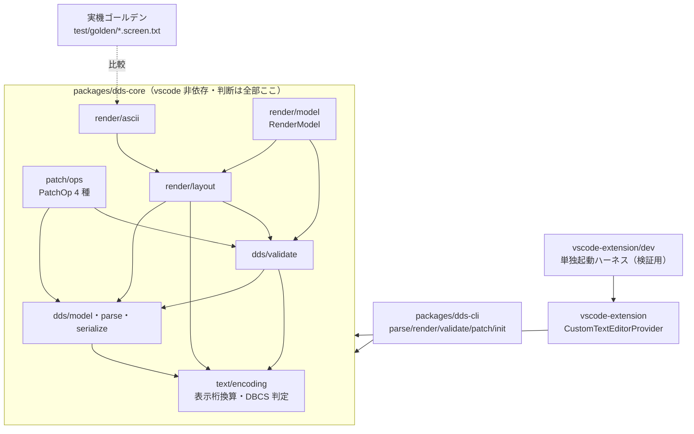
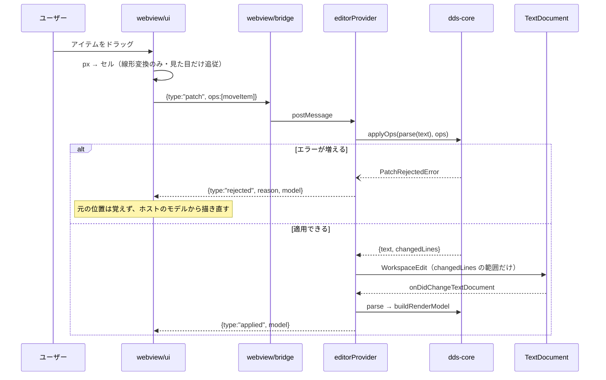

# レビューガイド: DDS ビジュアルエディタ walking skeleton

> 差分が大きい（新規 TS 約 7,400 行・3 パッケージ新設）ので、**どこを・なぜ見るか**に絞った案内。
> コードの再掲はしない。`path:line` はクリックで飛べる。

## 変更概要 / 目的

`.dspf`（DDS 表示装置ファイル）を**マウスでレイアウトできる**ようにする。ただし本 PR は
**walking skeleton**——DSPF の 1 レコード様式・標識なし・L1 編集（移動 / リサイズ / 追加 / 削除）を
**縦に薄く一周**させる。横展開（キーワード編集・標識・サブファイル・PRTF・MCP）は後続。

**この機能の価値は「桁が正しいこと」**なので、正しさの担保に構造を割いている:

- **編集していない行は 1 バイトも変わらない**（既存の手書き資産を GUI で開いても差分が暴れない）。
- **描画が実機の見え方と一致**していることを、実機で採取したゴールデンと機械比較する。
- **人間（GUI）と AI（CLI）が同じコアを叩く**——編集モデルを二重に持たない。

## まず読む 3 ファイル

レビューの取っ掛かりはここ。全体の設計判断がこの 3 つに現れている。

| ファイル | なぜ |
|---|---|
| `packages/dds-core/src/text/encoding.ts:57`（`isDbcsCodePoint`）/ `:165`（`displayWidth`） | **表示桁の換算はここだけ**。散らばると DBCS 混在で必ず破綻する（spec D3） |
| `packages/dds-core/src/dds/serialize.ts:58`（`rewriteLine`） | **行の raw を保ち、桁範囲だけ差し替える**。「バイト不変」が注意深さではなく構造で決まる（spec D2） |
| `packages/dds-core/src/render/layout.ts:94`（`placements`） | ASCII レンダラと GUI が**同じ配置計算**を通る。ゴールデンの担保が GUI にも効く |

## 構成（3 パッケージ）

**`vscode` への依存はパッケージ境界で機械的に止めている**——`packages/dds-core/package.json` に
`@types/vscode` を入れず、`tsconfig.json` の `types: ["node"]` を固定。破ると `tsc` が TS2307 で落ち、
`scripts/check-no-vscode-dep.mjs` も検出する（二重の防御・AC9）。

## 重要ポイント（特に見てほしい所）

### 1. 編集は「行の桁範囲の局所置換」で、全文再生成しない

DDS エディタ最大の失敗モードは「開いて保存しただけで全行に差分が出る」こと。
モデルは各行の生テキスト（`raw`）を保持し、**編集された行の該当桁だけ**を差し替える。
解釈できない行（コメント・継続行・未知のキーワード）は `opaque` として素通しする。

- `packages/dds-core/src/dds/parse.ts` — `raw` 保持と `opaque` 判定
- `packages/dds-core/src/dds/serialize.ts:58` — 桁範囲の書き換え

### 2. VSCode 側でも全文置換しない（AC2 の最後の関門）

core が構造で守っていても、**provider が全文置換した時点で台無し**になる。
`applyOps` が返す `changedLines` の範囲だけを `WorkspaceEdit` にする。

- `vscode-extension/src/dds/edit.ts:43`（`lineReplacement`）— **座標系の取り違えに注意**。
  `changedLines` は**適用後テキスト**の座標なので、旧文書側の終端は
  `新終端 + (旧行数 - 新行数)` で求める。**ここを間違えると削除で行が消えず、後続行が複製される**
  （実際に review で見つかった。`07-editor-webview/review.md` must-1）。
- `vscode-extension/src/dds/editorProvider.ts:233`（`applyLineReplacement`）— 挿入 / 削除 / 置換の 3 形。

### 3. WebView は「描く」だけ。文字を数えない

表示桁の計算を UI 側に持たせた瞬間、真実源が 2 つになって桁が食い違う。
そこで **core が `segments`（文字と占有桁数の対応）を渡し**、UI は `cols × セル幅` の箱に流すだけにした。
SO/SI は「文字が空の 1 桁」として現れる——これで DBCS 定数が 1 桁ずれない。

- `packages/dds-core/src/render/layout.ts:191`（`constantDrawing`）— セルと区切りを 1 度の走査で作る
- `vscode-extension/src/dds/webview/ui.ts:170`（`measure`）— **セル幅は実測**。CSS の `ch` は使わない
  （日本語混在の等幅フォントで DBCS 幅と一致する保証がない）。測定値は画面右上に常時表示している

### 4. 拒否の規則は「エラーが**増えた**とき」だけ

当初は「触った行にエラーがあれば拒否」だったが、それだと**元からエラーを持つ項目を動かせない**
（小数桁が抜けたフィールドをレイアウト修正で動かす、という正当な操作が止まる）。
GUI を実操作して見つかった。

- `packages/dds-core/src/patch/ops.ts:150`（`applyOps`）/ `:202`（`increasedErrors`）
- 経緯: `04-validate-patch/decisions.md` D6

### 5. スタンドアロンが本体、VSCode は埋め込み先の 1 つ

UI（`webview/ui.ts`）は `vscode` にも `acquireVsCodeApi` にも触らない。
差し替わるのは `Bridge` の実装だけ。**それが本当に成り立つことを、ブラウザで動かして確認済み**。

- `vscode-extension/src/dds/webview/bridge.ts` — `acquireVsCodeApi` の**唯一の呼び出し箇所**
- `vscode-extension/src/dds/webview/protocol.ts` — メッセージ契約 ＋ `Host`（ホストが何を肩代わりするか）
- `vscode-extension/dev/README.md` — 単独起動ハーネスと Playwright e2e の回し方

## 処理フロー（ドラッグ 1 回で何が起きるか）

**`applied` は変更イベントからだけ送る**（`editorProvider.ts:122`）。テキストエディタ側で直接編集された
場合も同じ道を通るので、双方向同期のために別経路を作らずに済む。
再描画はモデルを丸ごと差し替えるだけ＝**冪等**なので、再入してもループしない。

## 主要な変更箇所

| パス | 要点 |
|---|---|
| `package.json`（root） | npm workspaces 化。孤児だった `package-lock.json` の正規化を含む |
| `packages/dds-core/src/dds/validate.ts:332` | **属性バイトの隣接規則**（`b1 < a2 + 2`）。実機の `CRTDSPF` で 24 ケース確かめて確定（`spec.md` D7） |
| `packages/dds-core/src/patch/ops.ts:228`（`resolveOps`） | **全操作を元のモデル上で解決してから 1 度だけ行を組む**＝部分適用が起きない |
| `packages/dds-core/src/render/model.ts:132` | `RenderModel` 生成。**今は使わない拡張点**（`records` 配列・`activeRecordId` 等）を型に刻んである |
| `vscode-extension/package.json` | `contributes.customEditors`（**`priority: "option"`**）。**`languages`/`grammars` は無変更** |
| `vscode-extension/esbuild.mjs` | 拡張本体（Node/CJS）と WebView（browser/IIFE）を別々に束ねる |
| `vscode-extension/src/dds/webviewHtml.ts` | CSP。**`unsafe-inline` を入れない**——位置指定は CSSOM で与える |
| `.github/workflows/extension-tests.yml` | 新設。build / test / `vscode` 非依存ガード |
| `docs/dds-golden/README.md` / `ac7-transcript.md` | 実機ゴールデンの採取手順と、**AI が CLI だけで DSPF を作った記録（失敗も含む）** |

## リスク / 確認してほしい点

1. **`priority: "option"` を維持しているか**（`vscode-extension/package.json`）。
   既定にすると `.dspf` でテキストエディタが開かなくなり、既存のルーラー / SOSI が使えなくなる（AC8 違反）。
   統合テストで「ダブルクリック相当ではテキストエディタが開く」ことを固定してある。
2. **`contributes.languages` を増やしていないこと**。languageId は診断・キーバインド・補完の発火条件を
   兼ねるので、増やすと既存機能が一斉に波及する（AGENTS.md の既知の罠）。
3. **統合テストは CI に載せていない**（`decisions.md` D3）。表示環境が要り、この環境でも 1 度
   拡張ホストが即終了した。**不安定なテストを CI に置くと赤を無視する習慣がつく**ため見送った。
   `xvfb-run` での CI 化は backlog へ。
4. **GUI の e2e も CI 非搭載**（`playwright-core` を devDependency にしていない）。
   `npm run dev:e2e` で手元実行。ブラウザ未検出なら exit 2 で止まる（黙って緑にしない）。
5. **標識（条件）付きの重なり**は未検証。`CPD7866` が「with no conditions specified」と限定しているため
   警告されないと推測しているが、確かめていない。標識対応は後続 work。
6. **`ruler.ts` の DBCS 桁ズレ**（既存バグ）は本 PR では直していない。02 で実測し起票済み。
7. **プロンプター（F4）の統合テスト**は、`await` が永久に返らない既往を最小修正で潰しただけ。
   **VSCode 非依存化と Playwright 自律テストは次の work** に切り出す（本 PR に混ぜるとレビュー単位が壊れる）。

## 検証の全体像

| 層 | 件数 | どこで |
|---|---|---|
| コア（単体・ゴールデン比較） | 218 | CI |
| CLI | 37 | CI |
| 拡張（単体・型検査） | 52 | CI |
| 拡張（VSCode 統合） | 77 | **手元のみ** |
| GUI e2e（単独起動・実操作） | 21 | **手元のみ** |

**全 10 AC 充足**（対応は `spec.md`「受け入れ基準との対応」と各 subtask の `review.md`）。
