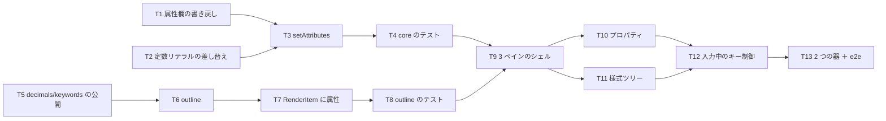

# 計画: 属性編集（L2）とプロパティ／様式ツリー

## subtask 分割の判定: **分割しない**

新規 1 ファイル ＋ 変更 8 ファイル ＋ テスト 2 本。**spec と plan で 1 PR に収まる**。
前回（PR #109）が 12 ファイル新設で分割不要だったので、今回はそれより小さい。

## 実装方針

**core → モデル → UI** の順に積む。core は `vscode` に触らないので、上に進む前に単体で固められる。

```
① 属性欄の書き戻し（名前・型・小数・使用）＋ 定数リテラルの差し替え
     ↓
② setAttributes（型・検証・適用）
     ↓
③ outline（配置に依らない項目一覧）＋ RenderItem に属性を載せる
     ↓
④ 3 ペインのシェル（ツリー・プロパティ）
     ↓
⑤ 2 つの器（VSCode / 単独起動）で通す
```

### 「描かれない項目」を最初から通す

`outline` を `layout.items` から作ると **AC3 の狙いがそのまま落ちる**（`research.md` F3）。
③ の時点で「位置欄が空の項目がツリーに出る」テストを置き、**出所を間違えたら落ちる**ようにする。

### 定数の差し替えは先にテストを書く

「定数の後ろにキーワードが続く」実例がリポジトリのサンプルに無い（`research.md` F1）ので、
**気付かないまま壊せる**。① でテストを先に作る。

## 作業順序と依存関係



## リスク / 留意点

- **R1: 定数の後続キーワードを壊す**（`research.md` F1）。実サンプルに例が無く、
  **手で試しても気付かない**。T2 でテストを先に書く。
- **R2: outline の出所を間違える**（F3）。`layout.items` から作ると描かれない項目が落ち、
  **AC3 は「実装した」のに機能しない**という最悪の形になる。T8 で固定する。
- **R3: プロパティの入力がキャンバスのキー操作に漏れる**（AC-I5）。
  入力欄で矢印を押したら項目が動いた、`Delete` で項目が消えた、は事故。
  **`keydown` の入口で判定**する（spec D7）。e2e で確かめる。
- **R4: 拒否時のフォーカス**（AC-I4）。モデルを差し替えて再描画すると**入力欄ごと作り直される**ので、
  素朴に実装するとフォーカスが飛ぶ。**拒否のときは再描画しない**か、
  再描画後にフォーカスを戻す必要がある。
- **R5: 名前変更が他所に追随しない**（F4）。黙って壊さないよう、プロパティに注意書きを出す。
- **R6: 3 ペインでキャンバスが狭くなる**。1280px 幅で 80 桁 ≒ 560px なので収まるが、
  **狭い画面では横スクロールが要る**。中央は `overflow: auto` のままにする。

## テスト方針

### 単体（CI で回る）

- **属性の書き戻し**: 該当桁だけが変わる／右詰め／大文字化／行末の空白の扱い。
- **定数の差し替え**: **後続キーワードが残る**／`'` の重ね／100 桁超は拒否。
- **拒否**: 名前 10 桁超・小数桁 2 桁超・定数に定位置欄・フィールドにリテラル・名前を空に。
- **バイト不変**: 属性を変えても**対象行以外は 1 文字も変わらない**。
- **outline**: 位置欄が空の項目・画面外・非表示用途が**一覧に出る**／様式ごとに並ぶ／
  `sourceLine` が `items` と対応する。

### e2e（単独起動・手元）

- ツリーで項目を選ぶ → プロパティに出る → 名前を変えて `Enter` → **ソース面の該当行だけが変わる**。
- **描かれない項目**（位置欄が空）をツリーから選べる。
- プロパティの入力中に矢印・`Delete` を押しても**キャンバスの項目が動かない**。
- 拒否（名前 11 桁）で**何も書き換わらず**、理由が出る。

### 既存の門番

`npm test`（492 件）と `npm run verify`（14 項目）。PRTF・lint・プレビューのテストが
共有モジュールの回帰を見張る。
