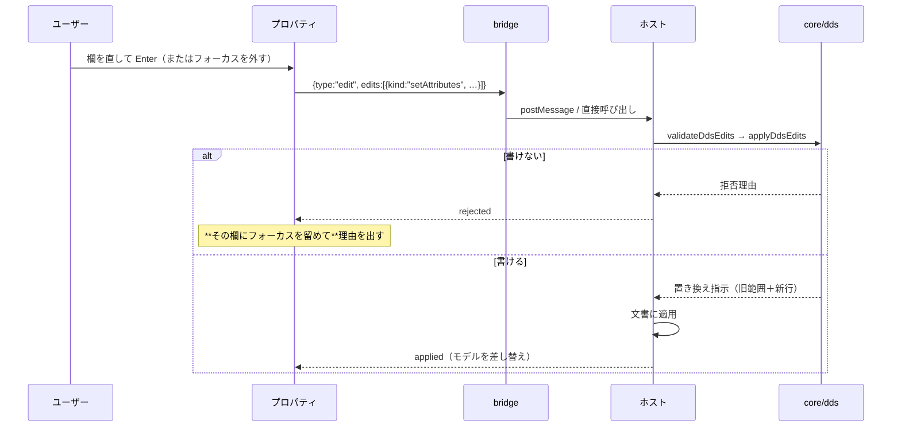

# 仕様: 属性編集（L2）とプロパティ／様式ツリー

## 概要

確定デザイン **C1**（`docs/design/dds-designer/`）の 3 ペインのうち、**左（様式ツリー）と
右（プロパティ）**を実装し、**項目の中身を変える編集操作**を足す。

編集の骨格（検証 → 置き換え指示 → 適用）は PR #109 で通っているので、
**その上に操作を 1 つ足し、UI にペインを 2 つ足す**のが本 work の全体像。

## 設計方針

### D1. 属性の編集は 1 つの操作にまとめる（`setAttributes`）

```ts
| {
    readonly kind: "setAttributes";
    readonly sourceLine: number;
    /** 与えた欄だけを書き換える。undefined の欄は触らない。 */
    readonly attributes: {
      readonly name?: string;      // 19-28
      readonly length?: number;    // 30-34
      readonly dataType?: string;  // 35
      readonly decimals?: number;  // 36-37
      readonly usage?: string;     // 38
      readonly text?: string;      // 定数のリテラル（キーワード欄の先頭）
    };
  }
```

**欄ごとに操作を分けない。** プロパティは「複数欄を直して 1 回確定する」使い方をするので、
分けると**1 回の確定が N 個のパッチ**になり、途中で 1 つ拒否されたときの状態が説明できなくなる。
1 操作なら「全部書けるか、何も書かないか」で済む（既存の部分適用しない方針と揃う）。

`resize` は `setAttributes({length})` の特殊形だが、**残す**——つまみの操作は
「長さだけを変える」ことが明確で、UI からの意図がそのまま型に出るほうがよい。

### D2. 定数のリテラルは**先頭の 1 つだけ**を差し替える

キーワード欄は `'リテラル'` の後ろにキーワードが続きうる（`research.md` F1）。
`readConstant` と**同じ正規表現**を使って先頭のリテラルだけを置換し、**残りをそのまま繋ぐ**。

規則を 2 か所に書かないため、`ddsLogicalUnits.ts` に
`replaceLeadingConstant(keywords, text): string | undefined` を置き、
`readConstant` と並べる（読む側と書く側が同じファイルで隣り合う）。

### D3. 描画モデルは「描く項目」と「全項目」を分けて持つ

`resolveDspfLayout` は**位置が無い / 数字でない / 非表示用途**の項目を落とす（`research.md` F3）。
一覧（ツリー）をそこから作ると、**AC3 の狙いがそのまま落ちる**。

```ts
interface RenderModel {
  readonly canvas: …;
  readonly items: readonly RenderItem[];       // 描く項目（配置済み）
  readonly outline: readonly OutlineRecord[];  // 全項目（様式ごと・配置に依らない）
  readonly diagnostics: …;
}

interface OutlineRecord {
  readonly name: string;
  readonly sourceLine: number;
  readonly items: readonly OutlineItem[];
}

interface OutlineItem {
  readonly sourceLine: number;          // 選択の宛先（`items` と同じ鍵）
  readonly kind: "field" | "constant";
  readonly label: string;               // 名前 または リテラル
  readonly attributes: ItemAttributes;  // プロパティが出す値
  /** 描かれない理由。描かれるなら undefined。 */
  readonly hidden?: "no-position" | "invalid-position" | "not-displayed";
}
```

**出所は `toLogicalUnits`**（配置解決を通さない）。`items` と `outline` は
**`sourceLine` で対応づく**——選択の鍵が 1 つなので、キャンバスと一覧が自然に同期する。

### D4. プロパティが出す数字は「引き算」だけ

占有（属性文字込み）は `RenderItem.occupancy`、右端の余裕は
`canvas.columns - occupancy.end`。**UI がするのは引き算だけ**で、文字を数えたり
幅を求め直したりはしない（真実源は `dspfLayout` のまま）。

描かれない項目には占有が無いので、**プロパティでは「—」を出す**（推測で埋めない）。

### D5. 3 ペインのシェル。ホスト切替 UI は作らない

C1 のレイアウト（左: ツリー / 中央: キャンバス / 右: プロパティ）を実装する。
**両モードで同じ構成**。モックにあったホスト切替は**デモ用で製品には作らない**
（`docs/design/dds-designer/README.md`・ユーザー判断 2026-08-27）。

ペインの幅は固定（左 200px / 右 320px）とし、折りたたみは本 work では作らない
（**まず中身を動かす**。畳む機能は中身が要るようになってから）。

### D6. 確定は `Enter` / フォーカス喪失。`Esc` で戻す

プロパティの入力は**確定するまで送らない**。確定は `Enter` かフォーカスを外したとき、
`Esc` は編集前の値に戻して**何も送らない**。

**拒否されたらフォーカスをその欄に留める**（AC-I4）。理由はプロパティ内に出し、
入力し直せるようにする——キャンバス上部の状態表示だと、入力欄から目が離れる。

### D7. 入力中はキャンバスのキー操作を止める

いまの `ui.ts` は `isTypingTarget` を矢印と `Delete` の手前でしか見ていない。
**`keydown` の入口で判定する**形に変える（`Esc` だけは入力欄の取り消しとして通す）。

### D8. 名前の変更は追随しない。その旨を UI に出す

`SFLCTL(NAME)` のようにフィールド名を引数に取るキーワードは、core が**解釈していない**
（`research.md` F4）。名前を変えても**他所は古い名前のまま残る**。

黙って壊すのが最悪なので、**プロパティの名前欄に注意書きを出す**
（「参照しているキーワードは追随しません」）。追随そのものは後続 work。

## 対象範囲

### 追加

| パス | 内容 |
|---|---|
| `src/core/dds/dspfOutline.ts` | 配置に依らない項目一覧（`toLogicalUnits` から作る・D3） |
| `test/unit/ddsAttributeEdit.test.ts` | 属性編集の単体（拒否条件・バイト不変・定数の後続キーワード保持） |
| `test/unit/dspfOutline.test.ts` | 一覧（描かれない項目が出ること・様式ごと） |

### 変更

| パス | 変更内容 |
|---|---|
| `src/core/dds/ddsLogicalUnits.ts` | `replaceLeadingConstant` を追加（D2） |
| `src/core/dds/ddsEditWriteBack.ts` | 属性欄（名前・型・小数・使用）の書き戻し |
| `src/core/dds/ddsEdit.ts` | `setAttributes` の型・検証・適用 |
| `src/core/dds/dspfLayout.ts` | `decimals` / `keywords` を `DspfPlacedItem` に公開 |
| `src/core/dds/dspfRenderModel.ts` | `outline` を載せ、`RenderItem` に属性を持たせる |
| `src/dds/webview/protocol.ts` | `setAttributes` の検証 |
| `src/dds/webview/ui.ts` / `ui.css` | 3 ペイン・ツリー・プロパティ・入力中のキー制御 |
| `dev/standalone.ts` / `dev/e2e.mjs` | 3 ペインでの操作確認 |

### 変更しない（明示）

- `dspfPreview*` / `prtfPreview*` / `lint/*` / `cli/*` / `prompter/*` / `contributes`。
- キーワード欄の**構文解釈**（L3）。本 work が触るのは**先頭のリテラルだけ**。

## インターフェース / データ構造

```ts
/** プロパティが出す値。定位置欄とキーワード欄の生テキスト。 */
export interface ItemAttributes {
  readonly name?: string;
  readonly text?: string;
  readonly length?: number;
  readonly dataType?: string;
  readonly decimals?: number;
  readonly usage?: string;
  /** 45 桁以降の生テキスト（**解釈しない**。表示のみ）。 */
  readonly keywords: string;
}
```

拒否コード（**書けないものだけ**という既存方針を維持）に足すもの:

| コード | 条件 |
|---|---|
| `name-too-long` | 名前が 19-28 桁（10 桁）に収まらない |
| `decimals-out-of-range` | 小数桁が 36-37 桁（2 桁）に収まらない・負 |
| `field-column-on-constant` | 定数に名前・長さ・型・小数・使用を指定した |
| `text-on-field` | フィールドにリテラルを指定した |
| `line-too-long` | 書き換えの結果 100 桁を超える（`research.md` F5） |

## 振る舞いの詳細

### 属性編集の流れ



### エッジケース

- **定数の後ろにキーワードがある**: 先頭のリテラルだけを差し替え、後続をそのまま繋ぐ（D2）。
- **リテラルを伸ばして 100 桁を超える**: `line-too-long` で拒否（何も書かない）。
- **描かれない項目を選んだ**: キャンバスに強調するものが無いので、
  プロパティに理由（位置欄が空 / 画面に出ない用途）を出す。占有は「—」。
- **名前を空にした**: フィールドから名前を消すと定数と区別できなくなるので拒否
  （`field-needs-name` を再利用）。
- **型・使用に 2 文字以上**: 1 桁欄なので拒否（`ddsReplaceField` が切り詰める前に弾く）。

## ドメイン固有の考慮

- **桁の意味と右詰めは原典どおり**（`DDS_COLUMNS` と既存の書き戻しに従う）。
- **名前は大文字に正規化する**（実ソースはすべて大文字。`buildItemLine` と同じ扱い）。
- **リテラル中の `'` は `''` に重ねる**（`quoteLiteral` と `readConstant` が対）。
- **キーワード欄は解釈しない**（L3）。プロパティでは**生テキストを読み取り専用**で見せる。

## 受け入れ基準との対応

| AC | 満たし方 |
|---|---|
| **AC1** 名前・型・小数・使用 | `setAttributes` が該当桁だけを `ddsReplaceField` で置換（D1） |
| **AC2** 定数の文字列 | `replaceLeadingConstant` が先頭リテラルだけを差し替え（D2） |
| **AC3** 描かれない項目に手が届く | `outline` を `toLogicalUnits` から作る（D3）。`hidden` に理由を持たせる |
| **AC4** 占有と右端の余裕 | `occupancy` と `canvas.columns` から UI が引き算（D4） |
| **AC5** 様式ごとの一覧 | `OutlineRecord` が様式単位（D3） |
| **AC6** 対象行以外バイト不変 | 既存の「旧範囲＋新行」を返す形をそのまま使う。単体で固定 |
| **AC7** 書けない値は拒否 | 拒否コード 5 種を追加。**何も書かない**（既存の全件検証を通す） |
| **AC8** 既存挙動の非後退 | 触るファイルを限定（対象範囲）。`npm test` / `npm run verify` |
| **AC9** 両ホストで動く | `dev/standalone` に同じ 3 ペインが出る。e2e で属性編集を実操作 |
| **AC-I1** 選択の同期 | 鍵は `sourceLine` 1 つ（D3）。キャンバス・ツリー・プロパティが同じ値を見る |
| **AC-I2** 確定 / 取り消し | `Enter`・フォーカス喪失で確定、`Esc` で戻す（D6） |
| **AC-I3** キーボードだけで完結 | ツリーは上下キー、プロパティは `Tab`（D6） |
| **AC-I4** フォーカスの行き先 | 拒否時はその欄に留め、理由をプロパティ内に出す（D6） |
| **AC-I5** 既存操作を妨げない | `keydown` の入口で入力中を判定（D7） |
