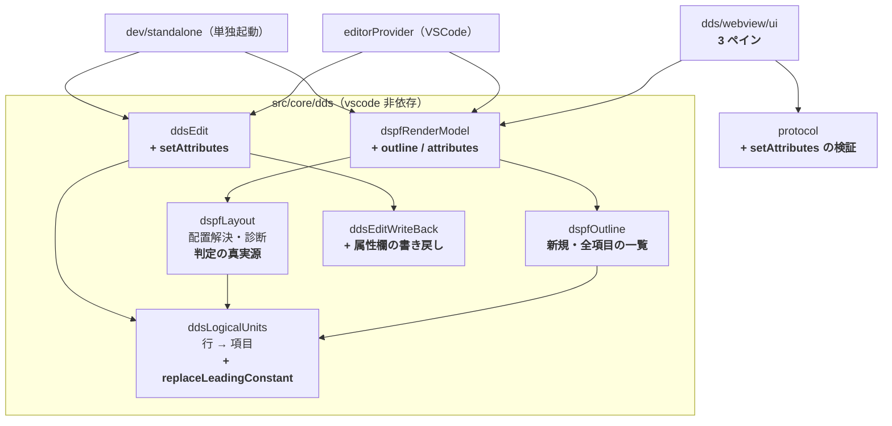
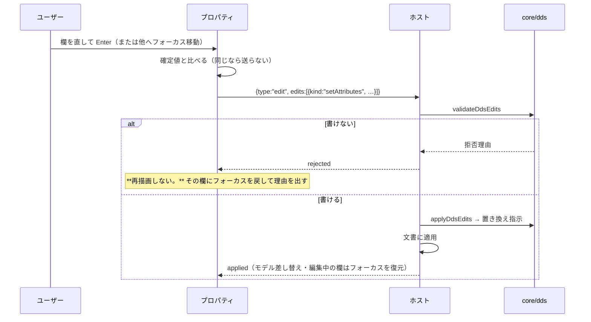

# レビューガイド: 属性編集（L2）とプロパティ／様式ツリー

> 新規 3 ファイル・変更 10 ファイル（約 1,400 行）。**どこを・なぜ見るか**に絞った案内。

## 変更概要 / 目的

PR #109 で入ったのは**確定デザイン C1 の中央キャンバスだけ**だった。項目を動かす・伸ばす・
置く・消すことはできても、**中身を変えられなかった**——名前を間違えたら消して置き直すしかない。

本 PR で **C1 の左（様式ツリー）と右（プロパティ）**を実装し、**属性を変える編集操作**を足した。

**特に効くのは「キャンバスに描かれない項目に手が届く」こと。** 位置欄が空・画面に出ない用途
（`H`/`P`/`M`）の項目は配置解決で落ちるので**キャンバスに出ない**。うち非表示用途は**診断すら出ない**ため、
一覧が無いと GUI からは存在しないのと同じだった。

## 全体像

## 重要ポイント（特に見てほしい所）

### 1. 一覧は**配置解決を通さない**（ここが本 PR の肝）

`vscode-extension/src/core/dds/dspfOutline.ts`。`resolveDspfLayout` は
**画面に置けない項目を落とす**（`dspfLayout.ts:220` 非表示用途 / `:257` 位置が不正 / `:267` 位置が空）。
一覧をそこから作ると、**AC3 の狙いがそのまま落ちる**ので、`toLogicalUnits`（行を項目にまとめるだけ）
から作り、描かれない理由を添えている。

`items`（描く）と `outline`（全部）は **`sourceLine` で対応づく**——鍵が 1 つなので、
キャンバスと一覧のどちらで選んでも同期する。

**ずれの見張り**: `test/unit/dspfOutline.test.ts` の最後の suite が
「理由が無い項目は必ず描かれている / 理由が付いた項目は描かれていない」
「描かれる項目はすべて一覧にも出る」を実サンプル込みで検査する。
別実装なので、**片方だけ直すとずれる**。集合を共有しただけでは順序のずれを防げないため、
突き合わせ自体をテストにした。

### 2. 定数のリテラルは**先頭の 1 つだけ**を差し替える

`src/core/dds/ddsLogicalUnits.ts` の `replaceLeadingConstant`（`readConstant` の隣）。
キーワード欄は `'見出し'DSPATR(HI)` のようにリテラルの後ろにキーワードが続きうるので、
**欄ごと置き換えるとキーワードが消える**。読む側と同じ正規表現を 1 か所に置いて共有している。

**リポジトリのサンプルにこの形が無い**ので、手で試しても気付けない。テストで作って固定した。

### 3. 拒否のときは**再描画しない**

`src/dds/webview/ui.ts` の `rejected` 分岐。素直に描き直すと**入力欄ごと作り替わってフォーカスが飛び**、
さらに消えた欄の `blur` がもう一度 commit を呼んで **拒否 → 再描画 → blur → 拒否 …** と往復し続けた
（単独起動はホストが同期なので即座に循環する）。実際に踏んで直した。

文書は変わっていないので**描き直す必要が無い**——理由をプロパティ内に出し、
**その欄にフォーカスを戻して選択状態にする**（入力し直せる）。
併せて確定値を覚え、`Enter` と `blur` の両方から同じ編集を送らないようにした。

### 4. プロパティが出す数字は**引き算だけ**

占有は `RenderItem.occupancy`（属性文字込み・core が計算）、右端の余裕は
`canvas.columns - occupancy.end`。**UI は文字を数えない**。
描かれない項目には占有が無いので「—」を出す（推測で埋めない）。

### 5. 入力中はキャンバスへキーを漏らさない

`ui.ts` の `onKeyDown` は**入口で**入力中を判定する。ここを後ろに置くと、
プロパティで矢印を押した瞬間に**項目が動き**、`Delete` で**項目が消える**。

## 処理フロー（属性を 1 つ直したとき）

## 主要な変更箇所

| パス | 要点 |
|---|---|
| `src/core/dds/dspfOutline.ts` | **新規**。配置に依らない項目一覧。描かれない理由（`no-position` / `invalid-position` / `not-displayed`） |
| `src/core/dds/ddsLogicalUnits.ts` | `replaceLeadingConstant`（読む側と同じ正規表現を共有） |
| `src/core/dds/ddsEdit.ts` | `setAttributes`（**与えた欄だけ**）＋拒否コード 5 種 |
| `src/core/dds/ddsEditWriteBack.ts` | 属性欄の書き戻し（名前は大文字化・数値は右詰め） |
| `src/core/dds/dspfLayout.ts` | `decimals` / `keywords` を公開、`NON_DISPLAY_USAGE` を共有 |
| `src/dds/webview/ui.ts` / `ui.css` | 3 ペイン・ツリー・プロパティ・入力中のキー遮断・フォーカス復元 |
| `dev/standalone.ts` / `dev/e2e.mjs` | **描かれない項目を含むサンプル**を足し、e2e で一覧から直せることを確認 |

## リスク / 確認してほしい点

1. **数え方の割り切り**: 行長の上限 100 桁は **JS の文字数**（lint と同じ）。DBCS を含む行は
   実バイトではもっと長い。**表示桁で数えるなら lint と同時に変える**必要がある。
2. **名前変更は参照に追随しない**。`SFLCTL(NAME)` 等は古い名前のまま残るので、
   **プロパティに注意書きを出して明示**している。追随は L3。
3. **キーワード欄は読み取り専用**（L3 の範囲）。
4. **小数桁を空にできない**（0 は書ける）。欄ごと消す手段が無い。
5. **中央ペインは横スクロールする**。狭い画面では正常な挙動だが、
   見えていない位置のつまみは掴めない。
6. **e2e は CI 非搭載**（`playwright-core` を devDependency にしない方針）。

## 検証の全体像

| 層 | 件数 | 実行場所 |
|---|---|---|
| 単体 | **522**（今回 +30） | CI |
| 原典突き合わせ・往復（`npm run verify`） | 14 項目 | CI |
| 桁位置 lint（実機確認済みソース） | 指摘 0 | CI |
| GUI e2e（単独起動・実操作） | **30**（今回 +15） | 手元のみ |
