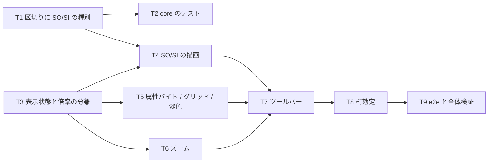

# 計画: 表示切替（SO/SI・属性バイト・グリッド・他様式・ズーム）

## subtask 分割の判定: **分割しない**

変更 5 ファイル・新規 0。**表示だけ**の変更で、ホストとの契約も編集経路も触らない。
前 2 work（12 ファイル新設 / 3 ファイル新設）より小さく、1 PR に収まる。

## 実装方針

**core の小さな追加 → UI の状態 → 描画 → 操作**の順。

```
① RenderSegment に SO/SI の種別（core・これだけ）
     ↓
② 表示状態（DisplayOptions）を render() の外に持つ
     ↓
③ 描画に反映（SO/SI・属性バイト・グリッド・淡色・ズーム）
     ↓
④ ツールバー（ボタン・ズーム段階）
     ↓
⑤ 桁勘定（プロパティ）
```

### ズームは「実測値」と「表示値」を最初から分ける

`measure()` が実測値を CSS 変数に直接入れている今の形のまま倍率を足すと、
**次の測定で倍率が二重に掛かる**。②の時点で分離する。

### 「表示の有無で桁が動かない」ことを最初に確かめる

SO/SI は**既に桁が空いている区切り**に描く。項目の前後に足すと全部ずれるので、
③で「表示を入れても項目の `left` / `width` が変わらない」ことを e2e で見る。

## 作業順序と依存関係



## リスク / 留意点

- **R1: SO/SI を足して桁がずれる。** 区切りの中に描くこと。**項目の幅を変えない**。
  e2e で「表示の切替で項目の位置と幅が変わらない」ことを見る。
- **R2: 倍率が二重に掛かる**（`research.md` リスク2）。実測値と表示値を分ける。
  フォント読み込み後の再測定でも倍率が保たれることを確かめる。
- **R3: 再描画で切替が戻る**（AC7）。状態は `render()` の外。
  選択・編集の適用のたびに `render()` が走るので、**戻ると即座に気付かれる**。
- **R4: 淡くしすぎて読めない**。`opacity: 0.35` を上限の目安にする。
- **R5: ツールバーが混む。** いまは「フィールドを置く / 定数を置く」だけの帯に 5 つ足す。
  **配置と表示を視覚的に分ける**（区切り線）。
- **R6: ズームでドラッグがずれる**（AC-I5）。`geometry` に渡す `metrics` も倍率込みにする。
  e2e で「150% でも指した桁に入る」ことを確かめる。

## テスト方針

### 単体（CI で回る）

- **区切りの種別**: DBCS の前後が `so` / `si` になる。半角だけなら種別が付かない。
  **`cols` の合計は `printWidth` と一致したまま**（種別を足しても幅は変わらない）。

### e2e（単独起動・手元）

- SO/SI を入れると `{` `}` が出る。**項目の位置と幅は変わらない**（R1）。
- 属性バイト・グリッドの切替が効き、**選択が外れない**。
- 他様式の淡色表示——選択中の様式以外が淡くなる。
- ズーム 150% で**セル幅が 1.5 倍**になり、**ドラッグが指した桁に入る**（R6）。
- 切替が**編集の適用後も保たれる**（R3）。
- 定数を選ぶと**桁勘定**が出る。

### 既存の門番

`npm test` / `npm run verify` / 桁位置 lint。表示だけの変更なので、
**編集系のテストが 1 件も動かないこと**が非後退の証拠になる。
